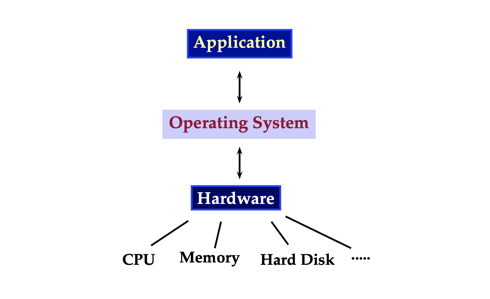
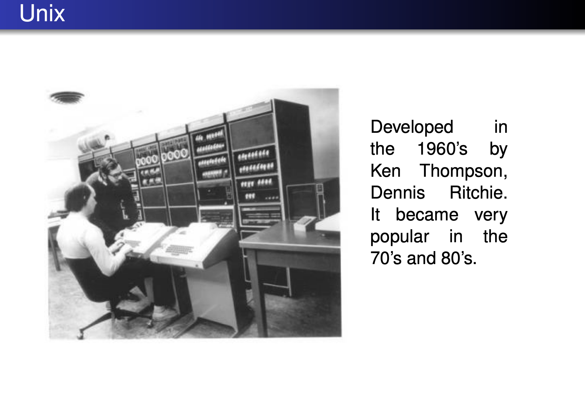
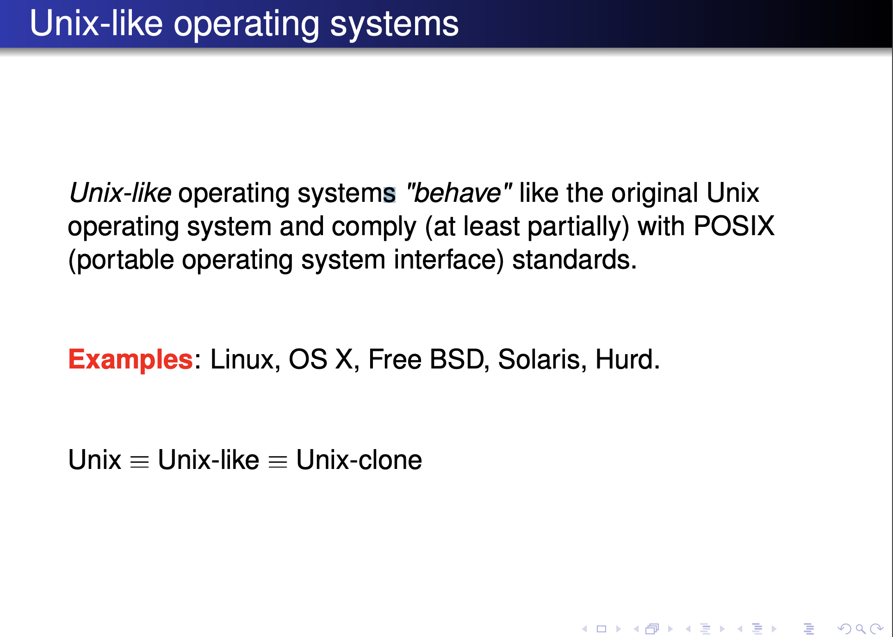
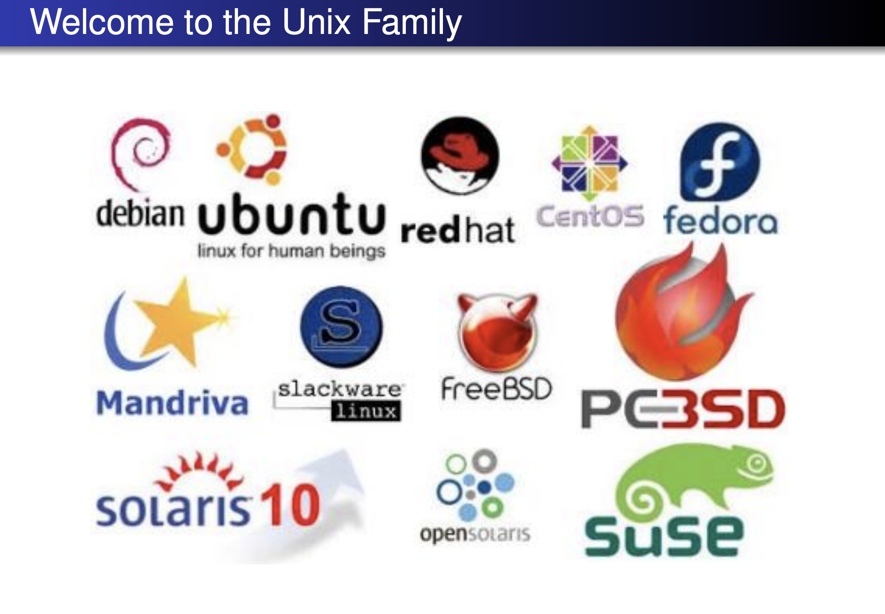
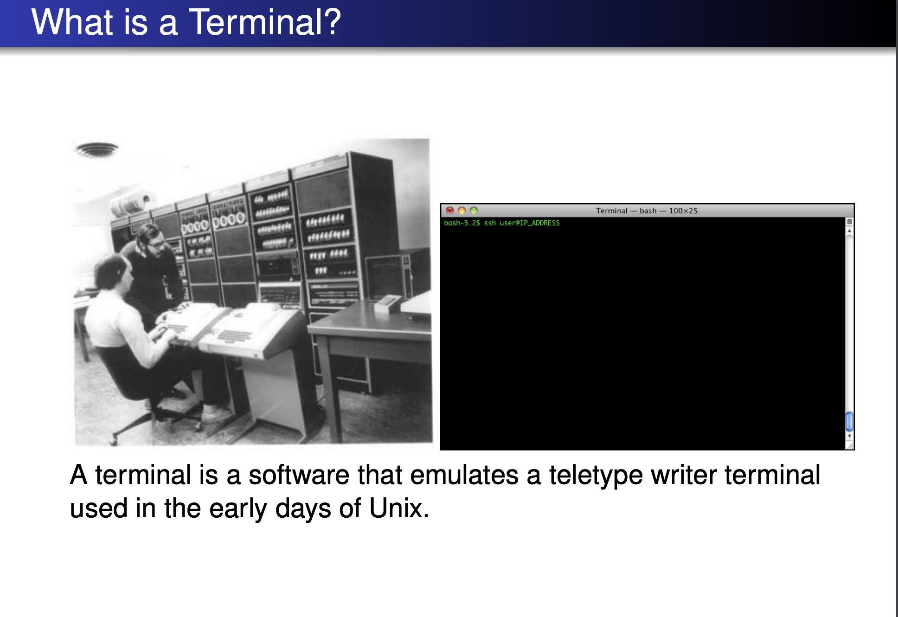
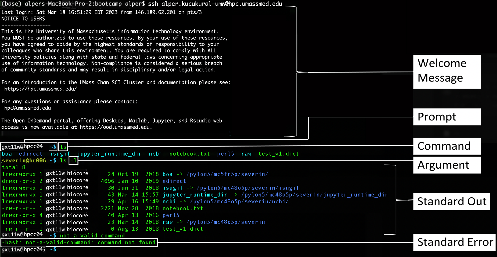
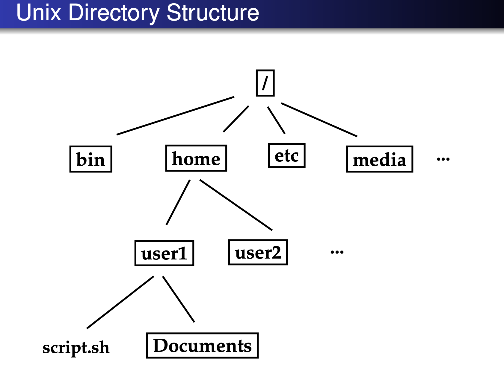
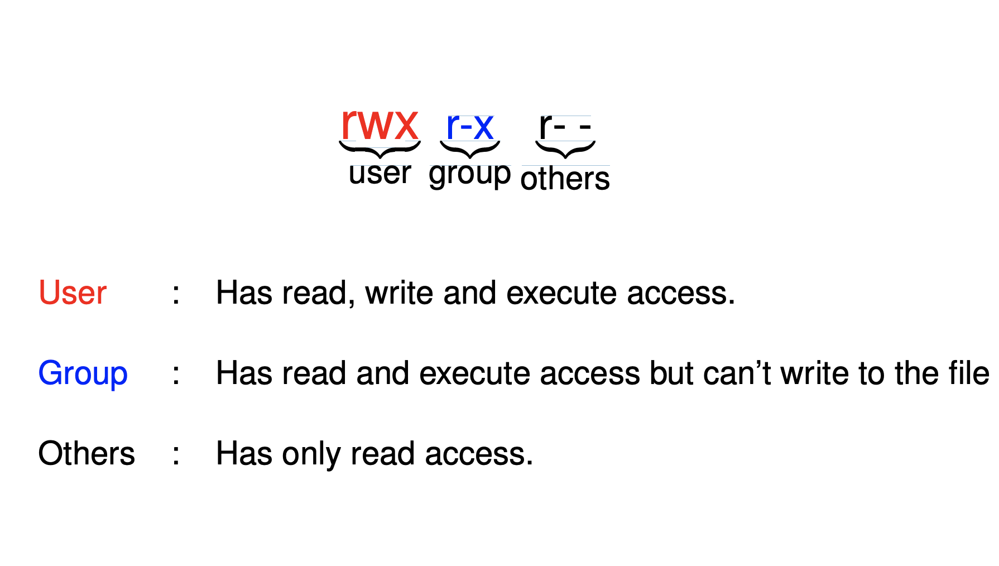

Session 1: Linux/Unix Environment
========

Disclaimer
-------

For the sake of clarity, the concepts mentioned in this tutorial have been simplified significantly. Linux is not Unix, but it is a Unix-like operating system. Linux system is derived from Unix. Similar commands you will learn in this tutorial may be applicable to other unix systems.
Most of the command line tools and programs we explain have many more features that cannot be found here. Linux command line tools are very well documented and their manual pages are freely available.
These notes are prepared for the users of UMMS Cluster. UMMS Cluster system has features that might not exist in standard Unix/Linux systems such as loading modules.
A rigorous treatment of topics on Unix and Bash can be found in various books in several levels.

Expected learning outcome
========

To understand the basics of Linux environment, how to use command line and to familiarize yourself with some standard tools and commands using a terminal.

Overview
========
  * [Introduction](#introduction)
  * [Before you start](#before-you-start)
  * [Getting Started](#getting-started)
  * [Basic Commands](#basic-commands)
  * [File transfer from your laptop to cluster using FileZilla](#file-transfer-from-your-laptop-to-cluster-using-FileZilla)
  * [Session1 Homework](#session1-homework)

## Introduction

Linux is an operation system like Microsoft Windows or OSX. An operating system is a collection of software that manages system resources (such as memory, cpu(s), display and etc.) and provide applications a simpler interface to the system
hardware.








### Unix shell

A shell is a software that runs inside a terminal and interprets and executes user commands.
One of the most popular shells being used today is called BASH (Bourne Again Shell). In this tutorial we will use bash. There are other shells like zsh or sh. They can also be used if you need for a specific functionality that is supported by that shell. 

## Before you start
### Convention: 

***$*** denotes a prompt for the command line. It is not meant to be typed while running the commands in this tutorial. All Bash commands will appear in a gray box that you will run in your terminal. In this example below, you will only write "your\_command" in the terminal an press enter. It will then execute the command in your terminal. (Please only run commands in the lines starts with \"$\" symbol.)

	$ your_command

Let's start running some commands. First command will be "ssh" to connect to the UMASS cluster. If you're using windows, please use PuTTY or similar program to make SSH connection.

	$ ssh username@ghpcc06.umassrc.org
	

Let’s verify that we are at the right place. In this case only run "hostname", not the output of the command (ghpcc06).

	$ hostname
	ghpcc06
	
You need to see "ghpcc06" in your terminal as an output. ghpcc06 is our "head node". You will learn what head or child nodes are in these tutorials later. 


## Getting started

To print something on the screen. We use echo command. 
	
	$ echo Hello World
	
If you just run 

	$ Hellow World
	-bash: Hello: command not found
	
You will get this error "command not found". Because there is no any command called "Hello". As you can see, this command is interpreted by "bash" and when there is an error, bash reports the error.


## Basic Commands
  * [List a directory (folder)](#list-a-directory-folder)
  * [Locating Applications and Software Packages](#locating-applications-and-software-packages)
  * [Modular system](#modular-system)
  * [Print working directory](#print-working-directory)
  * [Accessing Directories](#accessing-directories)
  * [Exploring the Filesystem](#exploring-the-filesystem)
  * [Creating a directory](#creating-a-directory)
  * [Copying Files](#copying-files)
  * [Copying Directories](#copying-directories)
  * [Removing a file](#removing-a-file)
  * [Removing a directory](#removing-a-directory)
  * [Moving a directory or a file](#moving-a-directory-or-a-file)
  * [Rename a directory or a file](#rename-a-directory-or-a-file)
  * [Files](#file)
  * [Redirecting Standard Output to a File](#redirecting-standard-output-to-a-file)
  * [Viewing text files](#viewing-text-files)
  * [Creating an empty file](#creating-an-empty-file)
  * [File and Directory Security](#file-and-directory-security)
  * [File Permissions](#file-permissions)
  * [Wildcards](#wildcards)
  * [Working with Compressed Files](#working-with-compressed-files)
  * [Downloading a file from web](#downloading-a-file-from-web)

Before we explore the commands used to manipulate the Linux environment, we should take a quick look at the structure of the environment itself.

You can think of a Linux file system as an upside-down tree. See the diagram below. In this diagram, the boxes are directories or folders. "script.sh" is a file.
 


At top you will see the following symbol; "/". It is called "root" directory. For example if user1 wants to access Documents directory,  user will use "/home/user1/Documents" when it is needed. This directory structure is called "Full Path" or "Absolute Path" of a directory. Full path of script.sh in this example will be "/home/user1/script.sh". 

### List a directory (folder)
Probably the most often used command in Linux is the "ls" command. It is used to list the contents of a directory. 
Unlike many other operating systems, Linux is case-sensitive. In other words, if you type "LS" instead of "ls", Linux will not recognize the command. This applies to director and file names, like "home" and "script.sh", as well.

Lets run some commands below one at a time and list the content of the directories. 

	$ ls /
	$ ls /project
	$ ls /nl
	$ ls /project/umw_biocore/class/

For example, last command result will be

    $ ls /project/umw_biocore/class/
    class.html  class.R  data.tsv  funcs.R

We will visit ls command later to learn about the sizes or permissions, creation times, or owner of the files or directories.

### Locating Applications and Software Packages
Depending on the specific distribution, programs and software packages can be installed in various directories. In general, executable programs should live in the following directories

```
/bin
/usr/bin
/sbin
/usr/sbin
/opt.
```

One way to locate programs is to employ the ``which`` utility. For example, to find out exactly where the diff program resides on the filesystem:

	$ which diff
	/usr/bin/diff

If which does not find the program, whereis is a good alternative because it looks for packages in a broader range of system directories:

	$ whereis diff
	diff: /usr/bin/diff /usr/share/man/man1/diff.1.gz

### Modular system

The software packages in our cluster are installed in a modular structure to support multiple versions of the software in a single system. For example, "STAR" is a splice aware genomic aligner. It is installed as a module and initially it is not loaded in the system. 

	$ which STAR
	
	/usr/bin/which: no STAR in (...)

which command couldn't find the STAR in any of our paths.

Please write the command below and press "tab button" in your keyboard. It will list all available versions of star. (Tab can also be used for auto-completion of any other commands.)

	$ module load star/2.   #(Press tab button here)
	star/2.3.0e  star/2.4.2a  star/2.5.3a  star/2.7.0e  

To load the desired version just complete it and press enter.  

	$ module load star/2.7.0e  

Run "which" command again to see the location of the command;

	$ which STAR
	
To unload a module when needed;

	$ module unload star/2.7.0e  

To list all available modules in the cluster;

	$ module avail 

If a version of a software package you want to use is not installed in our cluster. You can always send an email to hpcc-admins to have it installed. We will use these and other modules, in other sessions.


### Print working directory

pwd command will show what directory you are in.

To see the working directory,

	$ pwd


### Accessing Directories
The following commands are useful for directory navigation:

|Command|Result|
|-------|-----------|
|cd 	|Change to your home directory|
|cd ~	|Change to your home directory (same like above)|
|cd ..|Change to parent directory|
|cd - |Change to previous directory|
|cd /	|Changes your current directory to the root (/) directory|
|cd /project/umw_biocore/class|Changes your current directory to a specific directory|

	~ : Home directory
	. : current directory
	.. : parent directory

If a file path begins with /, then it is an absolute path. It doesn’t depend on the current working directory.
If a file path begins WITHOUT /, then it is a relative path. The path is defined according to the current directory. So, the path depends on the current working directory.


Please use all the commands in the table above and run "pwd" command after that to see which directory you are in and "ls" to see the content of the directory.

	$ cd
	$ pwd
	$ ls
	$ cd ..
	$ pwd
	$ ls
	$ cd -
	$ pwd
	$ ls
	$ cd /
	$ pwd
	$ ls
	
Now we have to take a time to explain "pathnames". 

So far we have only been listed files that are in our current directory. 
Sometimes you might want to manipulate or list files that are not in your current directory. For example, you may be doing a lot of work in the ~/bootcamp directory, but you remember that you wanted to work on "/project/umw_biocore/class". You could accomplish this by using these commands:

	$ ls /project/umw_biocore/class
	$ ls ~/bootcamp
	
	
Please remember if it starts with "/". It is called full path or absolute path. You can use these paths while copying or moving the filed or folders.
	
### Exploring the Filesystem
The tree command is a good way to get a bird’s-eye view of the filesystem tree. The following commands can help in exploring the filesystem:

|Command|Result|
|-------|-----------|
|ls 	  |List the contents of the present working directory|
|ls –a  |List all files including hidden files and directories|
|ls –l  |Detailed list of files and directories|
|ls –lh  |Detailed list of files and directories where the file sizes are reported in human readable format|
|tree   |Displays a tree view of the filesystem|
|tree -d|Just list the directories and suppress listing file names|


Please use the commands in the table using the example directory "/project/umw_biocore/class". You can use these command with any other directories too. 

To see the complete list of options of a command. 

	$ man ls
	
***To exit from manual of a command, please press "q" button in your keyboard.***

Try commands below;

	$ ls /project/umw_biocore/class
	$ ls –a /project/umw_biocore/class

Which file is different in the output of both commands above?

The hidden files start with ".". 

	$ ls –l /project/umw_biocore/class
	$ ls –lh /project/umw_biocore/class
    
You can also run -l -a command together
    
	$ ls -a -l /project/umw_biocore/class
    
ls command can also recognize the parameters together like in -lh suports in any order
 
 	$ ls -al /project/umw_biocore/class
 	
tree command shows all files and folders recursively. If you have many files just press Ctrl+C, in the directory you want to check the tree.

	$ tree /project/umw_biocore/class

***If any of your commands run too long. You can always use Ctrl+C in your keyboard to stop the execution.***
	
List the tree with only the folder names

	$ tree -d /project/umw_biocore/class


### Creating a directory

Let's first go to our home directory.

	$ cd
	
Create a directory called "bootcamp"

	$ mkdir bootcamp
	
Lets go into this directory and print where we are.

	$ cd bootcamp
	$ pwd

You can try going to another directory using the full path

	$ cd /project/umw_biocore/class
	$ pwd
	$ ls
	
Please go back using full path, or using "\~" symbol. "\~" means your home directory.

	$ cd ~/bootcamp
	$ pwd
	
Or you could have used 

	$ cd /home/your_user_id/bootcamp
	
The directory could also be created like below. 
	
	$ mkdir ~/bootcamp

Or using the full path

	$ mkdir /home/your_user_id/bootcamp

However, if you try the commands above, bash will give an error, since directory is already created.


If you want to create a directory inside of another directory which is not created before, you can use "-p" command. For example, creating ~/bootcamp/dir1/dir2/dir3 without -p, This command will give an error.

	$ mkdir ~/bootcamp/dir1/dir2/dir3
	mkdir: cannot create directory `/home/your_user/bootcamp/dir1/dir2/dir3': No such file or directory


When you use -p option, it will create all those directories;

	$ mkdir -p ~/bootcamp/dir1/dir2/dir3
	$ cd ~/bootcamp/dir1/dir2/dir3
	$ pwd
	
You can also create multiple directories with one command.

	$ mkdir ~/bootcamp/first ~/bootcamp/second
	
If you go to that directory and get a list;

	$ cd ~/bootcamp
	$ ls
	dir1  first  second
	
You can also use tree command

	$ tree ~/bootcamp
	/home/your_user/bootcamp
	├── dir1
	│   └── dir2
	│       └── dir3
	├── first
	└── second
	
### Copying Files

You can copy the files from the source to the destination using a command like below. 

cp sourcefile(s) destination_path

Lets copy funcs.R file to our ~/bootcamp/first directory and compare them.

	$ cp /project/umw_biocore/class/funcs.R ~/bootcamp/first
	$ ls -l /project/umw_biocore/class/funcs.R
	$ ls -l ~/bootcamp/first

Check the size;

|Permissions|# of links|user name|user group|size|date|filename|
|-------|-------|-------|-------|-------|-------|-------|
|-rwxr-xr-x|1 |ak97w| umw\_manuel\_garber|5532|Apr  7 17:17| funcs.R|

### Copying Directories

To copy a directory with the files included, we use -R option

Before copying;

	$ tree ~/bootcamp
	/home/your_user/bootcamp
	├── dir1
	│   └── dir2
	│       └── dir3
	├── first
	│   └── funcs.R
	└── second

Lets copy first directory into the second 

	$ cp -R ~/bootcamp/first ~/bootcamp/second

After copying check how second directory content looks like;

	$ tree ~/bootcamp
	/home/your_user/bootcamp
	├── dir1
	│   └── dir2
	│       └── dir3
	├── first
	│   └── funcs.R
	└── second
	    └── first
	        └── funcs.R

### Removing a file

You can use "rm" command to remove a file. Lets remove funcs.R file under ~/bootcamp/second/first/funcs.R file. You can either use the full path or change the directory and remove the file in that directory.
	
	$ cd ~/bootcamp/second/first
	$ rm funcs.R

### Removing a directory

If the directory is empty, you can use rmdir function. Let's remove ~/bootcamp/second/first

	$ cd ~/bootcamp/second
	$ rmdir first
	
Compare the tree

	$ tree ~/bootcamp
	/home/your_user/bootcamp
	├── dir1
	│   └── dir2
	│       └── dir3
	├── first
	│   └── funcs.R
	└── second
	
If the directory is not empty, you can use -rf parameter.

***Please, be careful using rm commands. When a file or a directory deleted, there is no way to go back unless you have a backup***

	$ rm -rf ~/bootcamp/first
	$ tree ~/bootcamp
	/home/your_user/bootcamp
	├── dir1
	│   └── dir2
	│       └── dir3
	└── second

All "first" directory is gone!

### Moving a directory or a file

Lets move all dir1 directory included with all sub directories into "second" folder.

	$ mv ~/bootcamp/dir1 ~/bootcamp/second
	$ tree ~/bootcamp
	/home/your_user/bootcamp
	└── second
	    └── dir1
	        └── dir2
	            └── dir3

Lets move dir3 to the same level to dir1 which is two directory above using relative paths. I will just go to dir2.

	$ cd ~/bootcamp/second/dir1/dir2

When you get the list; you will only see dir3 here;

	$ ls
	dir3

I will move dir3 to two directory above

	$ mv dir3 ../../
	$ tree ~/bootcamp
	/home/your_user/bootcamp
	└── second
	    ├── dir1
	    │   └── dir2
	    └── dir3
	    
If it was one level above, I would just use "../"

You can use these relative paths with ls, cp or other commands too.
	

### Rename a directory or a file

First, please change your working directory to ~/bootcamp

	$ cd ~/bootcamp
	$ ls -l 

You will see only "second" directory. Let's change its name to "first" using 

"mv source destination_path". 

	$ mv second first
	$ tree
	.
	└── first
	    ├── dir1
	    │   └── dir2
	    └── dir3

Or you could have used full paths (absolute paths) or starting with ~/.


### Files

Technically, every file is a binary file.

Yet, it is common practice to group them into two:

- Text Files : Contains only printable characters (txt, bed, sam)
- Binary Files : Files that are not text files. (e.g. gz, bam) 

### Redirecting Standard Output to a File

You can direct an output of a command into a file using ">" symbol.

Lets put the tree output into a file under bootcamp directory.

	$ cd ~/bootcamp 
	$ tree first > mytree.txt 
	$ ls 
	first  mytree.txt
	$ cat mytree.txt

Lets put ls -l output to "list.txt" file.

	$ ls -l > list.txt
	$ cat list.txt


### Viewing text files
Text files are of extreme importance in bioinformatics.
There are many tools to view and edit text files.
"less" is a very useful program that you can use. You check the manual (man less) for the details.
	
	$ cd ~/bootcamp
	$ less mytree.txt 
	
Exit with "q" button in your keyboard.

You can also use "more" command.

	$ more mytree.txt	

It is called "more" because after it has displayed a page of text, if the text is more than one page, it pauses and puts "-- More --" at the bottom of the screen to let you know that there is more text yet to be shown. To see the next page of text, you just hit the spacebar.

"head" and "tail" commands are also good to print head and tail of a file. If they used without a parameter, they will print 10 lines. When it is used with "-n X" parameter, it will print X # of lines.

	$ head -n 5 /project/umw_biocore/class/funcs.R
	$ tail -n 5 /project/umw_biocore/class/funcs.R
	
"cat" is another program that you can view the files. It dumps all file into the screen. So, if the file is big, prefer using "more" or "less".

	$ cat /project/umw_biocore/class/funcs.R

### Creating an empty file

"touch" command creates a file.

	$ cd ~/bootcamp
	$ touch my_new_file.txt
	$ touch my_new_file2.txt
	$ ls -l
	total 31
	drwxrwxr-x 4 your_user your_group 44 Apr  7 17:54 first
	-rw-rw-r-- 1 your_user your_group  0 Apr  7 18:49 my_new_file2.txt
	-rw-rw-r-- 1 your_user your_group  0 Apr  7 18:49 my_new_file.txt
	-rw-rw-r-- 1 your_user your_group 83 Apr  7 18:01 mytree.txt
	
The first column here shows permissions and first character represents the type of the line. 
	
	- : file
	d : directory
	l : symbolic link (check below) 
	
### Creating a symbolic link 

If you don't want to copy a file but use it in another directory you can use "ln" command.
The command below will create a link to the current directory. Check how "." is used to represent current directory. This usage can be used in "cp" command too.

	$ cd ~/bootcamp
	$ ln -s  /project/umw_biocore/class/funcs.R .
	
When you use ls -l, funcs.R symbolic link will point the location of the original file.

	$ ls -l
	total 38
	lrwxrwxrwx 1 your_user your_group  34 Apr  7 23:36 funcs.R -> /project/umw_biocore/class/funcs.R


### File and Directory Security:

Now it's time to talk about security. Linux is a multi-user operating system, so it has security to prevent people from accessing each other's confidential files. Please check File Permissions below to learn how to set the permissions for desired files and directories. 

### File Permissions:



Deciphering the security characters will take a bit more work.

First, you must think of those nine characters as three sets of three characters (see bottom right). Each of the three "rwx" characters refers to a different operation you can perform on the file or directory.

The 'r' means you can "read" the file's contents.
The 'w' means you can "write", or modify, the file's contents.
The 'x' means you can "execute" the file. This permission is given only if the file is a program.
If any of the "rwx" characters is replaced by a '-', then that permission has been revoked.

For example, the owner's permissions for our three primate files are "rw-". This means that the owner of the file ("mytree.txt", i.e. you) can "read" it (look at its contents) and "write" it (modify its contents). You cannot execute it because it is not a program; it is a text file.

Members of the group "your_group" can only read the files ("r--"). We want to change the second permission character from '-' to 'w' so that those people in your group can modify the contents of these files as well.

The final three characters show the permissions allowed to anyone who has a UserID on this Linux system. We prefer to refer to this set as "world" or "others". Our three files are "world-readable", that is, anyone in our Linux world can read their contents, but they cannot modify the contents of the files. This is the way we want to leave it.

chmod: Change file mode bits.

$ chmod filemode file

To give only read access to other users,

	$ chmod o=r my_new_file.txt

To give read,write and execution access together,

	$ chmod o=rwx my_new_file.txt
	$ ls -l 
	total 31
	drwxrwxr-x 4 ak97w umw_manuel_garber 44 Apr  7 17:54 first
	-rw-rw-r-- 1 ak97w umw_manuel_garber  0 Apr  7 18:49 my_new_file2.txt
	-rw-rw-rwx 1 ak97w umw_manuel_garber  0 Apr  7 18:49 my_new_file.txt
	-rw-rw-r-- 1 ak97w umw_manuel_garber 83 Apr  7 18:01 mytree.txt

For more details and learning binary system check the link below;

<https://www.linux.com/training-tutorials/understanding-linux-file-permissions/>

### Wildcards

We could get you to type two more "chmod" commands to modify the permissions of all text files one by one, but there's an easier way using "wildcards".

A wildcard allows you to specify more than one file at the same time. The '*' matches any number of characters. For example, if you want to execute a command on all txt files in the ~/bootcamp directory, you would specify '*' as the filename. If you want to be more selective and match only files which end in "txt", you would use "*.txt". Note that the '*' can even match zero characters, so "*txt" would match "txt" as well as "mytree.txt".

The other wildcard, '?', is not used very often, but it can be useful. It matches exactly one character. For example, if you want to match "mytree", but not "my_new_file2.txt", you would use "my????.txt". The first '?' matches the 't' in "tree", but the second 'r' and so on. Since there are 4 chartacthers there in tree, it will match that but it will faill to match to my_new_file2.txt file.

So to copy only txt files to dir1 folder. 
	
	$ cd ~/bootcamp
	$ cp *.txt dir1/.

"dir/." usage also very common, the files will go under dir1 folder. However, it is not mandantory.
 

### Working with Compressed Files

We use gzip to compress / decompress files

tar to pack files into one file for archiving purposes.

To compress a directory (e.g. dir1)

	$ cd ~/bootcamp
	$ tar -cvf archive.tar dir1

To pack a directory and some files in a zipped tar file

	$ tar -cvf archive.tar.gz dir1 my_new_file.txt mytree.txt

	
To get our directory back from the tar.gz file and check what you get under back direcrory.

	$ mkdir ~/bootcamp/back
	$ cd ~/bootcamp/back
	$ mv ~/bootcamp/archive.tar.gz ~/bootcamp/back
	$ tar -xvzf archive.tar.gz
	$ ls
	$ pwd
	$ tree
	
Usually we get the backups using this method. However, making these files too big would be a problematic since, while copying if this file is corrupted, you cannot unzip the file. So, having backups with smaller portions would reduce backup problems.

### Disk Space

To see how much disk space you have left on your system, you need to use the "df" command, which stands for "disk free". 

df -h will show the space in human readable format. In this example  


	$ df -h ~/.
	Filesystem            Size  Used Avail Use% Mounted on
	umassmghpcc-head.umassrc.org:/ifs/xdata/home/your_user
	                       50G   23G   28G  46% /home/your_user

"Size" is the disk allocated to you.

"Used" is the used portion.

"Avail" is the free space. 

The "Use%" column shows the percentage of user space that is currently used.

### Downloading a file from web

In it’s simplest form when used without any option, "wget" will download the resource specified in the [url] to the current directory.

In the following example we are downloading an annotation file from <https://bioinfo.umassmed.edu/pub/data/ucsc.gtf>

	$ cd ~/bootcamp/
	$ mkdir genome
	$ cd genome
	$ wget https://bioinfo.umassmed.edu/pub/data/ucsc.gtf
	$ ls -l

Print first 10 lines using head command to see the content of the file.

	$ head ucsc.gtf 
	
### File transfer from your laptop to cluster using FileZilla

Please install FileZilla to your computer from the linke below;

<https://filezilla-project.org/download.php>

Please check the link below to learn how to use FileZilla client.

<https://wiki.filezilla-project.org/FileZilla_Client_Tutorial_(en)>

The information you need is below;

	Hostname: ghpcc06.umassrc.org
	Username: Your_cluster_user
	Password: Your_cluster_password
	Port: 22

### Session1 Homework:

1. 	Please create RNA-Seq folder under bootcamp and download, copy and create links of the files into that directories shown in tree below. 

- mm10.fa file is located /share/data/umw_biocore/genome_data/mousetest/mm10/mm10.fa
- ucsc.gtf file is located /share/data/umw_biocore/genome_data/mousetest/mm10/ucsc.gtf
- rsem.to.table.pl file is https://bioinfo.umassmed.edu/pub/rsem.to.table.pl
- fastq files are located /project/umw_biocore/pub/moustest/mm10/fastq.quantification/

When you run tree function the output should look like below;

	$ tree RNA-Seq/
	RNA-Seq/
	├── mm10
	│   ├── mm10.fa -> /share/data/umw_biocore/genome_data/mousetest/mm10/mm10.fa
	│   └── ucsc.gtf
	├── progs
	│   └── rsem.to.table.pl
	└── reads
	    ├── control_rep1.1.fq
	    ├── control_rep1.2.fq
	    ├── control_rep2.1.fq
	    ├── control_rep2.2.fq
	    ├── control_rep3.1.fq
	    ├── control_rep3.2.fq
	    ├── exper_rep1.1.fq
	    ├── exper_rep1.2.fq
	    ├── exper_rep2.1.fq
	    ├── exper_rep2.2.fq
	    ├── exper_rep3.1.fq
	    └── exper_rep3.2.fq

2. Please compress the RNA-Seq directory and create RNA-Seq.tar.gz file under your bootcamp directory. To check if it worked, create a ~/bootcamp/test directory, copy this RNA-Seq.tar.gz file there and extract. Use tree command to compare the same tree output like in #1. Get the size of RNA-Seq.tar.gz file and message it to one of us on slack (Alper, Onur or Elisa) 
