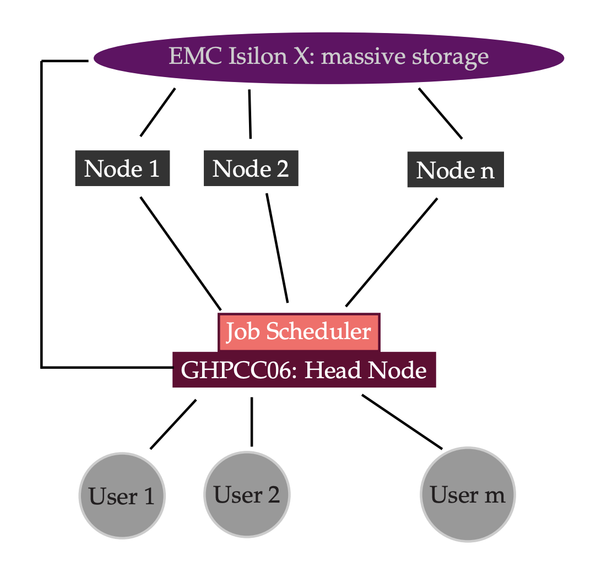
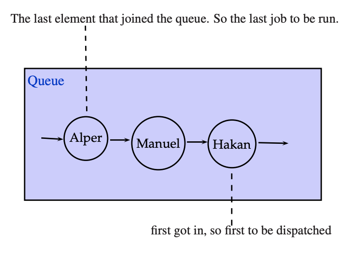
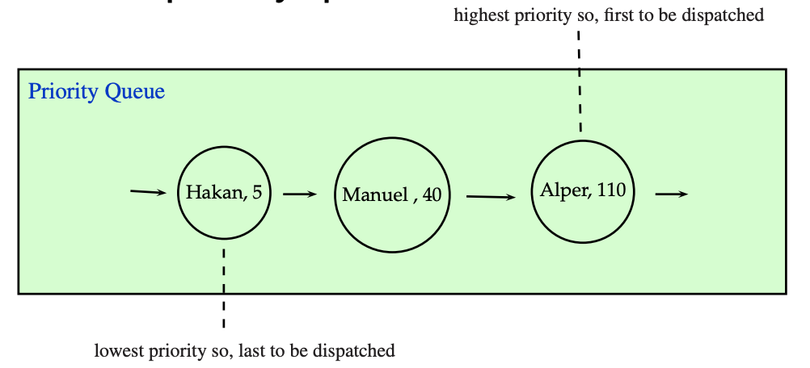

Session 2: UMass High Performance Computing Center
========

Expected learning outcome
========

To understand the basics of UMMS cluster and resources we have to proces biological data. With this tuorial you will familiarize cluster commands using a terminal.

Overview
========
  * [Introduction](#introduction)
  * [Before you start](#why-cluster)
  * [MGHPCC](#mghpcc)
  * [Storage Organization](#storage-organization)
  * [Getting started](#getting-started)
  * [Reaching the Nodes](#reaching-the-nodes)
  * [Job Scheduler](#job-scheduler)
  * [Our First Job Submission](#our-first-job-submission)
  * [Specifying Resources](#specifying-resources)
  * [Job Scheduling](#job-scheduling)
  * [A more Sophisticated Job Submission](#a-more-sophisticated-job-submission)
  * [Monitoring Jobs](#monitoring-jobs)
  * [Killing Jobs](#killing-jobs)
  * [Creating Logs](#creating-logs)
  * [Interactive Nodes](#interactive-nodes)
  * [Determining Resources](#determining-resources)
  * [Advised Practice](#advised-practice)
  * [Most Important MGHPCC Policy](#most-important-mghpcc-policy)
  * [Session2 Homework](#session2-homework)

## Introduction

It is getting easier and cheaper to produce bigger genomic data every day. Today it is not unusual to have 100 samples getting sequenced for a research project. Say, we have 100 samples
sequenced and each sample gave us about 50 million reads. It may easily take half a day to process just one library on a desktop computer. 

### Why Cluster?

Massive data coming from Deep Sequencing needs to be

 - stored
 - (parallel) processed

It is not feasible to process this kind of data even using a high-end laptop/computer.

### MGHPCC

University of Massachusetts Green High Performance Computing Cluster

	HPCC ≡ GHPCC ≡ MGHPCC ≡ the Cluster

***HPC :*** High performance computing

***Cluster :*** a number of similar things that occur together

***Computer Cluster :*** A set of computers connected together that work as a single unit

MGHPCC has over 10K+ cores available and 400+ TB of high performance storage. It is located in Holyoke MA and provides computing services to the five campuses of UMass.

### Storage Organization

Though there are many file systems mounted on the head node, there are three file systems that are important for us.
    
|Type|Location|Content|Quota|	
|-------|-------|-------|-------|
|Home Space|/home/user\_name = ~|Small Files, executables, scripts| 50G|
|Project Space|/project/umw\_PI\_name|Big files being actively processed| Varies|
|Nearline Space|/nl/umw\_PI\_name|Big files for long term storage| Varies|

    
<pre>
<b>Caution:</b>
* We do NOT use the head node (ghpcc06) to process big data.
We use the cluster nodes to process it.
How do we reach the nodes?
</pre>

## Getting started

First command will be "ssh" to connect to the UMASS cluster. If you're using windows, please use PuTTY or similar program to make SSH connection.

	$ ssh username@ghpcc06.umassrc.org
	

Let’s verify that we are at the right place. In this case only run "hostname", not the output of the command (ghpcc06).

	$ hostname
	ghpcc06
	
You need to see "ghpcc06" in your terminal as an output. ghpcc06 is our "head node". 

### Reaching the Nodes

We do NOT use the head node (ghpcc06) to process big data.
We use the cluster nodes to process it.

How do we reach the nodes?

We submit our commands as jobs to a job scheduler and the job scheduler finds an available node for us having the sufficient resources ( cores & memory.)

### Job Scheduler

Job Scheduler is a software that manages the resources of a cluster system. It manages the program execution in the nodes.

It puts the jobs in a (priority) queue and executes them on a node when the requested resources become available.

There are many Job Schedulers available. 
In MGHPCC,

	LSF (Load Sharing Facility)
   
is used.

Say we have 100 libraries of RNASeq data. We want to align
using STAR.

	STAR ... library_1.fastq.gz
	STAR ... library_2.fastq.gz
	...
	STAR ... library_100.fastq.gz
	
We submit this job to the job scheduler rather than running it on
the head node one by one. Once we submit these hundred jobs for alingment they will be executed paralell in 100 different cores, if you submit STAR to use 1 core for each run. You can increase the # of cores per process to finish the job faster but there is a trade off that we will discuss, resource usage and priorities.

### Our First Job Submission

We use the command bsub to submit jobs to the cluster.
Let’s submit a job to write "Hello LSF" into a file in our home directory.

	$ bsub "echo Hello LSF > ~/firstjob.txt"
	
	
Specifying Resources
After running

	$ bsub "echo Hello LSF > ~/firstjob.txt"
	
we got the following warning message

	Job does not list memory required, please specify memory
	...
	Job runtime not indicated, please specify job runtime
	...
	Job <12345> is submitted to default queue <long>

Why did the job scheduler warn us?

### Specifying Resources

Besides other things, each job requires

	1. The # of core(s) processing units
	2. Memory

to execute
The maximum amount of time needed to complete the job must be provided.
There are different queues for different purposes, so the queue
should also be specified as well.

|Resource|Explanation|
|-----|-----|
|Cores| Number of processing units to be assigned for the job. Some programs can take advantage of multicores .Default value is 1.|
|Memory Limit| The submitted job is not allowed to use more than the specified memory. Default value is 1 GB|
|Time Limit|The submitted job must finish in the given time limit. Default value is 60 minutes.|
|Queue|There are several queues for different purposes. Default queue is the long queue.|

### Queues

Let’s see the queues available in the cluster.

	$ bqueues

We will be using the queues interactive , short and long.

|Queue|Explanation|
|-----|-----|
|interactive| used for bash access to the nodes|
|short| used for jobs that take less than 4 hours|
|long| (default queue) used for jobs that take more than 4 hours|

### Job Scheduling

In a system like MGHPCC, where there are over 10K cores and tens of thousands of jobs and hundreds of users, specifying the right parameters can make a big difference!

Let’s try to understand how a job scheduler works on a hypothetical example. The IBM LSF system works differently but using similar principles.

Suppose, for a moment, that when we submit a job, the system puts our job in a queue.

A queue is a data type that implements First In First Out (FIFO) structure.

Say first, Hakan then, Manuel and, lastly, Alper submit a job.

Then, the queue will look like

What if Hakan’s job needs 10 cores and 5 TB of memory in total and 8 hours to run whereas Alper’s job only needs one core 1 GB of memory and 20 minutes to run. Also, Alper didn’t use the cluster a lot recently but Hakan has been using it very heavily for weeks.
This wouldn’t be a nice distribution of resources. A better approach
would be prioritizing jobs, and therefore using a priority queue.

In a priority queue, each element has a priority score. The first element to be removed from the queue is the one having the highest priority.

- Hakan: I need 10 cores, 5TB of memory, 8 hours of time.
- System: A lot of resources requested and heavy previous usage, so the priority score is 5.
- Manuel: I need 2 cores, 8 GB of memory and one hour time.
- System: A medium amount of resources requested, light previous usage, so the priority is 40.
- Alper: I need one core, 1 GB of memory and 20 minutes.
- System: Very little amount of resources requested, light previous usage, so the priority is 110.

So, in a priority queue, we would have

This is a better and fairer sharing of resources. Therefore it is important to ask for the right amount of resources in your job submissions.
 
If you ask more than you need, then it will take longer to start your job.

If you ask less than you need, then your job is going to be killed.

It is a good idea to ask a little more than you actually need.

### A more Sophisticated Job Submission

Let’s submit another job and specify the resources this time.
To set

	1. We explicitly state that we request a single core, -n 1
	2. The memory limit to 1024 MB, we add -R rusage[mem=1024]
	3. Time limit to 20 minutes, we add -W 20
	4. Queue to short, we add -q short

	$ bsub -n 1 -R rusage[mem=1024] -W 20 -q short "sleep 300"
	
### Monitoring Jobs

We will be running jobs that take tens of minutes or even hours.
How do we check the status of our active jobs?

	$ bjobs

Let’s create some example jobs and monitor them. 
Let's run the command below several times;

	$ bsub "sleep 300"

then;

	$ bjobs

We can give a name to a job to make job tracking easier.
We specify the name in the -J parameter.

	$ bsub -J lib_1 "sleep 50"
	$ bsub -J lib_2 "sleep 100"
	$ bsub -J lib_2 "sleep 150"

### Killing Jobs

When you want to cancel or kill a job we use bkill command.

	$ bjobs

We give the JOBID to bkill to cancel the job we want.

Jobs can be killed because of many other reasons. Due to lack of resources or possible problems on the running node etc. To investigate the reason you can use 

	$ bjobs -l #JOBID

command. 

### Creating Logs

It can be helpful to have the output and specifications of the jobs in separate files.

Two log files can be created: the standard error output and the standard output of the command run.

The standard output file is created using the -o parameter and the standard error output is be created using the -e parameter.

	$ bsub -o output.txt -e error.txt "echo foo 1>&2; echo bar"

### Interactive Nodes

Can I get a computing node (other than the head node) for myself temporarily?

Yes. The interactive queue can be used for that.
	
	$ bsub -q interactive -W 120 -Is bash
	
***To respect others, we usually do all the operations using an interactive node. It will reduce the load of the head node.*** 

### Determining Resources

How do we determine the queue, time limit, memory and number of cores?

***Queue:*** Use the interactive queue for bash access. The time limit can be 8 hours maximum. If your job requires less than 4 hours, use the short queue, if it requires more than 4 hours,
you need to submit it to the long queue.

***Time Limit:*** This depends on the software and the size of data you are using. If you have a time estimate, request a bit more than that.

***Memory:*** Depends on the application. Some alignment jobs may require up to 32 GB whereas a simple gzip can be done with 1 GB of memory.

***Number of Cores:*** Depends on the application. Use 1 if you are unsure. Some alignment software can take advantage of multicore systems. Check the documentation of the software you are using.

### Advised Practice

- Do not use the head node for big jobs!

- Do not run programs on the head node that will take longer than 5 minutes or that will require gigabytes of memory. Instead submit such commands as jobs. You can also use the interactive queue for command line access to the nodes. This is mandatory!

- Remember that MGHPCC is a shared resource among the five campuses of UMass!

- Keep in mind that you are probably sharing the same nearline and project space quota with your lab members. Be considerate when using it!

- Keep your password secure.

- Backup your data.

- Keep your files organized

- Do not put genomic data in your home folder. Process data in the project space and use nearline for long term storage

- Delete unnecessary intermediate files

- Be considerate when submitting jobs and using disk space. The cluster is a shared resource.

- Do not process big data in the head node. Always submit jobs instead.

For more detailed information, see
<http://wiki.umassrc.org/>

### Most Important MGHPCC Policy

- ***Do not use the head node for big jobs!***

- Do not run programs on the head node that will take longer than 5 minutes or that will require gigabytes of memory. Instead submit such commands as jobs. You can also use the interactive queue for command line access to the nodes. ***This is mandatory!***

- On the head node (ghpcc06), using alignment software, samtools, bedtools and etc, R, Perl , Python Scripts and etc. for deep sequencing data is a ***very bad*** idea!

- You are likely to get a warning and / or termination of your jobs if you do so.

For questions: <hpcc-support@umassmed.edu>

### Session2 Homework:

1. How many jobs are running in the long, short and interactive queue?
2. How many jobs are pending in the long, short and interactive queue?
3. Run a sleep job for 100 seconds and kill it. Investigate the what happened to this job using bjobs -l command.
4. Try to run a non existing command and write the error message to ~/error.txt file.

