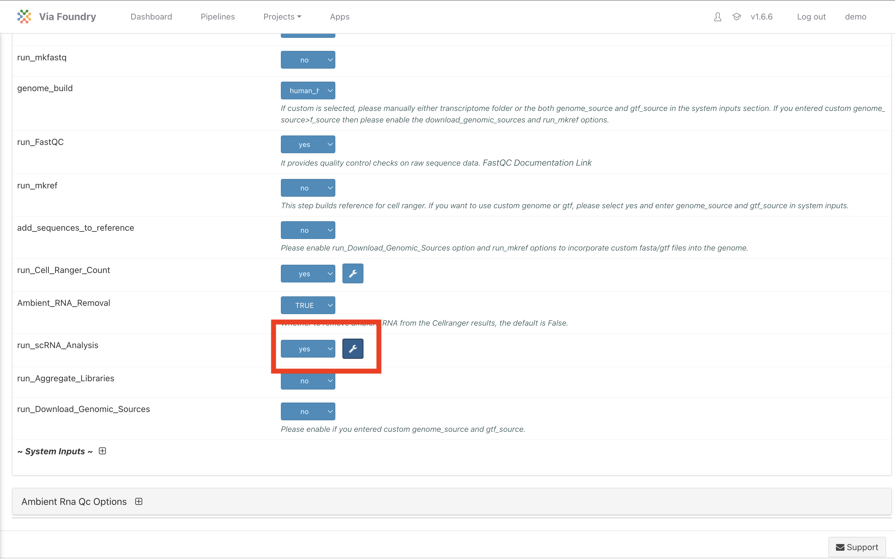
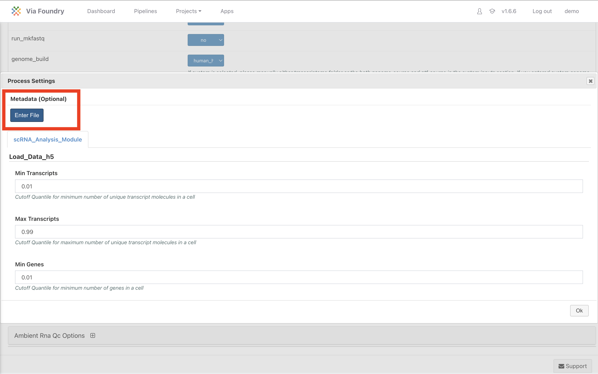
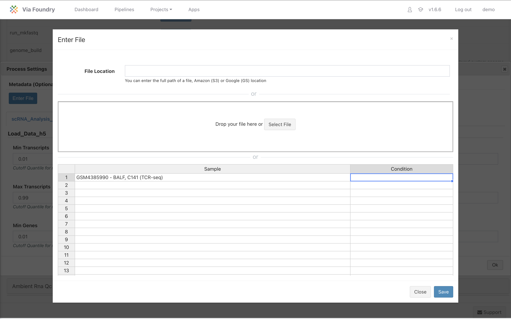
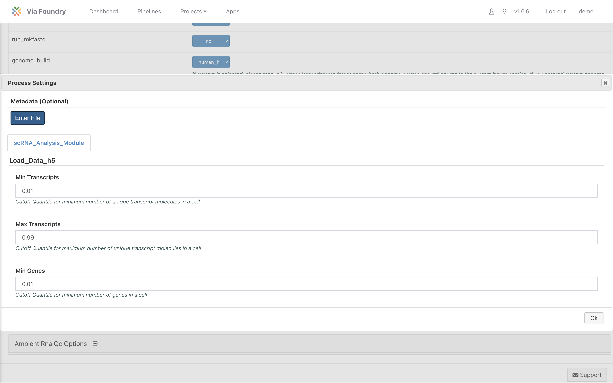
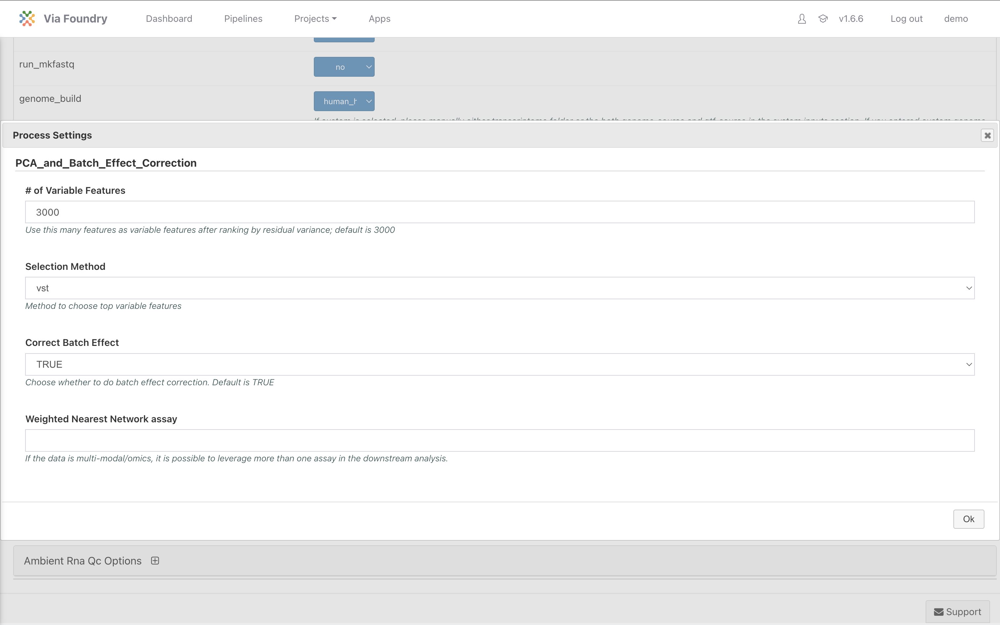
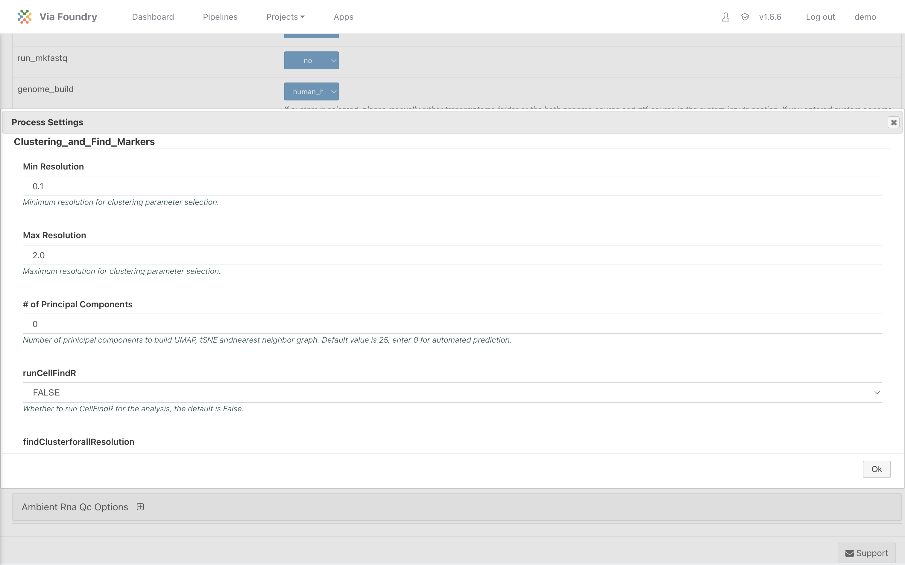
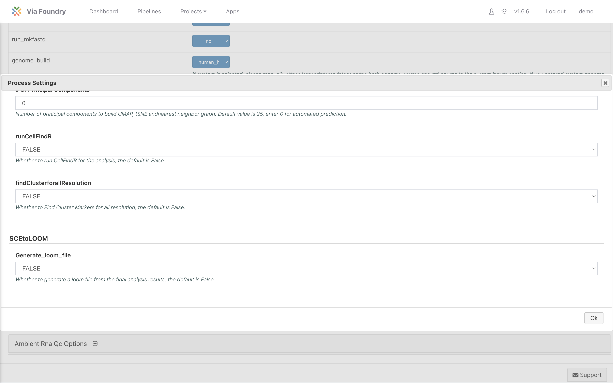

Expected Learning Outcome
========

* Gain an in-depth understanding of the advanced parameters of the Cell Ranger Single Cell RNA Sequencing Pipeline
* Fine-tune your single cell RNAsequencing analysis using metadata, filtering options, normalization methods, and clustering parameters on Via Foundry.

## Class Materials

Class materials will be uploaded after Session 3

# Before you start

Please go to https://viafoundry.umassmed.edu/ and login into your account. If you have a login issue, please let us know about it (BiocoreStaff@umassmed.edu). We will set up an account for you.

Advanced Parameters in Cell Ranger Pipeline
========

This session will walk through the advance parameter for the Cell Ranger pipeline.

Once logged in and the pipeline is initiated, access the **Advanced Parameters** by clicking the "Wrench" icon next to the `run_scRNA_Analysis` stage.

## Metadata File

Select the Metadata Button in the advance parameters.

1. **Entering Metadata Information**:
   - In the "Metadata file" section, click **Enter File**.
   - You can either manually input metadata or upload a file.

2. **Editing Metadata Columns**:
   - The default columns provided are "Sample" and "Condition."
   - To edit a column:
     - Right-click the "Condition" column header and select "Insert Column to the Right."
     - Right-click the new column and rename it "Symptoms."
     - Enter relevant information such as "COVID" for "Condition" and "MILD" for "Symptoms."

3. **Saving Metadata**:
   - After entering the necessary metadata, click **Save** to confirm the changes and proceed with the pipeline.

# Advance Parameter deep dive

This section describe parameters in the `run_scRNA_Analysis` advance options.

## Load_Data_h5 Section

In the `Load_Data_h5` stage, you can adjust filtering and normalization parameters for the Single Cell RNA Sequencing Pipeline.

1. **Minimum and Maximum Transcripts**:
   - These settings filter out cells with transcript counts outside the 1st and 99th percentiles.
   
2. **Minimum and Maximum Genes**:
   - Filters cells based on gene expression counts, removing cells that fall outside the 1st and 99th percentiles.

3. **Percent_mt (Percentage of Mitochondrial Content)**:
   - Set to 25% by default to exclude cells with high mitochondrial expression, indicative of cell stress or death.

4. **Percent_ribo (Percentage of Ribosomal Content)**:
   - Default is 50%, filtering out cells with excessive ribosomal gene expression, improving dataset quality.

5. **Number of Variable Features**:
   - Default: 3,000 variable features. You can adjust this number based on the needs of your analysis.

6. **Normalization Methods**:
   - Default: Log normalization.
   - Other methods: Relative counts or SCT (Single Cell Transform).

7. **Doublet Removal**:
   - Detects and removes doublets, unless the data comes from the Cell Ranger Multi pipeline, in which case doublets are not removed by default.

8. **Remove Mitochondrial/Ribosomal Genes**:
   - Default: False. You can adjust based on whether you want to retain or exclude these gene types.

## PCA_and_Batch_Effect_Correction

In this section, configure the following parameters to ensure accurate data normalization and batch effect correction:

1. **Batch Effect Correction**:
   - Automatically detects and corrects batch effects when multiple samples are present, improving consistency and reliability.

## Clustering_and_Find_Markers

Fine-tune the clustering and marker discovery process with the following settings:

1. **Min and Max Resolution**:
   - Sets the range for clustering resolution. The algorithm iterates through this range to determine optimal clustering.

2. **Number of Principal Components**:
   - Defines the number of principal components. Default is 0, meaning the pipeline will automatically determine the optimal number.

3. **Run CellFindR**:
   - If set to true, CellFindR will run to identify the best clustering resolution. This is resource-intensive and set to false by default.

4. **Find Cluster For All Resolution**:
   - If enabled, clusters are found for every resolution step. Default is false to save time.

## SCEtoLOOM

1. **Generate Loom File**:
   - Default: False. Loom files are large-format files for single-cell data. Set to true only if required for downstream analyses.

## Wrap-up

This guide covered the advanced settings available in the Single Cell RNA Sequencing Pipeline on Via Foundry. By understanding and adjusting these parameters, you can optimize your analysis to meet specific research needs. Proper customization ensures accurate cell population clusters, robust gene expression analysis, and high-quality data filtering.