Expected learning outcome
========

* Understand the basics of scRNA analysis in Foundry
* Launch your own CellRanger Pipeline

## Class Materials

Class materials will be uploaded after Session 3

# Before you start

Please go to https://viafoundry.umassmed.edu/ and login into your account. If you have a login issue, please let us know about it (BiocoreStaff@umassmed.edu). We will set up an account for you.

Running Cell Ranger Pipeline
========
This session will walk through the steps to successfully run the Single Cell RNA Sequencing Pipeline, Cell Ranger, on Via Foundry. By the end of this session, you'll be able to create and execute a pipeline run, input data, and view results on the platform.

## Find and Select the Cell Ranger Pipeline

Begin by navigating to the **Pipelines Tab** on Via Foundry and selecting the Single Cell RNA Sequencing Pipeline. You can use the search bar to locate the pipeline quickly. Select the pipeline

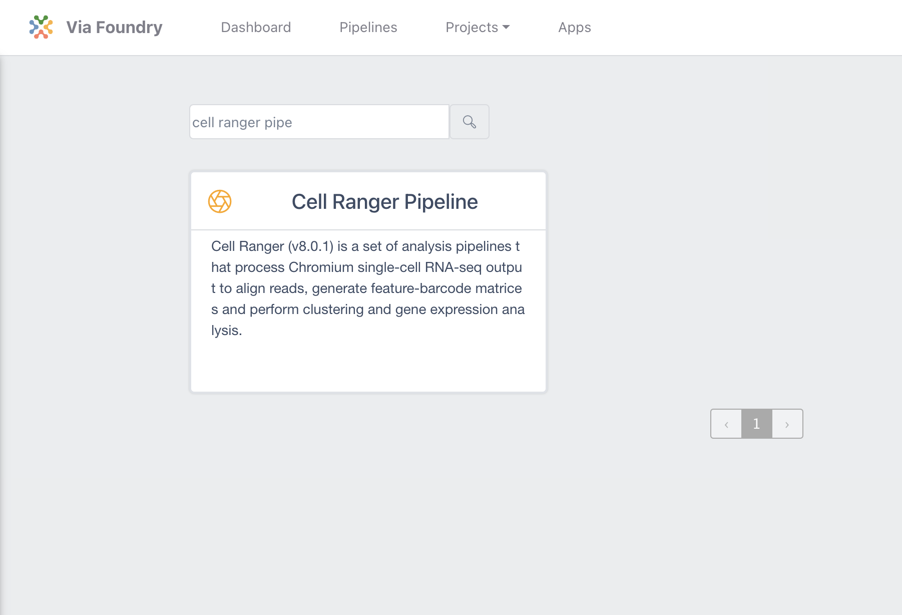

## Review the Pipeline Documentation
Before proceeding, you can review the detailed documentation for the Single Cell RNA Sequencing Pipeline. This will help you understand the steps and parameters involved in the pipeline's operation.

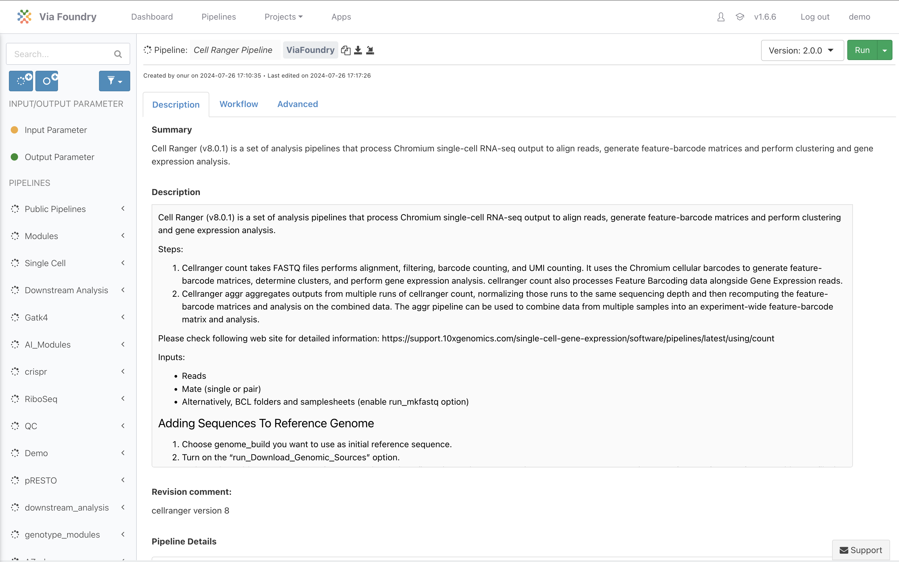

## Create a Pipeline Run
1. Select the green "Run" button on the prior page
2. **Select a Project**: Choose a project that you’ve previously created on Via Foundry (or create a new one). This project will store the results of your pipeline run.
3. **Name Your Run**: Provide a meaningful name for your pipeline run, then click on the "Save Changes" button to store the settings.

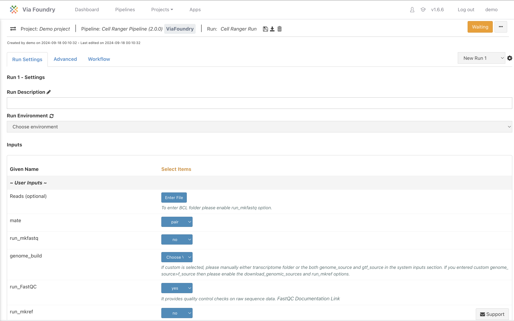

## Set Required Inputs

### Required Input: **Reads**
- Reads represent the raw sequencing data necessary for alignment and quantification in the pipeline. For this walkthrough we'll import sequencing data in the next step.

### Required Input: **genome_build**
- The genome_build is a reference genome used for mapping the reads. Make sure that the reference genome matches your experiment’s design and species.

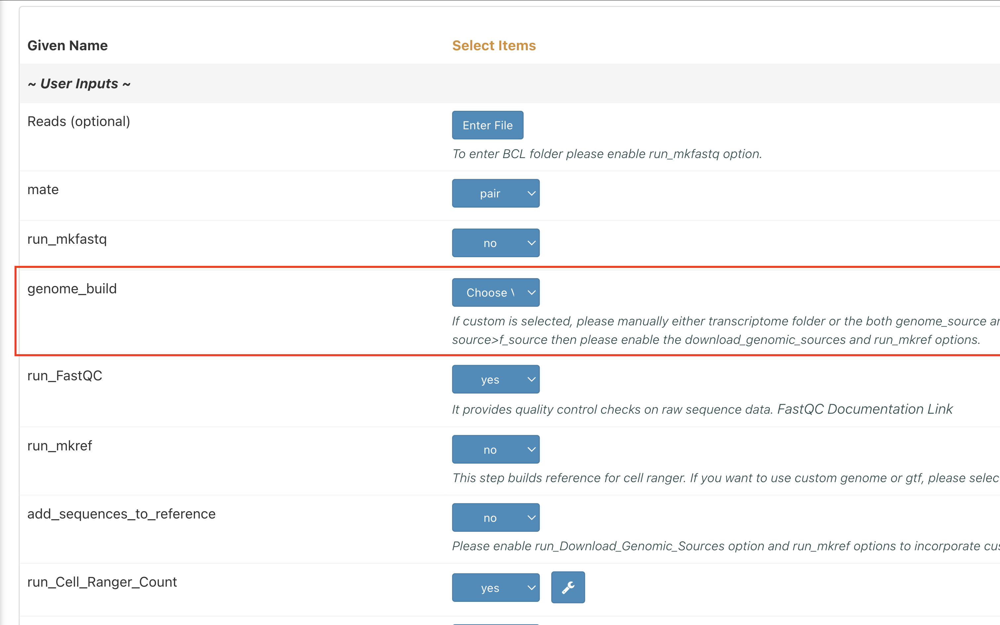

## Select Sequencing Reads Input
1. **Enter File**: Select the option to enter file data manually. For this tutorial, we will use public genomic data from a GEO/NCBI database.

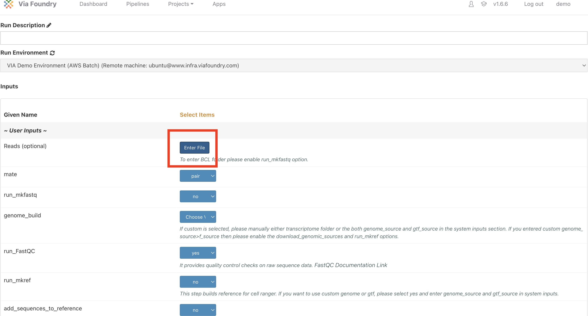

2. Navigate to the NCBI/GEO import page

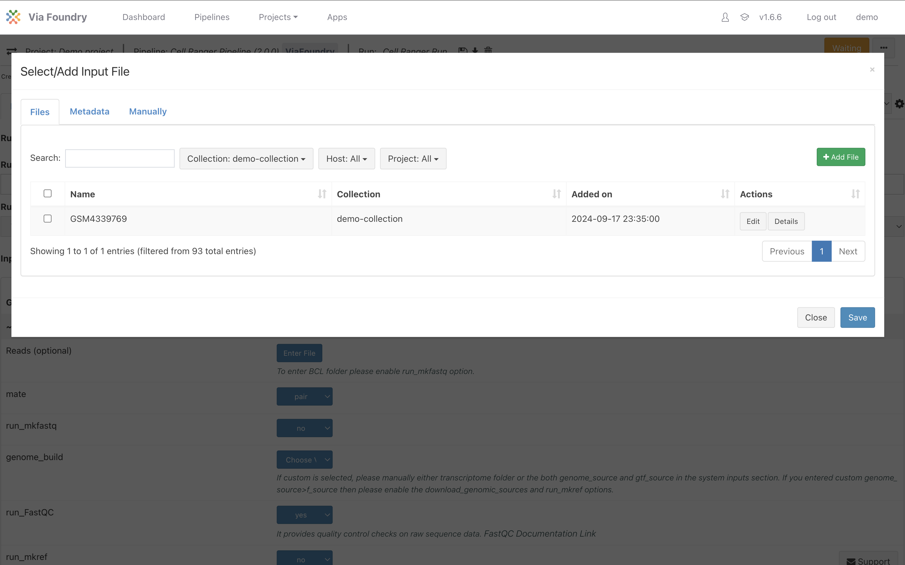

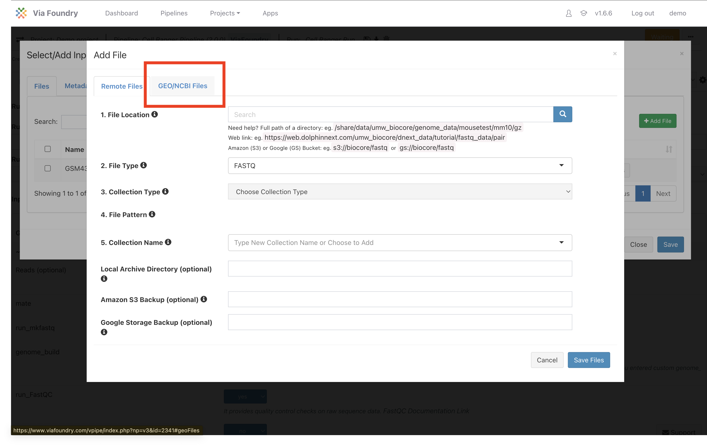

3. **Reference**: Enter the GEO accession number "GSM4339769" and select the appropriate sample. You can also rename the sample or collection name if needed.

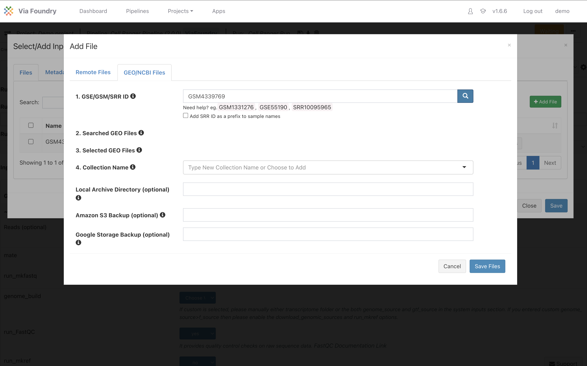

4. Click the search magnifying glass icon. Wait for results to return

5. Enter in a name for the imported sample and collection

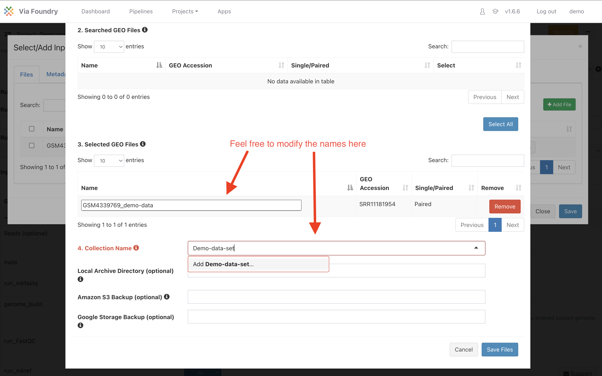

**genome_build**: Choose the appropriate reference genome from the dropdown list. In this case, select `Human HG38 gencode version 32 CellRanger version 6 genome` as the genome build. This genome is compatible with our experimental data.

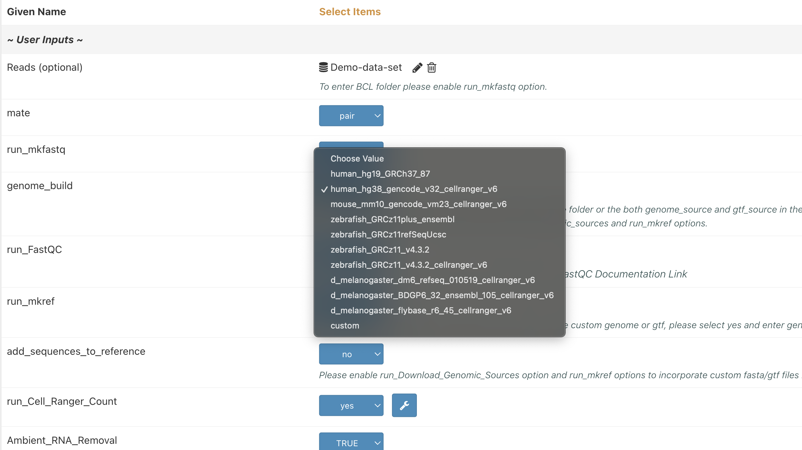

## Initiate the Pipeline Run
Once you have entered the required inputs (reads and genome_build) and selected the run environment, the **Run** button will turn green with a "play" icon. This indicates that the pipeline is ready to be executed.

1. Click the **Run** button to begin the analysis process.
2. This will take you to the **Run Page** where you can monitor and interact with your pipeline.

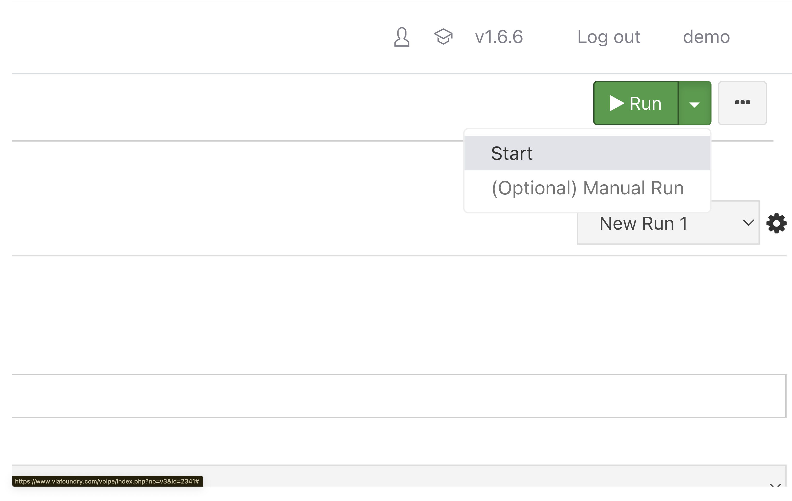

## Monitor the Pipeline Run
On the Run Page, you can navigate through various sections:

- **Run Settings**: Displays the inputs and parameters selected for this run.

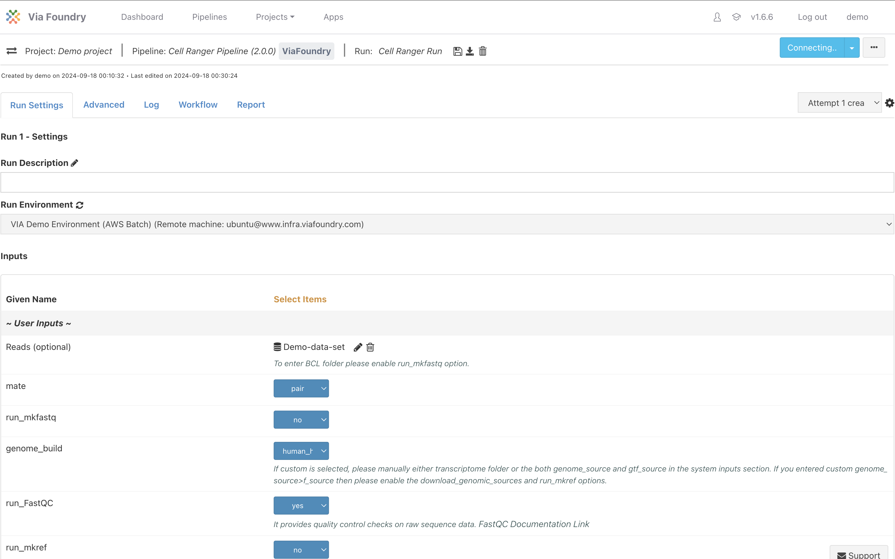

- **Advanced**: Contains in-depth information about the pipeline’s processes, down to each individual step.

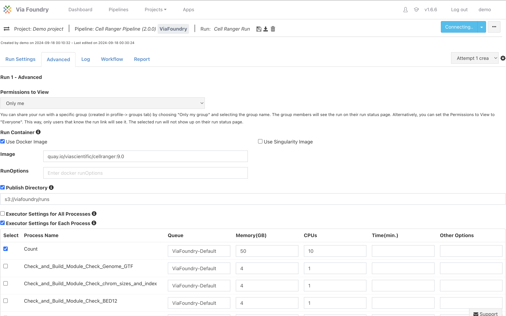

- **Log**: A live feed of the pipeline’s execution, displaying real-time progress and output.

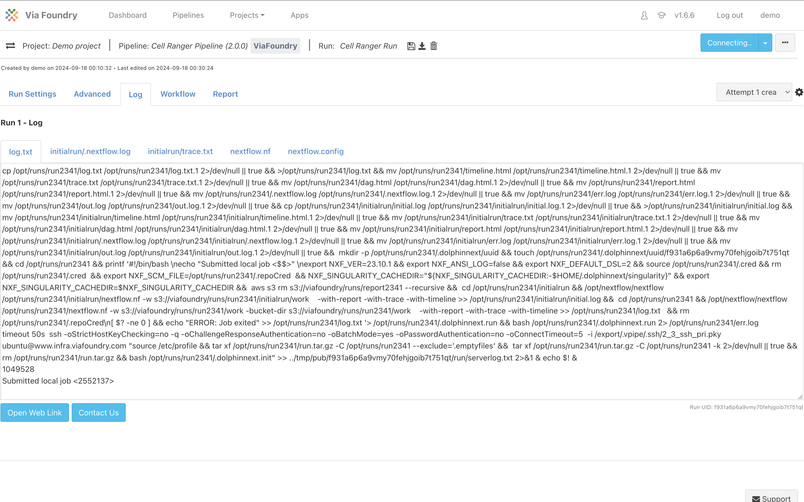

- **Workflow**: Shows a visual representation of the pipeline being executed.

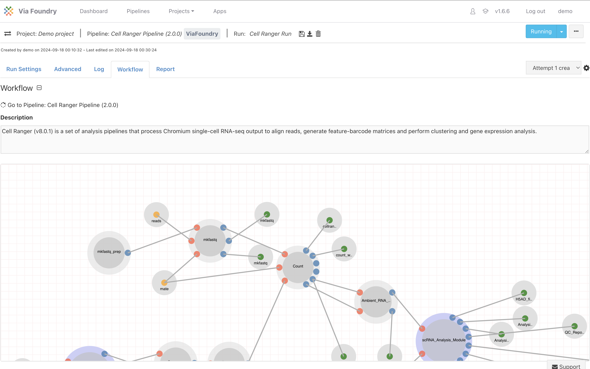

- **Report**: Contains the final results of the analysis. Once the pipeline has completed, the results will be available for review. If the pipeline is still running, this tab will display "No data available."

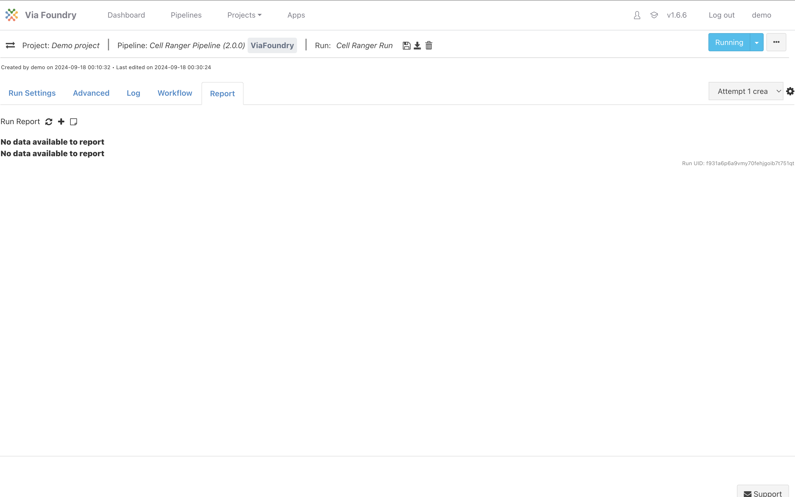

# Wrap-up
Congratulations! You have successfully launched the Single Cell RNA Sequencing Pipeline on Via Foundry. You now have the tools to set up your pipeline run, input data, and monitor the process. For further details and resources, consult the additional documentation provided on the Cell Ranger pipeline page or in Via Foundry.

Good luck with your studies, and feel free to reach out if you have any questions!
