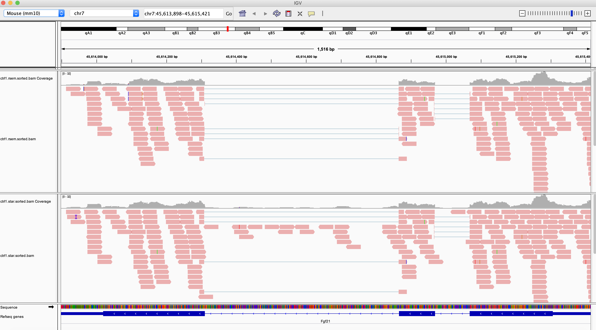

Session 3: RNA-Seq data processing and analysis
========

Expected learning outcome
========

To understand the basics of RNA-Seq data, how to use RNA-Seq for different objectives and to familiarize yourself with some standard software packages for such analysis.

Overview
========

  * [Introduction](#introduction)
  * [Getting Started](#getting-started)
  * [Exercise 1: prepare for genomic and transcriptomic alignments](#exercise-1-prepare-for-genomic-and-transcriptomic-alignments)
  * [Exercise 2: Genome alignment of RNA-seq reads](#exercise-3-genome-alignment-of-rna-seq-reads)

  * [Exercise 3: Quantify with the RSEM program](#exercise-2-quantify-with-the-rsem-program)
  * [Exercise 4: Differential Expression Analysis](#exercise-4-differential-expression-analysis)
  * [Session3 Homework](#session3-homework)

## Introduction
Today we will do the exercises below to learn, how genomic and transcriptomic alignments are done, their differences and what kind of software we use. In these examples, for splice aware genomic alignments, we will use STAR and for gene quantification, we will use RSEM. RSEM is going to use STAR in the background to map the reads to only transcriptome. Figure 1 shows a typical RNA-Seq pipeline.  

 
<p align="center"><b>Figure1. RNA-Seq pipeline example</b></p>

* When we want align the reads to whole genome, we need to use splice aware aligner. **Tophat**, **Hisat2** or **STAR** are used for this purpose. However, these software do not quantify the genes or transcripts. We need to use another program like **featureCounts** or **RSEM**. Even RSEM is slower than feature counts, it produces more accurate quantifications than featureCounts. 

* RSEM is bound to the completness of transcript annotation you used. If you don't want to loose anything due to the used annotation, we suggest you to align your reads to whole genome and visualize them using a genome browser to investigate all mapped reads to the genome.

* Please check the [RSEM](https://bmcbioinformatics.biomedcentral.com/articles/10.1186/1471-2105-12-323) paper for details.

Figure 2 shows the main differences between STAR and RSEM.

 
<p align="center"><b>Figure2. STAR vs. RSEM</b></p>

Sample pooling has revolutionized sequencing. It is now possible to sequence 10s of samples together. Different objectives require different sequencing depths. Doing differential **gene expression analysis** requires **less sequencing depth** than **transcript reconstruction** so when pooling samples it is critical to keep the objective of the experiment in mind.

In this activity, we will use subsets of experimentally generated datasets. One dataset was generated for **differential gene expression analysis** while the other towards **transcript annotation**.

## Getting Started

For quantification we will use a set of data generated from the same strain as the genome reference mouse (C57BL/6J). We selected three replicates from control (wild type) and three from a knock-out strain. The idea is to find genes that are in the same pathway as the gene that were knock out. We will use a reduced genome consisting of the first 9.5 million bases of mouse chromosome 16 and the first 50.5 million bases of chromosome 7.

### Quantification and differential gene expression analysis

The main goal of this activity is to go through a standard method to obtain gene expression values and perform differential gene expression analysis from an RNA-Seq experiment.

We will start by alignment and visualizing the data using the STAR spliced aligner. We will then perform gene quantification using the RSEM program and finally differential gene expression analysis of the estimated counts using EBSeq, DESeq or EdgeR.

This activity should also serve as a review of the previous two classes as you will work on the hpcc.

#### Before you start

1. Connect to cluster using the command below with your username and password

```
$ ssh your_user@ghpcc06.umassrc.org
```

2.  Please start an interactive job in the cluster using the command below or enter your `bsub` command as you've learned from previous sessions. Head node is only used only for job submissions. An interactive job/session is a way to log in to a node and use it as if it were your local workstation for the limited time (e.g. `qlogin` will set limit for 4 hours). You may use this same script in the future whenever you want to start and work on a node and run programs in an interactive session.

```
$ /project/umw_biocore/bin/qlogin
```

* Tip: If you want to learn the parameters of `qlogin` script, simply run `cat /project/umw_biocore/bin/qlogin`
	

3. If you haven't done your homework first week. Please run the command below to prepare your working directory for bootcamp.

```
$ /project/umw_biocore/bin/session1.sh
```	

4. Make sure you have at least 5G space in your home directory. To check it;

```
$ df -h .
Filesystem            Size  Used Avail Use% Mounted on
umassmghpcc-head.umassrc.org:/ifs/xdata/home/ak97w
		       50G   27G   24G  54% /home/ak97w
```

Here, I have 24G available space in my home.
	

## Exercise 1: prepare for genomic and transcriptomic alignments

Both STAR and RSEM rely on STAR to perform read alignment. STAR uses very efficient genome compression algorithm that allows for quick matching of sequences. To use these alignments, it is necessary to create index or reference files. Please go to `~/bootcamp/RNA-Seq/mm10` directory. We will create index files for STAR and reference files for RSEM. 

Creating these files are usually a one time thing and you use them in the future. We've already shared highly used genome builds for model organisms, so you can check it out later in `/share/data/umw_biocore/genome_data/`. Howewer, if you need to create these files yourself in the future, you can consult to this exercise. 

1. First load necessary modules we will use today.

```
$ module load star/2.7.0e
$ module load RSEM/1.3.0
$ module load samtools/1.9
```

2. Build STAR index files.

The command: `STAR --runMode genomeGenerate  --genomeDir publish_dir  \
--genomeFastaFiles genome_file --sjdbGTFfile gtf_file`

|Arguments|Explanation|
|---------|-----------|
|--runMode genomeGenerate| This run mode creates the index files
|--genomeDir| The location where the index files will be written|
|--genomeFastaFiles| Genome file that are going to be used to create the index files|
|--sjdbGTFfile| Annotation file to learn exon junction sites|
|\<annotation file\>| The annotation file in .gtf format|

Please consult STAR manual for more details; <https://physiology.med.cornell.edu/faculty/skrabanek/lab/angsd/lecture_notes/STARmanual.pdf>

Please run the commands below to create index files under star folder;

**When the command is too long, we use "\" to split to command into lines***

```
$ cd ~/bootcamp/RNA-Seq/mm10
$ mkdir star
$ STAR --runMode genomeGenerate  --genomeDir ./star  \
  --genomeFastaFiles mm10.fa --sjdbGTFfile ucsc.gtf
	
Apr 20 20:08:26 ..... started STAR run
Apr 20 20:08:26 ... starting to generate Genome files
Apr 20 20:08:27 ... starting to sort Suffix Array. This may take a long time...
Apr 20 20:08:28 ... sorting Suffix Array chunks and saving them to disk...
Apr 20 20:09:23 ... loading chunks from disk, packing SA...
Apr 20 20:09:27 ... finished generating suffix array
Apr 20 20:09:27 ... generating Suffix Array index
Apr 20 20:09:40 ... completed Suffix Array index
Apr 20 20:09:40 ..... processing annotations GTF
Apr 20 20:09:40 ..... inserting junctions into the genome indices
Apr 20 20:09:54 ... writing Genome to disk ...
Apr 20 20:09:54 ... writing Suffix Array to disk ...
Apr 20 20:09:55 ... writing SAindex to disk
Apr 20 20:09:59 ..... finished successfully
```

When you check the newly generated files with ls, the files should be like below; 

```	
$ ls star
chrLength.txt	   genomeParameters.txt
chrNameLength.txt  SA
chrName.txt	   SAindex
chrStart.txt	   sjdbInfo.txt
exonGeTrInfo.tab   sjdbList.fromGTF.out.tab
exonInfo.tab	   sjdbList.out.tab
geneInfo.tab	   transcriptInfo.tab
Genome
```

3. In addition to STAR index files, we will prepare the transcriptome for RSEM alignment. RSEM will align directly to the set of transcripts included (ucsc.gtf file). The transcript file was downloaded directly from the UCSC table browser and gene list is reduced for a faster creation. 

The command: `rsem-prepare-reference --star --gtf gtf_file genome_fasta_file index_prefix` 

|Arguments|Explanation|
|---------|-----------|
|--star|Builds STAR indices. Please check the manual to use other aligners|
|--gtf|RSEM will extract transcript reference sequences using the gene annotations specified in this file, which should be in GTF format.|
|\<genome fasta file\>|Genome Fasta file that are going to be used (e.g. mm10.fa)|
|\<index prefix\>|Prefix for the reference. RSEM will generate several reference-related files that are prefixed by this name. This name can contain path information (e.g. rsem/mm10.rsem)|

Manual for more details: <http://deweylab.biostat.wisc.edu/rsem/rsem-prepare-reference.html>

To generate the necessary reference files, please use the command below.

```	
$ cd ~/bootcamp/RNA-Seq/mm10
$ mkdir rsem
$ rsem-prepare-reference --star --gtf ucsc.gtf mm10.fa rsem/mm10.rsem
	
rsem-extract-reference-transcripts rsem/mm10.rsem 0 ucsc.gtf None 0 mm10.fa
Parsing gtf File is done!
mm10.fa is processed!
2058 transcripts are extracted.
Extracting sequences is done!
Group File is generated!
Transcript Information File is generated!
Chromosome List File is generated!
Extracted Sequences File is generated!
	
rsem-preref rsem/mm10.rsem.transcripts.fa 1 rsem/mm10.rsem
Refs.makeRefs finished!
Refs.saveRefs finished!
rsem/mm10.rsem.idx.fa is generated!
rsem/mm10.rsem.n2g.idx.fa is generated!
	
STAR  --runThreadN 1  --runMode genomeGenerate  --genomeDir rsem  --genomeFastaFiles mm10.fa  --sjdbGTFfile ucsc.gtf  --sjdbOverhang 100  --outFileNamePrefix rsem/mm10.rsem
Apr 20 20:05:43 ..... started STAR run
Apr 20 20:05:43 ... starting to generate Genome files
Apr 20 20:05:45 ... starting to sort Suffix Array. This may take a long time...
Apr 20 20:05:45 ... sorting Suffix Array chunks and saving them to disk...
Apr 20 20:06:38 ... loading chunks from disk, packing SA...
Apr 20 20:06:42 ... finished generating suffix array
Apr 20 20:06:42 ... generating Suffix Array index
Apr 20 20:06:55 ... completed Suffix Array index
Apr 20 20:06:55 ..... processing annotations GTF
Apr 20 20:06:55 ..... inserting junctions into the genome indices
Apr 20 20:07:08 ... writing Genome to disk ...
Apr 20 20:07:08 ... writing Suffix Array to disk ...
Apr 20 20:07:09 ... writing SAindex to disk
Apr 20 20:07:14 ..... finished successfully
```

Let's get the list for rsem references to make sure the command worked right;

```	
$ ls rsem
chrLength.txt	      mm10.rsemLog.out
chrNameLength.txt     mm10.rsem.n2g.idx.fa
chrName.txt.          mm10.rsem.seq
chrStart.txt	      mm10.rsem.ti
exonGeTrInfo.tab      mm10.rsem.transcripts.fa
exonInfo.tab	      SA
geneInfo.tab	      SAindex
Genome		      sjdbInfo.txt
genomeParameters.txt  sjdbList.fromGTF.out.tab
mm10.rsem.chrlist     sjdbList.out.tab
mm10.rsem.grp	      transcriptInfo.tab
mm10.rsem.idx.fa
```

Now, we organized the index files like below. In the future, if you need other index files for different aligners or need new annotations for the same software, you can put them into different folders to keep the index files in more organized way rather than putting them into the same folder.

```
$ tree -d ~/bootcamp/RNA-Seq/mm10/
mm10
├── rsem
└── star
```
	
## Exercise 2: Genome alignment of RNA-seq reads

1. To avoid cluttering the workspace we will direct the output of each exercise to its own directory. In this case for example:

```
$ cd ~/bootcamp/RNA-Seq
$ mkdir star
$ STAR  --genomeDir mm10/star --readFilesIn reads/control_rep1.1.fq \
reads/control_rep1.2.fq --outFileNamePrefix star/ctrl1.star
```
	
2. STAR produces a sam file. We need to convert it to a bam file.

```
$ samtools view -S -b star/ctrl1.starAligned.out.sam >  star/ctrl1.star.bam
```

3. We can then sort and index this bam file to compare with rsem alignments. You will learn the details about sorting and indexing in the next exercise before visulaization. 

```
$ samtools sort -o sorted/ctrl1.star.sorted.bam star/ctrl1.star.bam 
$ samtools index sorted/ctrl1.star.sorted.bam
```

4. Please do it for the other samples **(control_rep2, control_rep3, exper_rep1, exper_rep2, exper_rep3)**.
  
   You can also create a bash script as an example like below to run for the others; 
	(```/project/umw_biocore/class/starruns.sh```). 
	You can check what we have in this file using more/less or vi commands.


## Exercise 3: Quantify with the RSEM program

RSEM depends on an existing annotation and will only scores transcripts that are present in the given annotation file. It will also not align the reads in intronic and intergenic regions. We will compare the alignments produced by RSEM and STAR and this will become clear.

The first step is to prepare the transcript set that we will quantify. We selected the UCSC genes which is a very comprehensive, albeit a bit noisy dataset. As with all the data in this activity we will only use the subset of the genes that map to the genome regions we are using.

### 3.1 Calculate expression
RSEM is ready to align and then attempt to perform read assignment and counting for each isoform in the file provided above. You must process each one of the 6 libraries:

The command: `rsem-calculate-expression --star --paired-end -p <#-of-threads> \
--output-genome-bam <reads> <index_prefix> <output_prefix>`

Arguments|Explanation|
|---------|-----------|
|--star|Use STAR to align the reads|
|--paired-end|Input reads are paired-end reads. (Default: off)|
|-p|Number of threads to use|
|-output-genome-bam|Generate a BAM file in genmic coordinates|
|\<reads\>| Read files (e.g. reads/control_rep1.1.fq reads/control_rep1.2.fq) |
|\<index\>| Index prefix (e.g. mm10/rsem/mm10.rsem)|
|\<output prefix\>| Output prefix (e.g. rsem/ctrl1.rsem)|


For more details about the arguments; <http://deweylab.biostat.wisc.edu/rsem/rsem-calculate-expression.html>

``` 
$ cd ~/bootcamp/RNA-Seq
$ mkdir rsem
$ rsem-calculate-expression --star --paired-end -p 2  \
 --output-genome-bam reads/control_rep1.1.fq reads/control_rep1.2.fq \
 mm10/rsem/mm10.rsem rsem/ctrl1.rsem 
```

rsem-calculate-expression program produces the files below;

```	
$ ls rsem/ctrl1* -1
rsem/ctrl1.rsem.genes.results
rsem/ctrl1.rsem.genome.bam
rsem/ctrl1.rsem.isoforms.results
rsem/ctrl1.rsem.transcript.bam
	
rsem/ctrl1.rsem.stat:
ctrl1.rsem.cnt
ctrl1.rsem.model
ctrl1.rsem.theta
```

* Gene quantifications are reported in `rsem/ctrl1.rsem.genes.results` file.
* Isoform quantifications are in `rsem/ctrl1.rsem.isoforms.results` file. 


You should take the time to familiarize yourself with the output file.

```
$ head rsem/ctrl1.rsem.genes.results 
```

|gene_id|transcript_id(s)|length|effective_length|expected_count|TPM|FPKM|
|-------|----------------|------|----------------|--------------|---|----|
|0610005C13Rik|uc029wfi.1,uc029wfj.1|1112.77|925.22|3193.00|312675.64|191959.76|
|1500002O20Rik|uc009fpm.1,uc009fpn.1|1921.50|1733.96|0.00|0.00|0.00|
|1600014C10Rik|	uc009gks.1,uc009gkt.1|3241.00|3053.46|0.00|0.00|0.00|


|Column|Explanation|
|------|-----------|
|gene_id|Gene id from gtf file|
|transcript_id(s)| Transcript ID|
|length|Gene/Transcript's sequence length|
|effective_length|It counts only the positions that can generate a valid fragment. This value is used while calculating FPKM values|
|expected_count| This is the sum of the posterior probability of each read comes from this transcript over all reads.|
|TPM|Transcripts Per Million. It is a relative measure of transcript abundance. The sum of all transcripts' TPM is 1 million.|
|FPKM|Fragments Per Kilobase of transcript per Million mapped reads.|

* **Warning: Expected_count can be used as raw counts (unnormalized). The differential expression tests (like EBSeq, DESeq or EdgeR) are based on negative binomial distribution and require raw counts. So please use expected_count column for these methods.** 
* You **cannot use normalized values such as TPM or FPKM** while performing these methods. TPM or FPKM are usually used for data visualization such as heatmaps, scatter plots or bar plots etc.

Next, for each of the other **5 libraries (control_rep2, control_rep3, exper_rep1, exper_rep2, exper_rep3)**, please run `rsem-calculate-expression` to calculate expected counts by yourself. **You need to change the input fastq filenames  (control_rep1.1.fq and control_rep1.2.fq) and output directories (rsem/ctrl1.rsem) for each of the run.** Please check another example for control_rep2 at below: 

```
$ rsem-calculate-expression --star --paired-end -p 2  --output-genome-bam \
reads/control_rep2.1.fq reads/control_rep2.2.fq \
mm10/rsem/mm10.rsem rsem/ctrl2.rsem
```
	
#### samtools “sort” and "index"

When you align FASTQ files with all current sequence aligners, the alignments produced are in random order with respect to their position in the reference genome. In other words, the BAM file is in the order that the sequences occurred in the input FASTQ files.
	
If you want to visualize mapped reads in the genome browser, you will need to use **rsem/ctrl1.rsem.genome.bam** file which includes mapped reads in genomic coordinates. Before uploading into genome browser, you need to `sort` (samtools sort) and `index` (samtools index) bam file. We will do this in the following excercise. When a bam file sorted it is ordered positionally based upon their alignment coordinates on each chromosome. Moreover, indexing is required by genome viewers such as IGV or ucsc genome browser so that the viewers can quickly display alignments in each genomic region to which you navigate.

To sort and index we use samtools. Let's create them under **sorted** folder. Samtools sort command is following; 

	`samtools sort -o <output.bam> <input.bam>`
	
If you haven't loaded please load samtools.

```	
$ module load samtools/1.9
```

Let's run the commands. 

```
$ cd ~/bootcamp/RNA-Seq
$ mkdir sorted
$ samtools sort -o sorted/ctrl1.rsem.sorted.bam rsem/ctrl1.rsem.genome.bam 
$ samtools index sorted/ctrl1.rsem.sorted.bam
	
# Check the output of the commands: 
$ ls sorted
```

Please run the same command for other samples **(control_rep2, control_rep3, exper_rep1, exper_rep2, exper_rep3)**.Please check an example for control_rep2 at below:

```
$ samtools sort -o sorted/ctrl2.rsem.sorted.bam rsem/ctrl2.rsem.genome.bam 
$ samtools index sorted/ctrl2.rsem.sorted.bam
```

***Make sure to locate bam file and bam.bai (index file) together in the same directory for visualization. Otherwise, the genome browser will give an error.***

### 3.2 Create consolidated table


RSEM provides a simple script to take expected_count columns from all the independent RSEM output and combine it into a single table, which is useful for inspection and ready for differential gene expression analysis.

To find out what the script does you may run the following command in the transcriptomics directory:

```
  $ rsem-generate-data-matrix
```

Before you use this program, make sure you could run rsem-calculate-expression program for all the samples. When you get a list for *.genes.results; the result should look like below;

```	
$ ls rsem/*.genes.results 
rsem/ctrl1.rsem.genes.results  rsem/ctrl3.rsem.genes.results   rsem/exper2.rsem.genes.results
rsem/ctrl2.rsem.genes.results  rsem/exper1.rsem.genes.results  rsem/exper3.rsem.genes.results
```

If you haven't done the previous excercise but want to move forward, you can run the command below to run rsem commands for all samples. (**If you alredy have the results files above, please don't run the command below**) 

```
$ /project/umw_biocore/class/rsemruns.sh
```

Now we are ready to generate the data matrix;

```	
$ cd ~/bootcamp/RNA-Seq
$ mkdir quant
$ cd rsem
$ rsem-generate-data-matrix *.genes.results > ~/bootcamp/RNA-Seq/quant/rsem.gene.summary.count.txt
```

Let's grep Fgf21 gene in this file;

```		
$ cd ~/bootcamp/RNA-Seq
$ grep Fgf21 quant/rsem.gene.summary.count.txt 
"Fgf21"	108.00	124.00	172.00	499.00	650.00 330.00
```	

### 3.3 Visualize the raw data:

We are now ready to look at the data. Download the IGV program from the IGV site.

<http://software.broadinstitute.org/software/igv/download>

Transfer your bam files from the hpcc to your laptop using **FileZilla** (or use `scp` command in mac). If you haven't installed it, please check [our FileZilla guide in session 1](https://github.com/UMMS-Biocore/bootcamp/blob/75f609d1aac2aa51cac47a5d618365680c6abc9f/session1/session1.md#file-transfer-from-your-laptop-to-cluster-using-filezilla)

If you're having trouble installing FileZilla, you can directly download bam files by using our web link: https://galaxyweb.umassmed.edu/pub/class/sorted_bams/

Please make sure you've noted the directory you downloaded, since you will need to load them into IGV.

* **Note:** In general, when we work with real data, we don't not transfer the files. There are ways to access the files from your desktop or laptop directly at the HPCC, however we'll cover this later. Since the files are very small transfer time will not be a problem. 

1. Launch the IGV browser, and use the File -> load to load the files onto the browser. 
2. Load only one or two `.bam` files to begin with. Make sure `.bam` and `*.bam.bai` files are in the same folder. 
3. Choose **mm10** as a **genome build** from the top left dropdown. 

A few genes are good examples of differentially expressed genes. For example the whole region around the key **Fgf21** gene is upregulated in experiment vs controls, while the gene **Crebbp** is downregulated in experiments vs controls. 

4. To point your browser to either gene just type or copy the name of the gene (eg. **Fgf21** or **Crebbp**) in the location box at the top.

In the example below. I loaded rsem and star alignments for control_rep1. What is the major difference in these two alignment results? 

 

We will revisit these genes below when we do the differential gene expression analysis.

## Exercise 4: Differential Expression Analysis

One of the fastest way to perform differential expression(DE) analysis is using EBSeq in RSEM.

* rsem-run-ebseq command runs EBSeq in R. In our cluster, EBSeq library is installed in R/3.2.0. We will need to load it before we use the command. In this tutorial, we used one of the old versions of RSEM, since rsem-run-ebseq is no longer available in the latest RSEM version. This script takes inputs as; the generated matrix (rsem.gene.summary.count.txt), a comma-separated list of values representing the number of biological replicates each condition has (**3,3** in our example case) and it will write the output to results/de.txt. 

* Finally, rsem-control-fdr selects a list of genes from results/de.txt by controlling the false discovery rate (FDR) at level 0.01 and outputs them to results/fdr.de.txt. So, this package is using its own normalization method described in the link below. So, we need to use **expected_count** matrix.

To perform these analysis please run the commands below;

```
$ cd ~/bootcamp/RNA-Seq
$ /project/umw_biocore/bin/loadRSEM
$ mkdir results
$ module load R/3.2.0
$ /project/umw_biocore/bin/RSEM_v1.2.28/rsem-run-ebseq quant/rsem.gene.summary.count.txt 3,3 results/de.txt
$ /project/umw_biocore/bin/RSEM_v1.2.28/rsem-control-fdr results/de.txt 0.01 results/fdr.de.txt
There are 11 genes/transcripts reported at FDR = 0.01.
```

Each line in `results/de.txt` or `results/fdr.de.txt` file describes a gene and contains 7 fields:

|gene_id|PPEE|PPDE|PostFC|RealFC|C1Mean|C2Mean|
|-------|----------------|------|----------------|--------------|---|----|
|0610005C13Rik|0|1|0.546231866622021|0.546177403890056|1425.33639072579|2609.66660063196|
|Crebbp|0|1|3.27261666273869|3.28175727297395|255.559823493019|77.8659067886273|

|Column|Explanation|
|------|-----------|
|gene_name|Gene name|
|PPEE|Posterior probability of being equally expressed|
|PPDE|Posterior probability of being differentially expressed|
|PostFC|Iposterior fold change of condition 1 over condition 2|
|RealFC|Real fold change of condition 1 over condition 2|
|C1Mean|Mean count of condition 1|
|C2Mean|Mean count of condition 2|

* Note: For fold changes, PostFC is recommended over the RealFC and you can find the definition of these two fold changes in the description of PostFC function of EBSeq package.

<https://www.bioconductor.org/packages/release/bioc/vignettes/EBSeq/inst/doc/EBSeq_Vignette.pdf>

Please also note that PostFC, RealFC, C1Mean and C2Mean are calculated based on normalized read counts.

These detected genes actually make sense to us. Fgf21 is upregualted in exper vs. control. (Here first 3 columns were control and last 3 columns were knock out experiments. So 1/PostFC will give you the fold change that you can use to show upregulation. **Crebbp** would be down regulated in this comparison. Please confirm the results of `results/fdr.de.txt` in IGV for these 11 genes. 

Even though this method is one of the fastest way of doing differential expression analysis. We usually prefer using DESeq2 to perform DE analysis that we will learn in the next sessions.

## Session3 Homework

1. Please upload all the tracks to IGV, remove bam tracks and only keep coverage tracks. 
2. Color exper tracks to green and ctrl tracks to red by right-click change track color option.
3. Visualize Fgf2, Vasn and Pam16 genes separately.
4. Define a new gene list using "Regions"->"Gene Lists" menu by including genes above and press view. Send the screenshot to our bootcamp slack channel.


