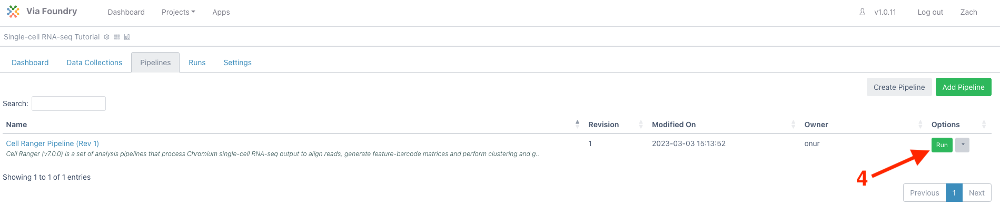
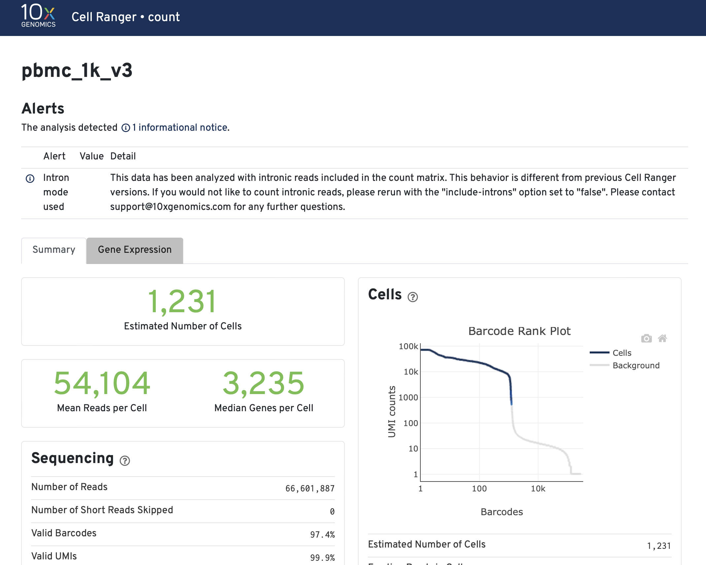

Expected learning outcome
========

To understand the basics of Foundry and run a single-cell RNA-Seq pipeline with sample data.

## Class Materials

You can follow the class materials below.

<b>Session 3: </b><br />

  * [Session3 scRNA-Seq Introduction](Session3_single_cell_intro.pptx)
  * [Session3 scRNA-Seq Analysis](Session3_Single_Cell_Analysis.pptx)
  * [Session3 scRNA-Seq Tutorial](Session3_Single_Cell_Analysis_Tutorial.pptx)


# Before you start

Please go to https://viafoundry.umassmed.edu/ and login into your account. If you have a login issue, please let us know about it (BiocoreStaff@umassmed.edu). We will set up an account for you.

<p align="center"> <p align="center">  </p>

Creating a Project
========

Once logged in, (1) click on the `Projects` drop down on the top menu. This is the place to configure your projects.

To create a new project, (2) select `Add a New Project`.

<p align="center">  </p>

In the `New Project` pop-up, (3) give the new project a name and (4) click save.

<p align="center">  </p>

Creating a Run
========

Once a project is created, to access pipelines (1) click the `Pipelines` tab and then (2) click `Add Pipeline` in the top right. 

<p align="center">  </p>

In the `Add pipeline` window, (3) click the `Add` button for the "Cell Ranger Pipeline" and close the window (bottom right). 

<p align="center">  </p>

To bring up the run page, (4) click the `Run` button of the Cell Ranger pipeline on the table.

<p align="center">  </p>

***

[Optional] To provide a run name, (5) click inside the box next to `Run`. Provide a new name and click anywhere outside the box to exit.

[Optional] To provide a run description, (6) click the pencil next to `Run Description`. Provide a description and (7) click on the checkbox to finish editing.

***

Under `Run Environment`, (8) select "Via Run Environment (AWS Batch)"

<p align="center">  </p>

To add the source data, under `User Inputs` next to `Reads` (9) click `Enter File`

<p align="center">  </p>

In the `Select/Add Input File` window, (10) select the `Files` tab and then (11) click `+ Add File`

<p align="center">  </p>


In the `Add File` window, (12) select the `Remote Files` tab and in the `1. File Location` box (13) paste the following path: 

```
/share/data/umw_biocore/dnext_data/test/fastq_10x_pbmc_1k_v3
```

Click (14) **search button** to see the content of the s3 directory. Leave `2. File Type` as "FASTQ" and in the `3. Collection Type` dropdown, (15) select 'Paired List'. 

<p align="center">  </p>


Under `4. File Pattern`, check that `R1 Pattern` is set to `_R1` and similarly that the `R2 Pattern` is set to `_R2`. For this sample, there were two sequencing lanes run (L001 and L002). To merge the two lanes, (16) hold shift while clicking on `pbmc_1k_v3_S1_L001_R1_001.fastq.gz` and (17) `pbmc_1k_v3_S1_L002_R1_001.fastq.gz`. The corresponding R2 will be automatically selected. (18) Click "Merge Selected Files" to combine the two lanes.

```
* Note: For other datasets, if you don't need to merge samples, you can select the samples you want to add and click 
"Add Selected Files" button. If you prefer to add all files that match the pattern, you can click "Add All Files" button.
```

<p align="center">  </p>

(19) Update the 'Name' to `pmbc_1k_v3_S1`. And input `fastq_10x_pbmc_1k_v3` as the `5. Collection Name`. The final three boxes can be left blank. (21) Click "Save Files".

<p align="center">  </p>

This will return to the `Change Input File` window. (22) Click "Save" again.

<p align="center">  </p>

Since this sample has paired end reads, (23) ensure the `mate` dropdown is set to "pair". To finish the `Metadata` section (24) click "Enter File".

<p align="center">  </p>


Pick the genome by (27) selecting "human_hg38_gencode_v32_cellranger_v6" in the `genome_build` dropdown. 

scRNA_Analysis_module settings
========

The scRNA_Analysis_module is a module that will take the count matrix(ces) from the Cellranger pipeline, and conduct downstream analysis such as filtering of low read count cells and multiplets, Normalization, Dimension Reduction and Clustering. The results of this module are several html files and files that can be interactively explored by using Shiny Apps and CellxGene browser.

From here I will introduce the options in this module. 

## Metadata (Totally Optional)
<p align="center">  </p>

In this option the user can input a tab-delimited table as the metadata sheet. The metadata sheet must include one column named "Sample", which includes the name(s) of the sample(s) that match(es) the "Name" specified in the previous "Enter File section". The process automatically adds all the information in the metadata to the scRNA_Analysis_module.

## LoadData
<p align="center">  </p>
<p align="center">  </p>
<p align="center">  </p>

In this section the user can input how they want to filter their data, how the data needs to be normalized and whether the empty droplets and multiplets needs to be filtered out from the data.

The min/maxTranscript and minMaxGenes are the lower and upper bounds of the UMI counts and gene counts per cell. These options are specified using quantile (ranging from 0 to 1). The default is to remove cells with genes and UMI counts higher than 99th percentile or lower than 1st percentile.

The percent_mt and percent_ribo allow users to specify the upper bound of mitochondrial contents and ribosomal contents. The values can range from 0 to 100 in these two options.

The RawInput and DoubletRemoval options allow users to specify whether the empty droplets and multiplets need to be removed from the dataset. In the cellranger pipeline they are set as "Yes".

The RemoveMitoGenes and RemoveRiboGenes (Not on the figure, but just below the RemoveMitoGenes option) allow users to remove genes that encode mitochondrial and ribosomal genes. Although it is highly not recommended, users can use the options to remove these genes.

## PCA_and_Batch_Effect_Correction

<p align="center">  </p>

In this section the user can specify how the Principal component analysis is conducted and whether Batch effect correction is needed.

The option "Weighted Nearest Network assay" will allow users to enter the name of another assay (scATAC,ADT etc) so that the analysis will leverage the multi-omic information from the sample.

## Clustering_and_Find_Markers

<p align="center">  </p>

In order to find the best parameter for the clustering algorithm, the module will scan parameters from the minimum resolution to the maximum resolution specified here. The default settings worked for most datasets we have tested the module on.

The "# of Principal Components" allows you to select the number of PCs to be used in the clustering analysis. Any integer between 2 and 100 can be used. However if the user is not sure about the number of PCs to use, 0 can be used as input and the best number will be predicted by the module.

***

In conclusion, all settings should be set to "yes", except `run_Aggregate_Libraries` and `genome_build` which was set to "human_hg38_gencode_v32_cellranger_v6".

<p align="center">  </p>

***

Finally, to submit the run (36) click "Run" in the top right and (37) select "Start"

<p align="center">  </p>

Analysis Results
========

<p align="center">  </p>

## Multiqc
[multiQC](https://multiqc.info) will aggregate the [FastQC](https://www.bioinformatics.babraham.ac.uk/projects/fastqc/) quality control report of each fastq file in the pipeline. The aggregation of multiple FastQC reports helps users to view the quality control of multiple fastq files easily.

<p align="center"> <p align="center">  </p>

## Count Web Summary

The output file in this section is a html file generated by [cellranger pipeline](https://support.10xgenomics.com/single-cell-gene-expression/software/pipelines/latest/what-is-cell-ranger).This html file is a quality control report of single cell RNA-Seq Count Matrix, which include estimated number of cells, alignment/quantification results and preliminary clustering analysis.
<p align="center"> <p align="center">  </p>

In this report there is also a preliminary clustering analysis of the data. The preliminary analysis result can be used as means of quality control because it shows likely cell populations and their gene markers. However, the results from this report may not be accurate.

<p align="center"> <p align="center">  </p>

## QC Reports

<p align="center"> <p align="center">  </p>

QC Reports is a html report of quality control and QC steps. On the top left side there is a category which can be used to navigate through the pages.

### QC Section
<p align="center"> <p align="center">  </p>

The QC section uses violin plots and scatter plots to visualize the data quality.

### Doublet Classification Section

<p align="center"> <p align="center">  </p>

The Doublet Classification section shows the results of doublet classification. As the figure shows the doublets tend to have higher number of genes and UMIs per cell than that of the singlets.

### Filtering Section

<p align="center"> <p align="center">  </p>

The Filtering section shows the results of filtering. As the figure shows the cells that will be filtered out will have either too high or too low number of genes and UMIs per cell.

## Final Reports

The final report is a html file that has similar structure as the QC report. 

### Aggregated QC Section
<p align="center"> <p align="center">  </p>

The Aggregated QC section uses multiple violin plots to show QC metrics of all the samples in the dataset. It is useful when the user wants to compare the quality of different samples.

### PCA Section

<p align="center"> <p align="center">  </p>
<p align="center"> <p align="center">  </p>

The PCA section of the final report is the information of the principal component analysis. The genes that are significant contributors to the top principal components and the amount of variance being explained by each principal component are visualized in this section.

### UMAP and tSNE Section

<p align="center"> <p align="center">  </p>

The UMAP and tSNE section shows the UMAP and tSNE plot of the dataset. If there are multiple samples in the dataset, the UMAP and tSNE can be used to visualize potential batch effect.

### Clustering Section

<p align="center"> <p align="center">  </p>

<p align="center"> <p align="center">  </p>

The clustering section the processing of selecting the optimal parameter for clustering and how the clusters are distributed over UMAP and tSNE plot. The module iterates through parameters within the range set up by users and uses the quality index of clusters to select the best parameter.

### Cluster Marker Section

<p align="center"> <p align="center">  </p>

<p align="center"> <p align="center">  </p>

The Cluster Marker section shows an interactive table that allows users to explore the top up-regulated genes in each cluster and a heatmap of the expressions of the top marker genes.

### Cluster Results Quality Control Section

<p align="center"> <p align="center">  </p>

This section uses violon plots to show the distribution of genes, UMIs and percentage of mitochondrial contents per cell over cluster. This section is useful to explore whether some clusters are driven by cells with poor quality.

## CellxGene Visualization

<p align="center"> <p align="center">  </p>
<p align="center"> <p align="center">  </p>

By clicking Launch button, users can explore the analyzed data interactively using CellxGene browser.

## iSEE Visualization

<p align="center"> <p align="center">  </p>
<p align="center"> <p align="center">  </p>

By clicking Launch button, users can explore the analyzed data interactively using iSEE shiny app.


