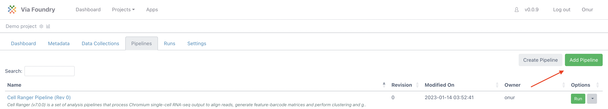
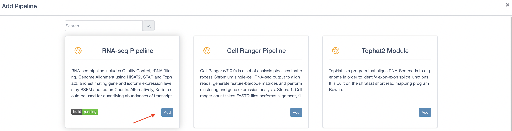
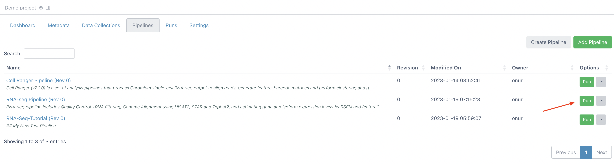
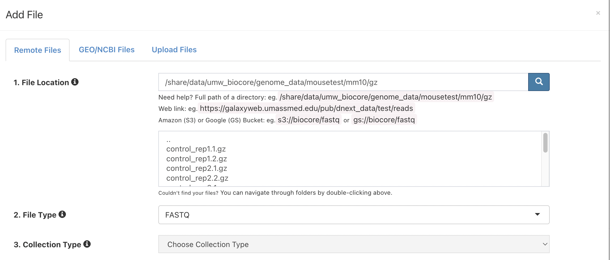
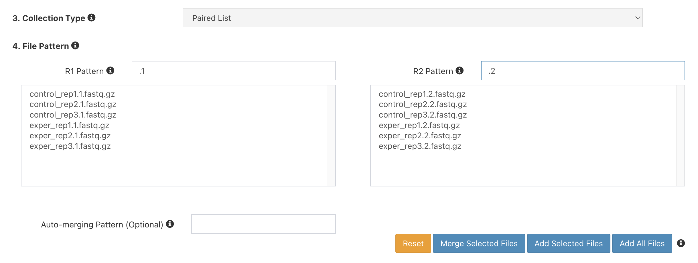
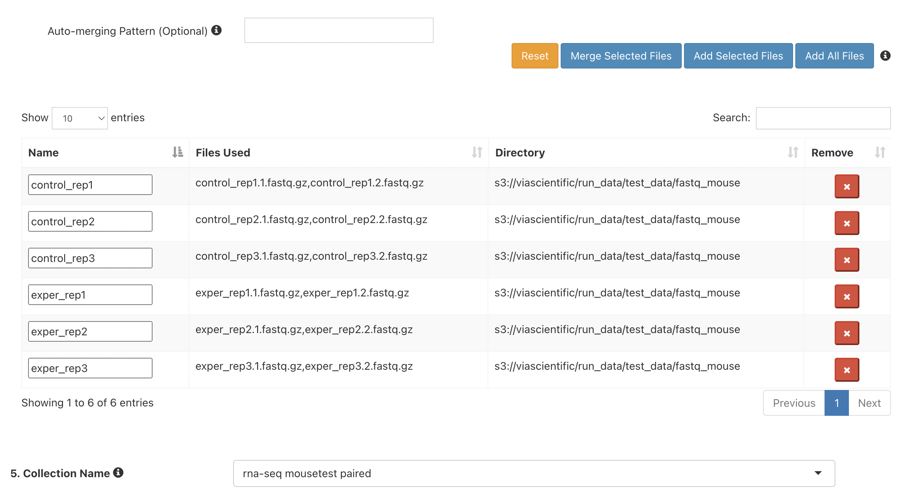
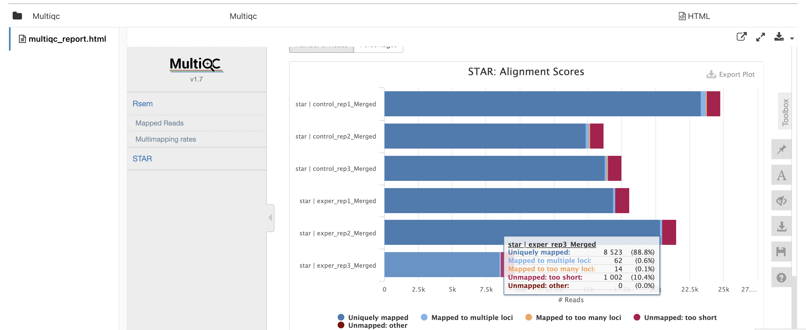
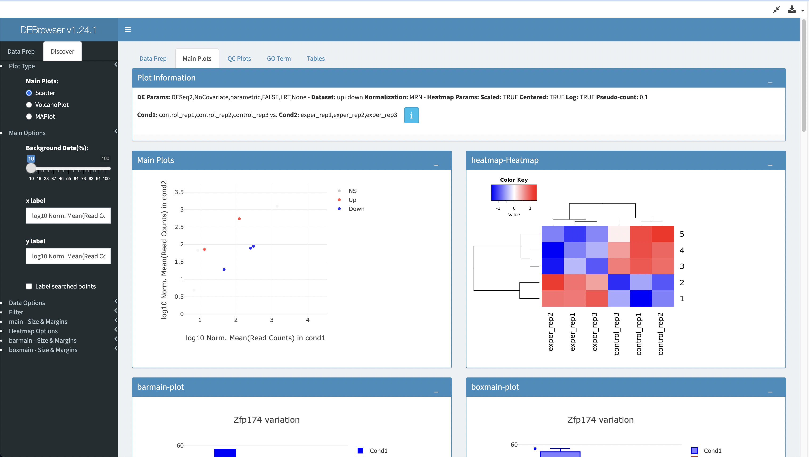

Expected learning outcome
========

To understand the basics of Foundry, and do RNA-Seq analysis with sample mouse data.

# Before you start

Please go to https://dev.viafoundry.net and login into your account. If you have an issue about login, please let us know about it (support@viascientific.com). We will set an account for you.

Creating a Run
========

Once logged in, click on the `Projects` section at the top menu and click `Add a New Project` button. This is the place to configure your project. To access pipelines, click `Pipelines` tab and then click `Add Pipeline` button. 



1. Click on `Add` button on "RNA-Seq Pipeline" and close the window. 



2. Now click `Run` button of the pipeline on the table.



3. Run page will be loaded. Under Run Environment, select "Via Demo Environment(AWS Batch)"
4. Under User Inputs, next to `reads`, click `Enter File`
5. Click `Add File` button to enter new files.
6. Next to "1. File Location", enter:
```
s3://viascientific/run_data/test_data/fastq_mouse
```
7. and click the magnifying glass icon. The box below should populate with files like so:



8. Next to `3. Collection Type`, choose `Paired List`
9. Under `4. File Pattern`, next to `Forward Pattern`, type `.1`. Similarly,  type `.2` for `Reverse Pattern`.



10. Click `Add All Files` button. You should now see 6 entries below.



11. Next to `5. Collection Name`, type `rna-seq mousetest paired` and Click `Save Files`
12. On the "Select/Add Input File" screen which should now have 6 entries, click "Save".
13. For "mate", choose "pair"
14. For genome_build, choose "mousetest"
15. Leave the rest as defaults
16. Click Run in the top right. RNA-Seq pipeline runs typically take several minutes to complete for this dataset.
17. Navigate to the Log tab and click on log.txt to see progress on your run.
18. Once the blue "Running" in the top right changes to a green "Completed" go to the Report tab to see the final reports.
19. Click on MulitiQC, and scroll to find this plot, which shows aligned reads per library:



20. Click on Summary to check mapping rates:


21. Click on RSEM Summary to download count table:


22. Click on DEBrowser to do Differential Expression Analysis.



Congratulations! You have run and tested a RNA-Seq pipeline on Foundry!
