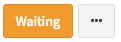

Session 4: NGS data processing on DolphinNext
========

Expected learning outcome
========

To understand the basics of DolphinNext, how to use DolphinNext for RNA-seq or any other Next generation Sequencing data analysis.

Benefits of the design:
========

* **Build:** Easily create new pipelines using a drag and drop interface. No need to write commands from scratch, instead reuse existing processes/modules to create new pipelines

* **Run:** Execute pipelines in any host environment. Seamless Amazon Cloud and Google Cloud integration to create a cluster (instance), execute the pipeline and transfer the results to the storage services (S3 or GS).

* **Resume:** A continuous checkpoint mechanism keeps track of each step of the running pipeline. Partially completed pipelines can be resumed at any stage even after parameter changes.

* **Improve:** Revisioning system keeps track of pipelines and processes versions as well as their parameters. Edit, improve shared pipelines and customize them according to your needs.

* **Share:** Share pipelines across different platforms. Isolate pipeline-specific dependencies in a container and easily replicate the methods in other clusters

Signing In
==========

First off, you need to enter DolphinNext web page: https://dolphinnext.umassmed.edu/ and login into your account by using **UMASS username and password**. If you have an issue about login, please let us know about it (**biocore@umassmed.edu**). We will set an account for you.

Running Pipelines
=================

If you prefer, you can check our video to follow the step to run RNA-Seq pipeline.

1. The easiest way to run pipeline is using main page by clicking the **Pipeline** button at the top left of the screen. Now, you can investigate publicly available pipelines as shown at below. Select **RNA-Seq Pipeline** by clicking **Learn More** button.

2. Once pipeline is loaded, you will notice "Run" button at the right top of the page.

3. This button opens new window where you can create new project by clicking **"Create a Project"** button. After entering and saving the name of the project, it will be added to your project list. Now you can select your project by clicking on the project as shown in the figure below.

4. Now, you may proceed with entering run name which will be added to your run list of the project. Clicking **"Save run"** will redirect to "run page".

5. Initially, in the header of the run page, orange ``Waiting`` button will be shown. In order to initiate run, following data need to be entered:

**A. Work Directory:**  Please enter `/home/your_username/bootcamp/dolphinnext` where run will be executed.
    
**B. Run Environment:** Please choose `Run Environment for ghpcc06.umassrc.org`
    
**C. Inputs:** 

* **reads:**  Choose paired reads found in your `/home/your_username/bootcamp/RNA-Seq/reads` directory. For adding paired reads please check this video: https://www.youtube.com/embed/3QaAqdyB11w
* **mate:** pair
* **genome_build:** mousetest_mm10
* **run_STAR:** yes 
* **run_RSEM:** yes 
	
6. Once all requirements are satisfied, ``Waiting`` button will turn in to green ``ready to run`` button as shown below. You can initiate your run by clicking ``run`` button. 
    
    .. image:: dolphinnext_images/run_header_ready.png
	   :align: center

