Introduction
=========

DolphinNext is an easy-to-use platform for creating, deploying, and executing complex nextflow pipelines for high throughput data processing.

DolphinNext provides: 
--------

1. A drag and drop user interface to build nextflow pipelines
2. Reproducible pipelines with version tracking 
3. Seamless portability to different computing environments with containerization
4. Simplified pipeline sharing using GitHub (github.com)
5. Support for continuous integration and tests (travis-ci.org)
6. Easy re-execution of pipelines by copying previous runs settings
7. Integrated data analysis and reporting interface with R markdown support

Our aim is;
--------

1. Reusability
2. Reproducibility
3. Shareability
4. Easy execution
5. Easy monitoring
6. Easy reporting


Expected learning outcome
========

To understand the basics of DolphinNext, how to use pipeline builder for different objectives and to familiarize yourself with Nextflow and some standard software packages for such analysis.

Overview
========
  * [Before you start](#before-you-start)
  * [Getting Started](#getting-started)
  * [Exercise 1: Creating processes](#exercise-1---creating-processes)
    * [FastQC process](#1-fastqc-process)
    * [Hisat2 process](#2-hisat2-process)
    * [RSeQC process](#3-rseqc-process)
  * [Exercise 2: Building a pipeline](#exercise-2---building-a-pipeline)
  * [Exercise 3: Running a pipeline](#exercise-3---executing-a-pipeline)
  * [Exercise 4 (optional): Supporting single and paired end reads](#exercise-4-optional---supporting-both-single-and-paired-end-reads)


If you prefer, you can click on the video links to follow the tutorial in a video.

[](https://youtu.be/zfLXCgJFls4)

**Video Summary:**
  * Exercise 1: Creating processes
    - FastQC process [at 0:07](https://youtu.be/zfLXCgJFls4?t=7)
    - Hisat2 process [at 0:55](https://youtu.be/zfLXCgJFls4?t=55)
    - RSeQC process [at 2:02](https://youtu.be/zfLXCgJFls4?t=122)
  * Exercise 2: Building a pipeline [at 2:43](https://youtu.be/zfLXCgJFls4?t=163)
  * Exercise 3: Running a pipeline [at 4:34](https://youtu.be/zfLXCgJFls4?t=274)
  

# Before you start

Please go to https://dolphinnext.umassmed.edu and login into your account by using **UMASS username** and **password**. If you have an issue about login, please let us know about it (biocore@umassmed.edu). We will set an account for you.

# Tutorial guide

This guide will walk you through how to start using DolphinNext pipelines and creating new pipelines.

## Exercise 1 - Creating processes

Once logged in, click on the "Pipelines" link at the top menu to access pipeline builder page. At the left sidebar you need to click **New pipeline** button as shown at below.

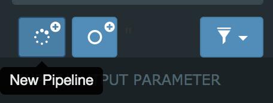


Here you can write a summary descripton about your pipeline using "Description" tab, start developing your pipeline using "Workflow" tab, and adding extra files or setting some extra parameters using "Advanced" tab. Let's get into some details about the pipeline elements.


### What is a "process"?

Process is a basic programming element in Nextflow to run user scripts. Please [click here](https://www.nextflow.io/docs/latest/process.html) to learn more about Nextflow's processes.

A process usually has inputs, outputs and script sections. In this tutorial, you will see sections that include necesseary information to define a process shown in the left side of the picture below. Please, use that information to fill "Add new process" form shown in the middle section in the picture below. DolphinNext will then convert this information to a nextflow process shown in the left side of the picture. Once a process created, it can be used in the pipeline builder. The example how it looks is shown in the bottom left side in the picture. The mapping between the sections shown in colored rectangles.      


### The process we will create in this exercise;

1. FastQC process
2. Hisat2 process
3. RSeQC process

You’ll notice several buttons at the left menu. New processes are created by clicking green “New process” button.

### 1. FastQC process
**a.** First, please click, blue “New process” button  in the left menu to open "Add New Process" modal.

**b.** Please enter FastQC for the process name and define a new "Menu Group". 

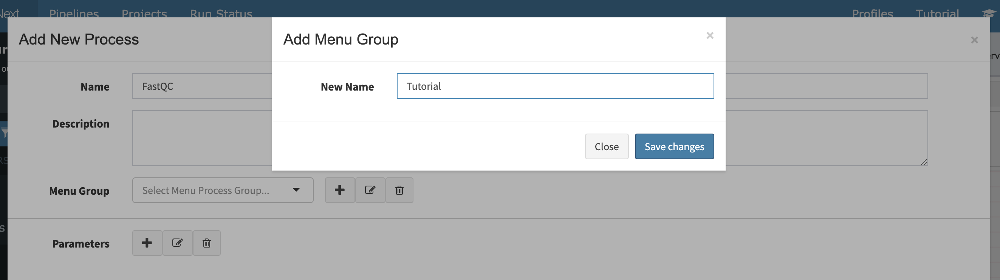

**c.** In the FastQC process, we have an input, an output and a line of a command we are going to use to execute the fastqc process.

```
Name: "FastQC"
Menu Group: "Tutorial"
Inputs: 
  reads(fastq,set) name: val(name),file(reads)
  
Outputs: 
  outputFileHTML(html,file) name: "*.html"
  
Script:
  fastqc ${reads}
```  

**d.** Lets select input and output parameters (`reads` and `outputFileHTML`) and define their "Input Names" that we are going to use in the script section.

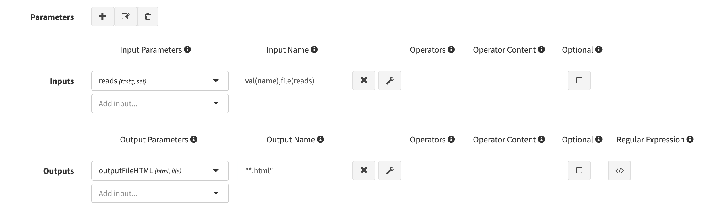
 
**e.** Let's enter the script section

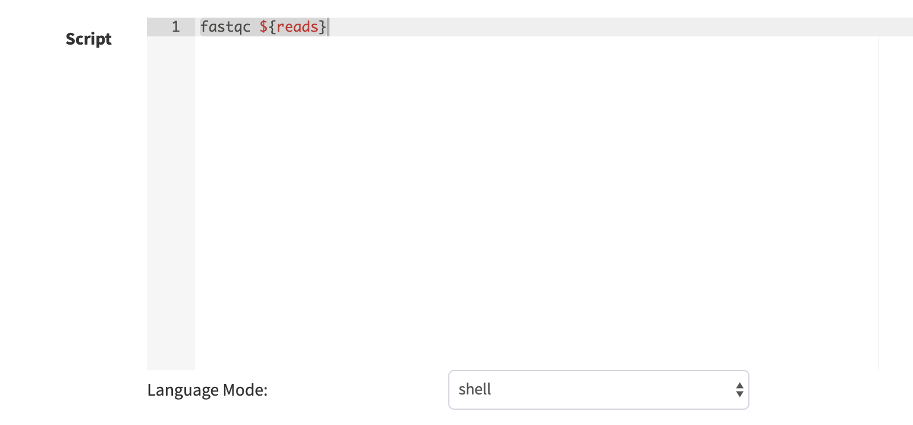

**f.** Press "Save changes" button at the bottom of the modal to create the process. Now this process is ready to use. We will use it in the Exercise 2.

### 2. Hisat2 process

Let's create Hisat2 process. 

**a.** First, please click, green “New process” button to open "Add New Process" modal.

**b.** Inputs, outputs and scripts should be defined like below;

```
Name: "Hisat2"
Menu Group: "Tutorial"
Inputs: 
  reads(fastq,set)       name: val(name),file(reads)
  hisat2IndexPrefix(val) name: hisat2Index
      
Outputs: 
  outputFileTxt(txt,file) name: "${name}.align_summary.txt"
  mapped_reads(bam,set)   name: val(name), file("${name}.bam")
  
Script:
  hisat2 -x ${hisat2Index} -U ${reads} -S ${name}.sam &> ${name}.align_summary.txt
  samtools view -bS ${name}.sam > ${name}.bam

```

**c.** After you select input output parameters (`hisat2IndexPrefix`, `mapped_reads` and `outputFileTxt` parameters), add their names and enter the script. The page should look like this;


**d.** Please save changes before you close the screen.

### 3. RSeQC process

**a.** First, please click, green “New process” button to open "Add New Process" modal.

**b.** The form should be filled using the information below;

```
Name: "RSeQC"
Menu Group: "Tutorial"
Inputs:
  mapped_reads(bam,set) name: val(name), file(bam)
  bedFile(bed,file)     name: bed
  
Outputs: 
  outputFileTxt(txt,file) name: "RSeQC.${name}.txt"
  
Script:
  read_distribution.py  -i ${bam} -r ${bed}> RSeQC.${name}.txt
```

**c.** After you select input output parameters, enter their names and the script. The page should look like this;


**d.** Please, save changes before you close the screen.

Here Exercise 1 is finished. Please move to Exercise 2 to build the pipeline using the processes you created in Exercise 1. 

## Exercise 2 - Building a pipeline


Once logged in, click to the pipeline button in the top left of the screen. You’ll notice Enter Pipeline Name box, just below the Pipelines button. Before you start building the pipeline make sure you have the processes available in your menu.


**a.** Please enter a name to your pipeline. E.g. "RNA-Seq-Tutorial" and select your menu group "public pipelines" and press save button.

**b.** Please drag and drop FastQC, Hisat2 and RSeQC to your workspace;


**c.** Please drag and drop three Input parameters and change their names to "Input_Reads", "Hisat2_Index" and "bedFile" and connect them to their processes;     

**d.** Connect your Hisat2 process with RSeQC process using mapped_reads parameter in both. You will observe that, when the types match you can connect the two processes using their matching input and output parameters.

**e.** Drag & Drop three "output parameters" from the side bar and name them "FastQC_output", "Hisat2_Summary", and "RSeQC_output" and connect them to their corresponding processes. While naming, click their "Publish to Web Directory" and choose the right output format according to the output type of the process.
 


**f.** Overall pipeline should look like below;

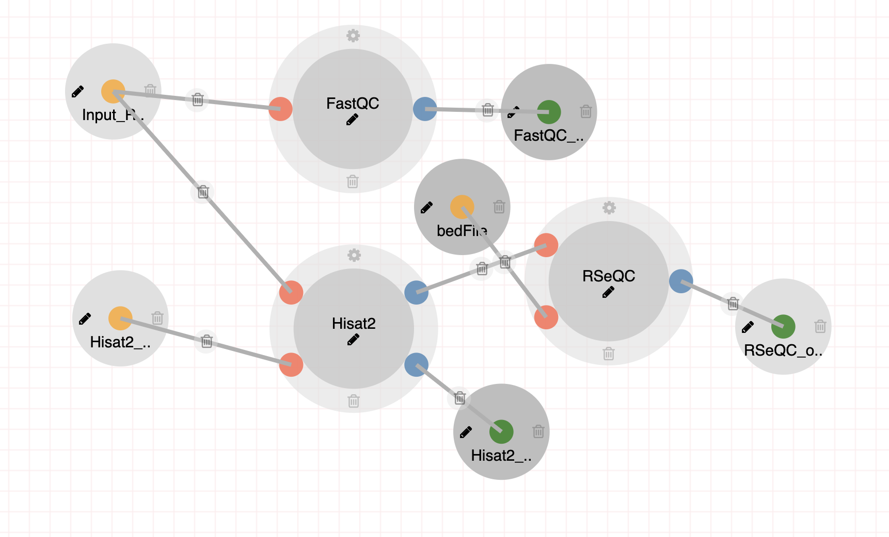
 
## Exercise 3 - Executing a pipeline

  **1.** Once a pipeline is created, you will notice “Run” button at the right top of the page.


  **2.** This button opens a new window where you can create a new project by clicking “Create a Project” button. After entering and saving the name of the project, it will be added to your project list. 


  **3.** Now you can select your project by clicking on the project.
You will then proceed by entering run name which will be added to your run list of the project. Clicking “Save run” will redirect you to the “run page” where you can initiate your run.


  **4.** Here, please enter your working directory, choose your "Run Environment", click "Use Singularity Image" and enter the values below;
  
<pre>
Work Directory: /home/<b>yourclusterusername</b>/test1
Run Environment: UMASS Cluster
Use Singularity Image: Checked
Image Path: /project/umw_biocore/singularity/UMMS-Biocore-rna-seq-1.0.img
Run Options: --bind /project

Inputs:
  - bedFile: /project/umw_biocore/training/genes.bed (Use <b>Manually</b> tab)
  - Hisat2_Index: /project/umw_biocore/training/Hisat2Index/genome (Use <b>Manually</b> tab)
  - Input_Reads: First go to <b>Files</b> Tab in "<b>Select/Add Input File</b>" modal and click "<b>Add File</b>" button. 
Then enter "File Directory (Full Path)" as: <b>https://galaxyweb.umassmed.edu/pub/dnext_data/tutorial/fastq_data/single/</b> and follow <a href="#creating-collection">Creating Collection</a> section.


</pre>  


  **5.** Now, we are ready to enter inputs we defined for the pipeline. Please choose "Manually" tab.First enter the location of the bed file. 

  **6.** Then enter the hisat2 index (/project/umw_biocore/training/Hisat2Index/genome). Please use "Manually" tab. 

  #### Creating Collection
  **7.**  In order to add files; First go to Files Tab in "Select/Add Input File" modal and click "Add File" button

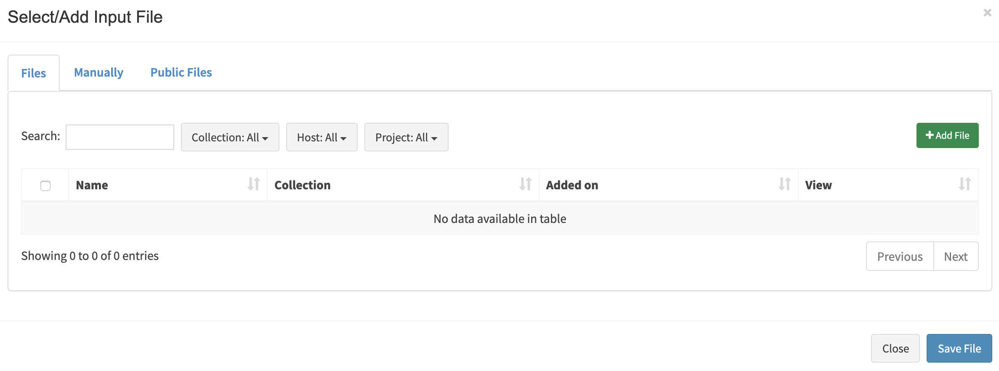

  **8.**  Enter the location of your files. Here for the test case we will use the url below for File Directory (Full Path) and please click "View Directory" button to get the list of files: 
  
File Directory (Full Path):
```
https://galaxyweb.umassmed.edu/pub/dnext_data/tutorial/fastq_data/single/
```
Then please choose "Single List" for the "Collection Type" and press "add all files" button.

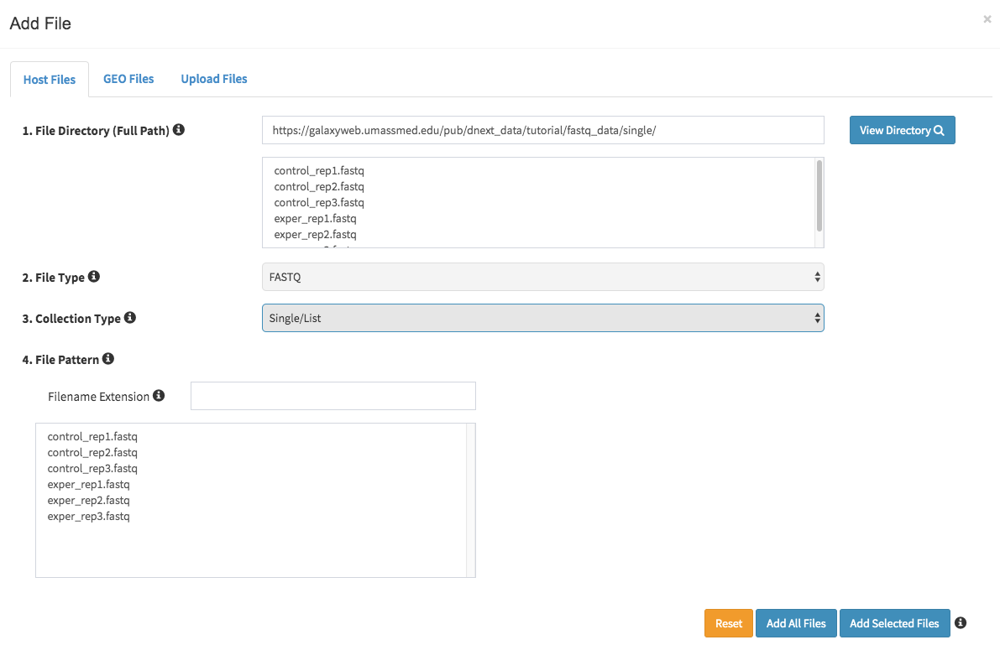

  **9.** Here there is an option to change the names but we will keep them as they are and enter a collection name and "save files".
```
collection name: test collection
```


  **10.** In the next screen, the user can still add or remove some samples. Let's click "Save file" button to process all samples.


  **11.** After we fill the inputs,  the orange "Waiting" button at the top right should turn to green "Ready to Run" button. Press that "Ready to Run" button.

  **12.** All run should finish in a couple of minutes. When the run finalized the log section will be look like below;

  **a. Logs**:


  **b. Timeline**:


  **c. Nextflow Reports**:
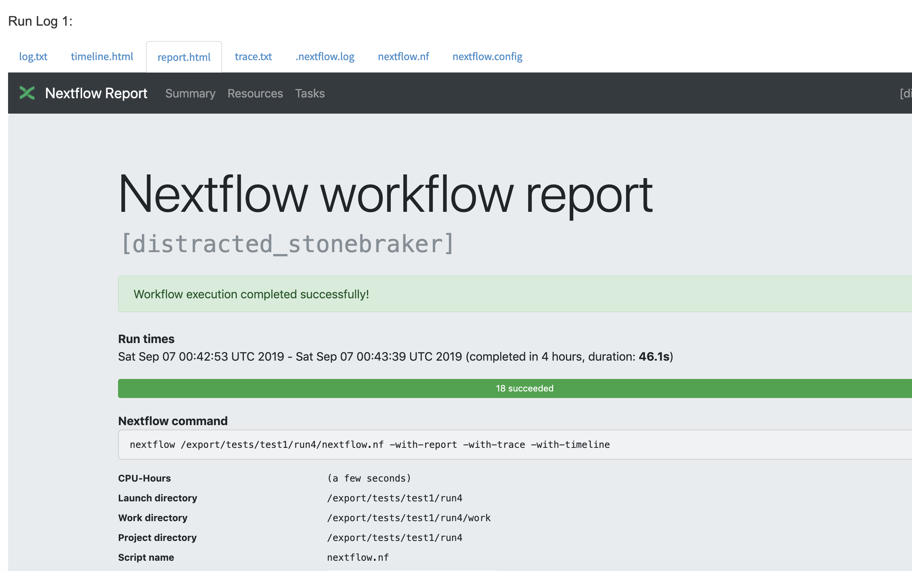

  **13.** In the report section, you can monitor all defined reports in the pipeline;
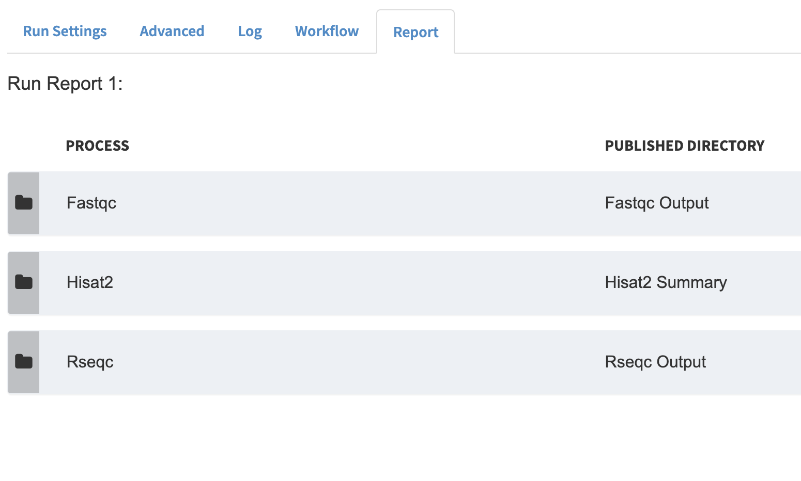

  **a. FastQC**


  **b. Hisat2**


  **c. RSeQC**


## Exercise 4 (optional) - Supporting both single and paired end reads

In order to support, both single and paired reads, we need to update FastQC and Hisat2 processes. Let's return back to pipeline page by clicking pipeline button at the top left menu and then choose our pipeline (eg. "RNA-Seq-Tutorial") from left sidebar.

---
**Explanation about Mate Parameter**

When we add "mate" parameter as an input, DolphinNext will realize that "reads" could be single or paired structure. Additionally, we will define two dropdown option for mate parameter: "single" and "pair" which will direct users. Finally, our pipeline will support both of the file structures.

---

### 1. Editing FastQC process

**a.** First, please click, FastQC process from left sidebar menu to open "Edit Process" modal.

**b.** In the inputs section, we need to add "mate" parameter as shown below:

```
Name: "FastQC"
Menu Group: "Tutorial"
Inputs: 
  reads(fastq,set) name: val(name),file(reads)
  mate(mate,val)   name: mate
  
Outputs: 
  outputFileHTML(html,file) name: "*.html"
  
Script:
  fastqc ${reads}
``` 


**c.** Click save button and then click save on existing button in the confirm revision window to overwrite changes. 

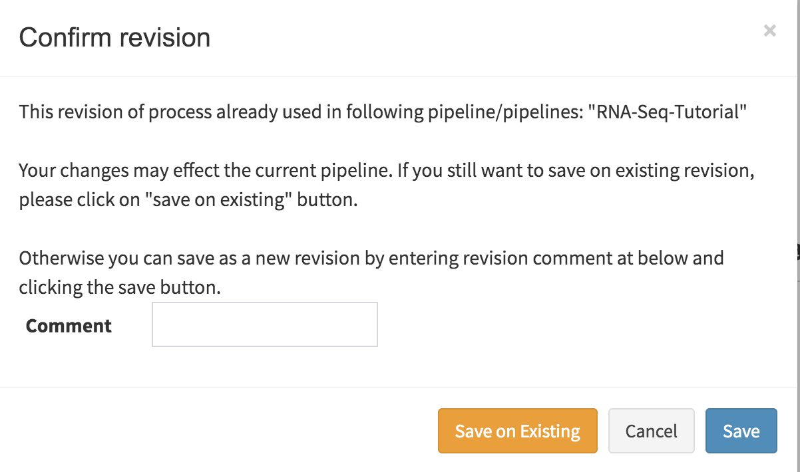

### 2. Editing Hisat2 process

Let's edit Hisat2 process. 

**a.** First, please click, Hisat2 process from left sidebar menu to open "Edit Process" modal.

**b.** In the inputs section, we need to add "mate" parameter and change the script section to support both "single" and "paired" reads as shown below:

```
Name: "Hisat2"
Menu Group: "Tutorial"
Inputs: 
  reads(fastq,set)       name: val(name),file(reads)
  hisat2IndexPrefix(val) name: hisat2Index
  mate(mate,val)         name: mate
  
Outputs: 
  outputFileTxt(txt,file) name: "${name}.align_summary.txt"
  mapped_reads(bam,set) name: val(name), file("${name}.bam")
  
Script:

  script:
  fileList = reads.toString().split(' ')
  file1 = fileList[0]
  file2 = ""
  if (mate == "pair") {file2 =  fileList[1]}

  """
  if [ "${mate}" == "pair" ]; then
      hisat2 -x ${hisat2Index} -1 ${file1} -2 ${file2} -S ${name}.sam &> ${name}.align_summary.txt
  else
      hisat2 -x ${hisat2Index} -U ${file1} -S ${name}.sam &> ${name}.align_summary.txt
  fi
  samtools view -bS ${name}.sam > ${name}.bam
  """

```


**c.** Click save button and then click save on existing button in the confirm revision window to overwrite changes. 


### 3. Editing Pipeline

**a.** Now we're ready to update our pipeline. First refresh the page and reload new "mate" parameter in the workflow.


**b.** Click "Save Pipeline" button to give permission to update pipeline. Confirm Revision window will show up as shown below. Simply click "Save on Existing" button to keep saving on existing revision.


**c.** Please drag and drop one **Input parameter** and change its name to "mate" and Dropdown Options "single,pair" as shown at below.

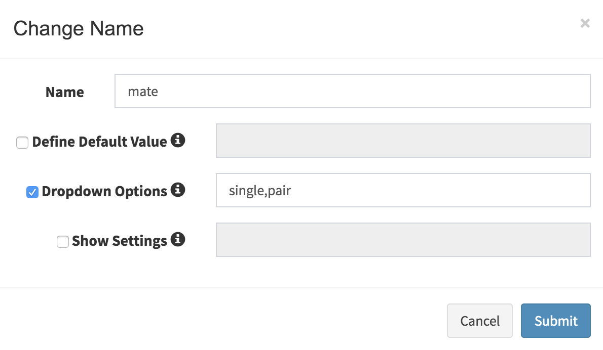

**d.** Connect "mate" input parameter to their processes; FastQC and Hisat2 as shown below.


### 4. Executing Updated Pipeline

**1.** It's time to reload our changes into our run page. We can easily go back to our run by clicking down arrow at the top right of the pipeline as shown below. Then please click "Existing runs" button. 


**2.** Then choose our run and click "Go to Run" button as shown below.


**3.** When run page reloads, you will see that mate parameter is added into inputs section as shown at below. Please choose as "pair".

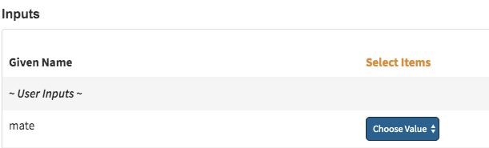

#### Creating Paired Collection

**4.** Now we need to add paired collection by clicking edit button of the "test collection". Then go to Files Tab in "Select/Add Input File" modal and click "Add File" button


**5.**  Here for the test case we will use the url of the paired reads. Please click "View Directory" button to get the list of files: 
  
File Directory (Full Path):
```
https://galaxyweb.umassmed.edu/pub/dnext_data/tutorial/fastq_data/pair/
```
**6.** Then please choose "Paired List" for the "Collection Type" and enter forward and reverse file patterns to match paired files. Now you can press "add all files" button.
```
Forward Pattern: .1
Reverse Pattern: .2
```


**7.** Enter a new collection name and "save files".
```
collection name: paired test collection
```
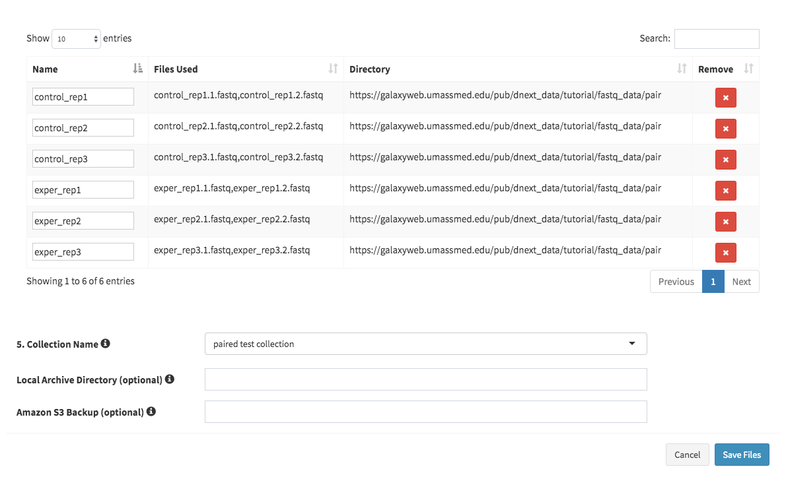

**8.** In the next screen, please click "Save file" button to process all samples.

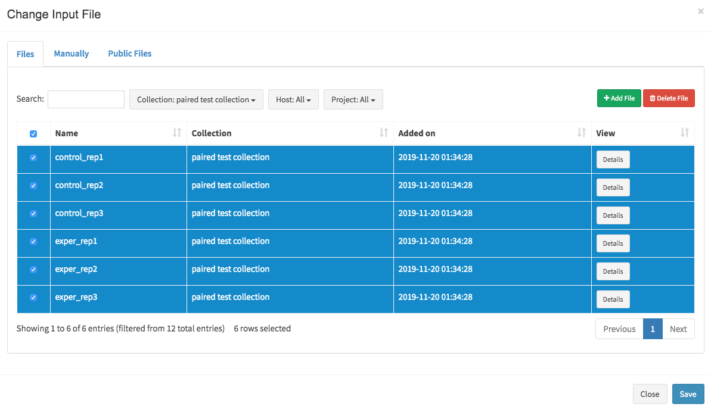

**9.** Before executing our run, just change the work directory to save outputs into separate directory.

  <pre>
  Work Directory: /home/<b>yourclusterusername</b>/test2
  </pre>  
  
**10.** Finally, click rerun button to execute your run.


