# Running the DE Module in Foundry

## Before you start

Please go to https://viafoundry.umassmed.edu/ and login into your account. If you have a login issue, please let us know about it (BiocoreStaff@umassmed.edu). We will set up an account for you.

## Creating a Run

Once logged in, click on the `Projects` section at the top menu and either 1. select an existing project or 2. click the `Add a New Project` button and enter your project name and click OK. To access pipelines, click the `Pipelines` tab and then click the `Add Pipeline` button. 

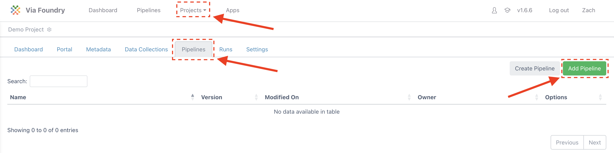

Search for `DE module` and click on the `Add` button on "DE module" and close the window. 

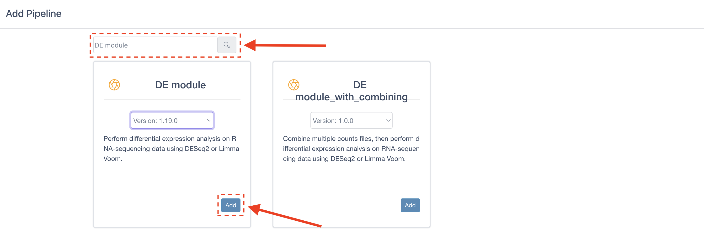

Now click the `Run` button of the DE module pipeline on the table.

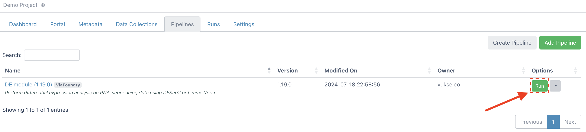

1. The run page will be loaded. Give your run a name
2. Under Run Environment, select "New UMASS SCI Cluster"
3. Enter your work directory on the cluster. (e.g. `/home/{your_cluster_username}/foundry/`)

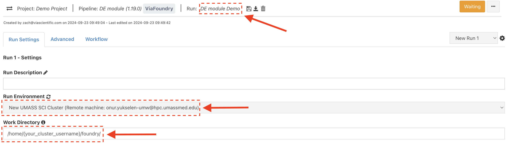

## Count Matrix

DESeq2 requires a count matrix as input. In this file, there is one column per sample and one row per feature as well as a header line that contains the sample names. Each cell contains the counts for a particular feature for each sample. The first four lines look like this:

| gene     | transcript | D01_Ctrl_0h | D01_Lps_1h | D01_Lps_2h | D01_Lps_4h | D01_Lps_6h | D09_Ctrl_0h | D09_Lps_1h | D09_Lps_2h | D09_Lps_4h | D09_Lps_6h |
|:--------:|:----------:|:-----------:|:----------:|:----------:|:----------:|:----------:|:-----------:|:----------:|:----------:|:----------:|:----------:|
| C9orf152 |	NA        |	0           |	0          | 3          |	0          | 5          |	1           |	0	         | 6          |	6          | 2          |
| RPS11    |	NA        |	11825       |	13716      | 7204       |	4339       | 11187      |	5855        |	6940       | 4941       |	7354       | 6446       |
| ELMO2    |	NA        |	773         |	805        | 372        |	490        | 1776       |	518         |	615        | 347        |	949        | 1190       |

**Note:** The second column ("transcript") must exist for this module. This column is included to be consistent with the output of some feature counting programs which store information here. It will be removed by the module during processing.

To add the counts matrix, do the following:

1. Under User Inputs, next to `Counts file`, click `Enter File`
2. Click the green `Add File` button in the top right to enter new files.
3. Next to "1. File Location", enter:
```
/share/data/umw_biocore/class/de_module_demo/
```
4. and **click the magnifying glass button**. The box below should populate with files like so:

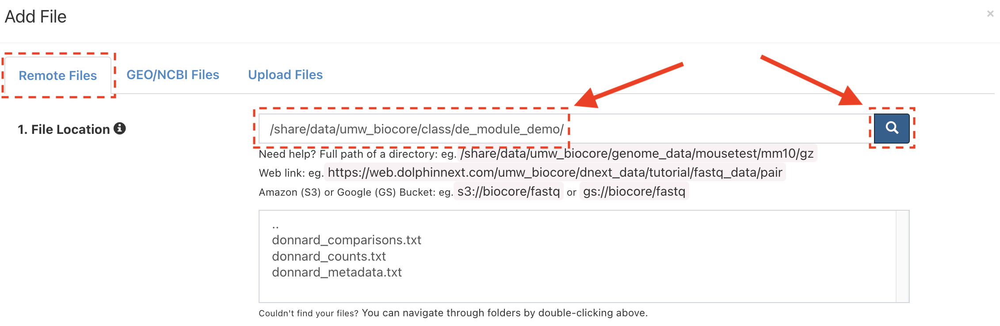

5. Next to `2. File Type`, choose `TXT`
6. Next to `3. Collection Type`, choose `Single/List`

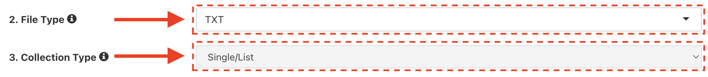

7. Under `4. File Pattern` select `donnard_counts.txt` and click "Add Selected Files"

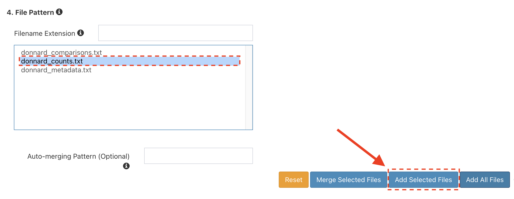

8. Under `5. Collection Name` give the collection the name `donnard_counts`
9. Click "Save Files"

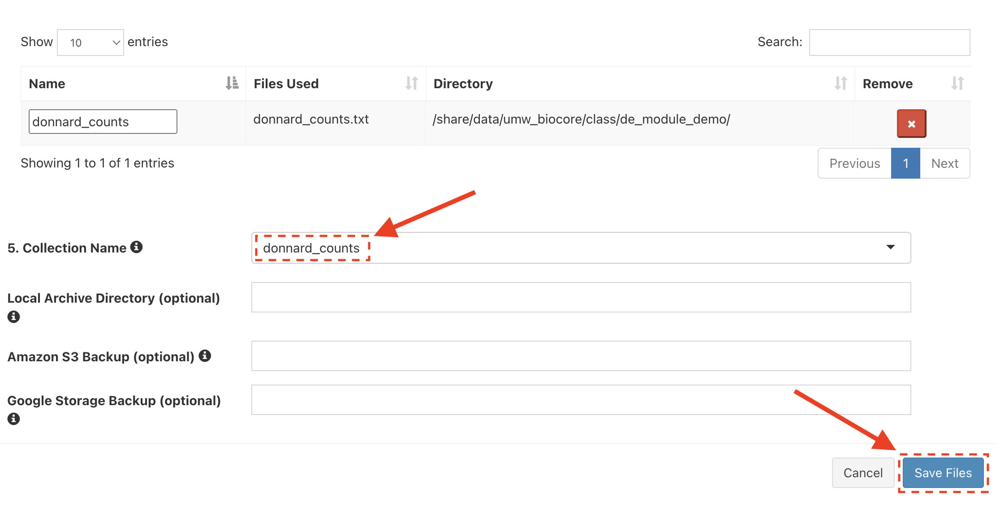

10. Click "Save"

## Group File

This module requires some information about each sample in order to group the samples together by condition. At minimum it must contain one column named `sample_name` and one column named `group`. All samples listed in this file must have a corresponding column in the count matrix. The group column is used to notate which samples belong to the same condition (replicates). Additional metadata columns are allowed. An example looks like this:

| sample_name | group | batch | condition | time |
|:-----------:|:-----:|:-----:|:---------:|:----:|
| D01_Ctrl_0h |ctrl   | A     | Ctrl      | 0h   |
| D01_Lps_1h  |1h     | A     | Lps       | 1h   |
| D01_Lps_2h  |2h     | A     | Lps       | 2h   |
| D01_Lps_4h  |4h     | A     | Lps       | 4h   |
| D01_Lps_6h  |6h     | A     | Lps       | 6h   |
| D09_Ctrl_0h |ctrl   | B     | Ctrl      | 0h   |
| D09_Lps_1h  |1h     | B     | Lps       | 1h   |
| D09_Lps_2h  |2h     | B     | Lps       | 2h   |
| D09_Lps_4h  |4h     | B     | Lps       | 4h   |
| D09_Lps_6h  |6h     | B     | Lps       | 6h   |

To add the grouping file, do the following:

1. Next to `Groups file` click `Enter File` and add the following file:

```
/share/data/umw_biocore/class/de_module_demo/donnard_metadata.txt
```

## Comparison File

The module needs to know which groups to compare. This file must contain columns named `controls`, `treats`, and `names`. Each row represents a comparison of the treatment group to the control group. The values of `controls` and `treats` must exist in the `group` column from the group file. The `names` column sets the prefix for output files. An example looks like this:

| controls | treats | names     |
|:--------:|:------:|:---------:|
| ctrl     | 1h     | 1h_v_ctrl |
| ctrl     | 2h     | 2h_v_ctrl |
| ctrl     | 4h     | 4h_v_ctrl |
| ctrl     | 6h     | 6h_v_ctrl |

To add the comparison file, do the following:

1. Next to `Comparison file` click `Enter File` and add the following file:

```
/share/data/umw_biocore/class/de_module_demo/donnard_comparisons.txt
```

## Genome Build

This example was performed in humans. In the `Genome build` dropdown select `human_hg38_gencode_v34`.

## DESeq Settings

There are several parameters that affect how the module will behave. This example experiment includes a time course of LPS treatment in duplicate. The complete time course was performed on two separate days (one replicate from each day). Batch correction may be necessary with this design. To override the default parameters for DESeq2 (enable batch correction):

1. Click the wrench next to next to `Run DESeq2`

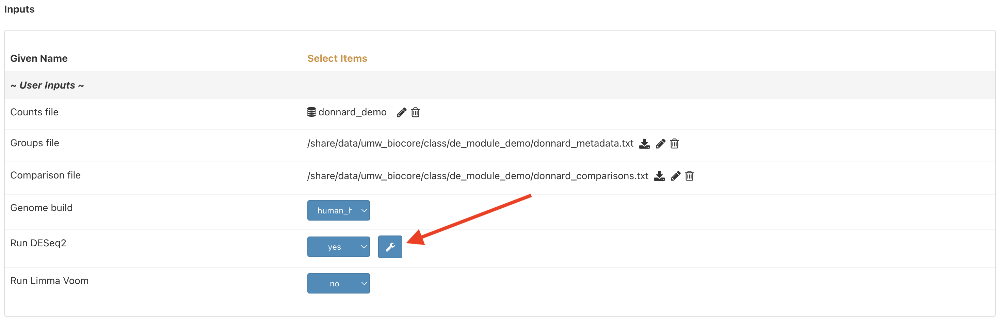

2. Navigate to the `Batch correction options` section and enable batch correction.
3. In the PCA plot options, set "Color" to `batch` and "Shape" to `group`.

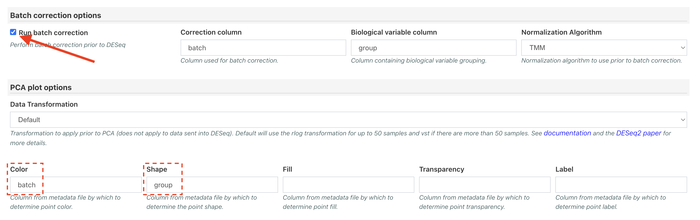

## Run Pipeline

The run is now ready. Click Run in the top right corner. The DE module typically takes 2-3 minutes to complete for this dataset.

## Viewing Results

When the run is complete, navigate to the results tab and look at the report generated for each comparison.

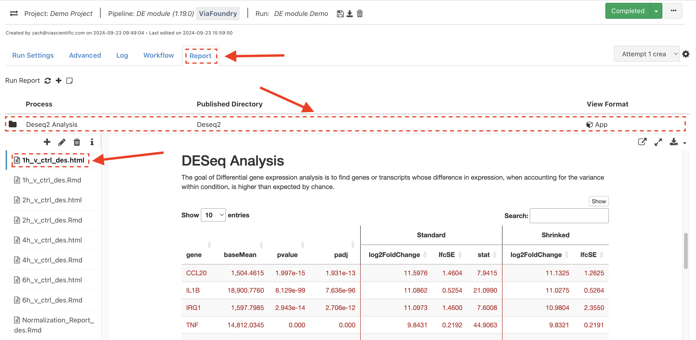

Congratulations! You have run and tested the DE module pipeline on Foundry!
