Expected learning outcome
========

To understand the basics of Foundry and run a single-cell RNA-Seq pipeline with sample data.

# Before you start

Please go to https://viafoundry.umassmed.edu/ and login into your account. If you have a login issue, please let us know about it (BiocoreStaff@umassmed.edu). We will set up an account for you.

<p align="center"> <p align="center">  </p>

Creating a Project
========

Once logged in, (1) click on the `Projects` drop down on the top menu. This is the place to configure your projects.

To create a new project, (2) select `Add a New Project`.

<p align="center">  </p>

In the `New Project` pop-up, (3) give the new project a name and (4) click save.

<p align="center">  </p>

Creating a Run
========

Once a project is created, to access pipelines (1) click the `Pipelines` tab and then (2) click `Add Pipeline` in the top right. 

<p align="center">  </p>

In the `Add pipeline` window, (3) click the `Add` button for the "Cell Ranger Pipeline" and close the window (bottom right). 

<p align="center">  </p>

To bring up the run page, (4) click the `Run` button of the Cell Ranger pipeline on the table.

<p align="center">  </p>

***

[Optional] To provide a run name, (5) click inside the box next to `Run`. Provide a new name and click anywhere outside the box to exit.

[Optional] To provide a run description, (6) click the pencil next to `Run Description`. Provide a description and (7) click on the checkbox to finish editing.

***

Under `Run Environment`, (8) select "Via Run Environment (AWS Batch)"

<p align="center">  </p>

To add the source data, under `User Inputs` next to `Reads` (9) click `Enter File`

<p align="center">  </p>

In the `Select/Add Input File` window, (10) select the `Files` tab and then (11) click `+ Add File`

<p align="center">  </p>


In the `Add File` window, (12) select the `Remote Files` tab and in the `1. File Location` box (13) paste the following path: 

```
/share/data/umw_biocore/dnext_data/test/fastq_10x_pbmc_1k_v3
```

Click (14) **search button** to see the content of the s3 directory. Leave `2. File Type` as "FASTQ" and in the `3. Collection Type` dropdown, (15) select 'Paired List'. 

<p align="center">  </p>


Under `4. File Pattern`, check that `R1 Pattern` is set to `_R1` and similarly that the `R2 Pattern` is set to `_R2`. For this sample, there were two sequencing lanes run (L001 and L002). To merge the two lanes, (16) hold shift while clicking on `pbmc_1k_v3_S1_L001_R1_001.fastq.gz` and (17) `pbmc_1k_v3_S1_L002_R1_001.fastq.gz`. The corresponding R2 will be automatically selected. (18) Click "Merge Selected Files" to combine the two lanes.

```
* Note: For other datasets, if you don't need to merge samples, you can select the samples you want to add and click 
"Add Selected Files" button. If you prefer to add all files that match the pattern, you can click "Add All Files" button.
```

<p align="center">  </p>

(19) Update the 'Name' to `pmbc_1k_v3_S1`. And input `fastq_10x_pbmc_1k_v3` as the `5. Collection Name`. The final three boxes can be left blank. (21) Click "Save Files".

<p align="center">  </p>

This will return to the `Change Input File` window. (22) Click "Save" again.

<p align="center">  </p>

Since this sample has paired end reads, (23) ensure the `mate` dropdown is set to "pair". To finish the `Metadata` section (24) click "Enter File".

<p align="center"> 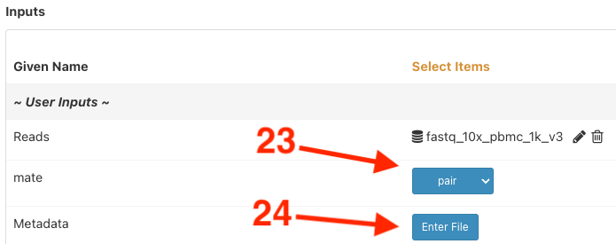 </p>

Metadata can be entered in three ways: Via a path to a file in the cloud, dropping a local file into the box, or in simple cases directly in the table. Notice the sample name is pulled in from the sample selection. To finish the table (25) fill in the "Condition" column with `pmbc_1k_v3` and (26) click "Save".

<p align="center"> 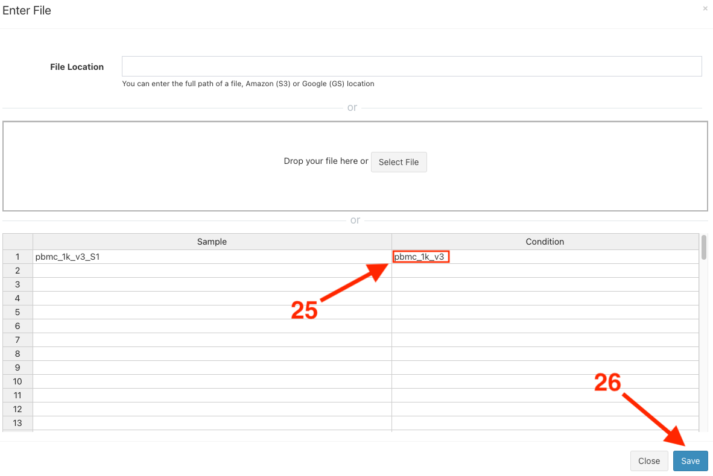 </p>


Pick the genome by (27) selecting "human_hg38_gencode_v32_cellranger_v6" in the `genome_build` dropdown. 

***


In conclusion, all settings should be set to "yes", except `run_Aggregate_Libraries` and `genome_build` which was set to "human_hg38_gencode_v32_cellranger_v6".

<p align="center"> 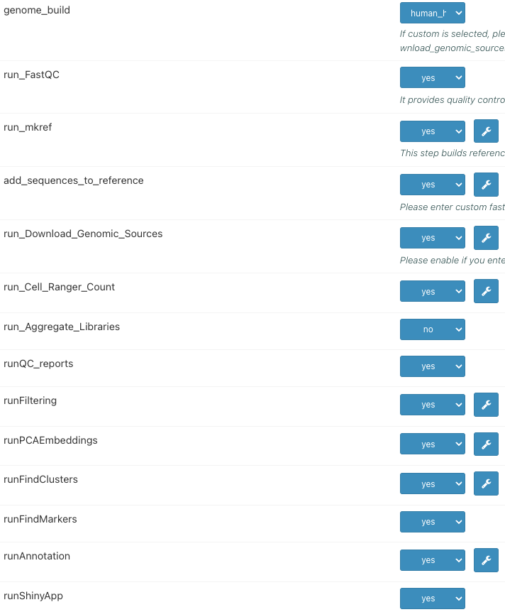 </p>

***

Finally, to submit the run (36) click "Run" in the top right and (37) select "Start"

<p align="center">  </p>

Analyzing Reports
========
* RNA-Seq pipeline runs typically take 2.5 hours (if you enter custom genome sequence) to complete for this dataset.
* Navigate to the Log tab and click on log.txt to see progress on your run.
* Once the blue "Running" in the top right changes to a green "Completed" go to the Report tab to see the final reports.
* While waiting for the run to finish, you can check the example finalized run: https://www.viafoundry.com/run/101

***

## Executing scRNA Seurat 10x Module (Optional)
* Instead of running whole 10x pipeline, you might execute only scRNA Seurat 10x Module too. This module would take 10 minutes to run.
1. Go to your `new project` by clicking on the `Projects` drop down on the top menu and clicking on your `new project`.
2. Click `Pipeline Tab` and click `Add Pipeline` Button.
3. In the `Add pipeline` window, click the `Add` button for the `scRNA Seurat 10x` and close the window. 
4. Click the `Run` button of the `scRNA Seurat 10x` on the table.
5. Choose Run Environment as `Via Run Environment (AWS Batch)`
6. Choose genome_build as `human_hg38_gencode_v32_cellranger_v6`
7. Click `Enter File` for Metadata. Fill in the "Sample" column with "pbmc_1k_v3_S1" and "Condition" column with `pmbc_1k_v3` click "Save".
8. Enter 101 for Data_Path which is the already finished 10x pipeline run id.
9. Click Run Button at the top right.

***

## Multiqc
[multiQC](https://multiqc.info) will aggregate the [FastQC](https://www.bioinformatics.babraham.ac.uk/projects/fastqc/) quality control report of each fastq file in the pipeline. The aggregation of multiple FastQC reports helps users to view the quality control of multiple fastq files easily.

<p align="center"> <p align="center">  </p>

## Count Web Summary

The output file in this section is a html file generated by [cellranger pipeline](https://support.10xgenomics.com/single-cell-gene-expression/software/pipelines/latest/what-is-cell-ranger).This html file is a quality control report of single cell RNA-Seq Count Matrix, which include estimated number of cells, alignment/quantification results and preliminary clustering analysis.
<p align="center"> <p align="center"> 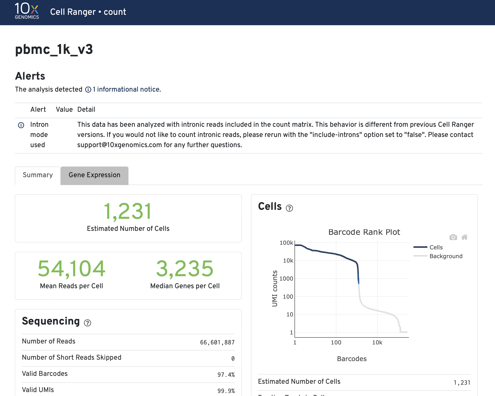 </p>

In this report there is also a preliminary clustering analysis of the data. The preliminary analysis result can be used as means of quality control because it shows likely cell populations and their gene markers. However, the results from this report may not be accurate.

<p align="center"> <p align="center"> 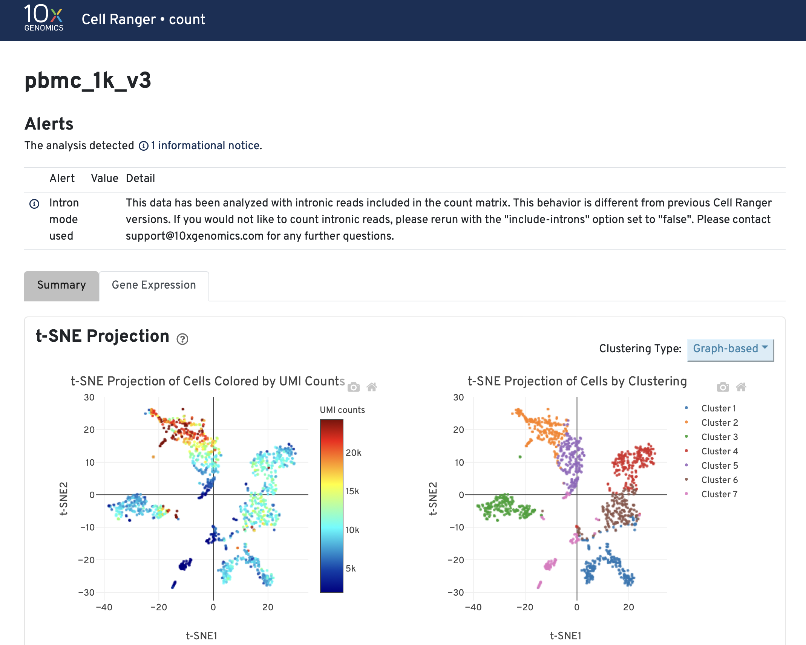 </p>

## Qc Plots
The cellranger software in the pipeline will generate a count matrix from input fastq files. The count matrix will be analyzed using R package [Seurat](https://satijalab.org/seurat/). In this html file the number of genes and number of UMIs ([Unique Molecular Identifiers](https://dnatech.genomecenter.ucdavis.edu/faqs/what-are-umis-and-why-are-they-used-in-high-throughput-sequencing/)) for each cell is plotted using violin plot and scatter plots.
<p align="center"> <p align="center"> 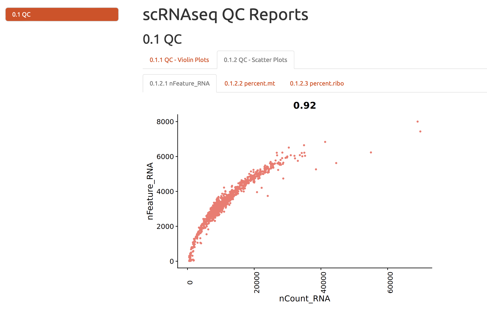 </p>

## Filtering Reports
In this html file the filtering criteria will be shown and the number of cells before and after the filtering will be shown.
<p align="center"> <p align="center"> 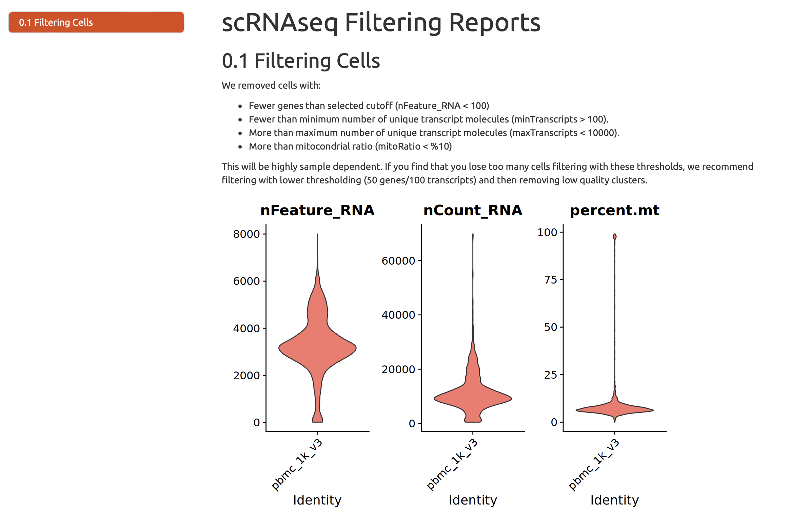 </p>
<p align="center"> <p align="center">  </p>


## Embedding Report
In this html file the dimension reduction results are shown.
In the single cell RNA-Seq analysis there are two layers of dimension reduction: Principal component analysis (PCA) and UMAP/tSNE.
### Prinicple component analysis (PCA)
Prinicple component analysis (PCA) is used to reduce the dimensionality of the data. The rationale of this analysis is that not all the genes in the scRNA-Seq data are contributing to the variations in gene expression profiles of cells due to the sparsity of data. PCA uses all the genes in the data and constructs a series of artificial dimensions ("Principal components") which are linear combinations of the gene expression profiles. 
For each Principal component the amount of variation explained and how genes contributed to the Principal component are calculated. In the figures below you can see an elbow plot of amount of variation explained: it shows that the amount of variation explained by Principal component decreases "exponentially", which means that using the top 15-20 Principal components can capture enough differences in the dataset and we can just use these Principal components in the downstream analysis.
The heatmap in the figure below shows what and how genes contributed to different Principal components. Most of these genes in the figure are immune cell type markers, which means that the Principal components are capturing differences between immune cell populations. 
<p align="center"> <p align="center"> 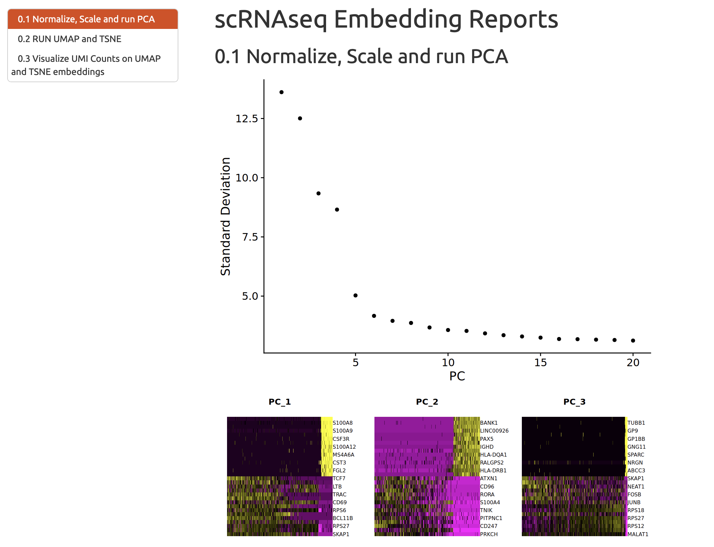 </p>

### tSNE and UMAP
Although PCA is very helpful and robust in the dimension reduction and generates biologically meaningful results, it is not good enough for the visualization. For visualization the pipeline generates [tSNE](https://lvdmaaten.github.io/tsne) and [UMAP](https://arxiv.org/abs/1802.03426), which is shown in this section.

<p align="center"> <p align="center"> 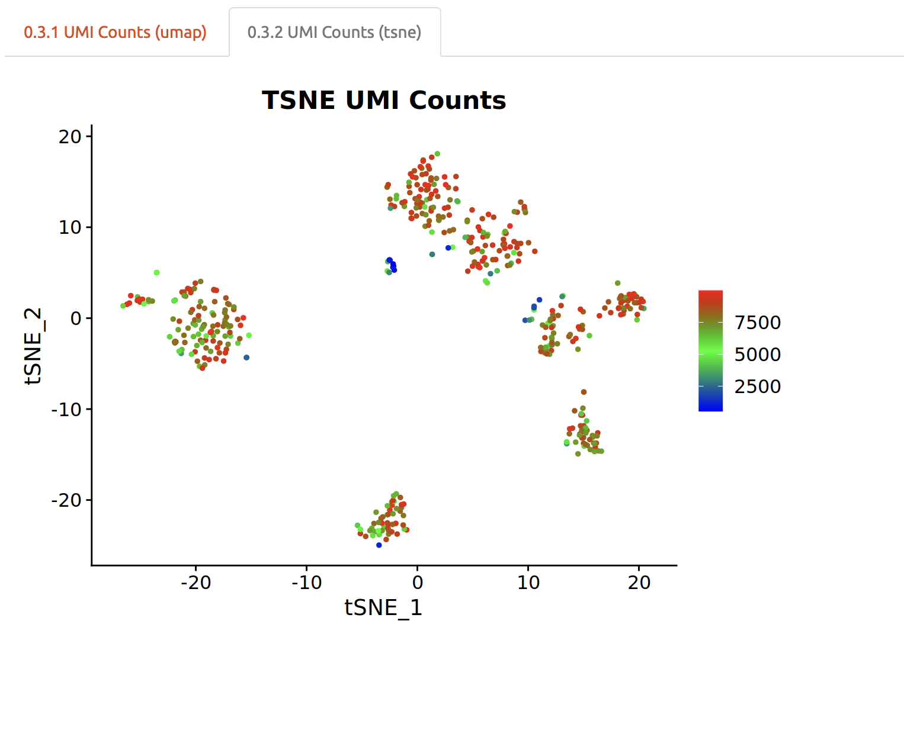 </p>


## Cluster Reports, Marker Reports and Markers
Cluster reports and Marker Reports are two html files generated by [Rmarkdown](https://rmarkdown.rstudio.com). The Markers section provided a tsv file of marker genes for each cluster.
### Description
The unsupervised clustering is used to group cells into populations so users do not need to look at a few thousand cells one at a time. After the clustering, genes that are significantly up and down regulated in each cell population are calculated: these genes can help users to identify the identity of cell populations.
### Cluster Reports
The report will visualize the clustering results, which is shown below.
<p align="center"> <p align="center"> 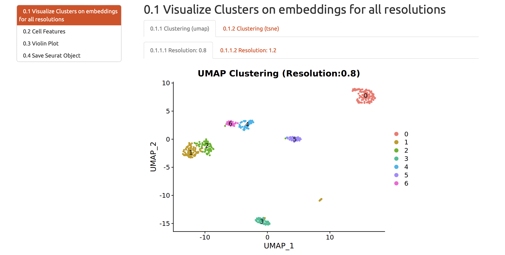 </p>
Another important visualization is plotting QC metrics of cells against the clustering results. This is to ensure that the clustering results are not significantly biased by the different sequencing depth and coverage of cells in the dataset.
<p align="center"> <p align="center"> 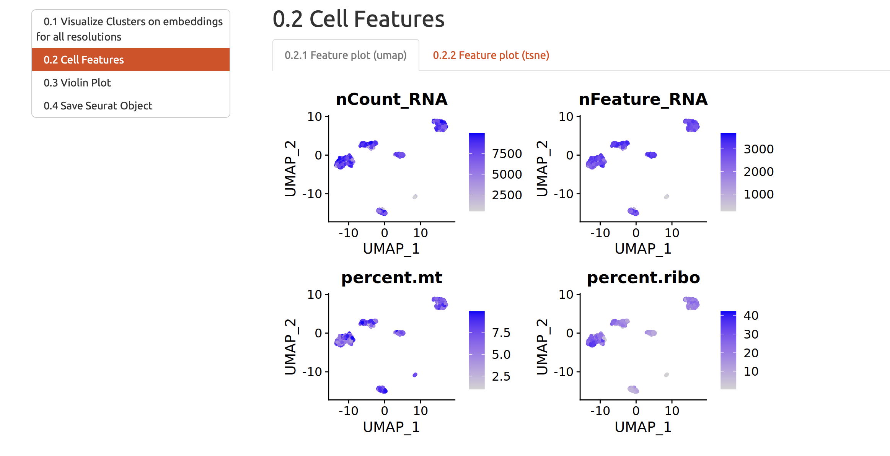 </p>

### Marker Reports
In this section the up-regulated genes in each cell population defined by clustering algorithm are visualized using heatmap. The figure below is an example of such a heatmap.
<p align="center"> <p align="center">  </p>

### Markers
In this section the full list of gene markers of each cell population is ready to be viewed and downloaded.
<p align="center"> <p align="center"> 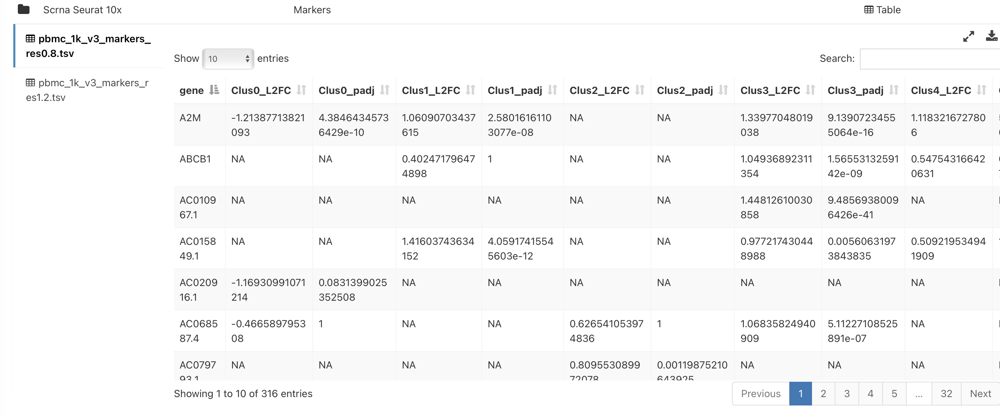 </p>


## Singler Rmd Report
Singler Rmd Report and Marker Reports is a html file generated by [Rmarkdown](https://rmarkdown.rstudio.com). 
[SingleR](https://doi.org/10.1038/s41590-018-0276-y) is an algorithm that annotates single cell RNA-Seq dataset based on gene markers of each cell population from clustering and a corresponding reference map. In this section the results of this SingleR annotation are shown.
<p align="center"> <p align="center"> 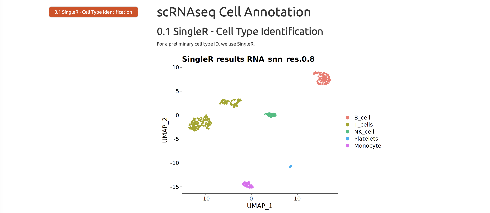 </p>

## Annot Out, Seurat H5ad and Shinyapp
In these sections the goal is to visualize end results of single cell RNA-Seq dataset using custom shiny Apps and [cellxgene](https://cellxgene.cziscience.com).

