Expected learning outcome
========

To understand the basics of Foundry and run a single-cell RNA-Seq pipeline with sample data.

# Before you start

Please go to https://viafoundry.umassmed.edu/ and login into your account. If you have a login issue, please let us know about it (BiocoreStaff@umassmed.edu). We will set up an account for you.

<p align="center"> <p align="center"> 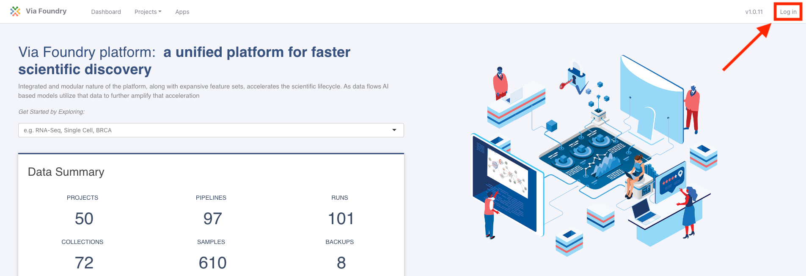 </p>

Creating a Project
========

Once logged in, (1) click on the `Projects` drop down on the top menu. This is the place to configure your projects.

To create a new project, (2) select `Add a New Project`.

<p align="center">  </p>

In the `New Project` pop-up, (3) give the new project a name and (4) click save.

<p align="center"> 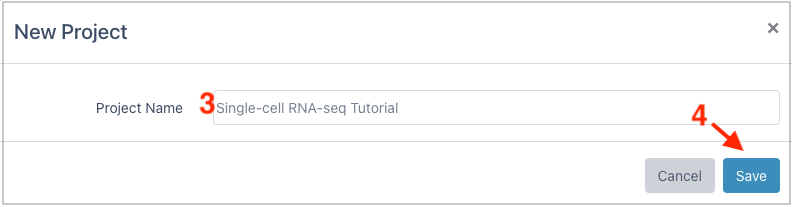 </p>

Creating a Run
========

Once a project is created, to access pipelines (1) click the `Pipelines` tab and then (2) click `Add Pipeline` in the top right. 

<p align="center"> 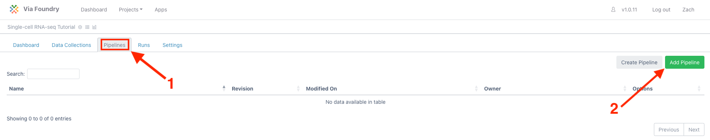 </p>

In the `Add pipeline` window, (3) click the `Add` button for the "Cell Ranger Pipeline" and close the window (bottom right). 

<p align="center"> 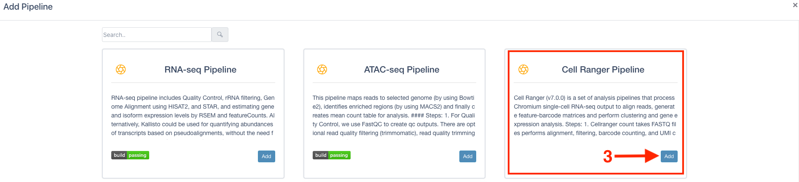 </p>

To bring up the run page, (4) click the `Run` button of the Cell Ranger pipeline on the table.

<p align="center"> 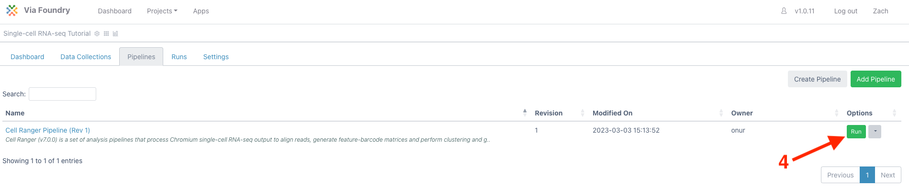 </p>

***

[Optional] To provide a run name, (5) click inside the box next to `Run`. Provide a new name and click anywhere outside the box to exit.

[Optional] To provide a run description, (6) click the pencil next to `Run Description`. Provide a description and (7) click on the checkbox to finish editing.

***

Under `Run Environment`, (8) select "Via Run Environment (AWS Batch)"

<p align="center"> 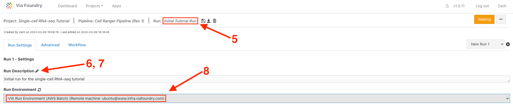 </p>

To add the source data, under `User Inputs` next to `Reads` (9) click `Enter File`

<p align="center"> 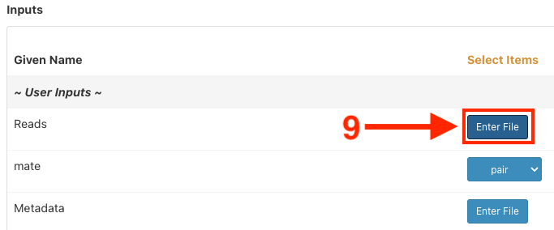 </p>

In the `Select/Add Input File` window, (10) select the `Files` tab and then (11) click `+ Add File`

<p align="center"> 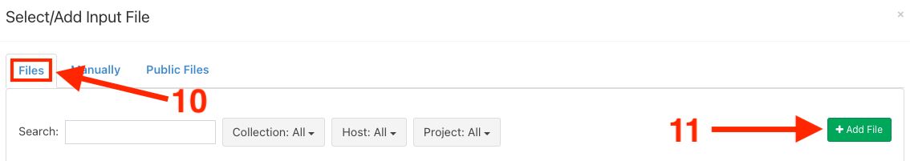 </p>


In the `Add File` window, (12) select the `Remote Files` tab and in the `1. File Location` box (13) paste the following path: 

```
/share/data/umw_biocore/dnext_data/test/fastq_10x_pbmc_1k_v3
```

Click (14) **search button** to see the content of the s3 directory. Leave `2. File Type` as "FASTQ" and in the `3. Collection Type` dropdown, (15) select 'Paired List'. 

<p align="center">  </p>


Under `4. File Pattern`, check that `R1 Pattern` is set to `_R1` and similarly that the `R2 Pattern` is set to `_R2`. For this sample, there were two sequencing lanes run (L001 and L002). To merge the two lanes, (16) hold shift while clicking on `pbmc_1k_v3_S1_L001_R1_001.fastq.gz` and (17) `pbmc_1k_v3_S1_L002_R1_001.fastq.gz`. The corresponding R2 will be automatically selected. (18) Click "Merge Selected Files" to combine the two lanes.

```
* Note: For other datasets, if you don't need to merge samples, you can select the samples you want to add and click 
"Add Selected Files" button. If you prefer to add all files that match the pattern, you can click "Add All Files" button.
```

<p align="center"> 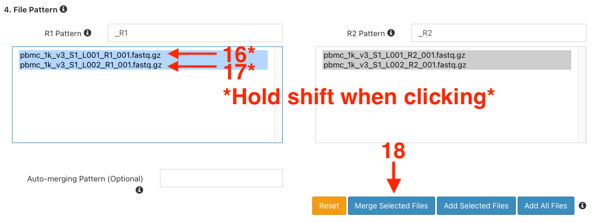 </p>

(19) Update the 'Name' to `pmbc_1k_v3_S1`. And input `fastq_10x_pbmc_1k_v3` as the `5. Collection Name`. The final three boxes can be left blank. (21) Click "Save Files".

<p align="center">  </p>

This will return to the `Change Input File` window. (22) Click "Save" again.

<p align="center">  </p>

Since this sample has paired end reads, (23) ensure the `mate` dropdown is set to "pair". To finish the `Metadata` section (24) click "Enter File".

<p align="center">  </p>


Pick the genome by (27) selecting "human_hg38_gencode_v32_cellranger_v6" in the `genome_build` dropdown. 

scRNA_Analysis_module settings
========

The scRNA_Analysis_module is module that will take the count matrix(ces) from Cellranger pipeline, and conduct downstream analysis such as filtering of low read count cells and multiplets, Normalization, Dimension Reduction and Clustering. The results of this module are several html files and files that can be interactively explored by using Shiny Apps and CellxGene browser.

From here I will introduce the options in this module. 

## Metadata (Totally Optional)
<p align="center"> 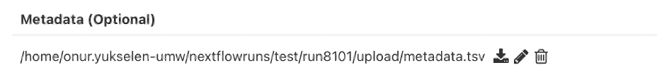 </p>

In this option the user can input a tab-delimited table as metadata sheet. The metadata sheet must includes one column named "Sample", which includes the name(s) of the sample(s) that match(es) the "Name" specified in the previous "Enter File section". The process automatically addes all the information in the metadata to the scRNA_Analysis_module.

## LoadData
<p align="center">  </p>
<p align="center"> 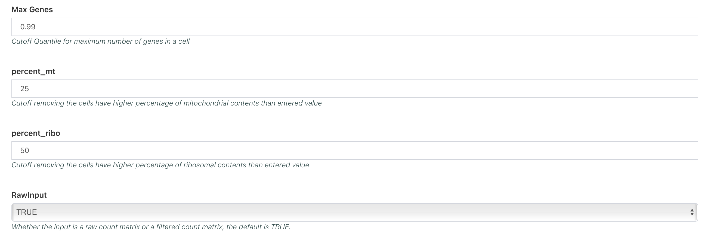 </p>
<p align="center"> 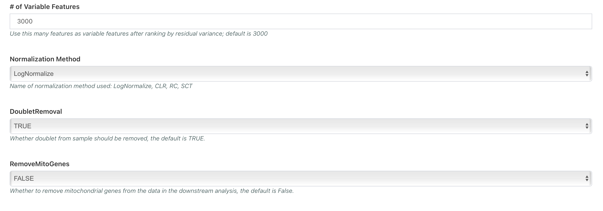 </p>

In this section the user can input how they want to filter their data, how the data needs to be normalized and whether the empty droplets and multiplets needs to be filtered out from the data.

The min/maxTranscript and minMaxGenes are the lower and upper bounds of the UMI counts and gene counts per cells. These options are specified using quantile (ranging from 0 to 1). The default is to remove cells with genes and UMI counts higher than 99th percentile or lower than 1st percentile.

The percent_mt and percent_ribo allow user to specify the upper bound of mitochondrial contents and ribosomal contents. The values can range from 0 to 100 in these two options.

The RawInput and DoubletRemoval options allow user to specify whether the empty droplets and multiplets needs to be removed from the dataset. In the cellranger pipeline they are set as "Yes".

The RemoveMitoGenes and RemoveRiboGenes (Not on the figure, but just below the RemoveMitoGenes option) allow user to remove genes that encode mitochondrial and ribosomal genes. Although it is highly not recommended, user can use the options to remove these genes.

## PCA_and_Batch_Effect_Correction

<p align="center"> 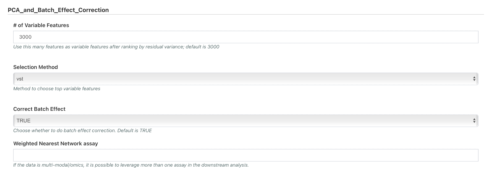 </p>

In this section the user can specify how the Principal component analysis is conducted and whether Batche effect correction is needed.

The option "Weighted Nearest Network assay" will allow user to enter the name of another assay (scATAC,ADT etc) so that the analysis will leverage the multi-omic information from the sample.

## Clustering_and_Find_Markers

<p align="center"> 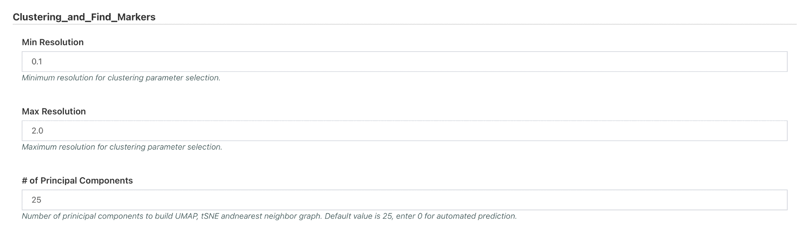 </p>


***

In conclusion, all settings should be set to "yes", except `run_Aggregate_Libraries` and `genome_build` which was set to "human_hg38_gencode_v32_cellranger_v6".

<p align="center"> 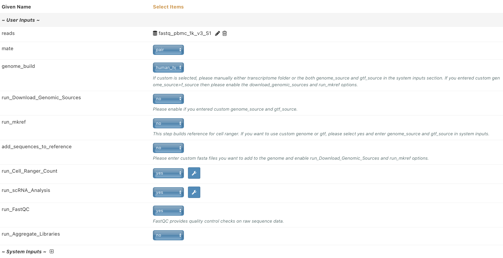 </p>

***

Finally, to submit the run (36) click "Run" in the top right and (37) select "Start"

<p align="center"> 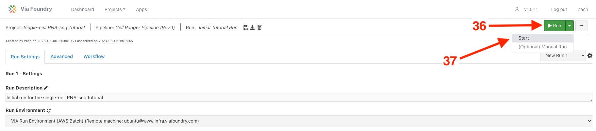 </p>

