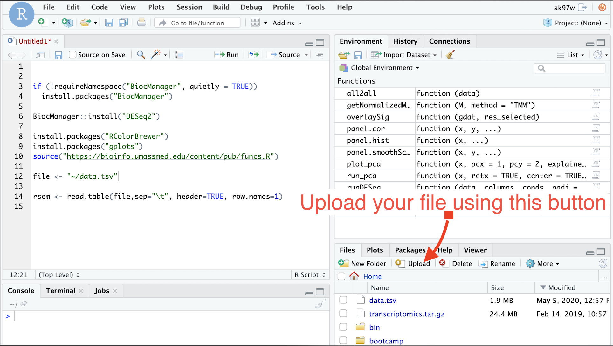
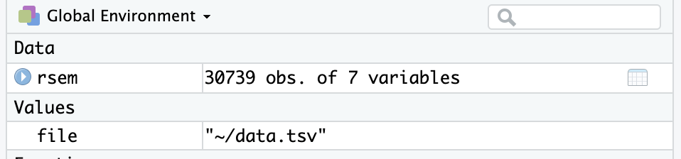
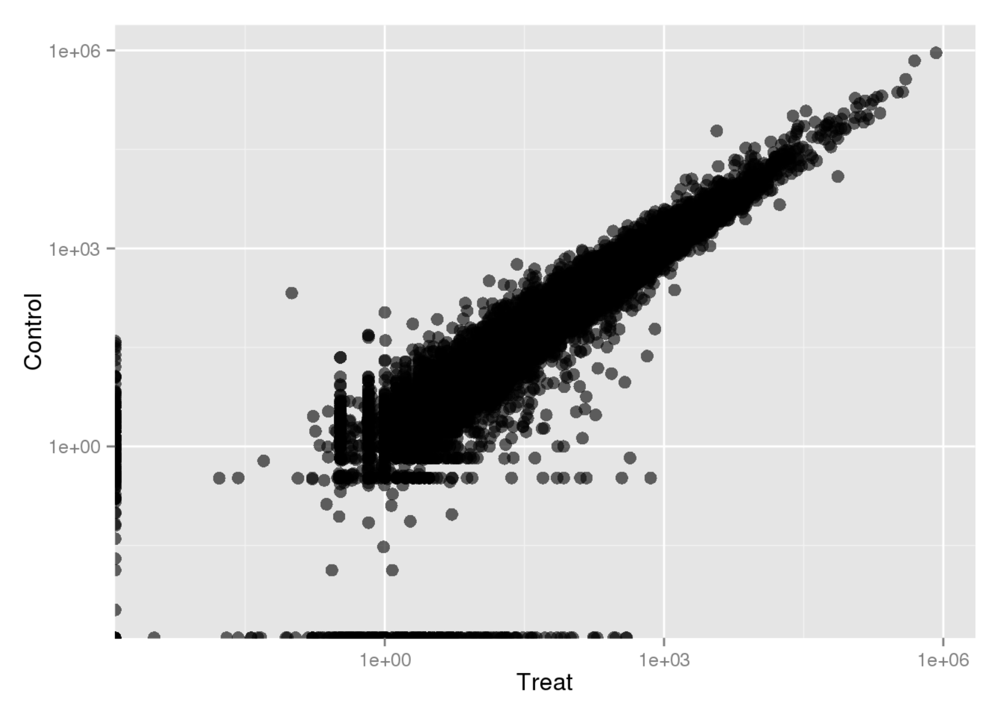
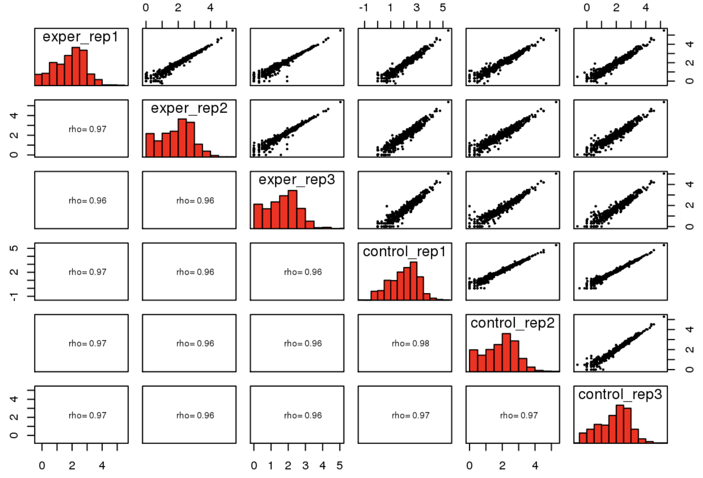
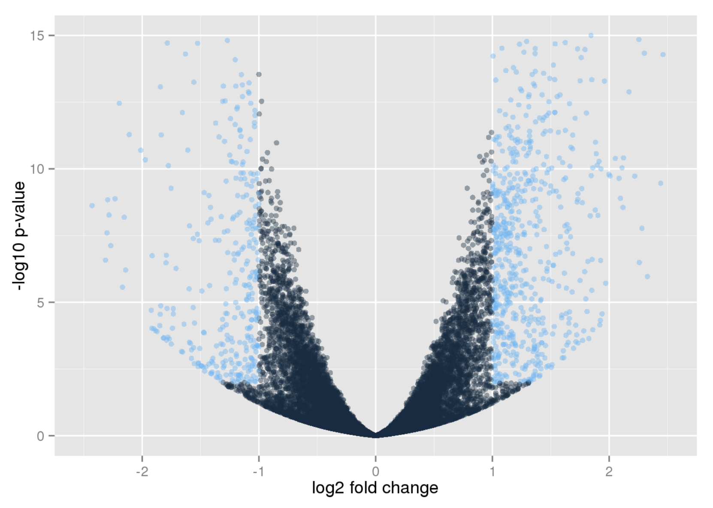
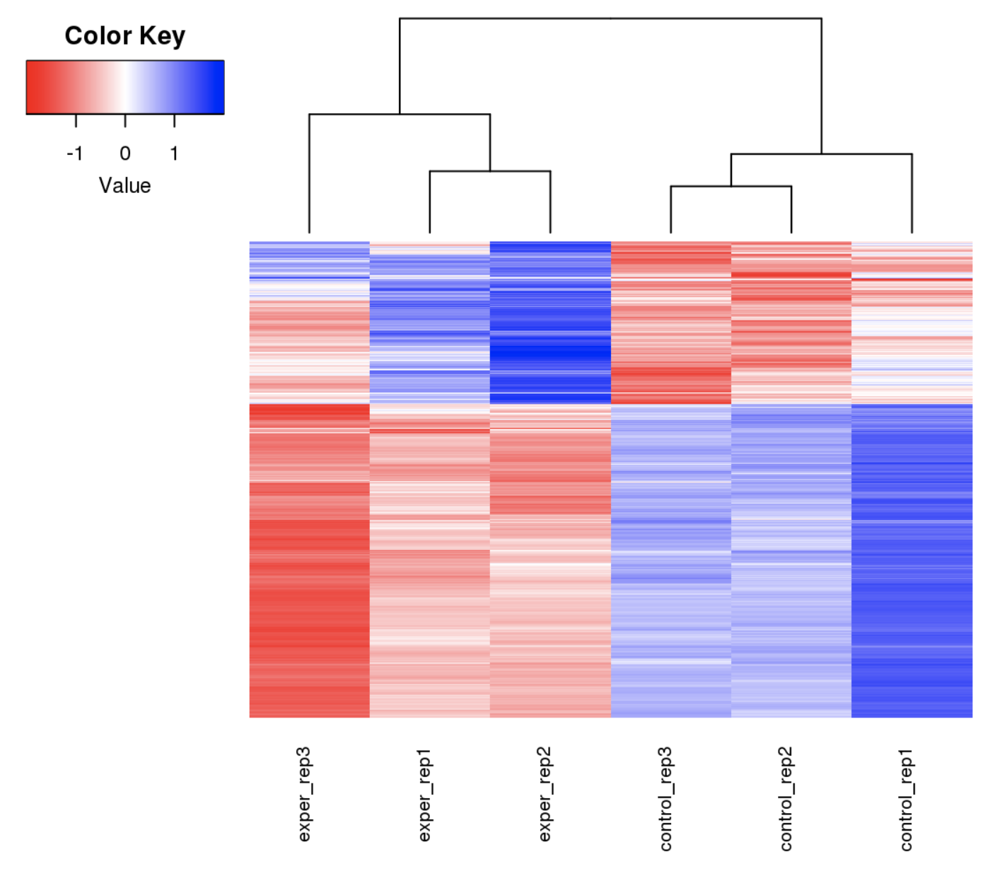
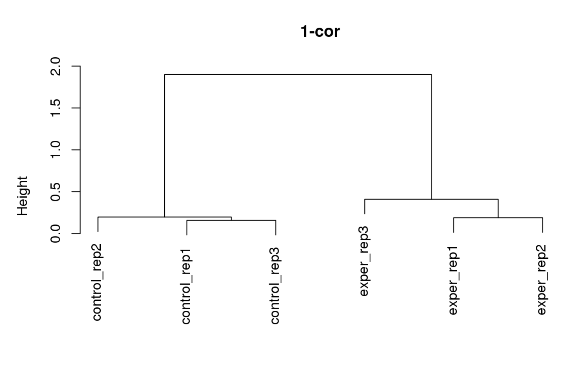

# Session 6: R and RStudio

# Expected learning outcome

To understand the basics of R and RStudio, how to use R in creating plots, doing table manipulation, and some basic computation. This document aims a beginner audience, rather than experts.

# Overview

- [Introduction](#introduction)
- [Getting Started](#getting-started)
- [R Basics](#r-basics)
- [R Tutorials](#r-tutorials)
- [RNA-Seq data analysis with R](#rna-seq_data_analysis_with_r)

## Introduction

Today we will do some basic exercises to start learning R. R is a programming language and software environment for statistical analysis, graphics representation and reporting. You can either download and install R into your computer or use R in the cluster. You can use R with a user interface called RStudio or you might prefer using R from the command line. There are a couple of ways to use R. In this tutorial we will use the UMass Cluster. **However, we also want you to install R and R-Studio into your local computer for the next session.**

## Getting Started

This week you will use R using R-Studio in the cluster. You can access the web interface using the link below from your local campus network or VPN using your cluster username and password.

For UMMS VPN instructions
<https://www.umassmed.edu/globalassets/it/documents/get-connected/working-remotely/umms-vpn-windows.pdf>

For Web interface, please enter cluster username and password:

<https://www.umassrc.org:444>

To access R-Studio in the cluster. Please use the short video below.

<https://www.youtube.com/watch?v=S6UO-KEy8ew>

- Selected RStudio Server settings in the video:

  - Rstudio Server version:3.6.0
  - Queue: Interactive
  - Number of hours: 4
  - Number of processors: 1
  - MB of memory per core: 64000

### Installing R and R-Studio to your local computer

Please install R 4.0.5 into your local computer **to use it in the next session.**

1. First please install R to your computer

   <https://cran.r-project.org/>

   For windows;
   <https://cran.r-project.org/bin/windows/base/R-4.0.5-win.exe>

   For mac;
   <https://cran.r-project.org/bin/macosx/R-4.0.5.pkg>

2. Second, please install R-Studio;

   <https://rstudio.com/products/rstudio/download/>

3) Please install DEbrowser to your local computer. This can take time to install all the packages.

   Open R or R-Studio and run the commands in R console, it will include most of the packages we will use;

```
if (!requireNamespace("BiocManager", quietly = TRUE))
    install.packages("BiocManager")

BiocManager::install("debrowser")
```

When it is asked. "Do you want to install from sources the package which needs compilation? (Yes/no/cancel)". If so, just type "n" for no, and hit Enter to continue.

    Do you want to install from sources the package which needs compilation? (Yes/no/cancel) n

It can ask to update old packages; please answer with "a"

    Old packages: 'boot', 'class', 'foreign', 'KernSmooth', 'MASS', 'nnet', 'rlang', 'spatial'
    Update all/some/none? [a/s/n]:

But and it will ask again to install rlang from source. Answer it with "n"

### Check debrowser

Run the commands below. It should launch debrowser in your browser.

    library(debrowser)
    startDEBrowser()

To stop debrowser, there is a stop button on the corner of the console.

## R Basics

### Packages

R consists of lots of functions that can be installed in your environment. If a package is not installed in your environment. You can install it using **install.packages("package_name")** function. If it is a Bioconductor package, you can install it using **BiocManager::install("package_name")**. Bioconductor provides tools for the analysis and comprehension of high-throughput genomic data.

### Setting your working directory

getwd command will let you know your existing working directory

    getwd()

**setwd("directory")** command will set the working directory. For now, we will keep your working directory. However, if you need to read/write files from/to a specific directory, this function might help you.

## R Tutorials

Let's use swirl to start learning R basics. First, we need to install and load the library.

    install.packages("swirl")
    library("swirl")

To start the tutorial just run the command below;

    swirl()

Choose a name for yourself and follow the instructions to start learning. Swirl package will print out all the instruction you to follow.

In this section please finish the tutorial below. We have recorded these tutorials, in case you stuck at any point.

#### R Programming:

    1: The basics of programming in R

<https://youtu.be/haHoWQhJEDY>
2: Workspace and Files

<https://youtu.be/DoxUXdAkRkg>

3: Sequences of Numbers

<https://youtu.be/VtF8oK0iFc8>

4: Vectors

<https://youtu.be/lTD-DvSYWc8>

5: Missing Values  
<https://youtu.be/05HFXKg7iSY>

6: Subsetting Vectors

<https://youtu.be/Os3w3N0Y2MA>

7: Matrices and Data Frames

<https://youtu.be/gn6WuV1Tyeo>

    12: Looking at Data

<https://youtu.be/ppDBvq5VY_8>

## RNA-Seq data analysis with R

### Before we start

Let's use editor in R-Studio and keep what will do in this session a Rscript file. Go to "File" -> "New File" -> "R Script"


- **Tip: To run any line in this editor in RStudio, please use Ctrl+Enter (for Windows) or Command+Enter (for Mac) to execute the line.**

Please install the necessary packages we want to use and load some sources we prepared for you to use in this session. For every line use Command+Enter (for Mac, or Ctrl+Enter for windows) to execute. Installing DESeq2 might take some time. While installing, when it asks an installation from source. Answer it with "n". Other than that you can upgrade other packages if it asks.

    if (!requireNamespace("BiocManager", quietly = TRUE))
      install.packages("BiocManager")

    BiocManager::install("DESeq2")
    BiocManager::install("edgeR")

    install.packages("RColorBrewer")
    install.packages("gplots")
    source("https://bioinfo.umassmed.edu/content/pub/funcs.R")

We already made gene quantifications and merged expected counts into a single table using dolphinNext. If you haven't done your homework. Here we prepared another table using whole reads (not only using reduced reads) to give you an idea about the complete picture of DESeq analysis. Please download this file into your computer to ~/Downloads folder for example.

<https://galaxyweb.umassmed.edu/pub/class/data.tsv>

This file is also uploaded to the location below. If you are using R-Studio in the cluster. Please upload it to your home.



### 1. Read the file

    file <- "~/data.tsv"

- If you are using your own computer, **please change the directory above** to wherever your file is located. Use the full path.

Read the data with row.names. We have the gene names in the first column in this table. When we set row.names=1 It will remove the first column from the data and put them to the row name section.

    rsem <- read.table(file,sep="\t", header=TRUE, row.names=1)

    head(rsem)

If file is loaded successfully you will see these lines in your "global environment".



### 2. Creating the data structure for DESeq Analysis

We need to select the columns that we are going to use in the analysis. Here we are
going to use the experiment and control data that will be 6 columns. Here in this step make sure to include the columns you want to use in your analysis.

    columns <- c("exper_rep1","exper_rep2","exper_rep3",
             "control_rep1","control_rep2","control_rep3")

    data <- data.frame(rsem[, columns])

### 3. Scatter plot with condition averages

Scatter plots are a key approach to assess differences between conditions. We will plot the average expression value (counts or TPMs for example) of two conditions. First calculate the average reads per gene. To find the average we sum experiments per gene and divide it to the number of replicas by using `rowMeans` function. We will calculate the average for control libraries too. After that, we are ready to merge the average values from experiment and control to create a two column data structure using the `cbind` function that merges tables.

    exp <- c("exper_rep1","exper_rep2","exper_rep3")
    cont <- c("control_rep1","control_rep2","control_rep3")
    avgall <- cbind( rowMeans(data[exp]), rowMeans(data[cont]) )

    head(avgall)

We can also change the column names using `colnames` function.

    colnames(avgall) <- c("Treat", "Control")

    head(avgall)

There are several packages in R that can be used to generate scatter plots. The same plot can be generated using the `ggplot` package.

    gdat<-data.frame(avgall)
    ggplot() +
      geom_point(data=gdat, aes_string(x="Treat", y="Control"),
                 colour="black", alpha=6/10, size=3) +
      scale_x_log10() +scale_y_log10()



To learn more about ggplots you can check the link below.

<http://r-statistics.co/Complete-Ggplot2-Tutorial-Part1-With-R-Code.html>

### 4. Filtering non-expressed genes

In Eukaryotes only a subset of all genes are expressed in a given cell. The expression is, therefore, a bimodal distribution, with non-expressed genes having counts that result from experimental and biological noise. It is important to filter out the genes that are not expressed before doing differential gene expression.

You can decide which cutoff separates expressed vs non-expressed genes by looking at your histogram we created. In our case, a total sum of 10 counts separates well expressed from non-expressed genes.

    sumd <- rowSums(data)
    hist(log10(sumd), breaks=100)
    abline(v=1)


### 5. All2all scatter plots

To make all to all scatter plot, use the function below.

    all2all(data)



### 6. Differential Expression Analysis

The goal of Differential gene expression analysis is to find genes or transcripts whose difference in expression, when accounting for the variance within the condition, is higher than expected by chance. The first step is to indicate the condition that each column (experiment)
in the table represent. Here we define the correspondence between columns and conditions.
Make sure the order of the columns matches to your table.

    conds <- factor( c( "Treat", "Treat","Treat",
    "Control","Control", "Control") )

    columns
    #[1] "exper_rep1"   "exper_rep2"   "exper_rep3"  "control_rep1" "control_rep2" "control_rep3"

DESeq will compute the probability that a gene is differentially expressed (DE) for ALL genes in the table. It outputs both a nominal and multiple hypotheses corrected p-value (padj).
Because we are testing DE for over 20,000 genes, we do need to correct for multiple hypothesis testing. To find genes that are significantly DE, we select the ones has lower padj values and higher fold changes and visualize them on our scatter plot with a different color. padj values are corrected p-values which are multiplied by the number of comparisons. Here we are going to use 0.01 for padj value and > 1 log2foldchange. (1/2 < foldChange < 2)

    de_res <- runDESeq(data, columns, conds,  padj=0.01, log2FoldChange=1, non_expressed_cutoff=10)

    ## estimating size factors
    ## estimating dispersions
    ## gene-wise dispersion estimates
    ## mean-dispersion relationship
    ## final dispersion estimates
    ## fitting model and testing

### 7. Make ggplot and overlay the significantly DE genes on the scatter plot

    overlaid_data <- overlaySig(gdat, de_res$res_selected)

    ggplot() +
      geom_point(data=overlaid_data, aes_string(x="Treat", y="Control",
           colour="Legend"), alpha=6/10, size=3) +
      scale_colour_manual(values=c("All"="darkgrey","Significant"="red"))+
      scale_x_log10() +scale_y_log10()


### 8. MA Plot

The Second way to visualize it, we use MA plots.
For MA Plot there is another builtin function that you can use.

    plotMA(de_res$res_detected,ylim=c(-2,2),main="DESeq2");


### 9. Volcano Plot

The third way of visualizing the data is by making a Volcano Plot. Here on the x-axis you have log2foldChange values and y-axis you have your -log10 padj values. To see how significant genes are distributed. Highlight genes that have an absolute fold change > 2 and a padj < 0.01

    volcanoPlot(de_res,  padj=0.01, log2FoldChange=1)



### 9. Clustering

The fourth way of visualizing the data that is widely used in this type of analysis is clustering and Heatmaps.

    sel_data<-data[rownames(de_res$res_selected),]

#### a. Normalizing the selected data using TMM

    norm_data<-getNormalizedMatrix(sel_data, method="TMM")

    ## Loading required package: edgeR
    ## Loading required package: limma
    ##
    ## Attaching package: 'limma'
    ##
    ## The following object is masked from 'package:DESeq2':
    ##
    ##     plotMA
    ##
    ## The following object is masked from 'package:BiocGenerics':
    ##
    ##     plotMA

Here we usually use normalized data and add a pseudocount value 0.1.

ld <- log2(norm_data+0.1)

- Alternatively, you can use the selected data without normalization `ld <- log2(sel_data+0.1)` and see the difference in the heatmap.

#### b. Scaling the value using their mean centers can be good if the data is uniformly distributed in all the samples.

    cldt <- scale(t(ld), center=TRUE, scale=TRUE);

We can define different distance methods to calculate the distance between samples. Here we focus on euclidean distance and correlation

#### c. Euclidean distance

    distance<-dist(cldt, method = "euclidean")

To plot only the cluster you can use the command below
plot(hclust(distance, method = "complete"),
main="Euclidean", xlab="")


##### The heatmap

    cld <- t(cldt)
    heatmap.2(cld, Rowv=TRUE,dendrogram="column",
              Colv=TRUE, col=redblue(256),labRow=NA,
              density.info="none",trace="none", cexCol=0.8);



#### d. Use Correlation between libraries

Here we calculate the correlation between samples.

    dissimilarity <- 1 - cor(cld)

We define it as distance. This will create a square matrix that will include the dissimilarities between samples.

    distance <- as.dist(dissimilarity)

To plot only the cluster you can use the command below

    plot(hclust(distance, method = "complete"),
     main="1-cor", xlab="")

 

##### The heatmap

    	heatmap.2(cld, Rowv=TRUE,dendrogram="column",
          Colv=TRUE, col=redblue(256),labRow=NA,
          density.info="none",trace="none", cexCol=0.8,
          hclust=function(x) hclust(x,method="complete"),
          distfun=function(x) as.dist((1-cor(t(x)))/2))

 
