# Session 7: Differential expression analysis with DEBrowser

## DE Analysis class material recap from last week

Please click the image below to access the video tutorial </br>

<div align="left">
  <a href="https://youtu.be/1hNAMKspcrA"></a>
</div>

## Expected learning outcome

========

Doing differential expression(DE) analysis without writing code and visualize DE results in an interactive way. This document aims beginner audience and it will walk through the usage from start to end.

# Overview

- [Introduction](#introduction)
- [Getting Started](#getting-started)
- [Un-normalized Counts](#unnormalized-counts)
- [Loading count data file](#loading-count-data-file)
- [Low Count Filtering](#low-count-filtering)
- [Quality Control Plots](#quality-control-plots)
- [Batch Effect Correction](#batch-effect-correction)
- [DE Analysis](#go-to-de-analysis)
- [Session7 Homework](#session7-homework)

## Introduction

Differential gene expression analysis has become an increasingly popular tool in determining and viewing up and/or down expressed genes between two or more sets of samples. The goal of Differential expression analysis is to find genes, transcripts, or regions whose difference in expression/count, when accounting for the variance within condition, is higher than expected by chance. DESeq2 is one of the highly used packages in R available via Bioconductor and is designed to normalize count data from high-throughput sequencing assays such as RNA-Seq and test for differential expression (Love et al. 2014). For more information on the DESeq2 algorithm, you can read its documentation below;

<https://bioconductor.org/packages/release/bioc/manuals/DESeq2/man/DESeq2.pdf>

With multiple parameters such as p-adjust values, log fold changes, and plot styles, altering plots, created with your DE data can be a hassle as well as time-consuming. The DEBrowser uses DESeq2, EdgeR, and Limma coupled with shiny to produce real-time changes within your plot queries and allows for interactive browsing of your DE results. In addition to DE analysis, DEBrowser also offers a variety of other plots and analysis tools to help visualize your data even further.

DEBrowser allows users to:

- make complex comparisons by building custom tables that include results of any supported DE algorithms on any combination of replicates of interest.
- detect batch effects and identify outliers by All-to-All, IQR, density, and PCA plots.
- graphically select from any of the genome-wide visualizations of any subset of genes for further in-depth exploration such as ontology, pathway and disease analysis.

## DEBrowser class material

Please click the image below to access the video tutorial </br>

<div align="left">
  <a href="https://youtu.be/L9Cx7rqT9nM"></a>
</div>

## Getting Started

### Installing R and R-Studio to your local computer

Please install R 4.0.5 into your local computer to use it in the next session.

1. First please install R to your computer

   <https://cran.r-project.org/>

   For windows;
   <https://cran.r-project.org/bin/windows/base/R-4.0.5-win.exe>

   For mac;
   <https://cran.r-project.org/bin/macosx/R-4.0.5.pkg>

2. Second, please install R-Studio;

   <https://rstudio.com/products/rstudio/download/>

### Installing DEBrowser to your local computer

Please install DEBrowser to your local computer. This can take time to install all the packages.

Open R or R-Studio and run the commands in R console.

```
if (!requireNamespace("BiocManager", quietly = TRUE))
    install.packages("BiocManager")

BiocManager::install("debrowser")
```

When it is asked. "Do you want to install from sources the package which needs compilation? (Yes/no/cancel)" just type "no" and hit Enter to continue.

    Do you want to install from sources the package which needs compilation? (Yes/no/cancel) n

It can ask to update old packages; please answer with "a"

    Old packages: 'boot', 'class', 'foreign', 'KernSmooth', 'MASS', 'nnet', 'rlang', 'spatial'
    Update all/some/none? [a/s/n]:

But if it asks again to install a package from source. Answer it with "n".

### Check debrowser

Run the commands below. It should launch DEBrowser in your preferred browser. We suggest using Chrome or Firefox.

    library(debrowser)
    startDEBrowser()

To stop DEBrowser, there is a stop button on the corner of the console.

## Unnormalized counts

Testing models of DESeq2 or other packages are based on negative binomial distribution which require count data as the input. This data obtained from RNA-Seq or other high-throughput sequencing experiments in the form of matrix. The values of the matrix should be un-normalized since the DESeq2 model internally corrects for library size. **So, transformed or normalized values such as counts scaled by library size should not be used as input.** Please use edgeR or limma for normalized counts.

- **Note:** We will convert uninteger values to integer to be able to run the DE algorithms.

## Count Normalization

Please click the image below to access the video tutorial </br>

<div align="left">
  <a href="https://youtu.be/I0VfI0xb_JI"></a>
</div>

## Loading count data file

To begin the analysis, you need to upload your **count data file** (in comma or semicolon-separated (CSV), and tab-separated (TSV) format) to be analyzed and choose appropriate separator for the file (comma, semicolon or tab).

- You can use the built-in demo data file for the tutorial by clicking on the **'Load Demo (Vernia et al.)!'** button.
- After you've finished your analysis with **Vernia et al. data**, you can load different dataset by clicking **'Load Demo (Donnard et al.)!'** to work on batch effect correction. To start from strach, simply refresh your page.

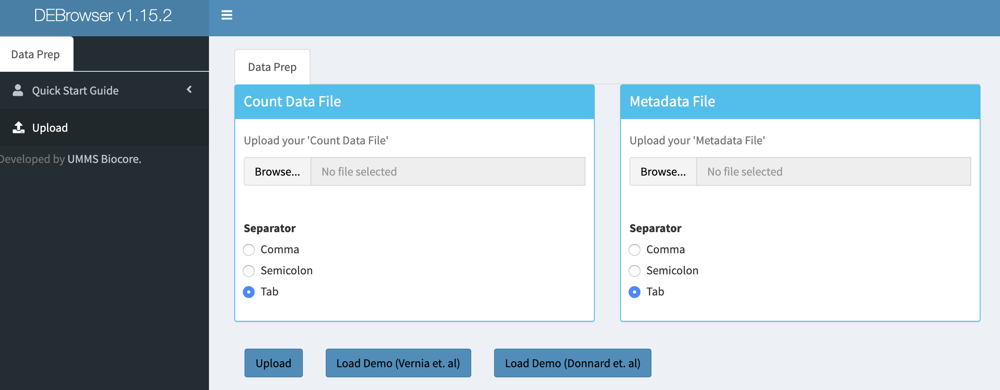

#### Details of the loaded files

The count matrix file should be like below.

| gene  | exper_rep1 | exper_rep2 | exper_rep3 | control_rep1 | control_rep2 | control_rep3 |
| ----- | ---------- | ---------- | ---------- | ------------ | ------------ | ------------ |
| DQ714 | 0.00       | 0.00       | 0.00       | 0.00         | 0.00         | 0.00         |
| DQ554 | 5.03       | 20.00      | 10.00      | 0.00         | 0.00         | 0.00         |
| AK028 | 2.00       | 1.29       | 0.00       | 120.00       | 0.00         | 0.00         |

In addition to the count data file; you might need to upload an optional metadata file to correct for batch effects or any other normalizing conditions you might want to address that might be within your results. To handle these conditions, simply create a metadata file by using the example table below with excel or your favorite editor. The metadata file also simplifies condition selection for complex data. The columns you define in this file can be selected on the condition selection page. Make sure you have defined two conditions per column. If there are more than two conditions in a column, those can be defined empty.

- **Note:** If your data is not complex, the metadata file is optional, you don't need to upload.

| sample       | batch | condition |
| ------------ | ----- | --------- |
| exper_rep1   | 1     | A         |
| exper_rep2   | 2     | A         |
| exper_rep3   | 1     | A         |
| control_rep1 | 2     | B         |
| control_rep2 | 1     | B         |
| control_rep3 | 2     | B         |

The metadata file can be formatted with a comma, semicolon, or tab separators similar to count data files. These files used to establish different batch effects for multiple conditions.
You can have as many conditions as you may require, as long as all of the samples are present. To handle for these conditions, simply create a metadata file by using the example table at above or download sample file from [this link.](https://bioinfo.umassmed.edu/pub/debrowser/simple_demo_meta.txt)

The example above would result in the first set of conditions as
`exper_rep1`, `exper_rep2`, `exper_rep3` from `A`
and second set of conditions as
`control_rep1`, `control_rep2`, `control_rep3` from `B`

as they correspond to those conditions in the `condition` column.

In the same way, 'batch' would have the first set as

`exper_rep1`, `exper_rep3`, `control_rep2` from `1`
and second set as
`exper_rep2`, `control_rep1`, `control_rep3` from `2`
as they correspond to those conditions in the `batch` column. These naming to define batches can be any value, string or numbers.

Once the count data and metadata files have been loaded in DEBrowser, you can click the upload button to visualize your data as shown below:

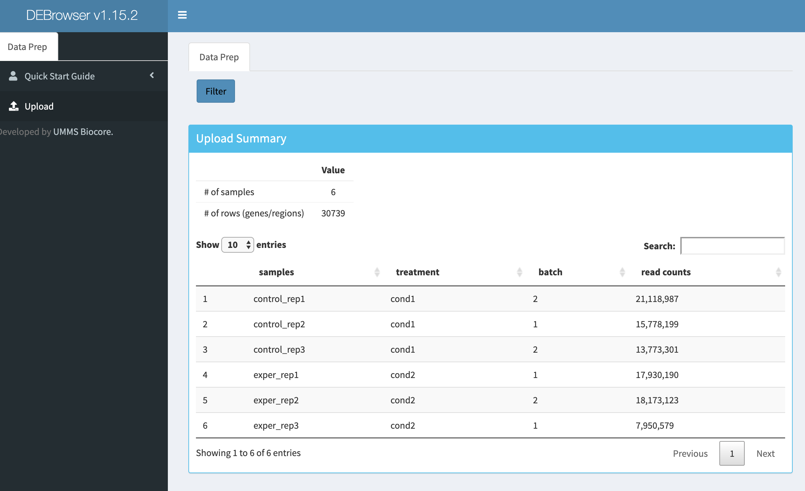

After loading the quantification file, and if specified the metadata file containing your batch fields, you then have the option to filter low counts and conduct batch effect correction prior to your analysis. Alternatively, you may skip these steps and directly continue with differential expression analysis or view quality control (QC) information of your dataset.

## Low Count Filtering

In this section, you can simultaneously visualize the changes of your dataset while filtering out the low count genes. Choose your filtration criteria from **Filtering Methods** box which is located just the center of the screen. Three methods are available to be used:

| Method    | Explanation                                                                                                                                                                                                                        |
| --------- | ---------------------------------------------------------------------------------------------------------------------------------------------------------------------------------------------------------------------------------- |
| **Max:**  | Filters out genes where the maximum count for each gene across all samples is less than the defined threshold                                                                                                                      |
| **Mean:** | Filters out genes where the mean count for each gene is less than the defined threshold.                                                                                                                                           |
| **CPM:**  | First, counts per million (CPM) is calculated as the raw counts divided by the library sizes and multiplied by one million. Then it filters out genes where at least defined number of samples is less than defined CPM threshold. |

After selecting filtering methods and entering threshold value, you can proceed by clicking **Filter** button which is located just bottom part of the **Filtering Methods** box. On the right part of the screen, your filtered dataset will be visualized for comparison as shown in the figure below.

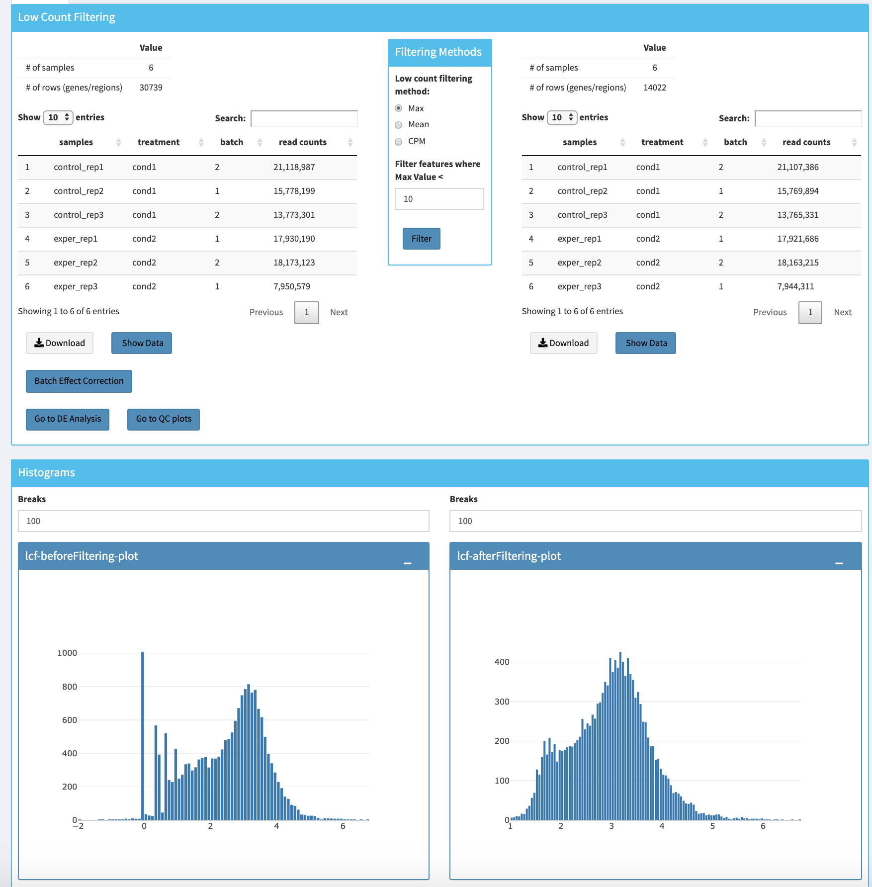

You can easily compare the following features, before and after filtering:

- Number of genes/regions.
- Read counts for each sample.
- Overall histogram of the dataset.
- gene/region vs samples data

To investigate the gene/region vs samples data in detail as shown below, you may click the **Show Data** button, located bottom part of the data tables. Alternatively, you may download all filtered data by clicking **Download** button which located next to **Show Data** button.

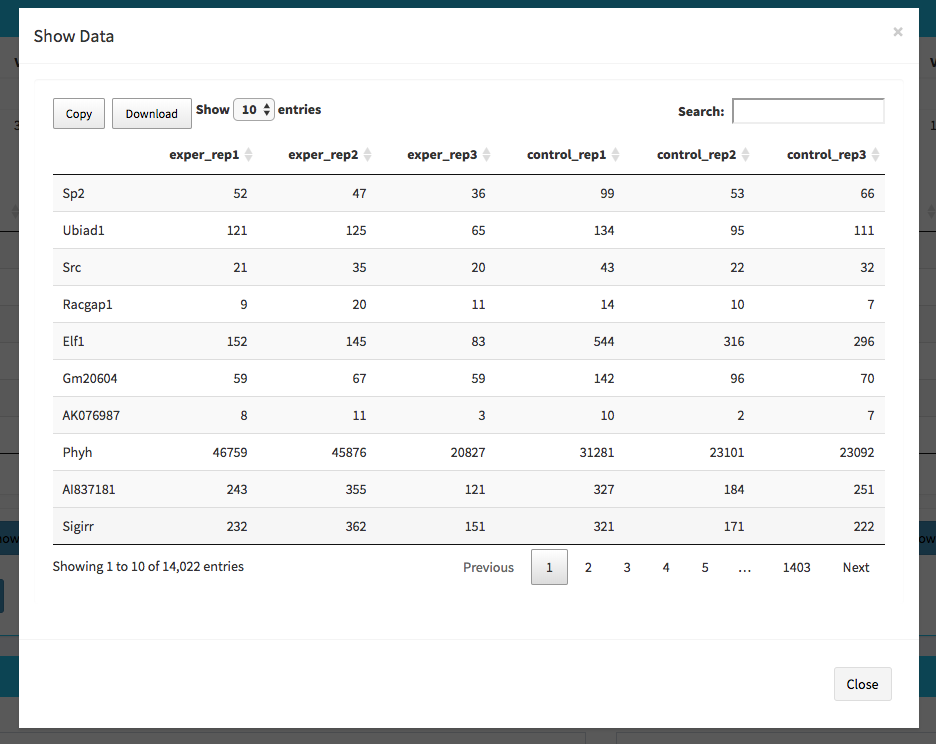

After, you may continue doing quality checks to detect any possible problems after quantification using **Go to QC plots**. If your data sequenced in different batches you can choose using **Batch Effect Correction** or directly jump to the differential expression analysis section using **GO to DE Analysis** button.

- [Quality Control Plots](#quality-control-plots)
- [Batch Effect Correction](#batch-effect-correction)
- [DE Analysis](#de-analysis)

## Quality Control Plots

Using **Go to QC plots** will take you to the quality control plots section. The page opens with a Principal Component Analysis (PCA) plot and users can also view an All2All, heatmap, IQR, and density by choosing **Plot Type** in the left menu. Here the dataset being used in the plots depends on the parameters you selected in the left panel. Therefore, you are able to adjust the size of the plots under 'width' and 'height' as well as alter a variety of other parameters to adjust the specific plot you're viewing.

**Note: When this page is opened the default dataset is "Most varied 500" genes. This set can be changed using "Data Options" => "Choose Dataset" dropdown to "All Detected" genes or "Searched" geneset. In order to use "Searched" geneset option, please use "Search box" in the same menu section.**

The All2All plot displays the correlation between each sample, Heatmap shows a heatmap representation of your data, IQR displays a bar plot displaying the IQR between samples, and Density will display an overlapping density graph for each sample. You also have the ability to select the type of clustering and distance method for the heatmap produced to further customize your quality control measures. Users also have the option to select which type of normalization methods they would like to use for these specific plotting analyses within the left menu.

Plotting Options

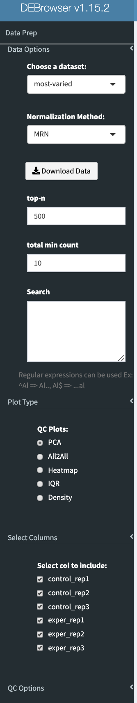

PCA Plot


PCA Loadings

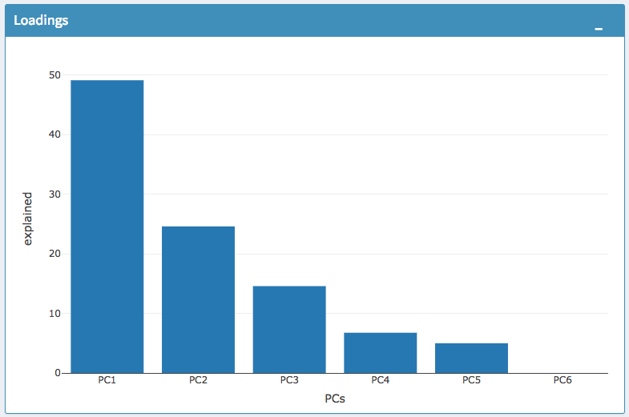

All2All Plot

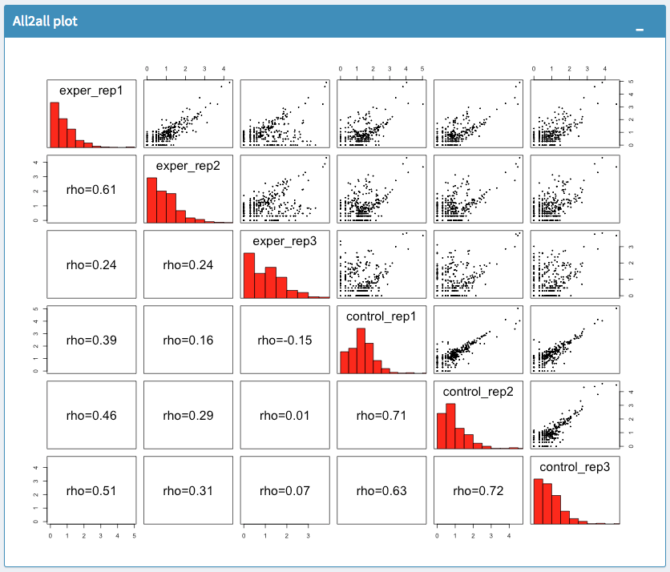

Heatmap

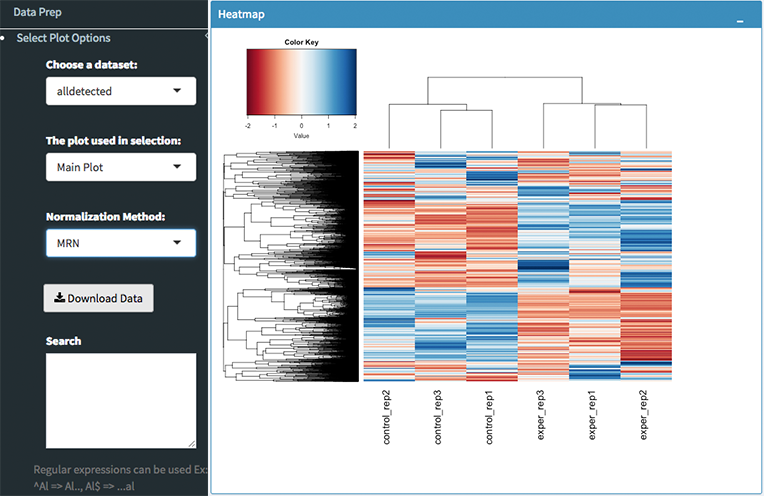

IQR Plot Before Normalization

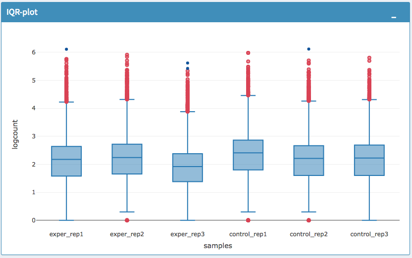

IQR Plot After Normalization


Density Plot Before Normalization

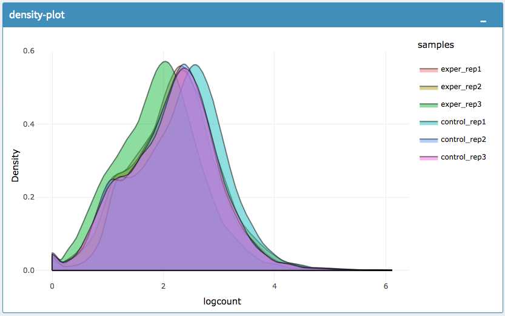

Density Plot After Normalization

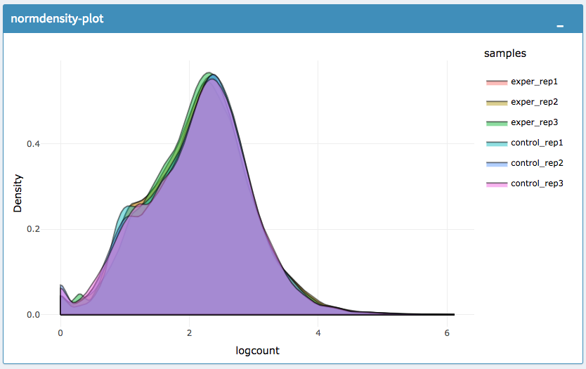

**Each QC plot also has options to adjust the plot height and width, as well as a download button for a png output located above each plot.**

For the Heatmap, you can also view an interactive session of the heatmap by selecting the 'Interactive' checkbox before submitting your
heatmap request. Make sure that before selecting the interactive heatmap option that your dataset being used is 'Up+down' or Most Varied set.
Just like in the Main Plots, you can click and drag to create a selection. To select a specific portion of the heatmap, make sure
to highlight the middle of the heatmap gene box in order to fully select a specific gene. This selection can be used later within the
GO Term plots for specific queries on your selection.

A. Before Selection B. Selection of the area with zoom tool C. Zoomed heatmap region which allows better viewing resolution.

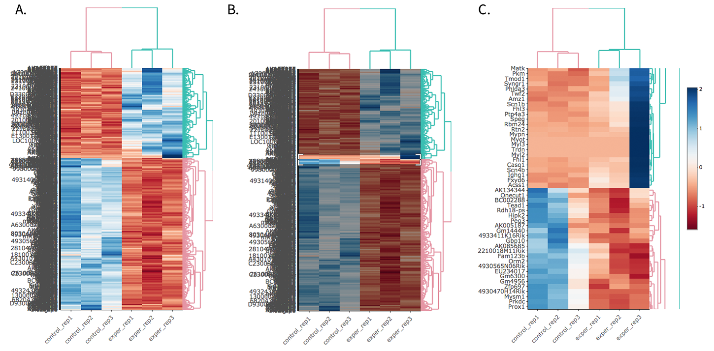

## Batch Effect Correction

- If you've loaded **Vernia et al. data**, you can skip this step.
- After you've finished your analysis with **Vernia et al. data**, you can load different dataset by clicking **'Load Demo (Donnard et al.)!'** to work on batch effect correction. To start from strach, simply refresh your page.

If specified metadata file containing your batch correction fields, then you have the option to conduct batch effect correction prior to your analysis. By adjusting parameters of **Options** box, you can investigate the character of your dataset. These parameters of the options box are explained as follows:

| Method                    | Explanation                                                                                                                                                                                                                                                                                                                                                                |
| ------------------------- | -------------------------------------------------------------------------------------------------------------------------------------------------------------------------------------------------------------------------------------------------------------------------------------------------------------------------------------------------------------------------- |
| **Normalization Method:** | DEBrowser allows performing normalization prior to the batch effect correction. You may choose your normalization method (among MRN (Median Ratio Normalization), TMM (Trimmed Mean of M-values), RLE (Relative Log Expression), and upper quartile), or skip this step by choosing **none** for this item. For our sample data, we are going to choose MRN normalization. |
| **Correction Method:**    | DEBrowser uses ComBat (part of the SVA Bioconductor package) or Harman to adjust for possible batch effects or conditional biases. For our sample data, Combat correction was selected.                                                                                                                                                                                    |
| **Treatment:**            | Please select the column that is specified in the metadata file for comparison, such as cancer vs control. It is named _treatment_ for our sample metadata.                                                                                                                                                                                                                |
| **Batch:**                | Please select the column name in the metadata file which differentiate the batches. For example in our metadata, it is called _batch_.                                                                                                                                                                                                                                     |

For more information, you can visit the following links for documentation:

- ComBat: <https://bioconductor.org/packages/release/bioc/vignettes/sva/inst/doc/sva.pdf>
- Harman: <https://www.bioconductor.org/packages/3.7/bioc/vignettes/Harman/inst/doc/IntroductionToHarman.html>

Upon clicking the submit button, comparison tables and plots will be created on the right part of the screen as shown below.

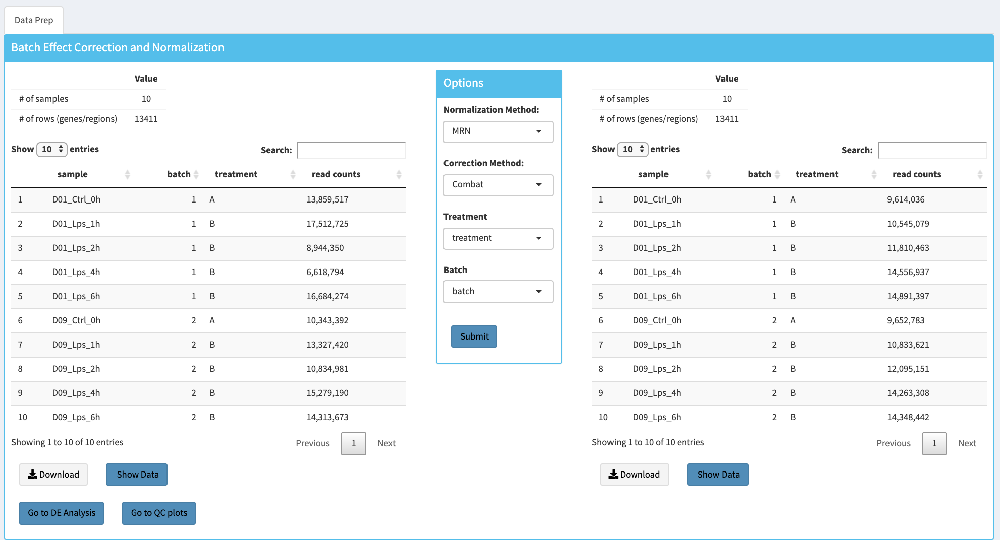

As you can see in this data (Donnard et. al, 2019), there is a clear batch effect. After correction, the same time points coming from different patients came closer.

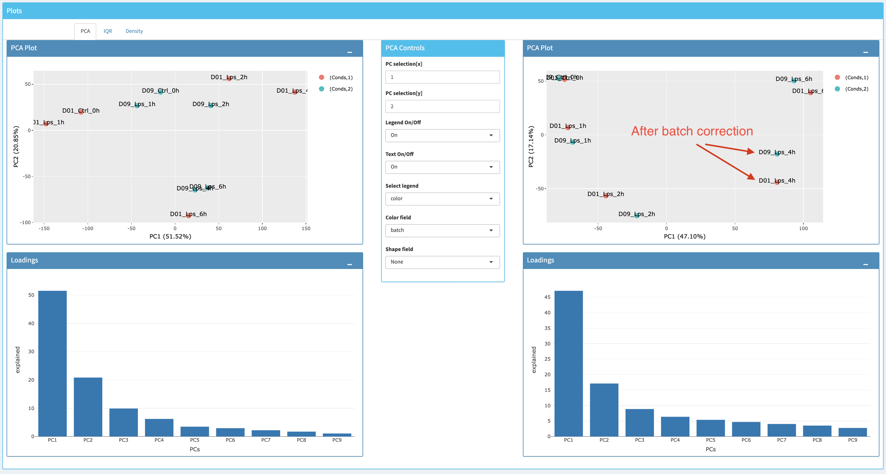

You can investigate the changes in the data by comparing the following features:

- Read counts for each sample.
- PCA, IQR, and Density plot of the dataset.
- Gene/region vs samples data

You can investigate the gene/region vs samples data in detail by clicking the **Show Data** button, or download all corrected data by clicking **Download** button.

Since we have completed **batch effect correction and normalization** step, we can continue with one of the following options: 'Go to DE Analysis'.

## DE Analysis

The first option, 'Go to DE Analysis', takes you to the next step where differential expression analyses are conducted.

**Sample Selection:** In order to run DE analysis, you first need to select the samples which will be compared. To do so, click on the "Add New Comparison" button, and choose **Select Meta** box as **treatment** to simplify fill `Condition 1` and `Condition 2` based on the **treatment** column of the metadata as shown below.


- **Removing Samples from a condition:** If you need to remove samples from a condition, simply select the sample you wish to remove and hit the delete/backspace key.
- **Adding Samples to a condition:** In case, you need to add a sample to a condition, you can click on one of the condition text boxes to bring up a list of samples. Then click on the sample you wish to add from the list and it will be added to the textbox.

**Note: You can add multiple conditions to compare by clicking on the "Add New Comparison" button, and view the results separately after DE analysis.**

**Method Selection:** Three DE methods are available for DEBrowser: DESeq2, EdgeR, and Limma. DESeq2 and EdgeR are designed to normalize count data from high-throughput sequencing assays such as RNA-Seq. On the other hand, Limma is a package to analyze normalized or transformed data from microarray or RNA-Seq assays. We have selected DESeq2 for our test sample and showed the related results below.

After clicking on the 'Submit!' button, DESeq2 will analyze your comparisons and store the results into separate data tables. It is important to note that **the resulting data produced by DESeq is normalized.** Upon finishing the DESeq analysis, a result table will appear which allows you to download the data by clicking the "Download" button. To visualize the data with interactive plots please click on the **"Go to Main Plots!"** button.

### The Main Plots of DE Analysis

Upon finishing the DESeq analysis, please click on **Go to Main Plots!** button which will open **Main Plots** tab where you will be able to view the interactive plots.

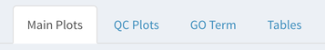

The page will load with **Scatter Plot**. You can switch to **Volcano Plot** and **MA Plot** by using the **Plot Type** section on the left side of the menu. Since these plots are interactive, you can click to **zoom** button on the top of the graph and select the area you would like to zoom in by drawing a rectangle. Please see the plots at below:

**A.** Scatter plot, **B.** Volcano plot, **C.** MA plot


You can easily track the plotting parameters by checking the **Plot Information** box as shown below. Selected DE parameters, chosen dataset, compared conditions, and normalization method are listed. Additionally, heatmap parameters (scaled, centered, log, pseudo-count) could be simply followed by this info box.

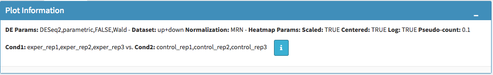

- Please keep in mind that to increase the performance of the generating graph, by default 10% of non-significant(NS) genes are used to generate plots. You might show all NS genes by please click **Main Options** button and change Background Data(%) to 100% on the left sidebar.

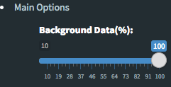

You can hover over the scatter plot points to display more information about the point selected. A few bar graphs will be generated for the user to view as soon as a scatterplot point has hovered over.

**A.** Hover on Fabp3 gene, **B.** Read Counts vs Samples, **C.** Read Counts vs Conditions


You also have a wide array of options when it comes to fold change cut-off levels, p-adjusted (padj) cut-off values, which comparison set to use, and dataset of genes to analyze.

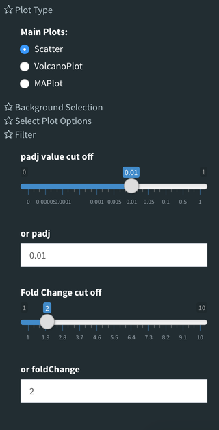

It is important to note that when conducting multiple comparisons, the comparisons are labeled based on the order that they are input. If you don't remember which samples are in your current comparison you can always view the samples in each condition at the top of the main plots.


After DE analysis, you can always download the results in CSV format by clicking the **Download Data** button located under the **Data Options**. You can also download the plot or graphs by clicking on the **download** button at top of each plot or graph.

### The Heatmap of DE Analysis

Once you've selected a specific region on Main Plots (Scatter, Volcano or MA plot), a new heatmap of the selected area will appear just next to your plot. If you want to hide some groups (such as Up, Down or NS based on DE analysis), just click on the group label on the top right part of the figure. In this way, you can select a specific part of the genes by **lasso select** or **box select** tools that includes only **Up** or **Down** Regulated genes. As soon as you completed your selection, heatmap will be created simultaneously. Please find details about heatmaps in [our documentation.](https://debrowser.readthedocs.io/en/master/heatmap/heatmap.html)

**A.** Box Selection, **B.** Lasso Selection, **C.** Created heatmap based on selection


We strongly recommend normalization before plotting heatmaps. To normalize, please change the parameters that are located under: **Data options -> Normalization Methods** and select the method from the dropdown box.

## Pathway Enrichment analysis

Please click the image below to access the video tutorial </br>

<div align="left">
  <a href="https://youtu.be/zIeYdJ06qG4"></a>
</div>

### GO Term Plots

The next tab, 'GO Term', takes you to the ontology comparison portion of DEBrowser. From here you can select the standard dataset options such as p-adjust value, fold change cut-off value, which comparison set to use, and which dataset to use on the left menu. In addition to these parameters, you also can choose from the 4 different ontology plot options: 'enrichGO', 'enrichKEGG', 'Disease', and 'compareCluster'. Selecting one of these plot options queries their specific databases with your current DESeq results.

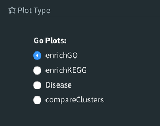

Your GO plots include:

- enrichGO - use enriched GO terms
- enrichKEGG - use enriched KEGG terms
- Disease - enriched for diseases
- compareClusters - comparison of your clustered data

The types of plots you will be able to generate include:

Summary plot:


GOdotplot:

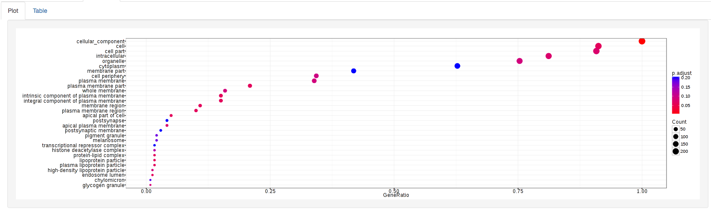

Changing the type of ontology to use will also produce custom parameters for that specific ontology at the bottom of the left options panel.

Once you have adjusted all of your parameters, you may hit the submit button in the top right and then wait for the results to show on screen.

### Data Tables

The last tab at the top of the screen displays various data tables. In order to change the displayed dataset, you can use **Data Options->Choose a Dataset** dropdown which has following options:

- All Detected
- Up Regulated
- Down Regulated
- Up+down Regulated
- Selected scatterplot points
- Most varied genes
- Comparison differences
- Selected genes
- Searched genes


All of the tables, except **the comparisons table**, contain the following information:

- ID - The specific gene ID
- Sample Names - The names of the samples given and they're corresponding TMM normalized counts
- Conditions - The log averaged values
- padj - p-adjusted value
- log2FoldChange - The Log2 fold change
- foldChange - The fold change
- log10padj - The log 10 padjusted value

**The comparisons table** generates values based on the number of comparisons you have conducted.
For each pairwise comparison, these values will be generated:

- Values for each sample used
- foldChange of comparison A vs B
- p-value of comparison A vs B
- p-adj value of comparison A vs B


You can further customize and filter each specific table in a multitude of ways. For unique table or dataset options, select the type of table dataset you would like to customize on the left panel under 'Choose a dataset' to view its additional options. All of the tables have a built-in search function at the top right of the table and you can further sort the table by column by clicking on the column header you wish to sort by.

The 'Search' box on the left panel allows for multiple searches via a comma-separated list. You can additionally use regex terms such as "^al" or "\*lm" for even more advanced searching. This search will be applied to wherever you are within DEBrowser, including both the plots and the tables. If you enter **more than three lines of genes**, the search tool will automatically match the beginning and end of the search phrases. Otherwise, it will find matched substrings in the gene list.

If you ever want to change your parameters or even add a new set of comparisons, you can always return to the _Data Prep_ tab to change and resubmit your data.

## Session7 Homework

Using Vernia et. al data;

Perform DE analysis for control and exper using all 3 replicates using DESeq2.

1. Please create a heatmap only the genes start with Fgf.
2. Please create a bar and box plots for Fgf21 gene.
3. Please create a PCA plot using the top 1000 genes where min counts over 1000 using unnormalized data.
4. Using the same data in #3, create an all2all plot.
5. Set padj val=0.0001 and fold change 2 and perform KEGG pathway analysis using mouse.
6. Perform DE analysis using DESeq2, EdgeR, and Limma with default options. Download gene lists for each comparison and create a Venn diagram using only up&down (padj<0.01 & logFoldChange>|1|) regulated gene lists in each comparison using an online tool like the page below.

   <http://bioinformatics.psb.ugent.be/webtools/Venn/>

7. Use DE genes from #5 and perform GO Term analysis using David.

   <https://david.ncifcrf.gov/>
