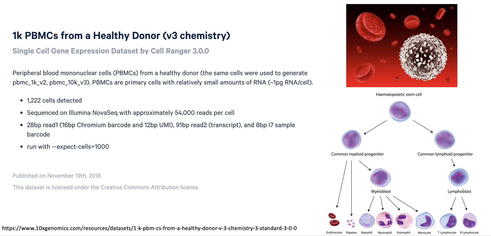
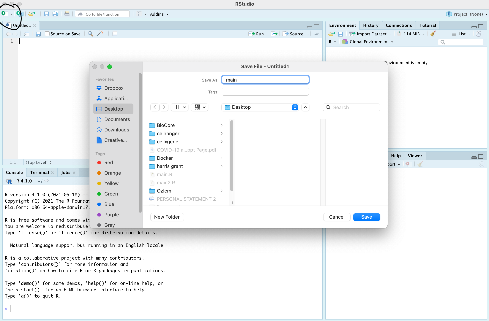
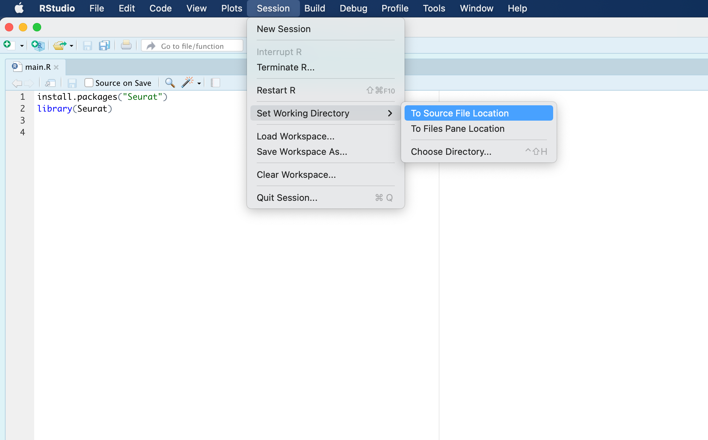
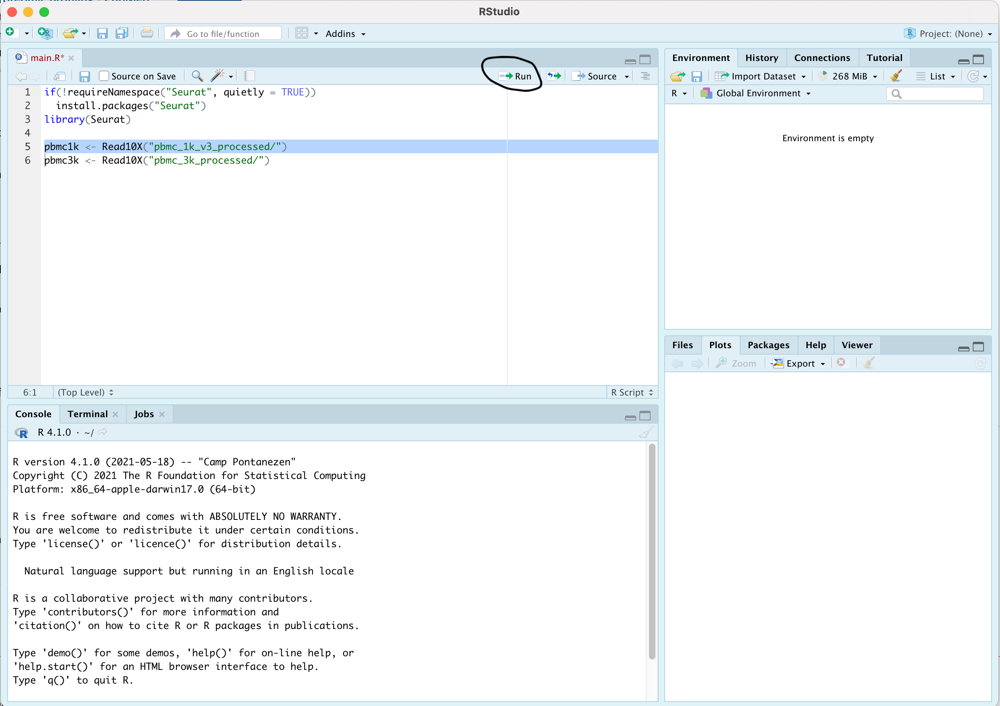

# Session 7 and 8: Single Cell RNA Analysis

# Expected learning outcome

To understand the basics of scRNA data analysis with R, how to use preprocessing tools to quantify scRNA sequencing reads, and to employ 
scRNA data analysis tools and packages to creating UMI distribution plots, filtering, normalization, clustering and annotation. 
This is a beginner level lecture in scRNA data analysis.

# Overview

|  | Day 1         | Day 2         |
| ------------- | ------------- | ------------- |
| 09:00-09:45   | Introducton to scRNA-Seq and scRNA Analysis with DolphinNext (part 1) | Dimensionality Reduction |
| 09:45-10:00   | Break | Break |
| 10:00-10:45   | scRNA Analysis with DolphinNext (part 2), scRNA Data Structures with R | Clustering |
| 10:45-11:00   | Break | Break |
| 11:00-11:45   | Quality Control, Filtering and Normalization | Marker Analysis and Cell Type Identification |

# Getting Started

The code below should be run in Rstudio, and will install the **Seurat** if the package is currently not in your local library. Instructions for downloading and setting up R and Rstudio was described in [Session 6](../session6/session6.md). 

```
if(!requireNamespace("Seurat", quietly = TRUE))
  install.packages("Seurat")
library(Seurat)
```

The "install.packages" command installs packages from Comprehensive R Archive Network (i.e. CRAN). It should install the **Seurat** package, necessary for conducting scRNA analysis routines and functions we will use. 

Seurat is an end-to-end Single cell RNA data analysis tool capable of filtering, normalizing, clustering and annotating single cells with thousands of features/genes. 

If you see the warning message below, enter y:

```
package which is only available in source form, and may need compilation of C/C++/Fortran: 'Seurat'
Do you want to attempt to install these from sources?
y/n:
```

When it is asked. "Do you want to install from sources the package which needs compilation? (Yes/no/cancel)". If so, just type "n" for no, and hit Enter to continue.

    Do you want to install from sources the package which needs compilation? (Yes/no/cancel) n

It can ask to update old packages; please answer with "a"

    Update all/some/none? [a/s/n]:

# Example Datasets and Sequencing Reads



Please create an scRNASeq folder for all files we will be using for Session 7 and 8. This should be the path `/project/your_groupname/your_username/bootcamp/scRNASeq`. 

Then you need to copy scRNA-Seq example files in `/project/umw_biocore/pub/scRNASeq` into your bootcamp directory under your home lab's project space: `/project/your_groupname/your_username/bootcamp/scRNASeq`.

Your lab's project space may not have a directory with your username in it, hence you can create one.

```
mkdir your_username
cp -r /project/umw_biocore/pub/scRNASeq /project/your_groupname/your_username/bootcamp/scRNASeq
```

After copying your files, go to `/project/your_groupname/your_username/bootcamp`. When you run tree command for scRNASeq, the output should look like below:

```
[am51w@ghpcc06 bootcamp]$ tree scRNASeq/
scRNASeq/
├── pbmc_1k_v3_fastqs
│   ├── pbmc_1k_v3_S1_R1_001.fastq.gz
│   └── pbmc_1k_v3_S1_R2_001.fastq.gz
├── pbmc_1k_v3_processed
│   ├── barcodes.tsv.gz
│   ├── features.tsv.gz
│   └── matrix.mtx.gz
└── pbmc_3k_processed
    ├── barcodes.tsv
    ├── genes.tsv
    └── matrix.mtx
```

# Transfering Files from Cluster to Local Computers 

We often require to analyze processed files that are low in size within our local computers (for obvious reasons). Therefore, we can now use **Filezilla** to copy our files to our own computers\. 

Transfer the following directories: **pbmc_1k_v3_processed** and **pbmc_3k_processed** to your Desktop, these directories are of the course materials that includes the scRNA datasets we gonna use. 

Please install FileZilla to your computer from the link below;

https://filezilla-project.org/download.php

Please check the link below to learn how to use FileZilla client.

https://wiki.filezilla-project.org/FileZilla_Client_Tutorial_(en)

The information you need is below;

```
Hostname: ghpcc06.umassrc.org
Username: Your_cluster_user
Password: Your_cluster_password
Port: 22
```

After using FileZilla, you should be able to access these directories from Desktop and import scRNA datasets. 

Now, you have to open Rstudio, and click **New File** button on the top left corner of RStudio window, then click **R script** to open a new .R file. Save the file with name **main.R** in your Desktop, and test if you can run the **Read10X** function as shown below. 

To run a script, choose the line or lines of scripts, then either click **Run** on top, or press CTRL+Enter (for Mac, command+Enter)






