# Session 8: Single Cell RNA Analysis, Day 1

# Expected learning outcome

To understand the basics of scRNA data analysis with R, how to use preprocessing tools to quantify scRNA sequencing reads, and to employ 
scRNA data analysis tools and packages to creating UMI distribution plots, filtering, normalization, clustering and annotation. 
This is a beginner level lecture in scRNA data analysis.

# Overview

- [Session 8: Single Cell RNA Analysis Day 1](#session-8-single-cell-rna-analysis-day-1)
- [Expected learning outcome](#expected-learning-outcome)
- [Overview](#overview)
- [Getting Started](#getting-started)
- [Introduction to scRNA-Seq Analysis](#introduction-to-scrna-seq-analysis)
- [scRNA-Seq Processing with DolphinNext](#scrna-seq-processing-with-dolphinnext)
- [Session 8 Homework 1](#session-8-homework-1)
- [scRNA Data Analysis and Data Structures](#scrna-data-analysis-and-data-structures)
- [Quality Control, Filtering and Normalization](#quality-control-filtering-and-normalization)
- [Session 8 Homework 2](#session-8-homework-2)

# Getting Started

Please install R 4.1.2 into your local computer. 

1. First please install R to your computer

   <https://cran.r-project.org/>

   For windows;
   <https://cran.r-project.org/bin/windows/base/R-4.1.2-win.exe>

   For mac;
   <https://cran.r-project.org/bin/macosx/base/R-4.1.2.pkg></br>

2. Second, please install R-Studio;

   <https://rstudio.com/products/rstudio/download/>
   
3. We will now install required R packages for conducting today's scRNA analysis practices before covering the basics of scRNA-Seq. Run the commands below. 


The "install.packages" command installs packages from Comprehensive R Archive Network (i.e. CRAN). It should install the 'Seurat' package, necessary for conducting scRNA analysis functions we will use in this lecture. 

Seurat is an end-to-end Single cell RNA data analysis tool capable of filtering, normalizing, clustering and annotating single cells with thousands of features/genes. 

The code below will install **Seurat** if the package is currently missing from your local library. 

```
if(!requireNamespace("Seurat", quietly = TRUE))
  install.packages("Seurat")
library(Seurat)
```

If you see the warning message below, enter y:

```
package which is only available in source form, and may need compilation of C/C++/Fortran: 'Seurat'
Do you want to attempt to install these from sources?
y/n:
```
    
# Introduction to scRNA-Seq Analysis

|  | Day 1         | Day 2         |
| ------------- | ------------- | ------------- |
| 09:00-09:45   | Introducton to scRNA-Seq and scRNA Analysis with DolphinNext (part 1) | Dimensionality Reduction |
| 09:45-10:00   | Break | Break |
| 10:00-10:45   | scRNA Analysis with DolphinNext (part 2), scRNA Data Structures with R | Clustering |
| 10:45-11:00   | Break | Break |
| 11:00-11:45   | Quality Control, Filtering and Normalization | Marker Analysis and Cell Type Identification |

Until now, we have covered the basics of R programming, drawing graphics and figures, and introductory RNA-Seq data analysis.
Today, we will cover 
- Single cell RNA sequencing (scRNA-Seq) with droplet-based methods
- Processing of scRNA-Seq reads with DolphinNext
- R programming and R packages for the essential scRNA-Seq data analysis

In previous sessions, we have worked on (Bulk) RNA-Seq data collected from a number of biological replicates to investigate the effects and differentially expressed genes upon knockout experiments. 

Here, transcript fragments from biological specimens are in fact originate from cells of the targeted tissue or biological sample, and we dont really know which type of cell those transcripts are coming from.  

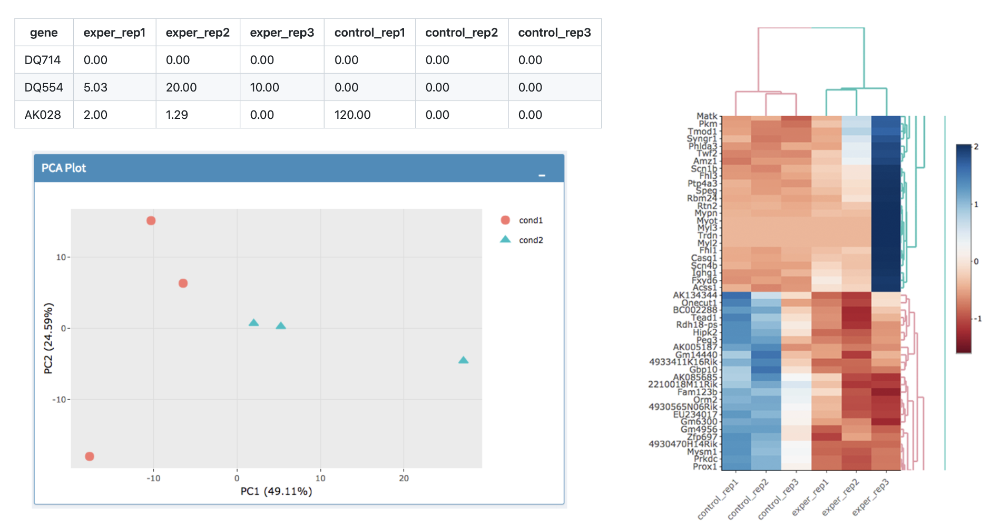

However, lets take a look at a recent research we have conducted with our collaborators in Department of Dermatology on a skin disorder called Vitiligo in which CD8 T-cells in one's body is programmed to kill melanocytes of epidermis, causing the depigmentation of the skin. 

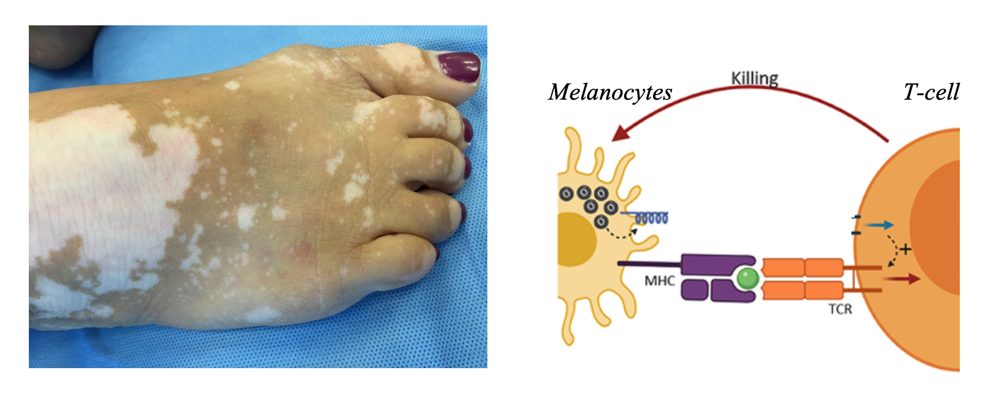

Basically, CD8 T-cells come into the skin and recognize interferon gamma, then this induces Keratinocytes of the skin to make CXCL10 which eventually leads more CD8 T-cells from the blood to come to the skin ([Rashighi et. al 2014](https://www.ncbi.nlm.nih.gov/pmc/articles/PMC4086941/)). On the other hand, a proportion of these CD8 t-cells become what is known to be Resident memory t-cells (Trm) and stay in the disease site which leads them to strike melanocytes again through Keratinocyte induction ([Richmond et. al 2018](https://pubmed.ncbi.nlm.nih.gov/30021889/)). 

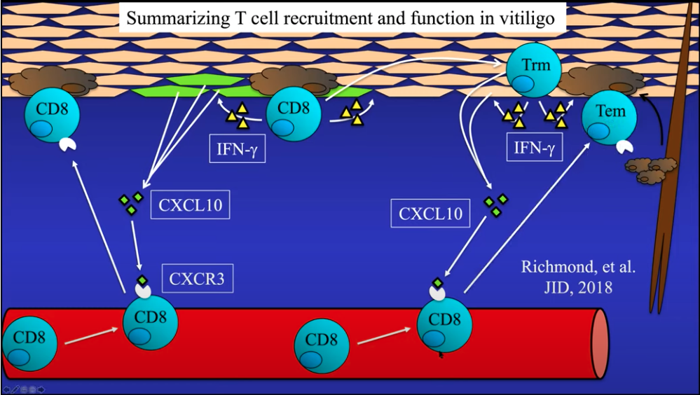

Hence, the objective should be to learn gene expression profiles of distinct cellular populations to learn more about cell specific mechanisms and discover new biology through a rather focused approach. 

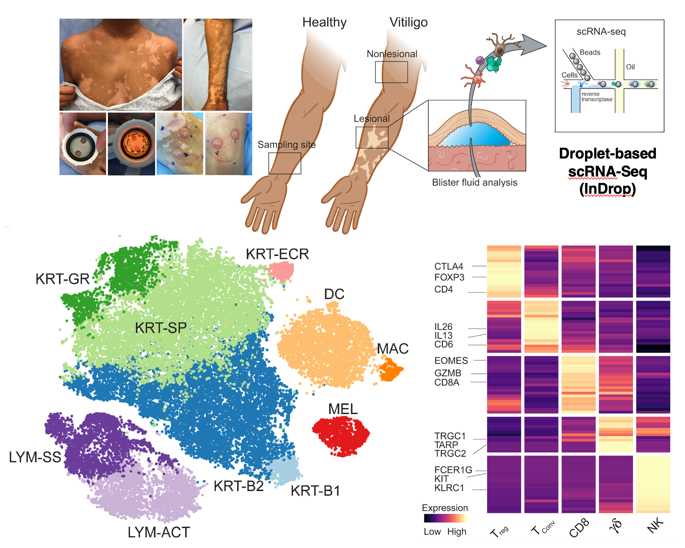

Why Single Cell ?

What we really want to achieve with single cell RNA-Seq is to attain expression profile of each cell from a solid tissue or a targeted organism, instead of the aggregate count of genes from all the cells. 

Essentially, both bulk and single cell RNA-Seq aim to isolate RNA from a solid diverse tissue, but what is different in scRNA-Seq is that we dissociate solid tissue into single cell suspension to isolate each single cell and to capture transctipts associated to each of those cells (or barcodes). This process of isolation/dissocation process depends on the technique of tagging or indexing transcripts with respect to cells which we cover later. 

Therefore, in bulk RNA-Seq you get a single vector of counts whose elements are associated with an aggregated number of RNA of a gene/isoform, whereas in scRNA-Seq you end up with thousands of vectors each associated with a cell, and each expression profile captures the gene expression of each individual cell.  

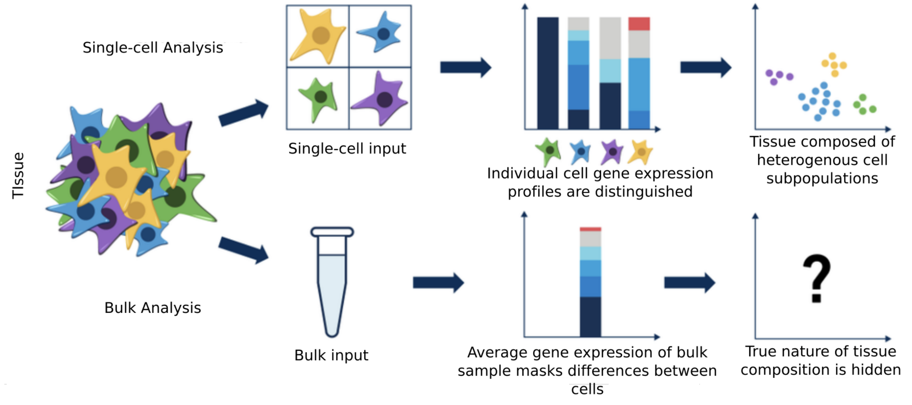

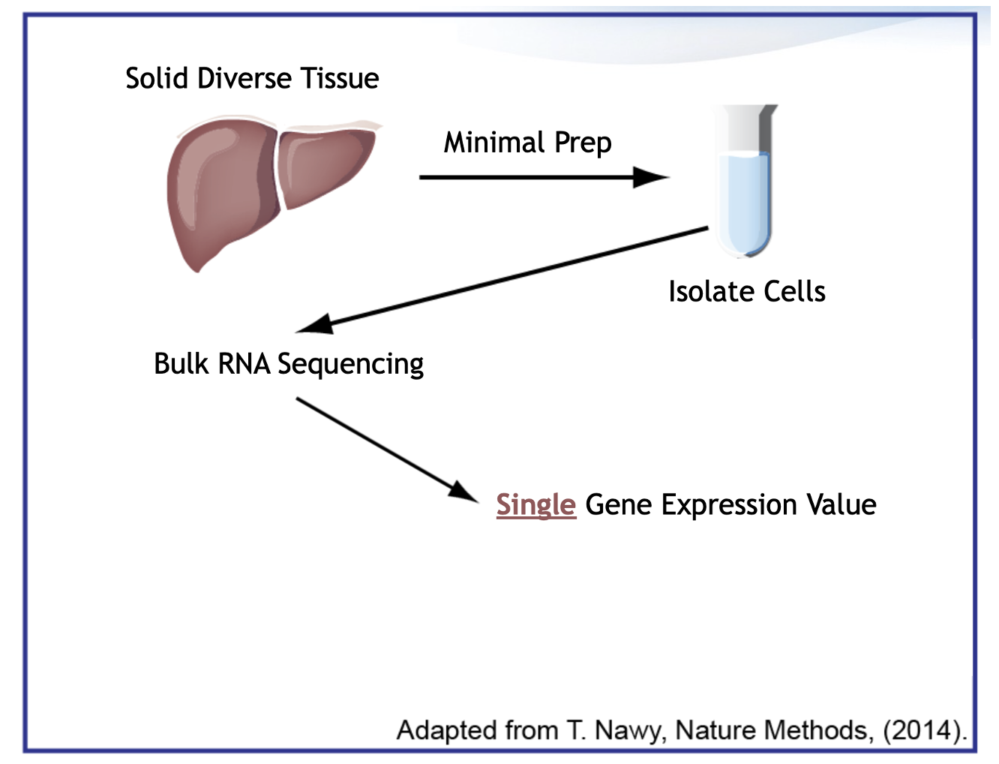

We should know that scRNA Analysis may not be necessary for all problems. It is well suited when populations are heterogeneous, and it is a powerful tool for studying intra and inter cell type variations in gene expression.

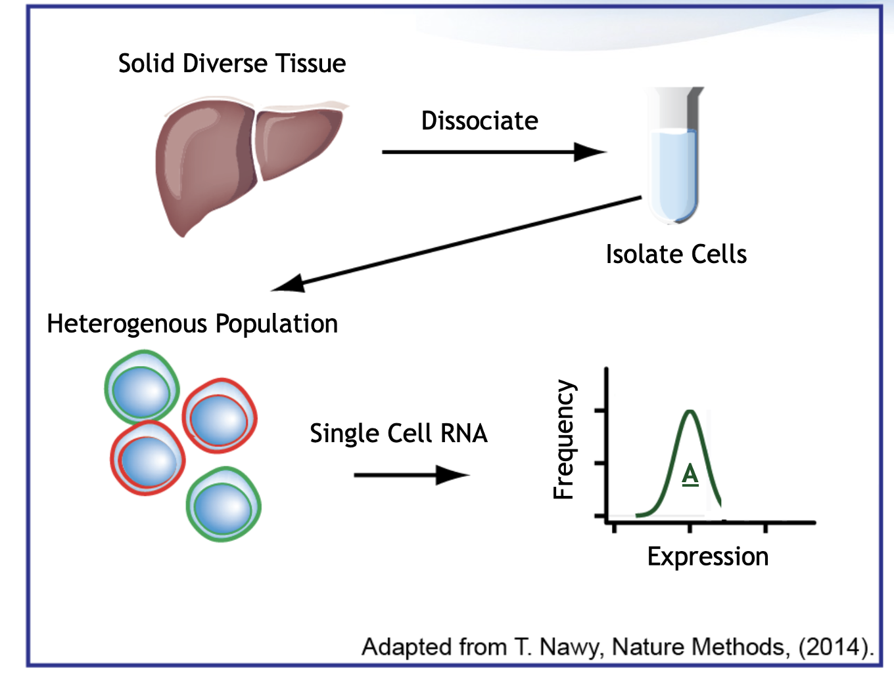

In fact, single cell RNA-Seq analysis is a long process of isolating cells, capturing cell specific transcripts and quantitatively analyze captured expression profiles of cells to investigate cellular mechanisms of the targeted biological problem at hand. 

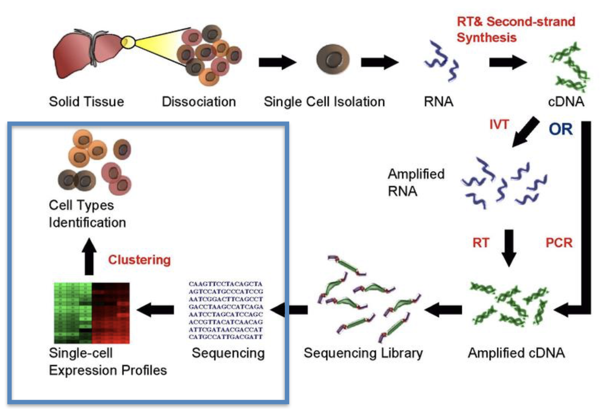

Although we are now discussing this entire workflow, we will primarily focus on analysis starting from pre-processing of sequenced single cell based RNA, how to import and analyze the expression profiles of cells in order to identify each existing cell type in the tissue. 

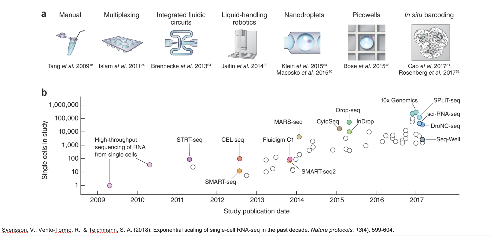

The workflow of the data analysis of scRNA analysis is highly dependant on the technology to isolate, separate and collect single cell transcripts, therefore we start by looking into the timeline of scRNA analysis, and take a look at the first ever scrna analysis to the modern ones that we use now. 

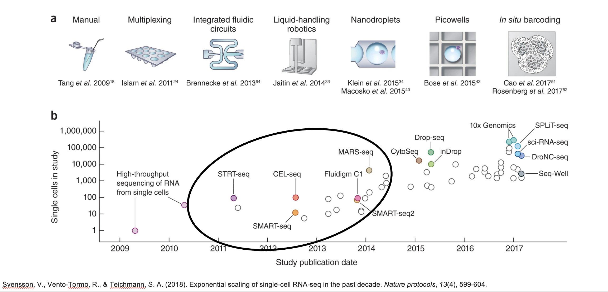

Starting from 2009, single cells were analyzed by what we call plate-based methods that analyze individual cells by separating them into distinct wells of a plate and prepare libraries for each of them. However, this requires a lot of effort and time since we prepare lots of libraries for each separate single cells of a tube of a plate. 

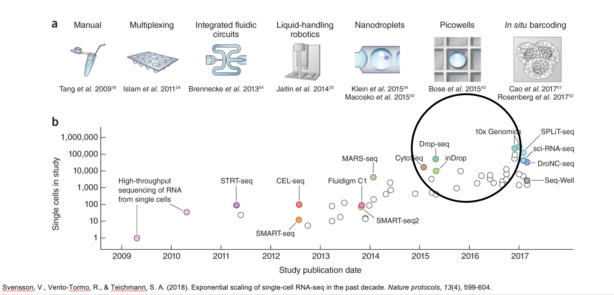

Around 2015, a group of methods have been devised to parallelize this grueling process by tagging cells and transcripts by revolutionary microfluidic technologies.  

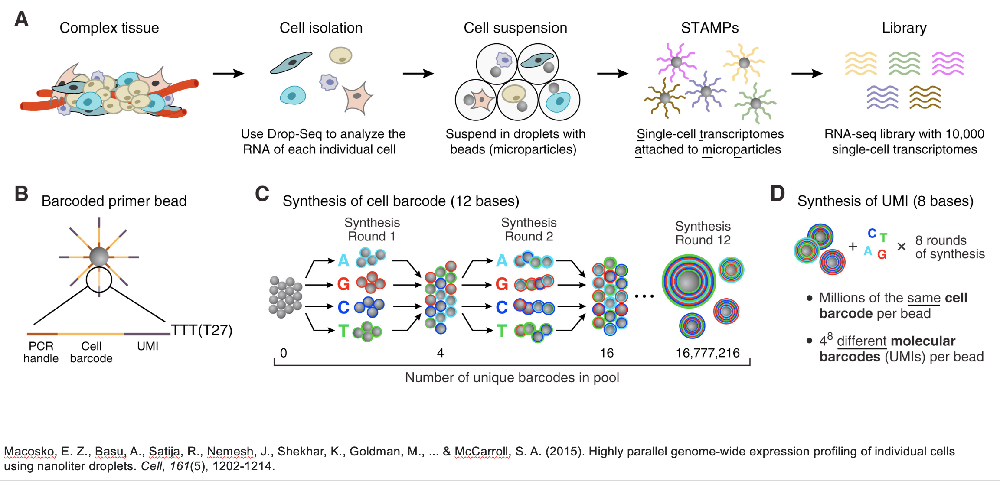

Drop-Seq method, came out in 2015, uses a microfluidic technology to separate and capture cells into droplets of oil where the cell is co-captured with a unique beads. Each of these beads are covered with bead specific nucleotide sequences that engineered to tag RNA from a cell with a unique barcode. 

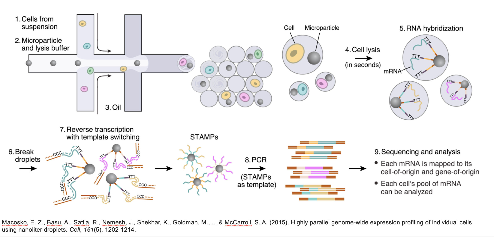

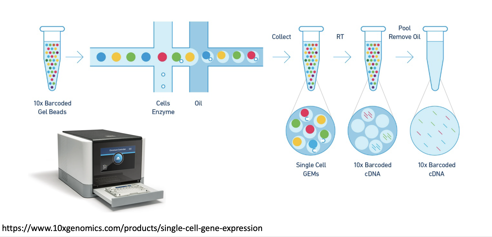


The problem with Drop-Seq was that most droplets were empty and usually had either a bead or a single cell in it, and increasing the concentration of beads and cells would increase doublets (two or more beads of cells in a droplet) which severely damages the accuracy of the analysis. One or two years later, 10X Genomics came up with an optimized microfluidic workflow to make at least %90 of droplets containing a bead which considerably increased cell or bead occupancy. 

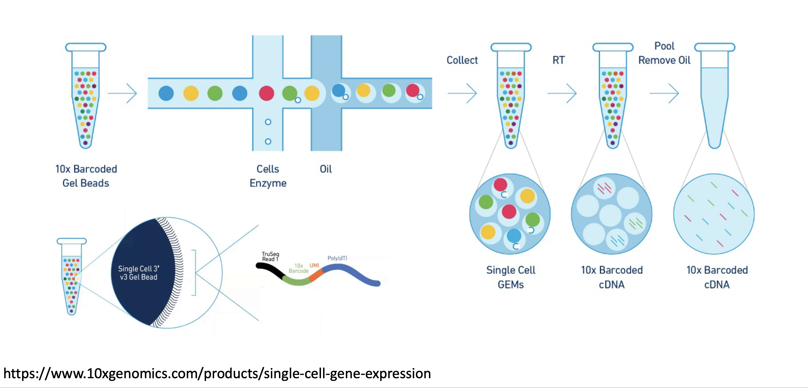

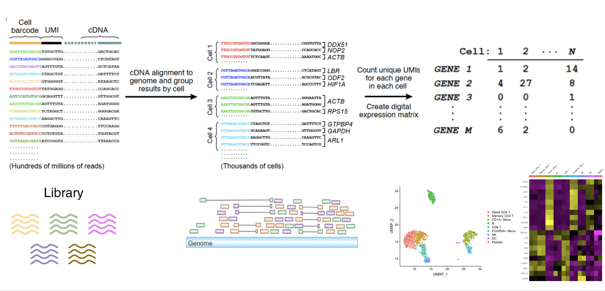

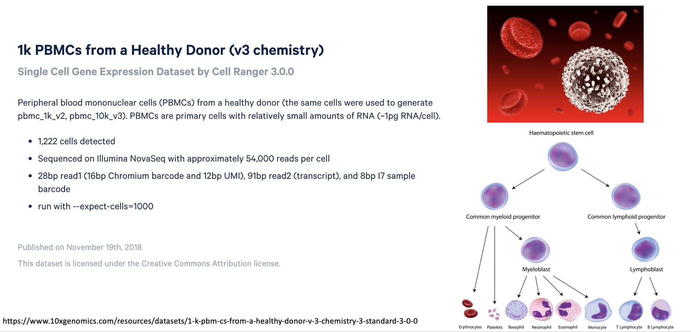

Throughout session 8 and 9, we will be using an example sample of peripheral blood mononuclear cells with a mix of T-cells, NK-cells as well as monocytes and platelets. This sample has around 1200 cells that we will process, filter and analyze. 

Please create scRNA-Seq folder under bootcamp. Then you need to copy scRNA-Seq example files in `/project/umw_biocore/pub/scRNASeq` into your bootcamp directory under your project folder: `/project/your_groupname/your_username/bootcamp/scRNASeq`. This may take a while since the folder is around 5GBs. 

When you run tree function the output should look like below. We will investigate each of these files later. 

```
[am51w@ghpcc06 bootcamp]$ tree scRNASeq/
scRNASeq/
├── pbmc_1k_v3_fastqs
│   ├── pbmc_1k_v3_S1_R1_001.fastq.gz
│   └── pbmc_1k_v3_S1_R2_001.fastq.gz
├── pbmc_1k_v3_processed
│   ├── barcodes.tsv.gz
│   ├── features.tsv.gz
│   └── matrix.mtx.gz
└── pbmc_3k_processed
    ├── barcodes.tsv
    ├── genes.tsv
    └── matrix.mtx
```

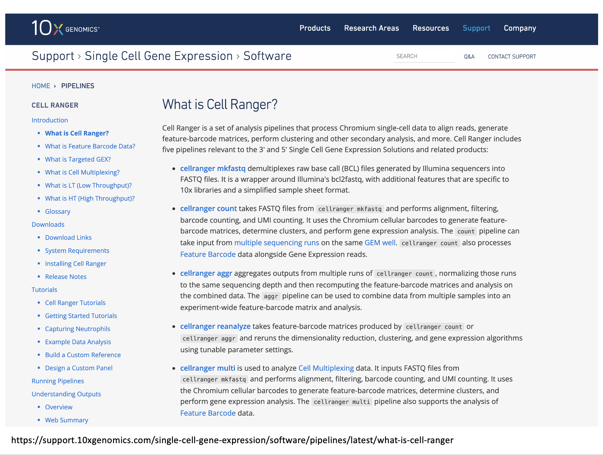

10X Genomics provides a group of tools and command with the **Cell Ranger** software tool to preprocess sequencing reads from single cell assays for downstream analysis. 

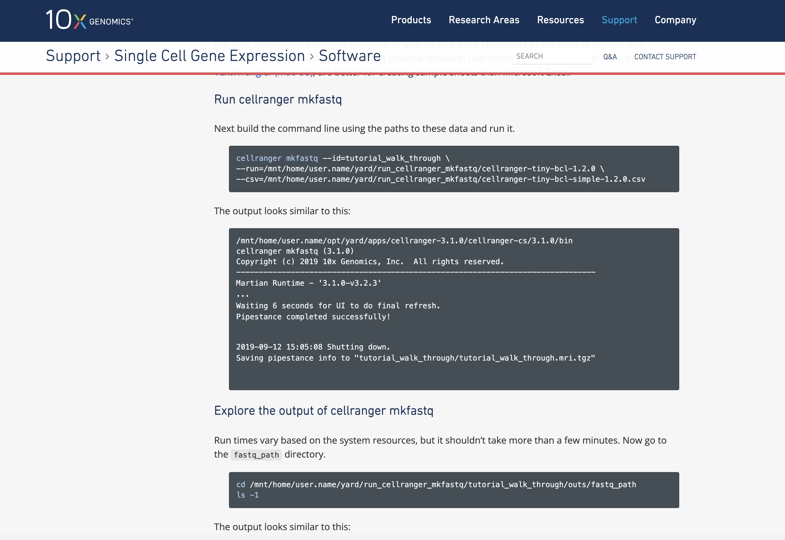

Ofcourse we first need to the incorporate cellranger mkfastq command to turn bcl files into fastq files. We wont cover cellranger mkfastq command and directly start with fastq files. 

The resulting files would be an R1 and R2 file for each sample. These reads can be found in `/project/umw_garberlab/amanukyan/bootcamp/scRNASeq/pbmc_1k_v3_fastqs`.  

```
[am51w@ghpcc06 scRNASeq]$ cd pbmc_1k_v3_fastqs
[am51w@ghpcc06 pbmc_1k_v3_fastqs]$ ls
pbmc_1k_v3_S1_R1_001.fastq.gz  pbmc_1k_v3_S1_R2_001.fastq.gz
```

Here, each sample is comprised of an R1 and R2 file where R1 holds the Cell barcode and UMI of each fragment captured in R2 which stores the actual reads from transcripts. The PBMC data is built using 10x version 3 chemistry, so each read in R1 file is of length 28-bp (16-bp barcode, and 12-bp UMI), and each read in R2 file is of length 91 comprised of the nucleotide sequence of the transcript. 

**Note:** unzipping fastq files may take a few mins. 

```
[am51w@ghpcc06 pbmc_1k_v3_fastqs]$ zcat pbmc_1k_v3_S1_R1_001.fastq.gz > pbmc_1k_v3_S1_R1_001.fastq
[am51w@ghpcc06 pbmc_1k_v3_fastqs]$ zcat pbmc_1k_v3_S1_R2_001.fastq.gz > pbmc_1k_v3_S1_R2_001.fastq
[am51w@ghpcc06 pbmc_1k_v3_fastqs]$ head -4 pbmc_1k_v3_S1_R1_001.fastq 
@A00228:279:HFWFVDMXX:1:1101:8486:1000 1:N:0:NCATTACT
NGTGATTAGCTGTACTCGTATGTAAGGT
+
#FFFFFFFFFFFFFFFFFFFFFFFFFFF
[am51w@ghpcc06 pbmc_1k_v3_fastqs]$ head -4 pbmc_1k_v3_S1_R2_001.fastq 
@A00228:279:HFWFVDMXX:1:1101:8486:1000 2:N:0:NCATTACT
NACAAAGTCCCCCCCATAATACAGGGGGAGCCACTTGGGCAGGAGGCAGGGAGGGGTCCATTCCCCCTGGTGGGGCTGGTGGGGAGCTGTA
+
#FFFFFFFFFFFFFFF:FFFFFFF:FFFFFFFFFFFFFFFFFFFFFFFFFF:FFFFFFFFFFFFFFFF:FFFFFFFFFFFFFFFFFFFFFF
```

The R1 and R2 files can be used in the "cellranger count" function now to establish the UMI tables. 


# scRNA-Seq Processing with DolphinNext

Instead of running a cellranger command and pull outputs of the command, we can use the cellranger pipeline within DolphinNext and immediately investigate results of the pipeline in an interactive interface. 

You can use dolphinnext from https://dolphinnext.umassmed.edu/, and then find the **Cell Ranger** Pipeline under **Single Cell** group. The pipeline can also be found in https://dolphinnext.umassmed.edu/index.php?np=1&id=831. 

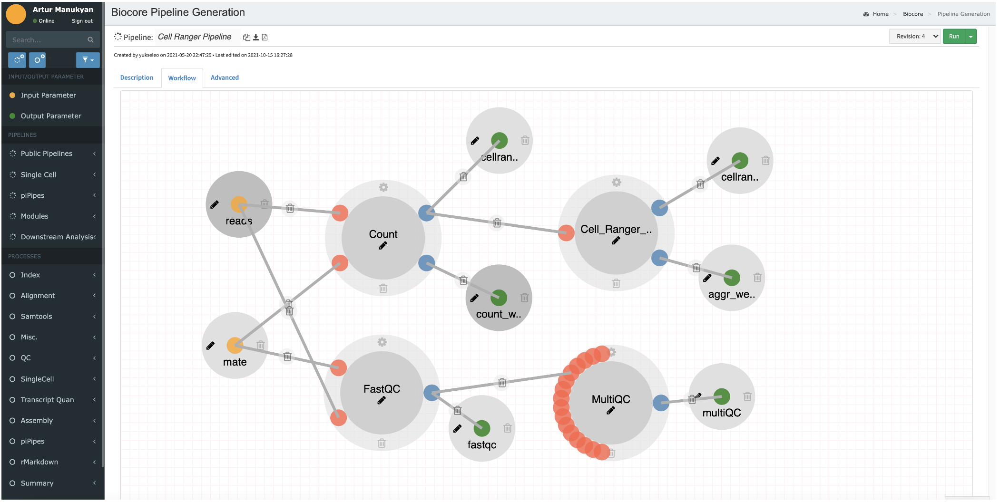

We will run and preprocess our PBMC example with the cellranger pipeline of Dnext by setting up the working directory, run environment, and input parameters. 

Click **Run**, and Create a Project named **scRNASeq bootcamp**, then enter a run name **PBMC cellranger**. 

**A. Work Directory:** Please enter `/project/your_groupname/your_username/bootcamp/scRNASeq/pbmc_cellranger` as work directory.

**B. Run Environment:** Please choose `Run Environment for ghpcc06.umassrc.org`

**C. Inputs:**

- **reads:** Choose paired reads found in `/project/your_groupname/your_username/bootcamp/scRNASeq/pbmc_1k_v3_fastqs` directory. For adding paired reads please check this video: [Adding reads](https://www.youtube.com/embed/3QaAqdyB11w)
- **mate:** pair
- **genome_build:** human_hg38_gencode_v32_cellranger_v6
- **run_Cell_Ranger_Count:** yes
- **run_Cell_Ranger_Count Module Countdata DE settings:** Edit as follows:
  - expected_cells: 1000
- **run_FastQC:** no
- **run_Aggregate_Libraries	:** no

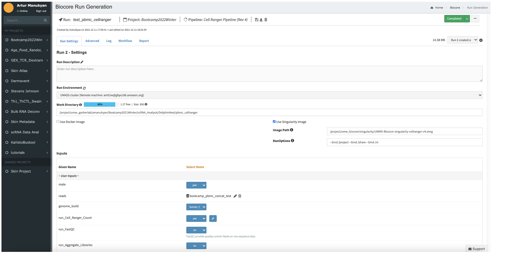

The cellranger pipeline run will take around 3 hours. We will not going to wait for it to finish but you can observe the reports after we are done! 

Cellranger pipeline will incorporate a preliminary analysis and report statistics such as (i) Number of Barcodes etc. 

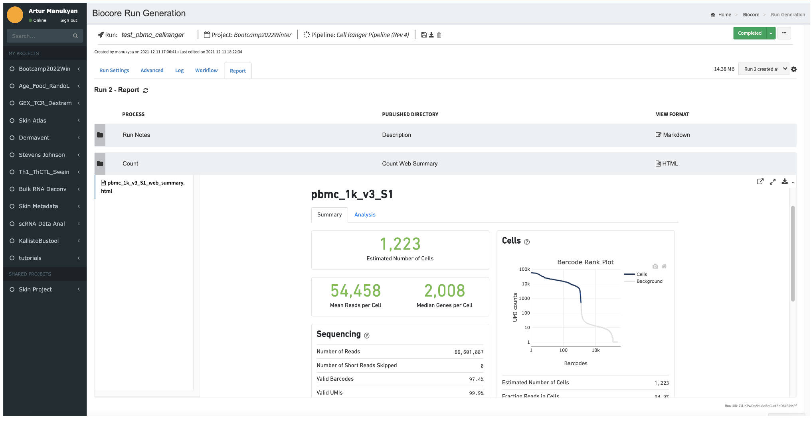

DolphinNext Cellranger pipeline (and **cellranger count** command) produces an output directory, **pbmc_1k_v3_S1_outs**, that includes all reports and
results of the cellranger pipeline. 

```
[am51w@ghpcc06 cellranger_count]$ ls
pbmc_1k_v3_S1_outs
[am51w@ghpcc06 cellranger_count]$ cd pbmc_1k_v3_S1_outs/
[am51w@ghpcc06 pbmc_1k_v3_S1_outs]$ ls
analysis                       metrics_summary.csv             possorted_genome_bam.bam.bai
cloupe.cloupe                  molecule_info.h5                raw_feature_bc_matrix
filtered_feature_bc_matrix     pbmc_1k_v3_S1_web_summary.html  raw_feature_bc_matrix.h5
filtered_feature_bc_matrix.h5  possorted_genome_bam.bam        web_summary.html
```

Here, both filtered and raw feature-barcode matrices are given as a results. On the contrary to Bulk RNA-Seq data sets and count tables, single cell UMI tables are quite large and sparse (lots of features or genes have 0 count). Hence, file storing minimal amount of information (i.e.) non-zero counts are often used to distribute or share UMI tables (i.e. Feature-Barcode matrices). 

One of these formats is the [Matrix Market Exchange Format](https://math.nist.gov/MatrixMarket/formats.html) which is used by cellranger to produce resulting UMI tables.

Cellranger provides two tsv and one mtx files that establishes the Feature-Barcode matrices. These files can also be found in `/project/umw_garberlab/amanukyan/bootcamp/scRNASeq/pbmc_1k_v3_processed`.

```
[am51w@ghpcc06 pbmc_1k_v3_S1_outs]$ cd filtered_feature_bc_matrix
[am51w@ghpcc06 filtered_feature_bc_matrix]$ ls
barcodes.tsv.gz  features.tsv.gz  matrix.mtx.gz
```

As you may guess **barcodes.tsv.gz** and **features.tsv.gz** are tables that lists the existing barcodes (or potential cells) and features (or genes) in the feature barcode matrix. 

```
[am51w@ghpcc06 filtered_feature_bc_matrix]$ zcat barcodes.tsv.gz > barcodes.tsv  
[am51w@ghpcc06 filtered_feature_bc_matrix]$ head barcodes.tsv 
AAACCCAAGGAGAGTA-1
AAACGCTTCAGCCCAG-1
AAAGAACAGACGACTG-1
AAAGAACCAATGGCAG-1
AAAGAACGTCTGCAAT-1
AAAGGATAGTAGACAT-1
AAAGGATCACCGGCTA-1
AAAGGATTCAGCTTGA-1
AAAGGATTCCGTTTCG-1
AAAGGGCTCATGCCCT-1
[am51w@ghpcc06 filtered_feature_bc_matrix]$ zcat features.tsv.gz > features.tsv 
[am51w@ghpcc06 filtered_feature_bc_matrix]$ head features.tsv 
ENSG00000243485	MIR1302-2HG	Gene Expression
ENSG00000237613	FAM138A	Gene Expression
ENSG00000186092	OR4F5	Gene Expression
ENSG00000238009	AL627309.1	Gene Expression
ENSG00000239945	AL627309.3	Gene Expression
ENSG00000239906	AL627309.2	Gene Expression
ENSG00000241860	AL627309.5	Gene Expression
ENSG00000241599	AL627309.4	Gene Expression
ENSG00000286448	AP006222.2	Gene Expression
ENSG00000236601	AL732372.1	Gene Expression
```

Here **barcodes.tsv.gz** and **features.tsv.gz** serve as an index for the location of non-zero counts of UMI table stored in **matrix.mtx.gz**. 
There are three columns in the mtx file, the first two rows give information on the file format and the software version. 

Starting from the third row, we have the number of genes (36601), number of barcodes (1223) and the sum of all UMIs (2612776) in the sample. 

The remaining rows (starting from 17 1 1) we have the locations of UMI counts associated to a particular gene and a barcode. For example, "17 1 1" 
indicates that the 17th gene and the first (1st) barcode has a UMI count of 1, and so forth. 

Thus, all other counts are realized as zero, and omitted in the mtx file. This UMI table storing format considerably decreases the amount of information stored at a time. 

```
[am51w@ghpcc06 filtered_feature_bc_matrix]$ zcat matrix.mtx.gz > matrix.mtx
[am51w@ghpcc06 filtered_feature_bc_matrix]$ head matrix.mtx 
%%MatrixMarket matrix coordinate integer general
%metadata_json: {"software_version": "cellranger-6.0.1", "format_version": 2}
36601 1223 2612776
17 1 1
52 1 1
58 1 1
60 1 1
61 1 1
63 1 2
76 1 1
```

Within DolphinNext, it is possible to implement numeruous pipelines with various properties, including alignment and quantification methods with increased speed. **kallisto | bustools** is a recently developed workflow for pre-processing single-cell RNA-seq data. It is based on a pseudoaligner **kallisto**, and a tool for processing aligned barcodes, UMIs and associated reads **BUStools**. You can check out **kallisto** [here](https://pachterlab.github.io/kallisto/), **BUStools** [here](https://bustools.github.io/), and specifically you can check **kallisto | bustools** [here](https://www.kallistobus.tools/) in this link.

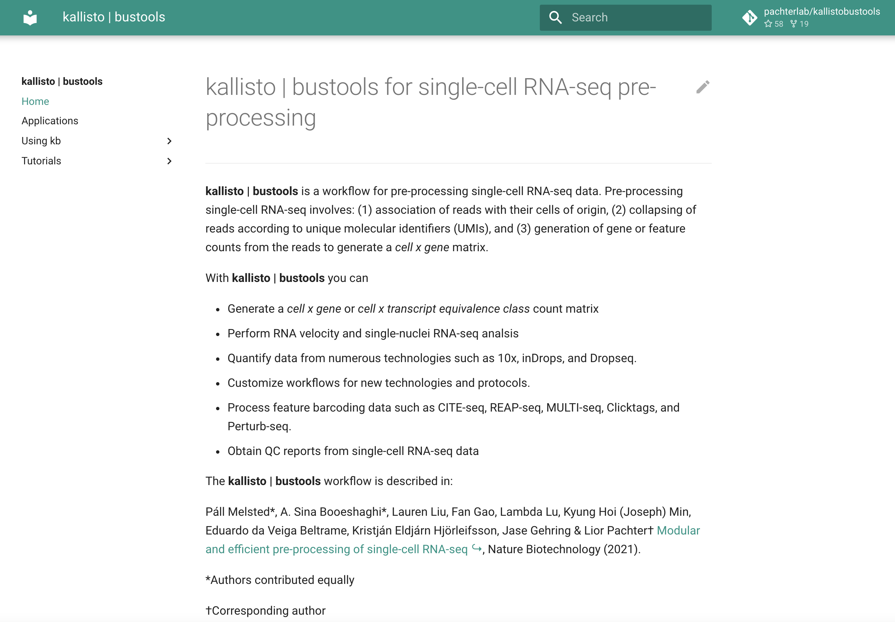

You can use the kallisto|bustools pipeline capable of executing this workflow in DolphinNext which considerably increases the speed of alignment/quantification. This pipeline finishes around 23 minutes.  

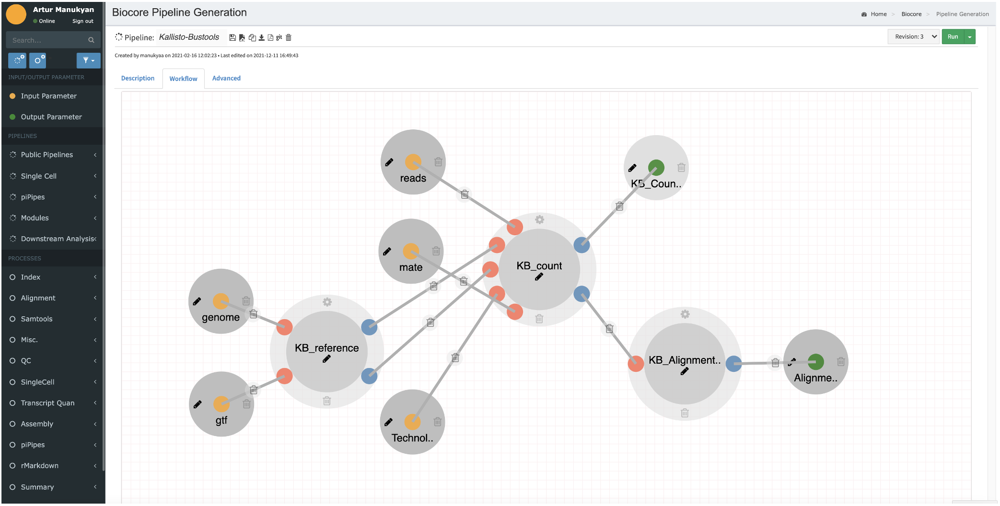

# Session 8 Homework 1

Run KallistoBUStools pipeline with PBMC paired reads. 

Here are settings of the pipeline:

**A. Work Directory:** Please enter `/project/your_groupname/your_username/bootcamp/pbmc_kallisto` as work directory.

**B. Run Environment:** Please choose `Run Environment for ghpcc06.umassrc.org`

**C. Inputs:**

- **reads:** Choose paired reads found in `/project/your_groupname/your_username/bootcamp/scRNASeq/pbmc_1k_v3_fastqs` directory. For adding paired reads please check this video: [Adding reads](https://www.youtube.com/embed/3QaAqdyB11w)
- **mate:** pair
- **genome_build:** human_hg38_gencode_v34
- **Technology:** 10XV3
- **run_Kallisto_Bustools:** yes
- **run_build_KB_reference:** no

# scRNA Data Analysis and Data Structures

Once we have preprocessed transcripts or reads captured from each single cell is aggregated within UMI tables, we can move on to data analysis for filtering, normalizing, and capturing cell types within the sample. 

Lets first take a look at a simple UMI table. 

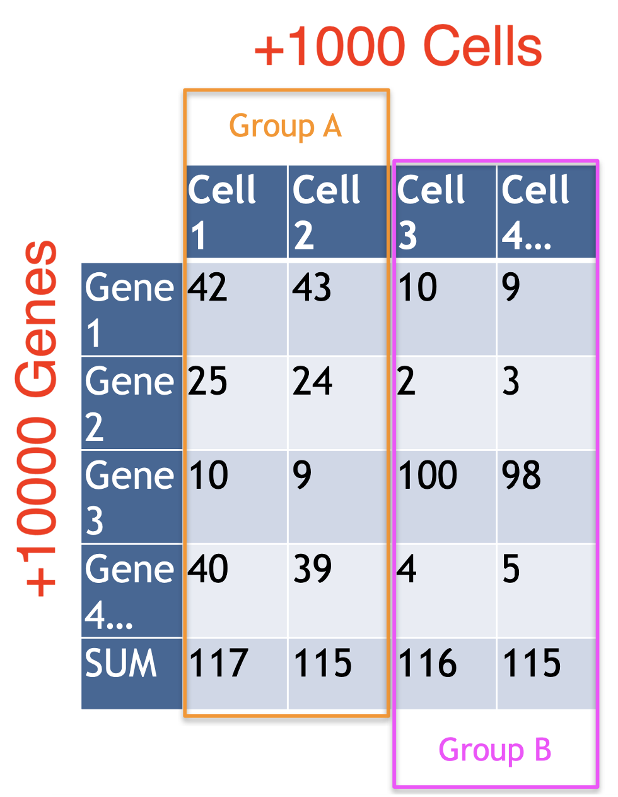

What we prioritize in scRNA analysis is to conduct **clustering**, a machine learning method to discover closely related data points within a dataset. We will cover what clustering is a little more in the next session. However, lets closely investigate why we need clustering by going back to Droplet-based sequencing methods. 


Droplet-based methods like 10x Genomics (and most scRNA-Seq methods in general) randomly tag transcripts from single cells with barcodes, hence we know what number of uniquely aligned molecules captured for each single cell but we dont really know the types of such cells (such as T-cells, NK cells etc.). We use clustering algorithms to capture cells with similar expression profiles as this suggest that similarly expressed cells are most likely members of the same cell type. 


In order to divide cells into meaningful groups, we have to sequentially conduct several steps that are widely accepted as mandatory within the field of scRNA data analysis. Most scRNA analysis tools (such as [Seurat](https://satijalab.org/seurat/articles/get_started.html)) incorporate these steps and provide easy-to-use R functions to execute em. 


We will use Seurat, an end-to-end scRNA analysis tool for clustering and annotating single cells. 

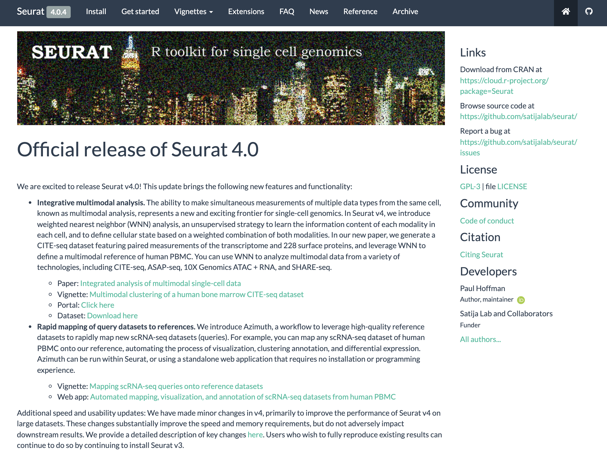

Let us start a new R session, and load the Seurat library. If you didnt install the Seurat package, you can use "install.packages" function as below. Then, use the "library" function to load the Seurat package. 

The code below will install **Seurat** if the package is currently missing from your local library. 

```
if(!requireNamespace("Seurat", quietly = TRUE))
  install.packages("Seurat")
library(Seurat)
```

Now we will import filtered feature-barcode matrix of the PBMC example, produced by the cellranger pipeline. Seurat incorporates a built-in function, tailored for importing UMI tables into the R environment. The resulting R object is of a dgCMatrix class, a compressed matrix format used in R. 

Currently, "pbmc_1k_v3_processed" folder should be residing in your bootcamp folder: `/project/your_groupname/your_username/bootcamp/scRNASeq`. You can either transfer this folder to your own computer (Desktop or anywhere in your file system).

**Note:** Once you transfer the "pbmc_1k_v3_processed" folder, you should 
- copy the folder to your Desktop 
- Simply use Session -> Set Working Directory -> Choose Directory and choose Desktop
- Open a new file by File -> New File -> R script and save the file as "main_1k". 

```
> pbmc1k <- Read10X("pbmc_1k_v3_processed/") 
```

or you can simply use the code below to import the UMI table.

```
> pbmc1k <- readRDS(url("https://www.dropbox.com/s/7v3ju3oyi0ele25/pbmc1k.Rds?dl=1"))
```

Now, lets examine the loaded UMI table. Each R "object" has a "class", so it is safe to start by looking into the class of each object first. 

```
> class(pbmc1k)
[1] "dgCMatrix"
attr(,"package")
[1] "Matrix"
> dim(pbmc1k)
[1] 36601  1223
> pbmc1k
36601 x 1223 sparse Matrix of class "dgCMatrix"
   [[ suppressing 66 column names ‘AAACCCAAGGAGAGTA-1’, ‘AAACGCTTCAGCCCAG-1’, ‘AAAGAACAGACGACTG-1’ ... ]]
   [[ suppressing 66 column names ‘AAACCCAAGGAGAGTA-1’, ‘AAACGCTTCAGCCCAG-1’, ‘AAAGAACAGACGACTG-1’ ... ]]
                                                                                                                                                      
MIR1302-2HG . . . . . . . . . . . . . . . . . . . . . . . . . . . . . . . . . . . . . . . . . . . . . . . . . . . . . . . . . . . . . . . . . . ......
FAM138A     . . . . . . . . . . . . . . . . . . . . . . . . . . . . . . . . . . . . . . . . . . . . . . . . . . . . . . . . . . . . . . . . . . ......
OR4F5       . . . . . . . . . . . . . . . . . . . . . . . . . . . . . . . . . . . . . . . . . . . . . . . . . . . . . . . . . . . . . . . . . . ......
AL627309.1  . . . . . . . . . . . . . . . . . . . . . . . . . . . . . . . . . . . . . . . . . . . . . . . . . . . . . . . . . . . . . . . . . . ......
AL627309.3  . . . . . . . . . . . . . . . . . . . . . . . . . . . . . . . . . . . . . . . . . . . . . . . . . . . . . . . . . . . . . . . . . . ......
AL627309.2  . . . . . . . . . . . . . . . . . . . . . . . . . . . . . . . . . . . . . . . . . . . . . . . . . . . . . . . . . . . . . . . . . . ......
AL627309.5  . . . . . . . . . . . . . . . . . . . . . . . . . . . . . . . . . . . . . . . . . . . . . . . . . . . . . . . . . . . . . 1 . . . . ......
AL627309.4  . . . . . . . . . . . . . . . . . . . . . . . . . . . . . . . . . . . . . . . . . . . . . . . . . . . . . . . . . . . . . . . . . . ......
```

Lets take a look at this matrix more closely and investigate the distribution of UMI counts across cells. Lets examine the number of non-zero UMI counts and the percentage of such UMIs. 

```
if(!requireNamespace("Matrix", quietly = TRUE))
  install.packages("Matrix")
library(Matrix)
> zero_counts <-  apply(pbmc1k,2,nnzero)
> summary(zero_counts)
   Min. 1st Qu.  Median    Mean 3rd Qu.    Max. 
     13    1632    2008    2136    2620    6672 
> length(pbmc1k)
[1] 44763023
> 1- sum(zero_counts)/length(pbmc1k)
[1] 0.9416309
```

It seems some cells have extremely low number of positive UMIs, and almost %95 of the UMI table are just zero counts. This further proves using sparse matrix formats to store UMI tables. We will also discuss removing redundant information in these huge zero matrices by means of **dimensionality reduction** which will be crucial for clustering cells into cell types. 

We are now ready to build our Seurat R object in order to start analyzing UMI distributions of single cells. If you would like to get more information on existing function within R packages, you can use help() function in R (e.g. help(CreateSeuratObject))

```
> pbmc1k_seu <- CreateSeuratObject(pbmc1k)
> pbmc1k_seu
An object of class Seurat 
36601 features across 1223 samples within 1 assay 
Active assay: RNA (36601 features, 0 variable features)
```

Seurat object is a collection of UMI tables and high level information (metadata) of single cells associated to a project. Seurat is capable of storing multiple assays of a single cell library (e.g. antibody tag assays, i.e. ADT, and transposase-accessible chromatin assay, i.e. ATAC). 

For each assay (RNA, ADT, ATAC etc.), we have counts (raw UMIs), data (normalized UMIs) and scale.data (scaled and normalized UMIs) of an assay, hence no information is deleted but stored in different compartments in the same R object. 

```
> pbmc1k_seu@assays$RNA@counts
36601 x 1223 sparse Matrix of class "dgCMatrix"
   [[ suppressing 66 column names ‘AAACCCAAGGAGAGTA-1’, ‘AAACGCTTCAGCCCAG-1’, ‘AAAGAACAGACGACTG-1’ ... ]]
   [[ suppressing 66 column names ‘AAACCCAAGGAGAGTA-1’, ‘AAACGCTTCAGCCCAG-1’, ‘AAAGAACAGACGACTG-1’ ... ]]
                                                                                                                                                      
MIR1302-2HG . . . . . . . . . . . . . . . . . . . . . . . . . . . . . . . . . . . . . . . . . . . . . . . . . . . . . . . . . . . . . . . . . . ......
FAM138A     . . . . . . . . . . . . . . . . . . . . . . . . . . . . . . . . . . . . . . . . . . . . . . . . . . . . . . . . . . . . . . . . . . ......
OR4F5       . . . . . . . . . . . . . . . . . . . . . . . . . . . . . . . . . . . . . . . . . . . . . . . . . . . . . . . . . . . . . . . . . . ......
AL627309.1  . . . . . . . . . . . . . . . . . . . . . . . . . . . . . . . . . . . . . . . . . . . . . . . . . . . . . . . . . . . . . . . . . . ......
AL627309.3  . . . . . . . . . . . . . . . . . . . . . . . . . . . . . . . . . . . . . . . . . . . . . . . . . . . . . . . . . . . . . . . . . . ......
AL627309.2  . . . . . . . . . . . . . . . . . . . . . . . . . . . . . . . . . . . . . . . . . . . . . . . . . . . . . . . . . . . . . . . . . . ......
AL627309.5  . . . . . . . . . . . . . . . . . . . . . . . . . . . . . . . . . . . . . . . . . . . . . . . . . . . . . . . . . . . . . 1 . . . . ......
AL627309.4  . . . . . . . . . . . . . . . . . . . . . . . . . . . . . . . . . . . . . . . . . . . . . . . . . . . . . . . . . . . . . . . . . . ......
```

Lets us check the metadata of the Seurat object. Here, **head()** function shows you the first 5 rows of a data table, a convenient way to quickly investigate a dataset. Here, upon running "CreateSeuratObject" function: 
- nCount_RNA: total number of UMIs of a cell 
- nFeature_RNA: total number of genes (non-zero UMIs) of a cell
is calculated. 

Here, "orig.ident" column within the metadata indicates the origin of the sample which is usually used for Seurat object built by multiple biological samples, but we will only incorporate a single sample in this workshop. 

```
> head(pbmc1k_seu@meta.data)
                      orig.ident nCount_RNA nFeature_RNA
AAACCCAAGGAGAGTA-1 SeuratProject       8722         2740
AAACGCTTCAGCCCAG-1 SeuratProject       5705         1892
AAAGAACAGACGACTG-1 SeuratProject       4431         1632
AAAGAACCAATGGCAG-1 SeuratProject       2860         1276
AAAGAACGTCTGCAAT-1 SeuratProject       6865         1936
AAAGGATAGTAGACAT-1 SeuratProject       9183         2151
```

There are also many other components in the Seurat object, but we havent start analyzing the data yet, so they are simply empty.

```
> pbmc1k_seu@reductions
list()
> pbmc1k_seu@neighbors
list()
> pbmc1k_seu@graphs
list()
> pbmc1k_seu@images
list()
```

# Quality Control, Filtering and Normalization. 

Seurat provides multiple built-in functions to check the quality of captured UMIs of cells. 

We will incorporate VlnPlot function (violin plot) to detect cells with unusual number of UMIs or those with extreme features (i.e. high mitochondrial content). 
Lets first visualize the number of genes (nFeature_RNA) and total number of UMIs (nCount_RNA) of all cells. 

```
VlnPlot(pbmc1k_seu, c("nCount_RNA", "nFeature_RNA"))
```

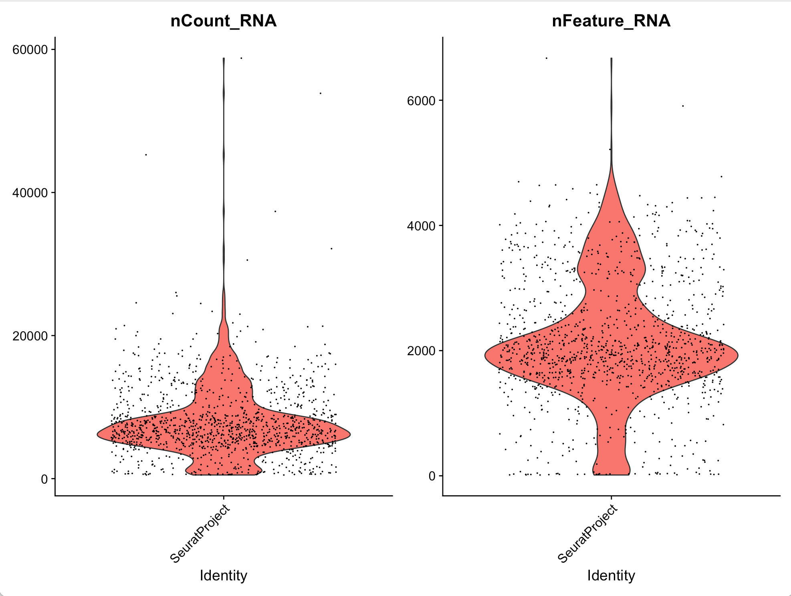

These cells with high UMIs do most likely have high number of features as well. For that, we will use the FeatureScatter function. 

```
FeatureScatter(pbmc1k_seu, feature1 = "nCount_RNA", feature2 = "nFeature_RNA")
```

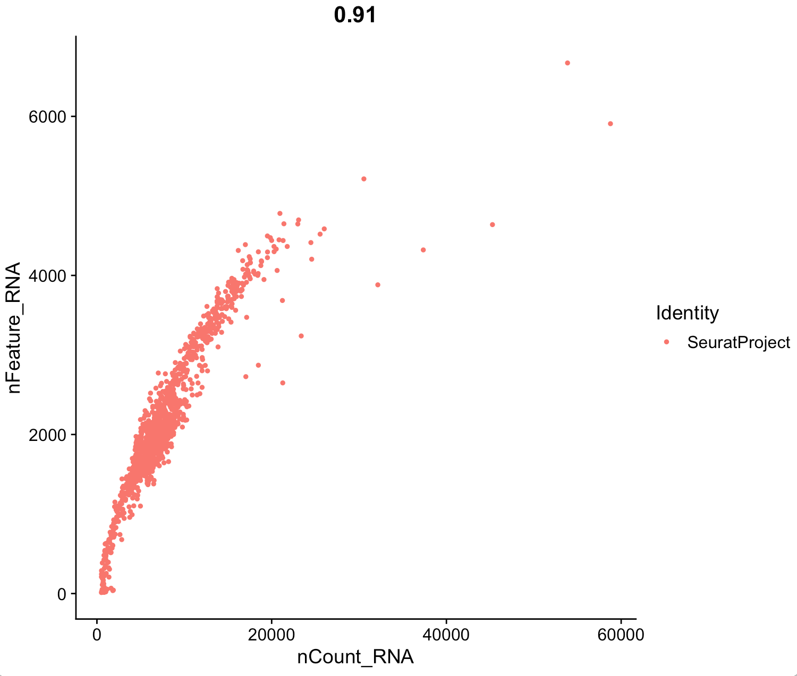

Some cells seem to have extreme number of UMIs which may indicate that these barcodes actually captured RNA from multiple cells as these can often happen in droplet-based scRNA sequencing methods. 

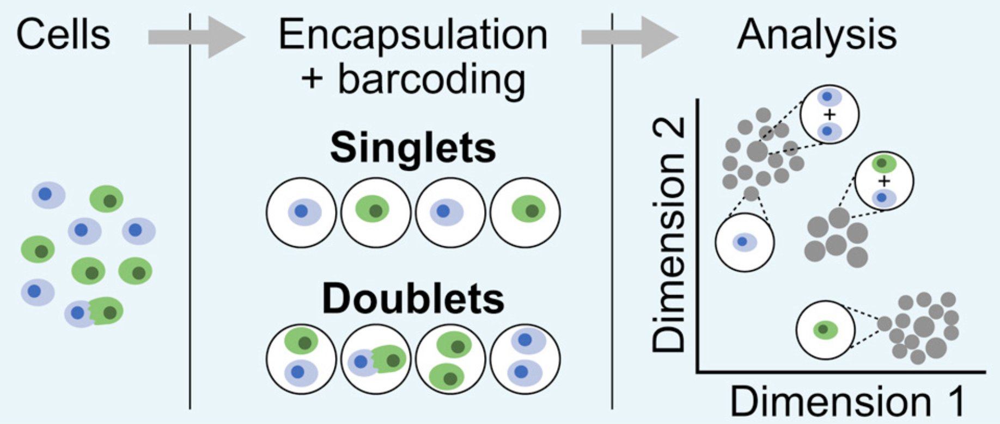

On the other hand, we may also have barcodes with low number of total UMIs which may indicate that those barcodes may associated with **(i)** empty droplets with no cells captured (exRNA is captured instead), **(ii)** cells with low RNA content that damages cell type annotation and clustering. 

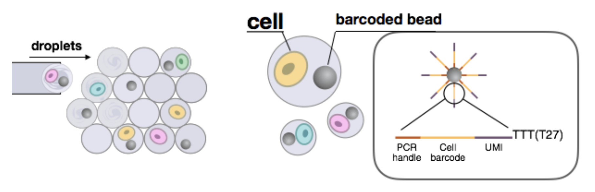

```
> range(pbmc1k_seu$nCount_RNA)
[1]   510 58775
> range(pbmc1k_seu$nFeature_RNA)
[1]   13 6672
```

There are indeed some cells that have extremely low number of non-zero genes and extreme high UMI counts. We will get back to those potential empty, low quality and multiplet barcodes, but lets move on to defining additional quality control measurements. 

Apoptotic (dying) cells express mitochondrial genes and export these transcripts (HUGO gene symbol starting with "MT-") to the cytoplasm in mammalian cells. 

```
> rownames_pbmc1k <- rownames(pbmc1k_seu)
> rownames_pbmc1k[grepl("MT-",rownames_pbmc1k)]
 [1] "MT-ND1"  "MT-ND2"  "MT-CO1"  "MT-CO2"  "MT-ATP8" "MT-ATP6" "MT-CO3"  "MT-ND3"  "MT-ND4L" "MT-ND4"  "MT-ND5"  "MT-ND6"  "MT-CYB" 
```

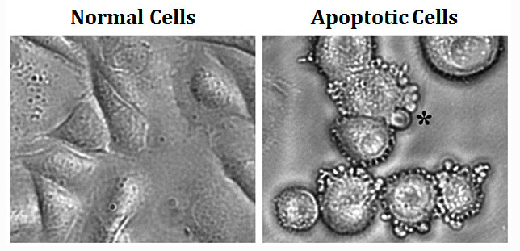

We can calculate the total number of UMIs of all genes with symbol "MT-" and also provide the ratio of total MT- UMIs vs the total number of all UMIs for each cell with the **PercentageFeatureSet** function. 

```
pbmc1k_seu[["percent.mt"]] <- PercentageFeatureSet(pbmc1k_seu, pattern = "^MT-")
```

We can now visualize all three quality control measures and determine filtering thresholds. 

```
VlnPlot(pbmc1k_seu, c("nCount_RNA", "nFeature_RNA","percent.mt"))
```

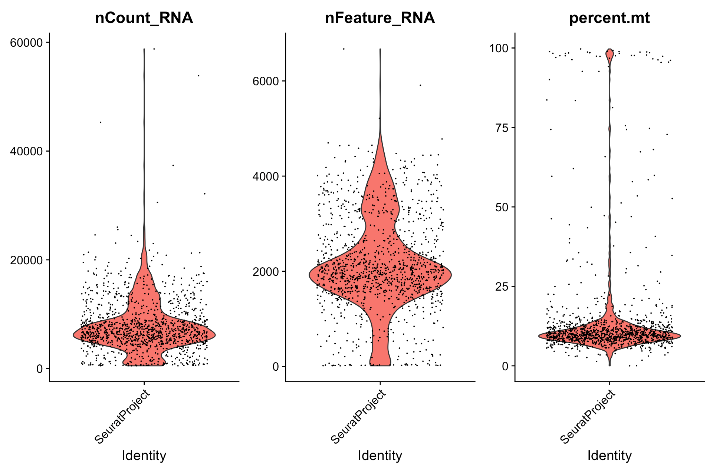

```
FeatureScatter(pbmc1k_seu, feature1 = "nFeature_RNA", feature2 = "percent.mt")
```

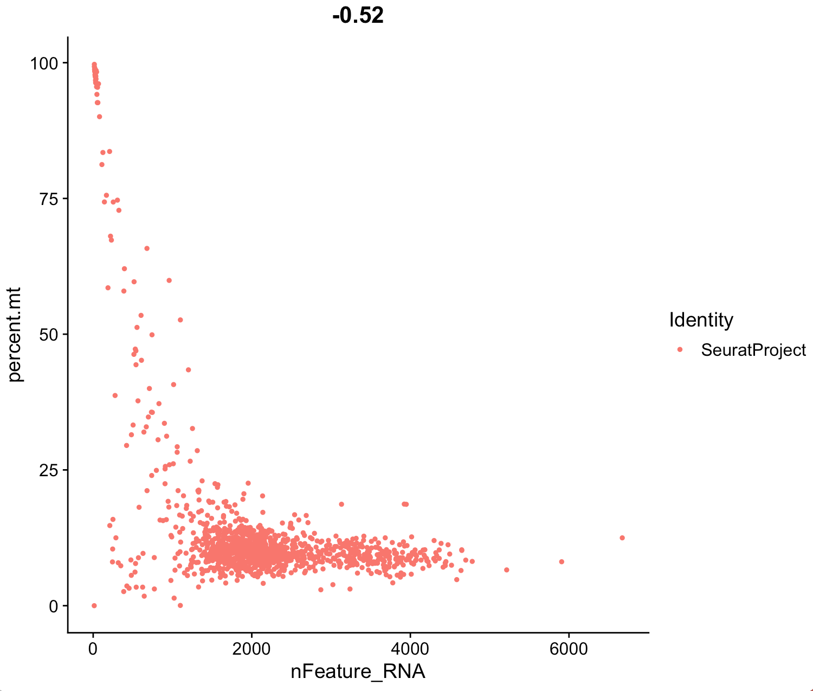

```
FeatureScatter(pbmc1k_seu, feature1 = "nCount_RNA", feature2 = "percent.mt")
```

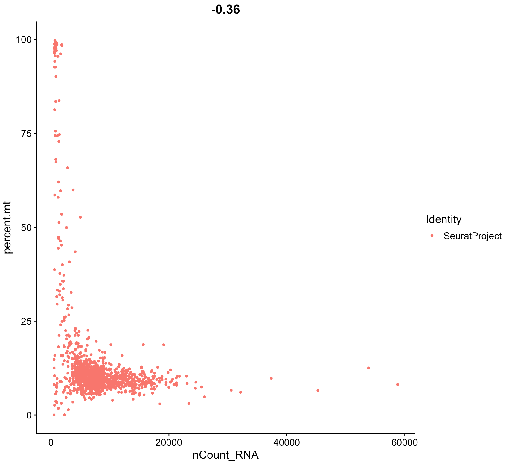

We can hence remove those cells with lower than 200 genes, higher than some total of 20000 UMIs and those cells with higher than total MT percentage of 20.
We use the subset function to delete those cells with those extreme properties. Hence, some 130 number of cells are removed. 

```
> pbmc1k_seu <- subset(pbmc1k_seu, subset = nFeature_RNA > 200 & nCount_RNA < 20000 & percent.mt < 20)
> pbmc1k_seu
An object of class Seurat 
36601 features across 1094 samples within 1 assay 
Active assay: RNA (36601 features, 0 variable features)
```

Now that we have filtered out low quality and possibly doublets barcodes. We can normalize UMI counts before we move on to dimensionality reduction and clustering (which we will cover in the next session).

Seurat incorporates NormalizeData function to rescale UMI counts to a global-scale by dividing each count with the UMI sum of cells, then it multiplies this count with a default scale.factor of 10000. Finally, we log transform scaled UMI counts to normalized skew data such as RNA counts. 

```
pbmc1k_seu <- NormalizeData(pbmc1k_seu) 
```

The resulting normalized counts are stored in a separate UMI table matrix, thus raw RNA counts are preserved for additional analysis. 

```
> range(pbmc1k_seu@assays$RNA@data)
[1] 0.000000 8.200866
> range(pbmc1k_seu@assays$RNA@counts)
[1]    0 6731
```

Now, lets save the processed and filtered Seurat object to use it later.

```
saveRDS(pbmc1k_seu, "pbmc1k_seu_normalized.rds")
```

# Session 8 Homework 2

10x Genomics website provides a large collection of single cell sequencing raw data examples. One of these datasets is the another version of our PBMC data with around 3000 cells.

<https://support.10xgenomics.com/single-cell-gene-expression/datasets/1.1.0/pbmc3k>

You can find the mtx file, and barcodes.tsv and genes.tsv files in the following path: 

```
/project/your_groupname/your_username/bootcamp/scRNASeq/pbmc_3k_processed
```

You are required to: 

* Transfer the "pbmc_3k_processed" folder from the given path to your local computer, and put it in your Desktop. 
* Open an "main_3k.R" file from Rstudio, as instructed before. 
* Import the PBMC 10x dataset and create a Seurat object using Read10X and CreateSeuratObject functions. 
* Alternatively, you can use the R code below to import the matrix in to your R Studio workspace. 

```
pbmc3k <- readRDS(url("https://www.dropbox.com/s/kvja6gkhz1nvq4g/pbmc3k.Rds?dl=1"))
```

* Calculate the mitochondrial content percentage using the PercentageFeatureSet function.
* By using violin plots and feature scatter plots, determine viable filtering thresholds for features counts, UMI counts and percent.mt. 
* Once you choose a set of thresholds, filter out cells that are most likely empty droplets, doublets or cells with high "MT-" content. 
* Finally, normalize UMI tables using NormalizeData function and save the resulting object as an .rds file.  

