# Session 8: Single Cell RNA Analysis

# Expected learning outcome

To understand the basics of scRNA data analysis with R, how to use scRNA packages to creating UMI distribution plots, filtering, normalization, clustering and annotation. 
This is a beginner level lecture in scRNA data analysis.

# Overview

- [Getting Started](#getting-started)
- [Introducton to scRNA-Seq Analysis](#introducton-to-scrna-seq-analysis)
- [scRNA-Seq Processing with DolphinNext](#scrna-seq-processing-with-dolphinnext)
- [Data Structures](#data-structures)
- [Filtering](#filtering)
- [Feature Selection and Dimensionality Reduction](#feature-selection-and-dimensionality-reduction)
- [Clustering](#clustering)
- [Normalization](#normalization)
- [Post Normalization Analysis and Clustering](#post-normalization-analysis-and-clustering)
- [Basic Analysis on Clusters](#basic-analysis-on-clusters)


## Getting Started

Please install R 4.0.5 into your local computer. 

1. First please install R to your computer

   <https://cran.r-project.org/>

   For windows;
   <https://cran.r-project.org/bin/windows/base/R-4.0.5-win.exe>

   For mac;
   <https://cran.r-project.org/bin/macosx/R-4.0.5.pkg></br>

2. Second, please install R-Studio;

   <https://rstudio.com/products/rstudio/download/>
   
3. We will now install required R packages for conducting today's scRNA analysis practices before covering the basics of scRNA-Seq. Run the commands below. It should install the 'devtools' package, necessary for installing scRNA analysis package of 'SignallingSingleCell' from GitHub. **Installing devtools may take long, please try to install before the session**.

```
install.packages(“devtools”)
library(devtools)
```

If Rstudio asks "Do you want to install from sources the package which needs compilation? (Yes/no/cancel)", just type "n" for no, and hit Enter to continue.

    Do you want to install from sources the package which needs compilation? (Yes/no/cancel) n

If R asks to update old packages; please dont write anything and hit Enter to continue:

```
These packages have more recent versions available.
It is recommended to update all of them.
Which would you like to update?

1: All                            
2: CRAN packages only             
3: None                           
4: tibble  (3.1.1 -> 3.1.2) [CRAN]
5: stringi (1.5.3 -> 1.6.2) [CRAN]
   
Enter one or more numbers, or an empty line to skip updates:
```

4. Now that we can use 'devtools' package and install GitHub packages, lets install 'SignallingSingleCell'.

Similar to Step 3, answer "n" or "no" if Rstudio asks you to install from source packages, and just enter if R asks to update packages

```
devtools::install_github(“kgellatl/SignallingSingleCell”)
library(SignallingSingleCell)
```
    
## Introduction to scRNA-Seq

In previous sessions, we have covered basics of R programming, drawing graphics and figures, and introductory RNA-Seq data analysis.
Today, we will briefly cover single cell RNA sequencing (scRNA-Seq), processing of scRNA-Seq reads and then we will extend on what he have learned 
on R and start programming for the essential scRNA-Seq data analysis.  

Why Single Cell ?

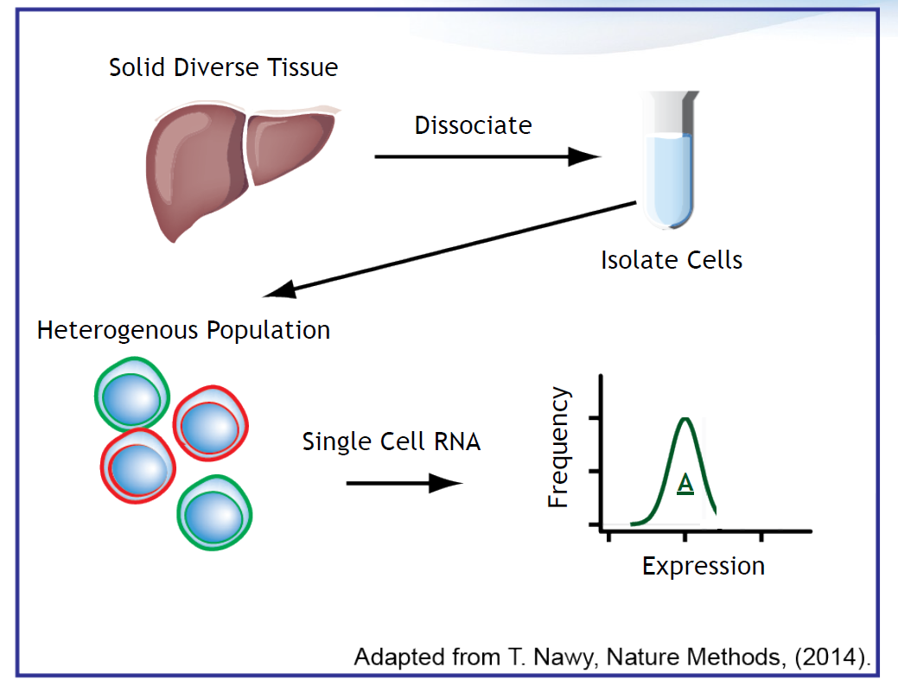

We should know that scRNA Analysis may not be necessary for all problems. It is well suited when populations are heterogeneous, and it is a powerful tool for studying intra and inter cell type variations in gene expression

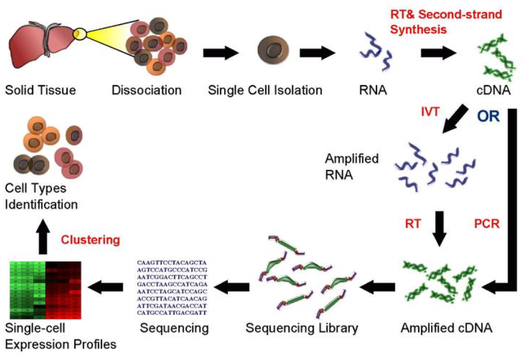

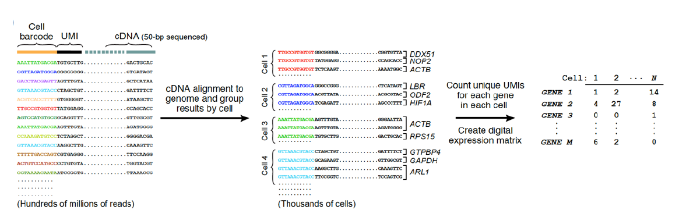

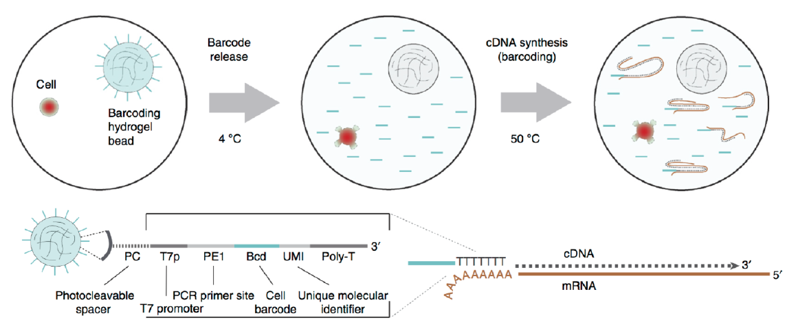

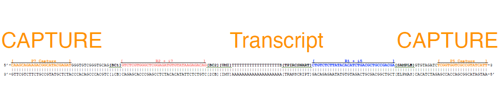


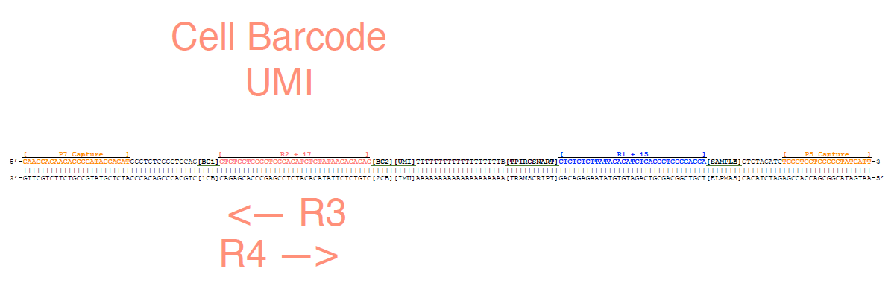

## scRNA-Seq Processing with DolphinNext

To process the fastq files that the instrument generates into a gene expression matrix involves many steps, which can be run as a continuous pipeline with DolphinNext

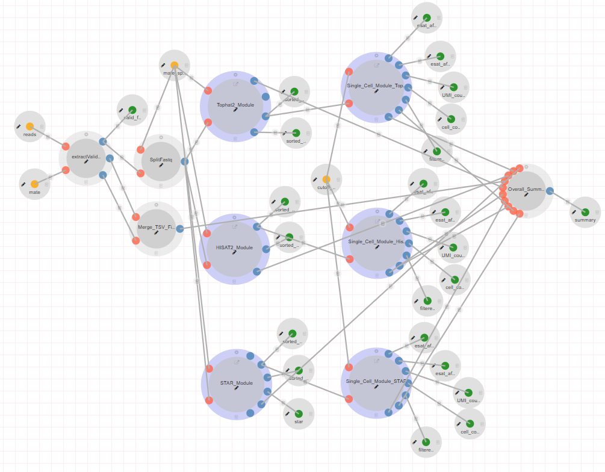

First, DolphinNext pipeline align these reads to reference genome using STAR, HISAT2 or Tophat2 aligners.
Also, mapped reads are merged by samtools, these bam files are also sorted and indexed. 

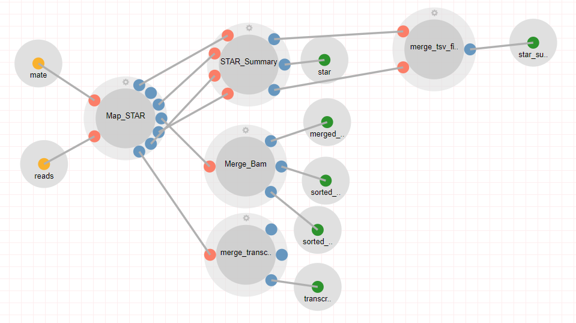

Then, reads are filtered, some cells with low number of reads are removed, and then ESAT (http://garberlab.umassmed.edu/software/esat/) is used to 
create UMI distribution tables.

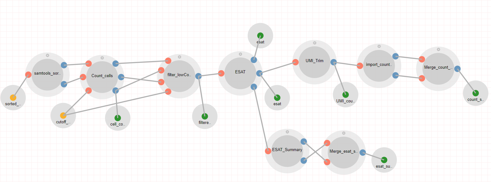

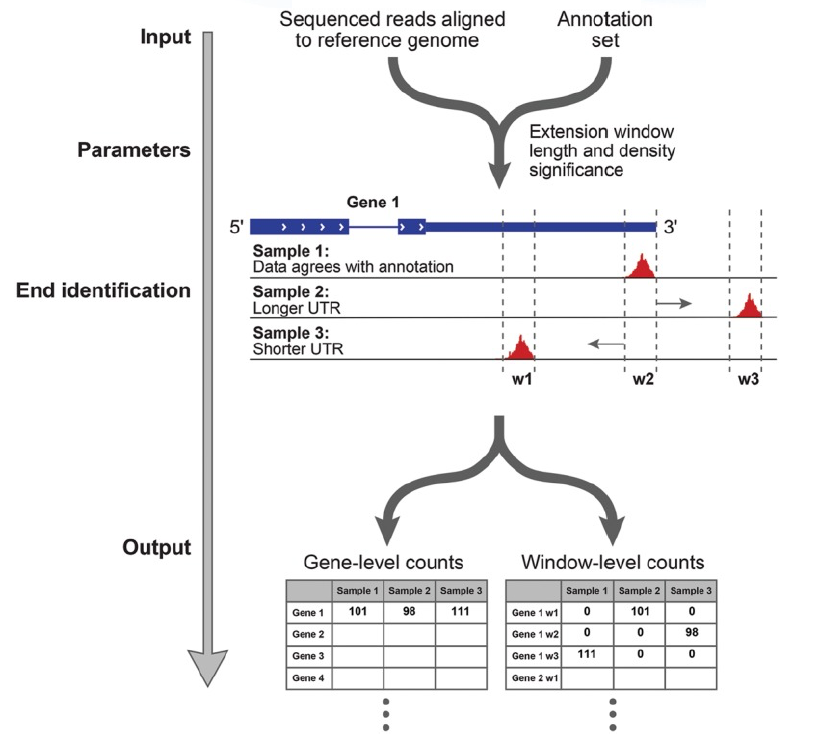

## Data Structures

R packages are used to conduct data analysis with built-in (already existing) functions. The idea is to immediately use an algorithm or method for any particular type
of analysis, include scRNA Data Analysis.

We have installed and loaded a library called SignallingSingleCell that include a considerable number of functions and algorithms to conducting scRNA data analysis, and
we will use these functions to cover entire cycle of analyzing single cell data. 

Now, lets download our datasets, load it into our R environment and start investigating! 

```
load(url("https://galaxyweb.umassmed.edu/pub/class/mDC_UMI_Table.Rdata")
load(url("https://galaxyweb.umassmed.edu/pub/class/ex_sc_skin.Rdata"))
```

Here, "Rdata" is a file format designed for R, and its primary use is to store R objects. We only have a single R object within this Rdata file, and it is called "mDC_UMI_Table". We can investigate this R object further and understand its structure. 

We will use the "ex_sc_skin" dataset during exercises

```
class(mDC_UMI_Table)

## [1] "matrix" "array" 

dim(mDC_UMI_Table)
 
## [1] 11584  3814
  
head(rownames(mDC_UMI_Table))
   
## [1] "0610007P14Rik" "0610009B22Rik" "0610009O20Rik" "0610010B08Rik" "0610010F05Rik"
## [6] "0610010K14Rik"
   
head(colnames(mDC_UMI_Table))
  
## [1] "0hrA_TGACGGACAAGTAATC" "0hrA_CACAACAGTAGCCTCG" "0hrA_GTTTGTTTGCACCTCT"
## [4] "0hrA_GCTTACCTTGACCCTC" "0hrA_GGAGAAGCGCTTTGGC" "0hrA_AAATCAGAGATCTCGG"

mDC_0hr_1hr_4hr_CLEAN[1:5,1:5] 
   
##               0hrA_TGACGGACAAGTAATC 0hrA_CACAACAGTAGCCTCG 0hrA_GTTTGTTTGCACCTCT
## 0610007P14Rik                     0                     0                     0
## 0610009B22Rik                     0                     0                     0
## 0610009O20Rik                     0                     0                     0
## 0610010B08Rik                     0                     0                     0
## 0610010F05Rik                     0                     0                     0
##               0hrA_GCTTACCTTGACCCTC 0hrA_GGAGAAGCGCTTTGGC
## 0610007P14Rik                     0                     0
## 0610009B22Rik                     0                     0
## 0610009O20Rik                     0                     0
## 0610010B08Rik                     0                     0
## 0610010F05Rik                     0                     0
```

The class function indicates the type of the R object which, in this case, a "matrix" that stores the UMI counts of each barcode in the scRNA experiment associated to each gene.
Columns are the barcodes, and the rows are the genes. The expression matrix contains 11584 genes and 3814 barcodes. 

For analyzing this expression matrix, we have to build a new R object with its own class (like "matrix"), and these classes are often designed within R packages. We 
will use the "ExpressionSet" object which is required for analyzing single cell expression matrices by the SignallingSingleCell package. Lets start by calling the 
"construct_ex_sc" function for that purpose!

```
ex_sc <- construct_ex_sc(mDC_UMI_Table) 
rm(mDC_UMI_Table)
ex_sc
   
## ExpressionSet (storageMode: lockedEnvironment)
## assayData: 11584 features, 3814 samples 
##   element names: exprs 
## protocolData: none
## phenoData: none
## featureData: none
## experimentData: use 'experimentData(object)'
## Annotation:  
```

Now the expression matrix is stored within an R object with ExpressionSet class, and we wont need the original expression matrix, we may delete it with "rm" function. 
The ExpressionSet class (ex_sc) is an extremely convienient data structure that contains 3 dataframes. These dataframes contain expression data, cell information, and gene information respectivelty. 

exprs(ex_sc) is the expression data, where rows are genes and columns are cells  
pData(ex_sc) is cell information, where rows are cells and columns are metadata  
fData(ex_sc) is gene information, where rows are genes and columns are metadata

Often we have metadata on the experiment that can be valuable in the analysis! Writing that information now may be appropriate. Our experiment consists of a time 
course with LPS stimulation. Now we can begin to take advantage of our faceting! We first create an empty column, then insert associated metadata. 

```
pData(ex_sc)$Timepoint <- NA 
pData(ex_sc)[grep("0hr", rownames(pData(ex_sc))),"Timepoint"] <- "0hr"
pData(ex_sc)[grep("1hr", rownames(pData(ex_sc))),"Timepoint"] <- "1hr"
pData(ex_sc)[grep("4hr", rownames(pData(ex_sc))),"Timepoint"] <- "4hr"
head(pData(ex_sc))
   
##                       Timepoint
## 0hrA_TGACGGACAAGTAATC       0hr
## 0hrA_CACAACAGTAGCCTCG       0hr
## 0hrA_GTTTGTTTGCACCTCT       0hr
## 0hrA_GCTTACCTTGACCCTC       0hr
## 0hrA_GGAGAAGCGCTTTGGC       0hr
## 0hrA_AAATCAGAGATCTCGG       0hr
 
View(pData(ex_sc))
```

We can also take a subset of the ExpressionSet object

```
mDC_0hr <- subset_ex_sc(ex_sc, variable = "Timepoint", select = c("0hr"))
```

## Filtering

The first step is to filter your data to remove low quality cells. Often creating a histogram of the values and assigning cutoffs is simple and effective. Typically we remove all cells lower than 500-1000 UMIs / cell, and we also remove cells with more than 10000 cells. 

Lets count total UMI counts of all barcodes, and visualize UMI density plots! We will also store these information on metadata as we calculate. 

```
ex_sc <- calc_libsize(ex_sc, suffix = "raw") # sums counts for each cell
plot_density(ex_sc, title = "UMI Density", val = "UMI_sum_raw", statistic = "mean")    
```

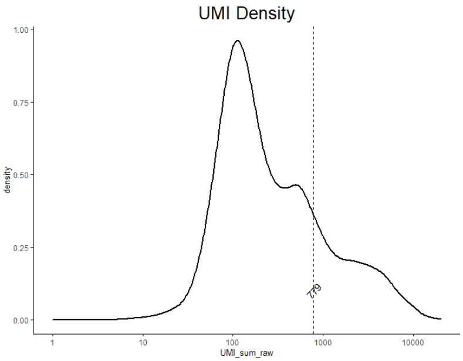

```
ex_sc <- pre_filter(ex_sc, minUMI = 1000, maxUMI = 10000, threshold = 1, minCells = 10,  print_progress = TRUE) 
   
## [1] "Filtering Genes"
## [1] "Filtering Low Cells"

ex_sc <- calc_libsize(ex_sc, suffix = "raw_filtered")
plot_density(ex_sc, title = "UMI Density",  val = "UMI_sum_raw_filtered", statistic = "mean") 
   
head(pData(ex_sc))
 
##                       Timepoint UMI_sum_raw UMI_sum_raw_filtered
## 0hrA_TGACGGACAAGTAATC       0hr        4572                 4570
## 0hrA_CACAACAGTAGCCTCG       0hr        1581                 1580
## 0hrA_GTTTGTTTGCACCTCT       0hr        2296                 2288
## 0hrA_GCTTACCTTGACCCTC       0hr        2098                 2097
## 0hrA_GGAGAAGCGCTTTGGC       0hr        2425                 2421
## 0hrA_AAATCAGAGATCTCGG       0hr        6618                 6601
```

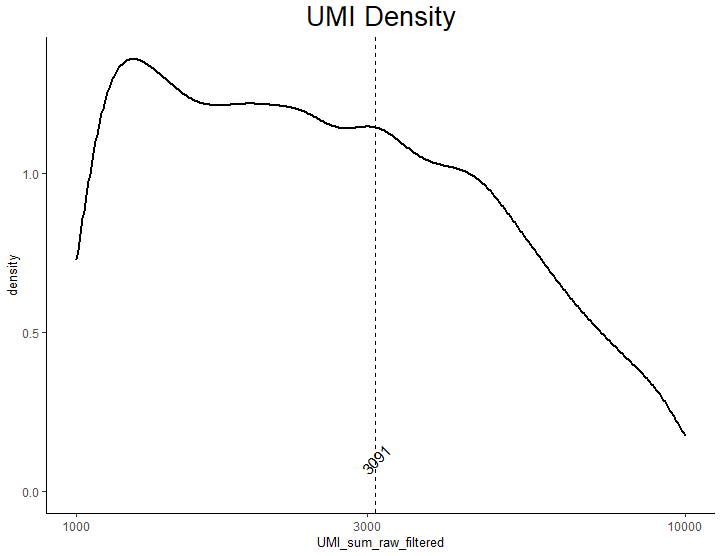

## Feature Selection and Dimensionality Reduction

Before normalization dimensionality reduction is necessary to form preliminary clusters. These clusters are used to normalize internal to a cluster before normalizing across clusters. First we can subset the genes, and then use these feature selected genes for dimension reduction.

We use the method of Principal Component Analysis (PCA) reduce the dimensionality of the dataset.

```
gene_subset <- subset_genes(ex_sc, method = "PCA", threshold = 1, minCells = 30, nComp = 10, cutoff = 0.85) 
ex_sc <- dim_reduce(ex_sc, genelist = gene_subset, pre_reduce = "iPCA", nComp = 10, tSNE_perp = 30, iterations = 500, print_progress=TRUE)  
colnames(pData(ex_sc))

##  [1] "Timepoint"            "UMI_sum_raw"          "UMI_sum_raw_filtered"
##  [4] "x"                    "y"                    "iPC_Comp1"           
##  [7] "iPC_Comp2"            "iPC_Comp3"            "iPC_Comp4"           
## [10] "iPC_Comp5"            "iPC_Comp6"            "iPC_Comp7"           
## [13] "iPC_Comp8"            "iPC_Comp9"            "iPC_Comp10" 

plot_tsne_metadata(ex_sc, color_by = "UMI_sum_raw", title = "Total UMIs per cell") 
```

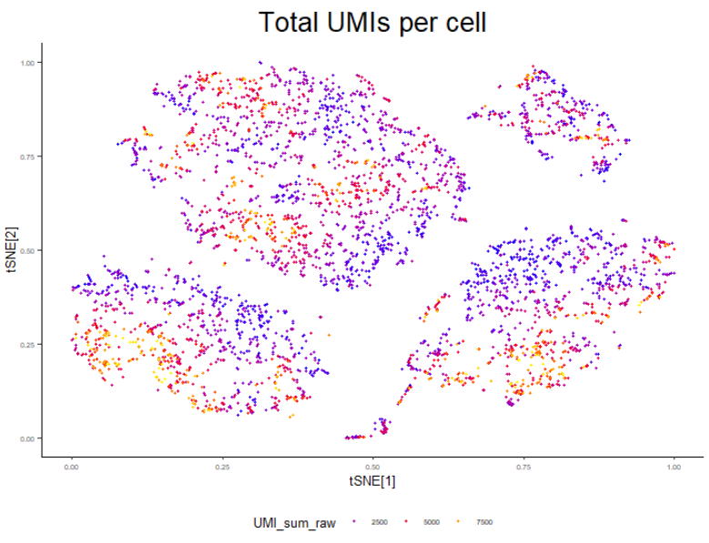

We can also plot principal components on tsne graphs

```
plot_tsne_metadata(ex_sc, color_by = "iPC_Comp1", title = "PC1 cell loadings") 
plot_tsne_metadata(ex_sc, color_by = "iPC_Comp2", title = "PC2 cell loadings") 
plot_tsne_metadata(ex_sc, color_by = "iPC_Comp3", title = "PC3 cell loadings") 
```


## Clustering

Now that we have dimension reduced data we can try clustering it! Clustering algorithms often require you to specify a parameter. This is either the number of clusters, or
parameter that represents some "resolution" which might represents a threshold for the similarity between expression profiles of barcodes. 

The "SignallingSingleCell" package incorporates a Spectral Clustering method that assumes the number of clusters, and we will assume that the data has 6 clusters!

```
ex_sc <- cluster_sc(ex_sc, dimension = "Comp", method = "spectral", num_clust = 6) 

table(pData(ex_sc)$Cluster)

## Cluster1 Cluster2 Cluster3 Cluster4 Cluster5 Cluster6 
##       55     1591     1016      338      862      217 
      
plot_tsne_metadata(ex_sc, color_by = "Cluster", title = "Spectral Cluster on iPCA components") 
```

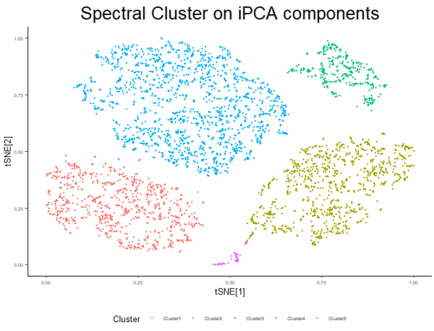

```
plot_density(ex_sc, title = "UMIs per cluster", val = "UMI_sum_raw", color_by = "Cluster", statistic = "mean")
```

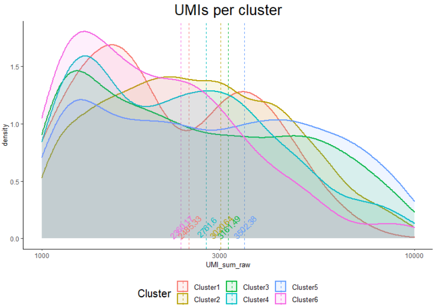

We can also calculate a set of markers for these clusters and store the scores of all genes to fData. This is a quick method to find good markers genes for cell identification. These gene scores get written to fData(). 

```
ex_sc <- id_markers(ex_sc, print_progress = TRUE) 

##               Cluster1_marker_score_Cluster Cluster2_marker_score_Cluster Cluster3_marker_score_Cluster Cluster4_marker_score_Cluster
## 0610007P14Rik                          6268                          2521                          8357                          7310
## 0610009B22Rik                         10584                           263                          3592                          8065
## 0610009O20Rik                          5647                          4980                          4513                          3187
## 0610010B08Rik                          6453                          7707                          3553                          5734
## 0610010F05Rik                         10512                          8695                          3988                          8753
## 0610010K14Rik                          3188                          5090                         10169                          6052
##               Cluster5_marker_score_Cluster Cluster6_marker_score_Cluster
## 0610007P14Rik                          3129                          8831
## 0610009B22Rik                          6436                          3304
## 0610009O20Rik                          6475                          7196
## 0610010B08Rik                          5302                          3583
## 0610010F05Rik                          2272                            56
## 0610010K14Rik                          8492                          3906
```

Using these scores, we can return top n markers (for example, n=10) for each cell identification

```
markers <- return_markers(ex_sc, num_markers = 10) 
table(pData(ex_sc)$Cluster)
markers

## $Cluster1_Markers
##  [1] "S100a9"  "S100a8"  "Mmp9"    "Chil1"   "Lcn2"    "Ngp"     "Pglyrp1" "Csf3r"  
##  [9] "Il1f9"   "Ifitm6" 

## $Cluster2_Markers
##  [1] "Trem2"   "Tbxas1"  "Pdxk"    "Plxna1"  "Fabp4"   "Itgax"   "Atp13a2" "F7"     
##  [9] "Amz1"    "Ctsk"   

## $Cluster3_Markers
##  [1] "Cmpk2"  "Rsad2"  "Ifit2"  "Iigp1"  "Ifi205" "Slc7a2" "Il6"    "Cd40"   "Plet1" 
## [10] "Ccl5"  

## $Cluster4_Markers
##  [1] "Fscn1"       "Ccr7"        "Cacnb3"      "Ccl22"       "Mmp25"      
##  [6] "Serpinb6b"   "Sema7a"      "Apol7c"      "Net1"        "Nup62-il4i1"

## $Cluster5_Markers
##  [1] "Flrt3"  "Tnfsf9" "Sdc4"   "Cxcl1"  "Ccl4"   "Sdc1"   "Cxcl2"  "Trem2"  "Tnf"   
## [10] "Fabp4" 

## $Cluster6_Markers
##  [1] "Rasgef1b" "Il1a"     "Myof"     "Egr2"     "Dnajb4"   "Cenpa"    "Nfkbiz"  
##  [8] "Errfi1"   "Tnip3"    "Chn2"    
```

## Normalization

Now that the data has preliminary clusters, we can normalize. SCRAN normalization will first normalize internally in clusters, before normalizing across clusters. Once the data is normalized we can run the same steps as above before visualization. The first step is to select the genes to be used for normalization. One method would be to first only use genes expressed in more than n cells, and then remove the most variable genes.

We will store the normalized data in a separate R object.

```
ex_sc_norm <- norm_sc(ex_sc, pool_sizes = c(20,25,30,35,40))
```

## Post Normalization Analysis and Clustering

Now that we have normalized, it is time to reprocess the data as before, this time on the normalized counts!

```
plot_density(ex_sc_norm, title = "size_factors", val = "size_factor", statistic = "mean") 
```

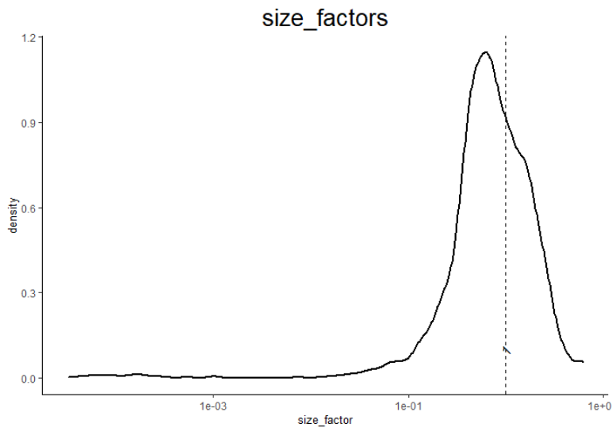

```
gene_subset <- subset_genes(ex_sc_norm, method = "PCA", threshold = 1, minCells = 30, nComp = 10, cutoff = 0.85)
ex_sc_norm <- dim_reduce(ex_sc_norm, genelist = gene_subset, pre_reduce = "iPCA", nComp = 12, tSNE_perp = 30, iterations = 500, print_progress=TRUE)
ex_sc_norm <- cluster_sc(ex_sc_norm, dimension = "Comp", method = "spectral", num_clust = 6)
plot_tsne_metadata(ex_sc_norm, color_by = "Cluster", title = "Spectral Cluster on iPCA components")
```

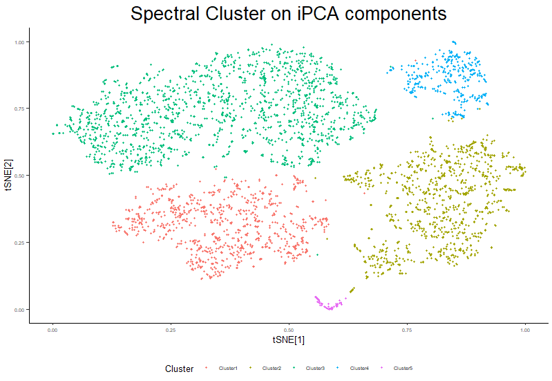

```
plot_density_ridge(ex_sc_norm, color_by = "Cluster", title = "UMIs per cluster", val = "UMI_sum_raw")
```

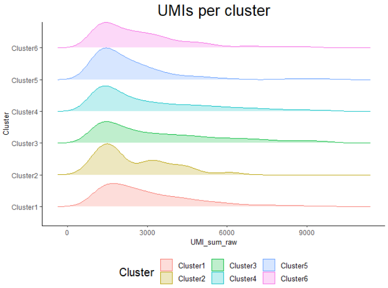

```
plot_tsne_metadata(ex_sc_norm, color_by = "UMI_sum_raw", title = "Total UMIs per cell") 
plot_tsne_metadata(ex_sc_norm, color_by = "size_factor", title = "Size Factor per cell") 
plot_tsne_metadata(ex_sc_norm, color_by = "iPC_Comp1", title = "PC1 cell loadings") 
plot_tsne_metadata(ex_sc_norm, color_by = "iPC_Comp2", title = "PC2 cell loadings") 
plot_tsne_metadata(ex_sc_norm, color_by = "iPC_Comp3", title = "PC3 cell loadings") 
```

## Basic Analysis on Clusters

As a quick and easy way to ID cells a marker id function is provided.

```
ex_sc_norm <- id_markers(ex_sc_norm, print_progress = TRUE) 
head(fData(ex_sc_norm))
marker_list <- return_markers(ex_sc_norm, num_markers = 5) 
plot_scatter(input = ex_sc_norm, title = "Correlation Plot", gene1 = "Ccr7", gene2 = "Ccl22", facet_by = "Cluster", color_by = "Timepoint", logscale = FALSE)
```

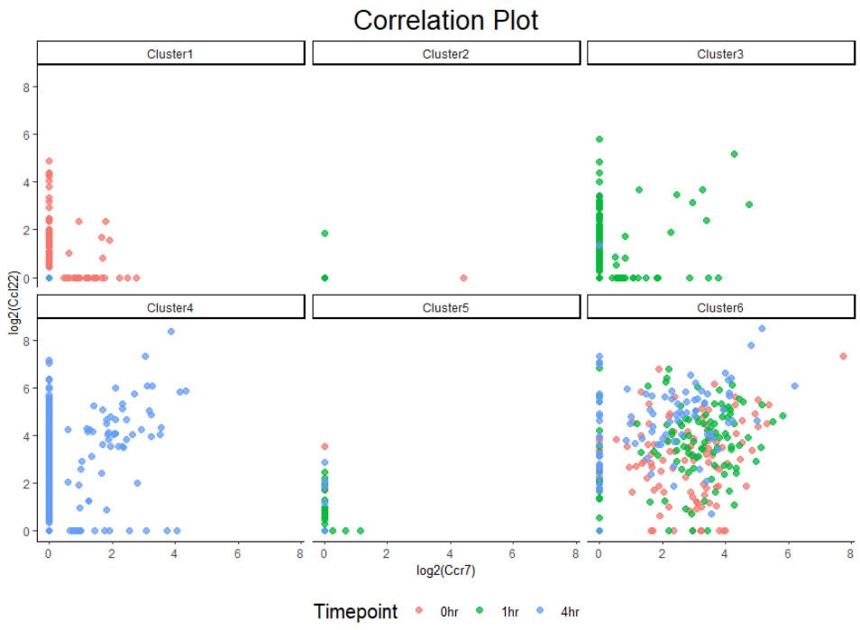

```
marker_facet <- c("Emr1", "Lcn2", "Ccr7")
plot_tsne_gene(input = ex_sc_norm, gene = marker_facet, title = "Marker Genes",  ncol = 3, density = FALSE)
plot_violin(ex_sc_norm, title = "Ccr7 across clusters", gene = "Ccr7", color_by = "Timepoint", facet_by = "Cluster", size = 1, ncol = 3)
```

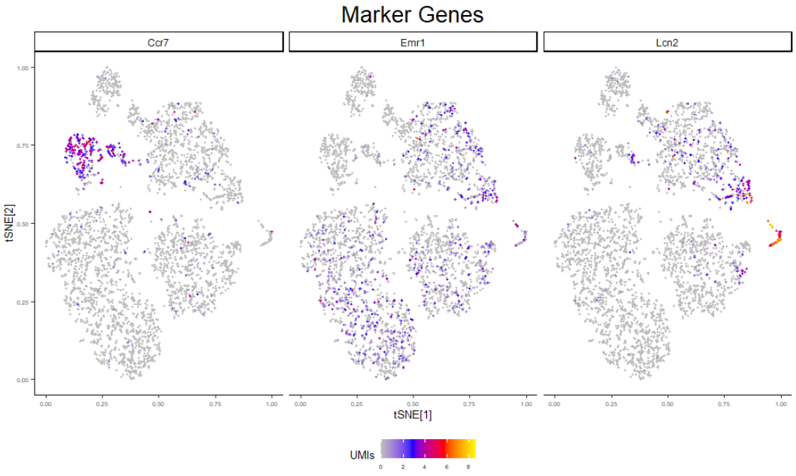

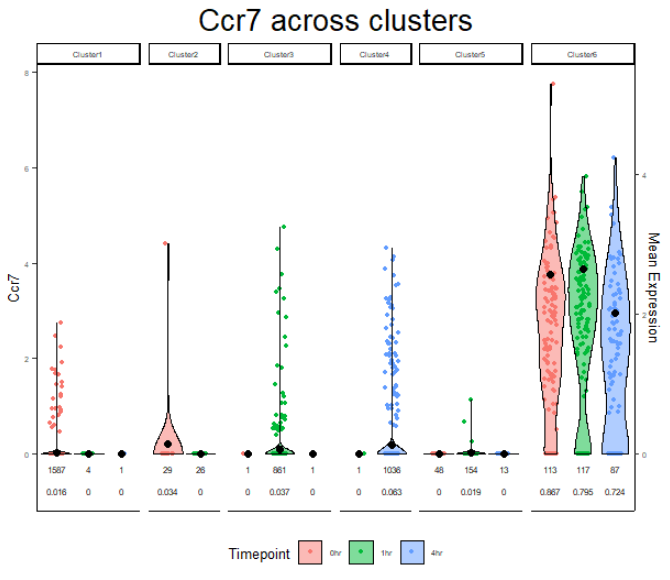

