# Session 9: Single Cell RNA Analysis, Day 2

# Overview

- [Session 9: Single Cell RNA Analysis, Day 2](#session-8-single-cell-rna-analysis-day-2)
- [Overview](#overview)
- [scRNA-Seq Data Analysis](#scrna-seq-data-analysis)
- [Feature Selection and Dimensionality Reduction](#feature-selection-and-dimensionality-reduction)
- [Clustering](#clustering)
- [Marker Analysis and Cell Type Identification](#marker-analysis-and-cell-type-identification)
- [scRNA Data Analysis Pipeline](#scrna-data-analysis-pipeline)
- [Session 9 Homework](#session-8-homework)
    
# scRNA-Seq Data Analysis

|               |               | Day 1         | Day 2         |
| ------------- | ------------- | ------------- | ------------- |
| Session 1     | 09:00-09:45   | Introducton to scRNA-Seq and scRNA Analysis with DolphinNext (part 1) | Dimensionality Reduction |
|               | 09:45-10:00   | Break | Break |
| Session 2     | 10:00-10:45   | scRNA Analysis with DolphinNext (part 2), scRNA Data Structures with R | Clustering |
|               | 10:45-11:00   | Break | Break |
| Session 3     | 11:00-11:45   | Quality Control, Filtering and Normalization | Marker Analysis and Cell Type Identification |

In the previous session, we have covered processing raw single cell RNA sequencing data with DolphinNext, data structures for single cell data using R and Seurat, and filtering and quality control of UMI tables. 

Today, we will be focusing on the last part of the life cycle of scRNA data analysis, and discuss **Data Clustering** which is essential to single cell data analysis (especially for those that are droplet-based methods). 

As you may remember from the previous scRNA data analysis session that droplet based methods capture transcripts from single cell in a drop oil with a bead which has barcodes and UMIs attach to it. Hence, we know that RNA from a cell is provided within a column of UMI table, but we dont know the type of this cell. Here, we will use **Data Clustering** to determine these cell types.

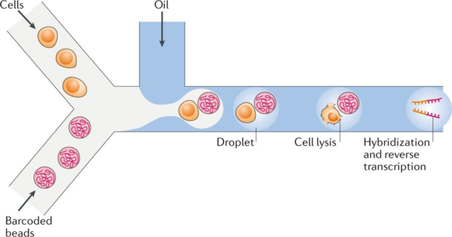

Let us take a look at a really simple illustrative example and discuss why data clustering is important for capturing cell types. Given UMI counts of a group of cells, we may use raw RNA UMI counts of these cells to determine the differences between them.

Let us calculate the normalized gene expression of these two genes for a group of cells, and visualize one cell in a 2d figure (which is enough because we have only two genes).

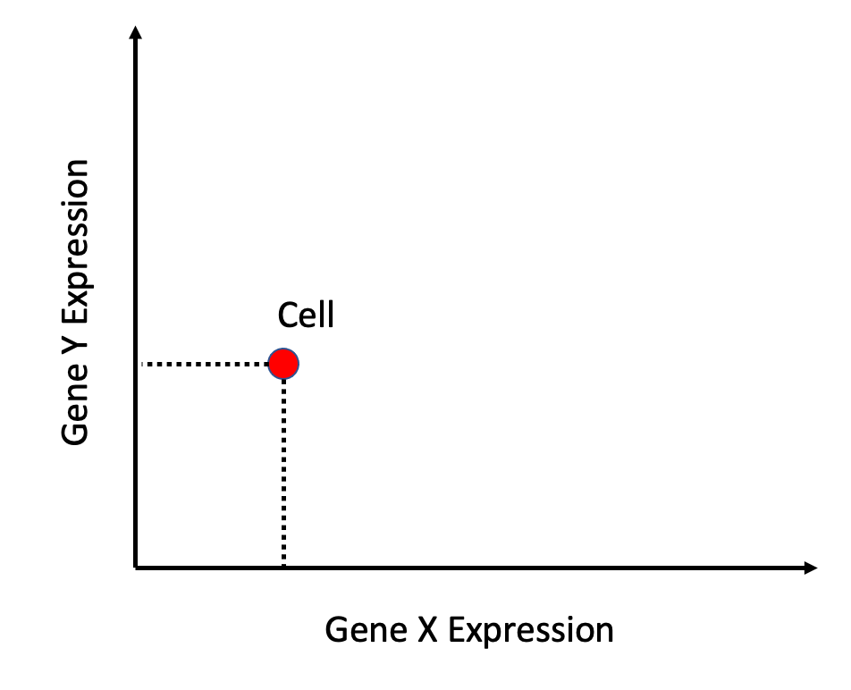

Here, a cell has a position in a 2d mathematical space since it has a certain normalized expression in both two genes. How can we determine the state of this cell? We have to visualize all other cells in the same manner to see if there is a certain relationship.

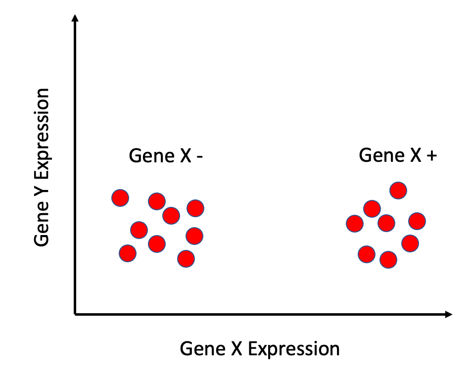

The abundance of all the cells we have captured revealed a certain pattern, it seems that there are two groups of cells who have similar RNA count but cells across different groups have unsimilar RNA counts.

This we determine by the x axis, since there is considerable difference between these two groups with respect to the gene X. Now, lets give another example with more cells.


There are now three groups of cells, with one having higher expression of Gene X, and the other having higher expression in both Gene X and Gene Y. It is easy to determine the number of groups (or clusters) since there are only two genes, and it easy to annotate these cell groups (or cell types). 

However, in reality we have **thousands of genes (high dimensional data)**, around or perhaps **more than 30000** genes/features, and many many more cells to find groups (or cell types) from. Hence, we have to incorporate several **mathematical tools to simplify such complex and high dimensional data** and use clustering analysis to determine the number of groups. In order to achieve a clustering of thousand of cells with thousands of genes in their expression profiles, we will incorporate a single cell data analysis workflow that is often used by many scRNA analysis packages (including **Seurat**). 

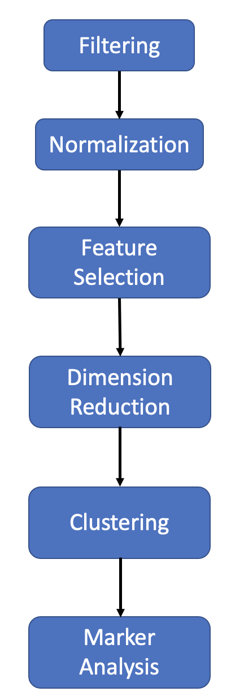

# Feature Selection and Dimensionality Reduction

In previous sessions, we have used **Principal Component Analysis (PCA)** to reduce the dimensionality of expression profiles and to visualize samples in two dimensional plots. However, in bulk RNA-Seq, the groups and conditions are mostly known and we are only interested if there exists differentially expressed genes separating the two (or multiple) groups. 


However, the dimensionality reduction in single cell RNA analysis occurs in a few steps that we gonna cover in the lecture. 

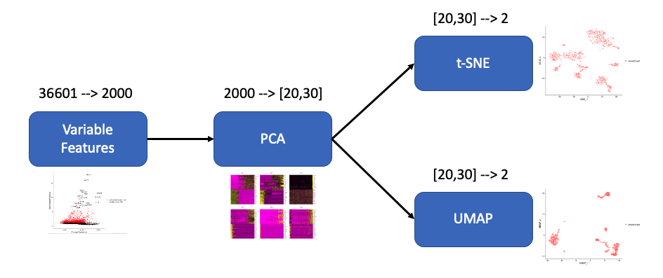

We will cover PCA in a bit more detail after removing genes that are not variable. Essentially, we select some considerably high number of genes, **e.g. 2000-3000**, and ignore the rest of the genes since they may not be as informative as the first 2000-3000. This process is often defined as **Feature Selection**. 

We will first reload the normalized data from the previous session.

```
> pbmc1k_seu <- readRDS("pbmc1k_seu_normalized.rds")
> pbmc1k_seu
An object of class Seurat 
36601 features across 1094 samples within 1 assay 
Active assay: RNA (36601 features, 0 variable features)
```

Alternatively, you can use the following code as well. 

```
> pbmc1k_seu <- readRDS(url("https://bioinfo.umassmed.edu/pub/data/pbmc1k_seu_normalized.rds"))
> pbmc1k_seu
An object of class Seurat 
36601 features across 1094 samples within 1 assay 
Active assay: RNA (36601 features, 0 variable features)
```

Our normalized data incorporates a filtered amount of cells with around 36601 genes, and some of these genes are more informative than others, and also, some of them are quite unnecessary to distinguish cell types. Hence we first select a some number of genes more variable (changing gene expression more frequently across cells). We use the `FindVariableFeatures` function to select those cells, the default value for the number of most variable features (or genes) is 2000.

`FindVariableFeatures` incorporates (by default) the **variance-stabilizing transformation** described [here](https://www.sciencedirect.com/science/article/pii/S0092867419305598) in detail. In summary, it captures a refined variance of each gene by first standardizing the normalized expression. Then the new variance is used to rank genes, first 2000 (by defuault) is used for further downstream analysis. 

There are more variable feature selection methods in `FindVariableFeatures` function, see `help(FindVariableFeatures)`. 

```
> pbmc1k_seu <- FindVariableFeatures(pbmc1k_seu, nfeatures = 2000)
Calculating gene variances
0%   10   20   30   40   50   60   70   80   90   100%
[----|----|----|----|----|----|----|----|----|----|
**************************************************|
Calculating feature variances of standardized and clipped values
0%   10   20   30   40   50   60   70   80   90   100%
[----|----|----|----|----|----|----|----|----|----|
**************************************************|
> pbmc1k_seu
An object of class Seurat 
36601 features across 1094 samples within 1 assay 
Active assay: RNA (36601 features, 2000 variable features)
```

Before moving on with this 2000 set of genes, lets take a look at them and visualize the top variable genes. 

```
> top20 <- head(VariableFeatures(pbmc1k_seu), 20)
> top20
 [1] "GNLY"   "IGLC2"  "IGLC3"  "FCGR3A" "S100A9" "PPBP"   "CDKN1C" "S100A8" "GZMB" "IGLC1"  "GP1BB"  "LYZ"    "PF4"    "NKG7"   "GNG11"  "IGHM"  
[17] "NRGN"   "ITM2C"  "TUBB1"  "CAVIN2"
plot_features <- VariableFeaturePlot(pbmc1k_seu)
plot_features_label <- LabelPoints(plot = plot_features, points = top20, repel = TRUE)
plot_features_label
```

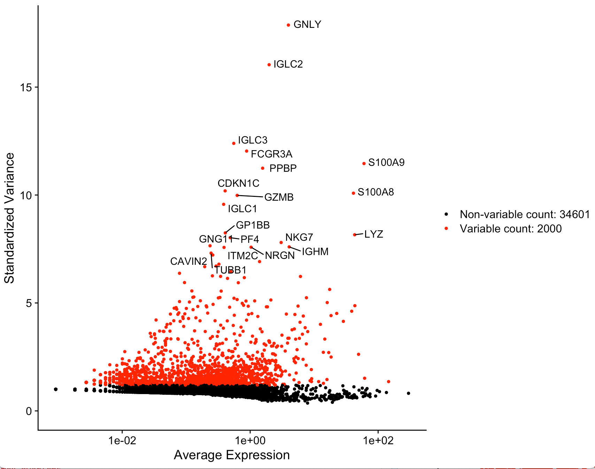

We can quickly recognize some of the marker genes that are selected as the most variable features. For example, **Granulysin (GNLY)** and **Granule 7 (NKG7)** are both found in natural killer cells, where as **PPBP** gene is made by Platelet cells (or thrombocytes). A first look at variable genes may give clues on quality of selected genes.  

We will incorporate these 2000 selected genes for clustering and cell type identification for the remainder of this lecture. Seurat employs most variables genes 
to decrease the complexity of dimensionality reduction and clustering algorithms. 

Dimensionality reduction is a necessary step to clustering since most clustering and partitioning algorithms are prone to **curse of dimensionality** which occurs when objects are defined in high dimensional spaces and this objects seem far away from eachother as opposed to lower dimensions. 

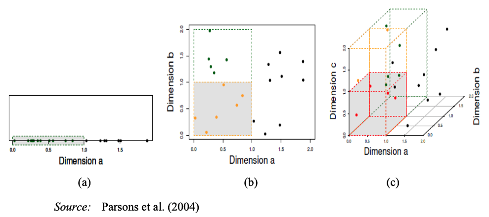

We are now ready to decrease the dimensionality of the data and further reduce the dimensionality to 2 dimensions for better visualization of single cell expression profiles. This reduction is performed in multiple steps. 

We have removed each individual gene whose variance were below some top number of genes. Now we need to eliminate (or transform) redundant genes which is correlated to some other top 2000 genes. To this end, we will incorporate **Principal Components Analysis (PCA)**.  

But what is Principal Components Analysis? The name suggests finding "principal components" of a dataset; that is, given a gene expression dataset with around 2000 genes (after removing genes that are not variable), we would like to reduce this number to somewhere between 20 or 30. 

Lets take a look at a 2D example with two correlated features. It can be observed that a combination of two variables entails a one-dimensional
description of the variability of the data. This new variable will be called **PC1** and if we were to compare the variance to the **PC2** which uncorrelated to 
PC1 (because of the angle between two lines being 90 degress), **PC1** is more informative to **PC2**. 

<table>
	<tbody>
		<tr>
			<td>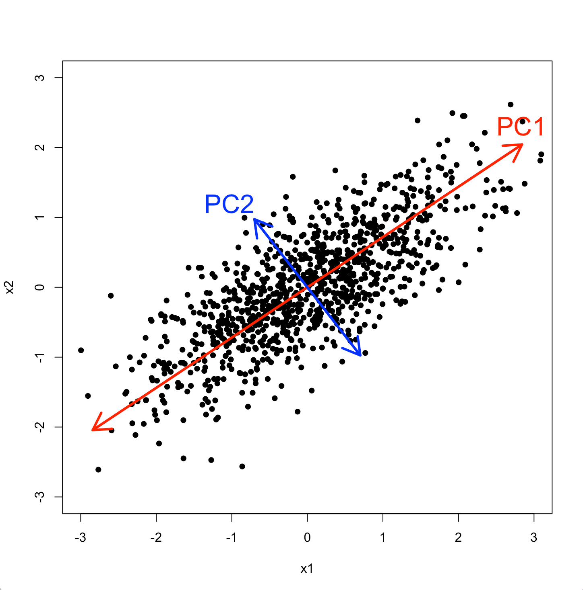</td>
			<td>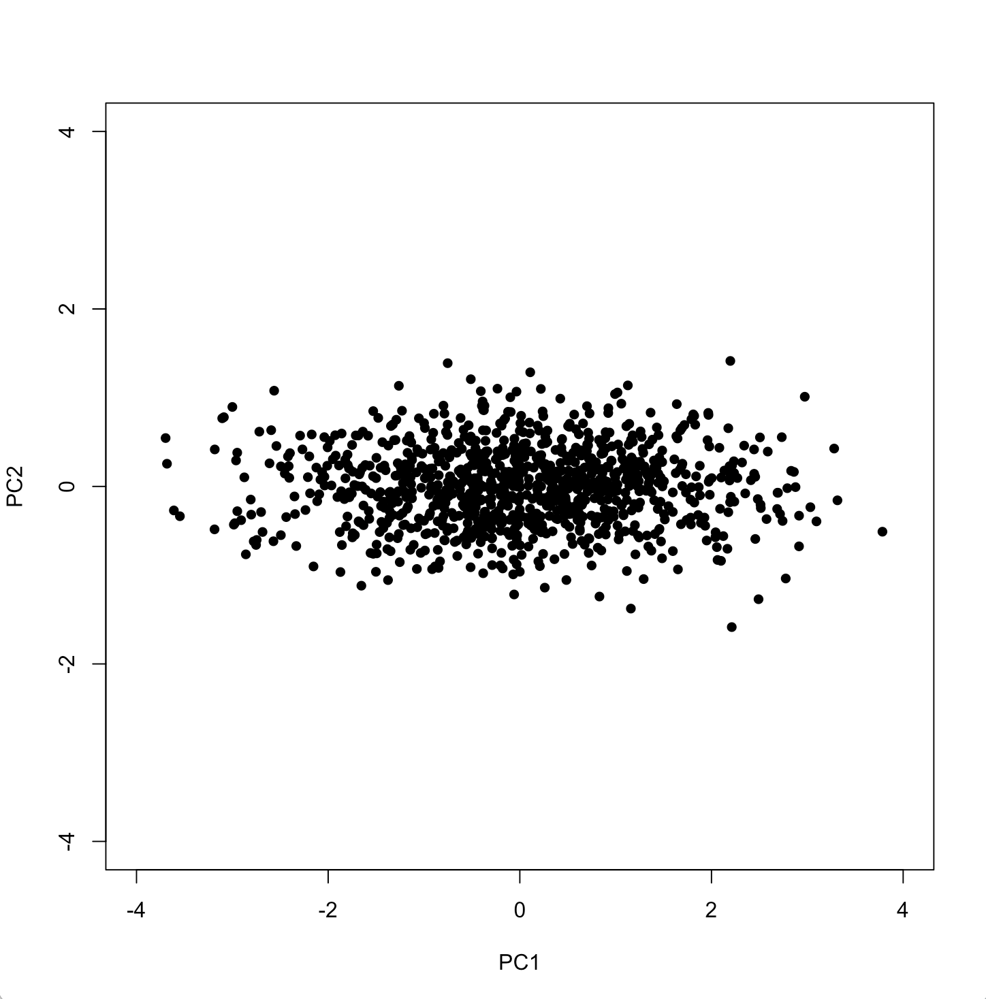</td>
		</tr>
	</tbody>
</table>

It is easy to visualize two dimensions but we have 2000 genes. PCA will accomplish a reduction of 2000 genes to some number of **latent genes** that we are going to use for clustering. 

The number of principal components (the dimensionality of reduced dataset) is a matter of choice but a quality control can be applied to look for the correct number of dimensions. We usually use the **elbow plot** to search for the correct number of principal components. 

```
pbmc1k_seu <- ScaleData(pbmc1k_seu, verbose = FALSE)
pbmc1k_seu <- RunPCA(pbmc1k_seu, verbose = FALSE, npcs = 30)
ElbowPlot(pbmc1k_seu, ndims = 30)
```

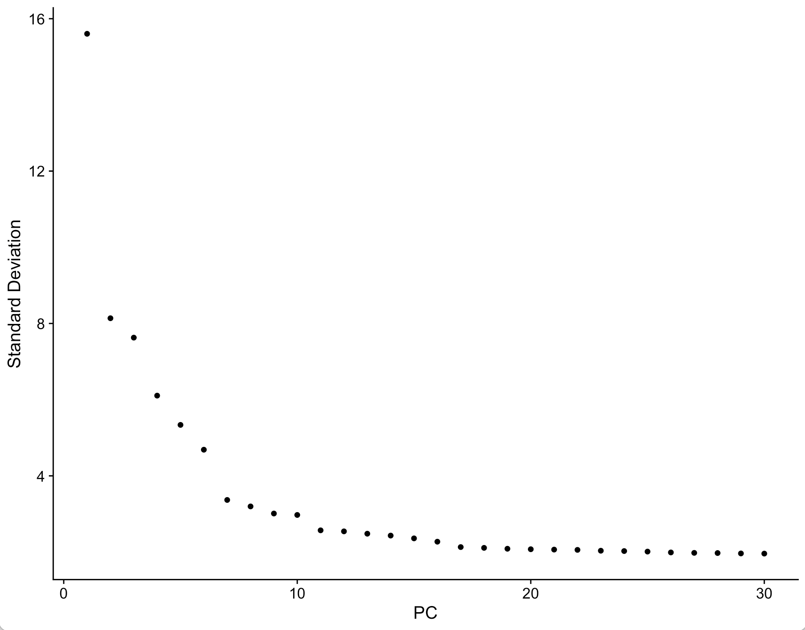

The elbow plot indicates that 20 principal components are enough (where the elbow of the line chart points to 20!) to reduce the dimensionality of the dataset; that is, the PCs after the 20th are minimally contributive to the variance. Hence we can stop at adding PCs after the 20th since they wont contribute to downstream analysis and clustering much! 

We can also investigate the relationship between PCs and most variables genes (or features) to check if we capture genes that are most relevant to our analysis. Here, we visualize the first six PCs but we can further visualize a selected number of PCs as well. Here we will use a Heatmap to visualize PCs vs Genes. 

```
DimHeatmap(pbmc1k_seu, dims = 1:6, balanced = TRUE)
```

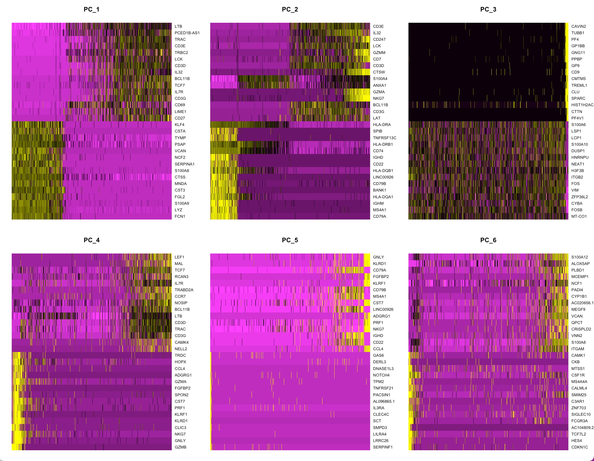

We have first reduced 36000 to 2000, then we reduced 2000 to 20, but we still have 18 more dimensions to reduce while preserving the information on expression profiles. Although 20 dimensions are enough to separate cell into meaningful groups via clustering, we reduce the additional number of 18 dimensions for visualization purposes. 

As the last step of the dimensionality reduction, we will incorporate the method **t-distributed stochastic neighbor embedding (t-SNE)**, that reduce high dimensional datasets to 2 dimensional datasets by capturing locally similar samples (or cells). We will use the first 20 PCs since they are the most informative PCs.

You can find a detailed description of t-SNE [here](https://cs.nyu.edu/~roweis/papers/sne_final.pdf), and an informative and illustrative explanation has been given [here](https://youtu.be/NEaUSP4YerM) in Youtube. 

```
pbmc1k_seu <- RunTSNE(pbmc1k_seu, verbose = FALSE, dims = 1:20)
DimPlot(pbmc1k_seu, reduction = "tsne")
```
   
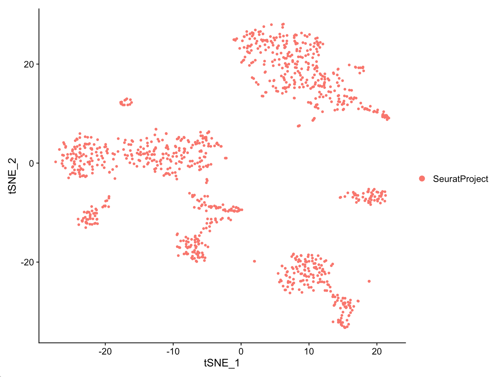

We can alternatively incorporate another dimensionality reduction method, which is called Uniform Manifold Approximation and Projection or UMAP. 

```
pbmc1k_seu <- RunUMAP(pbmc1k_seu, verbose = FALSE, dims = 1:20)
DimPlot(pbmc1k_seu, reduction = "umap")
```
   
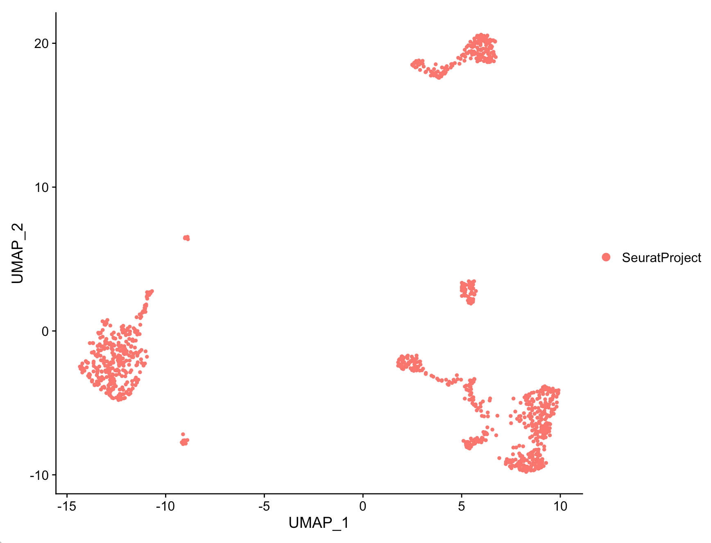

Both tSNE and UMAP, may reveal some information on how many clusters (or cell types) exist in the single cell RNA dataset but we may not truly know until we execute the clustering analysis.   

# Clustering

What is Clustering ? It is the task of **partitioning samples within a dataset into meaningful groups** where samples in the same cluster/group are more similar to each other than the rest of samples. 

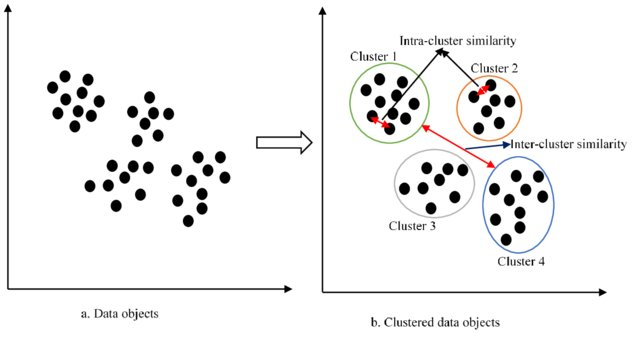

Although some clusters in a dataset can be easily depicted, it may not be the case in some other examples. 

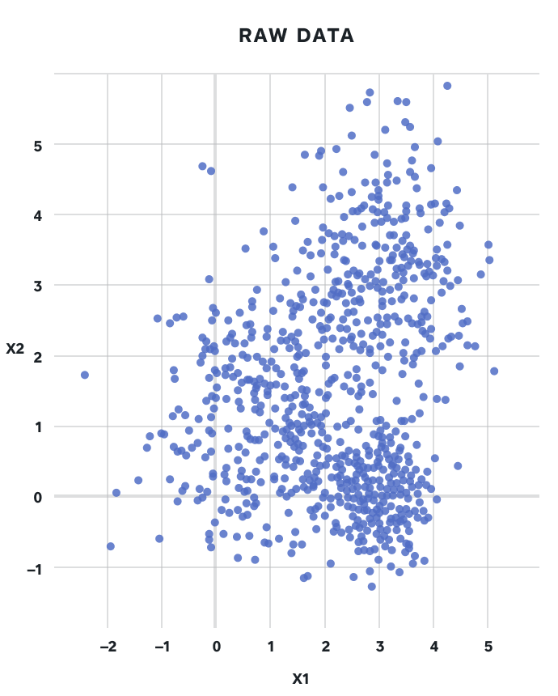

**Seurat** incorporates a graph based clustering strategy where we first determine the nearest neighbors of all cells in PC space (with dimensions 20). Then we construct a nearest neighbor graph from the calculated distances. 

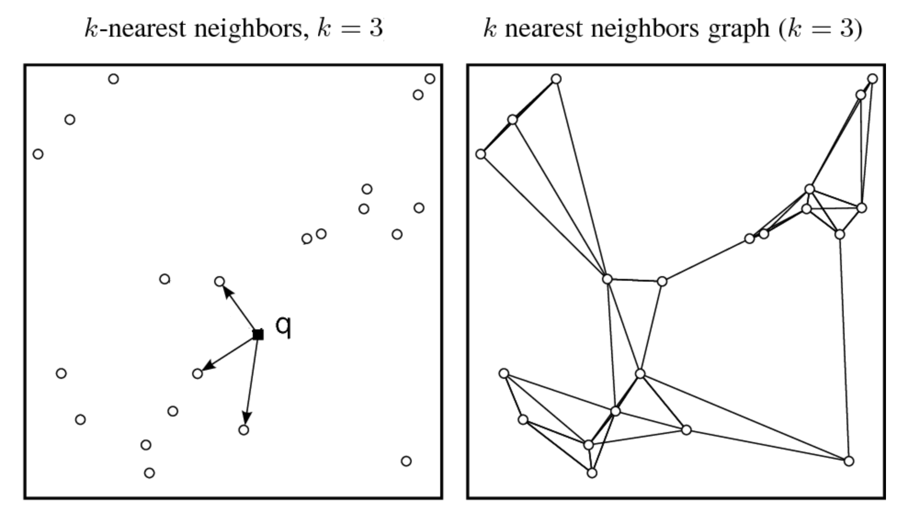

The illustrative example above finds the nearest 3 neighbors of all samples in two dimensions, then constructs a graph with all these edges. We set this number of neighbors to 20, and construct the graph to be clustered later. 

```
pbmc1k_seu <- FindNeighbors(pbmc1k_seu, dims = 1:20)
```

We will now move on to clustering with the computed nearest neighbors. Seurat incorporates several versions of graph clustering where the louvain algorithm
is the default choice. Here, we are looking for "communities" within graphs that are associated to clusters. A community defined as a group of nodes (or cells) are more likely connected to eachother, where the number of edges to other cells in other clusters are few. 

The result of louvain algorithm depends on the **resolution** parameter which determines how densely (the number of edges in a cluster) connected a group of cells should be to form a cluster. Thus, the higher the resolution parameter, the higher the number of clusters. 


We initially set resolution to 0.2 and execute clustering. We then visualize the clusters to evaluate the quality of clustering. 

```
pbmc1k_seu <- FindClusters(pbmc1k_seu, resolution = 0.2)
DimPlot(pbmc1k_seu, reduction = "tsne", label = T)
```

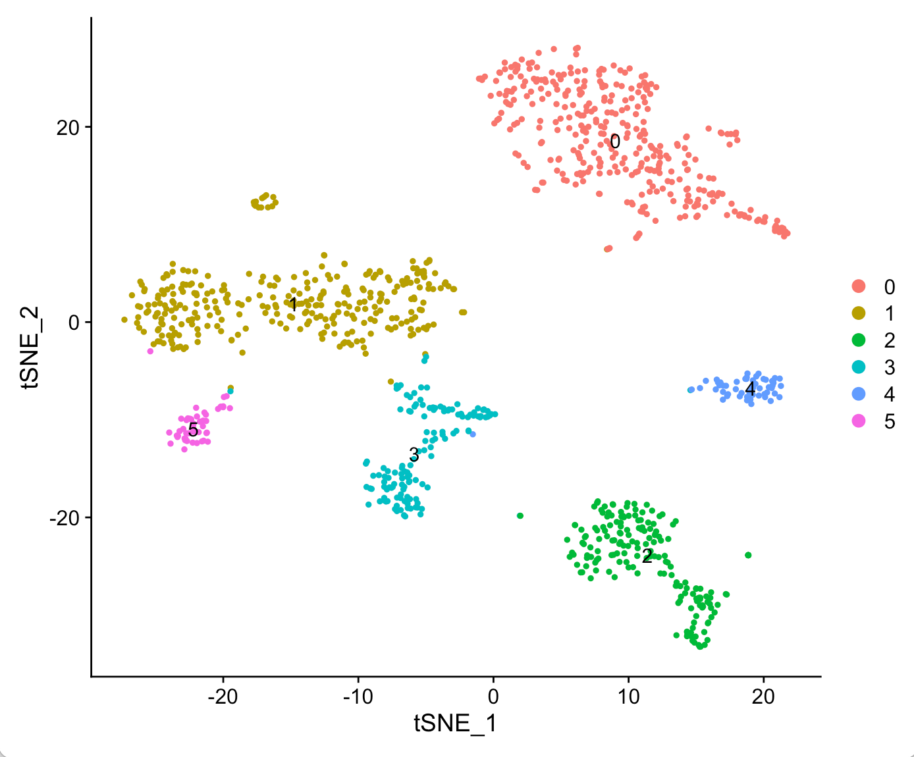

Some clusters might have been "underclustered"; that is, we need to further divide clusters into multiple clusters to achieve and optimized number of clusters (or cell types). 

```
> pbmc1k_seu <- FindClusters(pbmc1k_seu, resolution = c(0.2,0.4,0.6,0.8,1.0,1.4))
> colnames(pbmc1k_seu@meta.data)
 [1] "orig.ident"      "nCount_RNA"      "nFeature_RNA"    "percent.mt"      "RNA_snn_res.0.6" "seurat_clusters" "RNA_snn_res.0.4" "RNA_snn_res.0.2"
 [9] "RNA_snn_res.0.8" "RNA_snn_res.1"   "RNA_snn_res.1.4"
```

We can visualize the results of multiple resolutions in the same time to determine the best number of clusters. 

```
g1 <- DimPlot(pbmc1k_seu, reduction = "tsne", label = T, group.by = "RNA_snn_res.0.2")
g2 <- DimPlot(pbmc1k_seu, reduction = "tsne", label = T, group.by = "RNA_snn_res.0.4")
g3 <- DimPlot(pbmc1k_seu, reduction = "tsne", label = T, group.by = "RNA_snn_res.0.6")
g4 <- DimPlot(pbmc1k_seu, reduction = "tsne", label = T, group.by = "RNA_snn_res.0.8")
g5 <- DimPlot(pbmc1k_seu, reduction = "tsne", label = T, group.by = "RNA_snn_res.1")
g6 <- DimPlot(pbmc1k_seu, reduction = "tsne", label = T, group.by = "RNA_snn_res.1.4")
g1 + g2 + g3 + g4 + g5 + g6
```

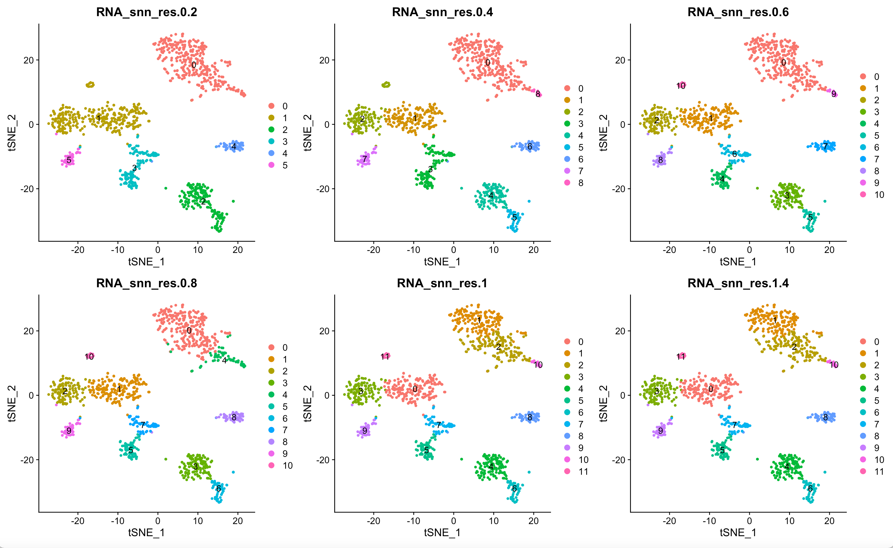


# Marker Analysis and Cell Type Identification

In the previous section, we have determined that `resolution=0.6` as the best partitioning of the single cell data whose clusters are associated with the cell types we are looking for. We will now employ a marker analysis to find genes associated with each cluster (or cell type), and use these marker genes to annotate these clusters. 

FindAllMarkers function will compare each cluster with all other clusters (one against all) to find differentially expressed genes associated to these clusters which will reveal cluster specific markers to determine the cell types (or states).

The function offers a variety of statistical hypothesis testing methods, but we will use the default test which Wilcoxon Rank Sum test. See `help(FindAllMarkers)` for additional options. 

```
Idents(pbmc1k_seu) <- "RNA_snn_res.0.6"
marker_table_pbmc1k_seu <- FindAllMarkers(pbmc1k_seu)
```

You can view the entire set of markers by using the View function in R Studio. 

```
View(marker_table_pbmc1k_seu)
```

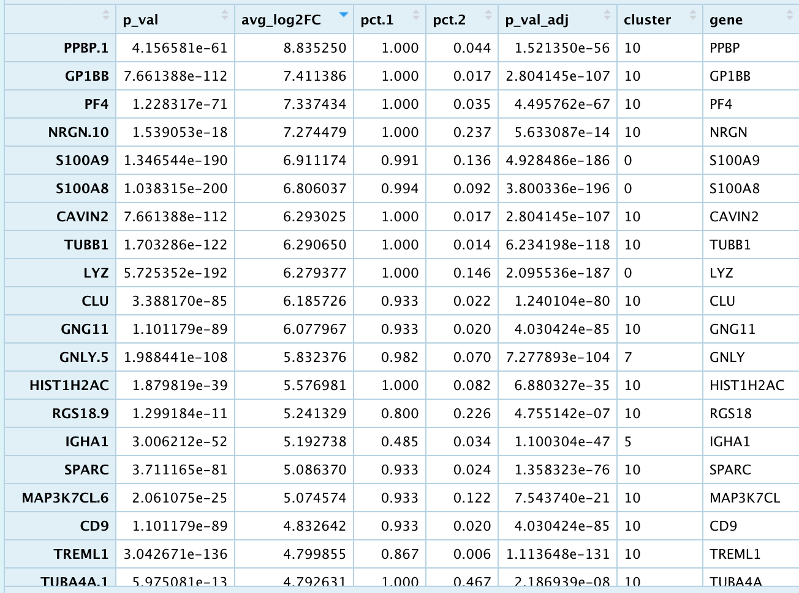

Seurat incorporates heatmaps to visualize a selected number of marker genes (or any genes in particular) to determine cell types. We will first select the top differentially expressed genes for each cluster using the **dplyr** package. Then, we will visualize these genes on an heatmap. 

We will now incorporate the **ggplot2** package in R, which is also used for many Seurat functions, but we load the ggplot2 library as well. 

```
DimPlot(pbmc1k_seu, reduction = "tsne", label = TRUE)
library(ggplot2)
marker_table_pbmc1k_seu %>%
  group_by(cluster) %>%
  top_n(n = 10, wt = avg_log2FC) -> top10
DoHeatmap(pbmc1k_seu, features = top10$gene) + NoLegend()
```

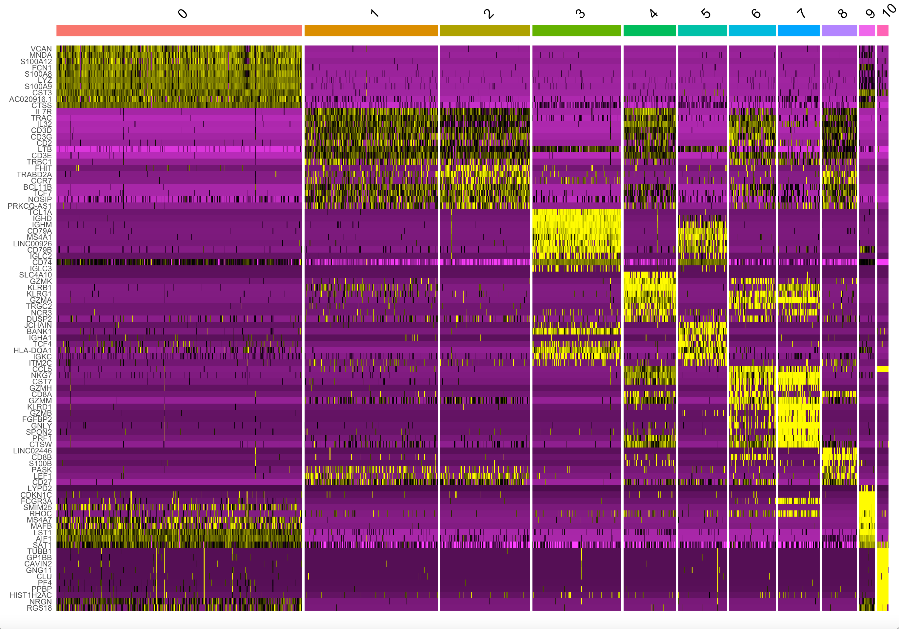

On some occasions, closely related clusters can only be annotated using a one-to-one test, given these two closely related clusters compared to each other instead of compared to all other clusters.

```
marker_table_pbmc1k_seu_1vs2 <- FindMarkers(pbmc1k_seu, ident.1 = "1", ident.2 = "2", group.by = "RNA_snn_res.0.6")
marker_table_pbmc1k_seu_3vs5 <- FindMarkers(pbmc1k_seu, ident.1 = "3", ident.2 = "5", group.by = "RNA_snn_res.0.6")
marker_table_pbmc1k_seu_4vs6 <- FindMarkers(pbmc1k_seu, ident.1 = "4", ident.2 = "6", group.by = "RNA_snn_res.0.6")
```

Using the marker table, the heatmap and additional marker analysis between some targeted clusters, we can make assumptions and estimations of the types of each cell associated with groups. These are: 

| Cluster ID    | Markers       | Markers           | 
| ------------- | ------------- | ----------------- |       
| 0             | CD14+ LYZ+    | CD14 monocytes    |
| 1             | IL7R S100A4   | Memory CD4+       |
| 2             | IL7R CCR7     | Naive CD4+        |
| 3             | TCL1A MS4A1   | TCL1A+ B          |
| 4             | CD8A IL7R     | Memory CD8+       |
| 5             | JCHAIN MS4A1  | JCHAIN+ B         |
| 6             | CD8A NKG7     | Effector CD8+     |
| 7             | GNLY NKG7     | NK                |
| 8             | CD8A CCR7     | Naive CD8+        |
| 9             | MS4A7 FCGR3A  | FCGR3A+ Monocytes |
| 10            | PPBP          | Platelet          |

Finally, we can annotate cells by renaming the idents. 

```
new.cluster.ids <- c("CD14 monocytes", "Memory CD4+", "Naive CD4+", "TCL1A+ B", "Memory CD8+", "JCHAIN+ B", "Effector CD8+","NK",
                     "Naive CD8+", "FCGR3A+ Monocytes", "Platelet")
names(new.cluster.ids) <- levels(pbmc1k_seu)
pbmc1k_seu <- RenameIdents(pbmc1k_seu, new.cluster.ids)
DimPlot(pbmc1k_seu, reduction = "tsne", label = TRUE, pt.size = 0.5) + NoLegend()
```

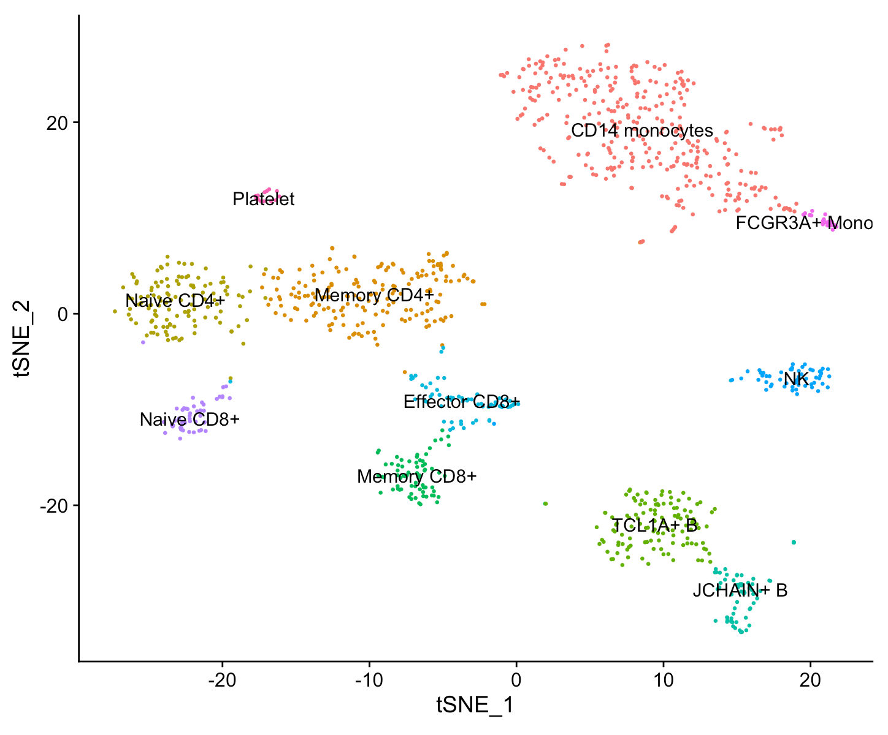

# scRNA Data Analysis Pipeline

As a concluding note, we will examine a DolphinNext pipeline geared towards creating Rmarkdown templates for Seurat scRNA data analysis workflows. This pipeline takes the output of a scRNA-Seq data analysis pipeline (10x directory or a UMI table) and analyze the data with predetermined thresholds. You can then use this rmarkdown template for your own analysis in your local computer. 

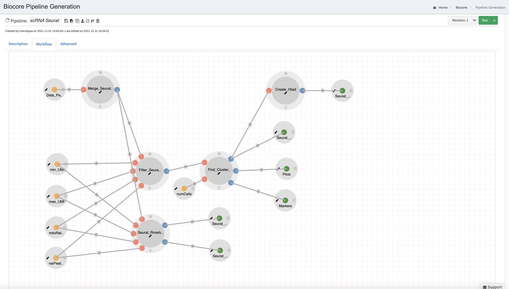

Lets take a look at the DolphinNext input parameters of the scRNA-Seq data analysis pipeline. 

**A. Work Directory:** Please enter `/project/your_groupname/your_username/bootcamp/pbmc_cellranger_seurat` as work directory.

**B. Run Environment:** Please choose `Run Environment for ghpcc06.umassrc.org`

**C. Inputs:**

- **Data_Path:** Choose the 10x UMI table files `/project/your_groupname/your_username/bootcamp/scRNASeq/pbmc_1k_v3_processed` directory. 
- **numCells:** 100
- **min_UMI:** 500 
- **max_UMI:** 20000
- **varFeatures:** 2000
- **mitoRatio:** 20

The results of the Pipeline can be imported as an rmarkdown html file. 

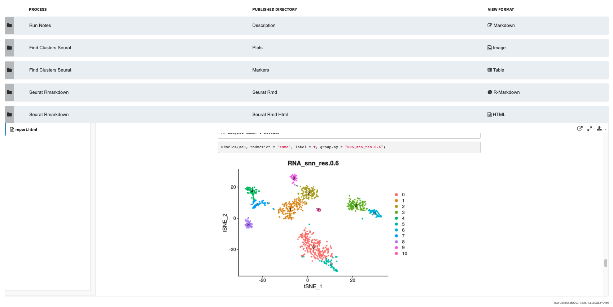

But you can also download the corresponding .rmd file to download and use in your own local computer. 

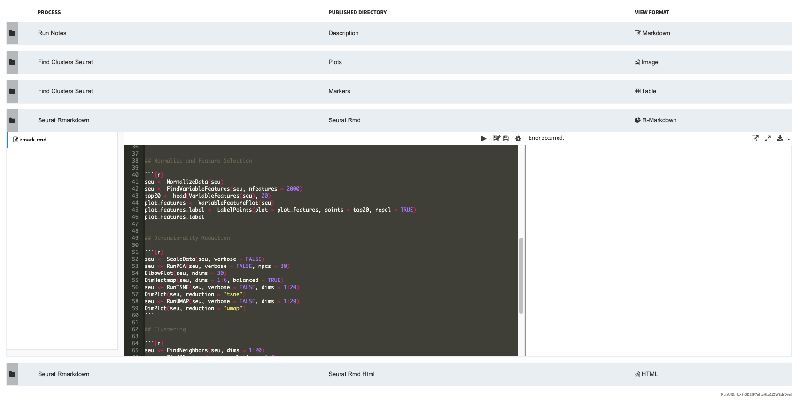

# Session 9 Homework

In the second homework of the last session (i.e. session 7), we have filtered, processed and normalized a PBMC data with 3000 cells. 

<https://support.10xgenomics.com/single-cell-gene-expression/datasets/1.1.0/pbmc3k>

You can find the mtx file, and barcodes.tsv and genes.tsv files in the following path: 

```
/project/your_groupname/your_username/bootcamp/scRNASeq/pbmc_3k_processed
```

If you have done the homework in the previous session, you should already have a normalized Seurat object saved as an .rds file. Otherwise, you can use the normalized .rds file in the path below (please run it in R). 

```
pbmc3k <- readRDS(url("https://bioinfo.umassmed.edu/pub/data/pbmc3k_seu_normalized.rds"))
```

Given the normalize Seurat object, you are required to repeat the scRNA-Seq data analysis steps we have covered today. Specifically, you will:  

* Select the most variables features 
* Choose the best number of principal components, and reduce the data with both tSNE and UMAP
* Find Neighbors of cells and apply clustering using a set of resolution paraneters (the selection of the set of resolutions is up to you, choose carefully). 
* Choose the best clustering result and identify cell types using FindAllMarkers, FindMarkers and DoHeatmap functions. 
* Annotate clusters (or cell types) and visualize the new annotate cells with tSNE (or UMAP) along with new labels.  
