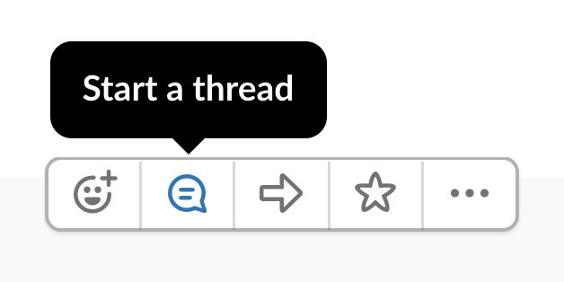
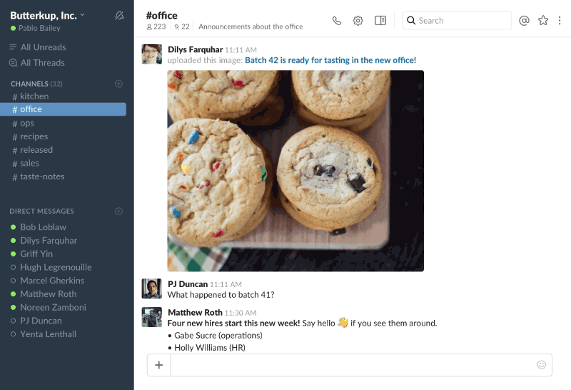
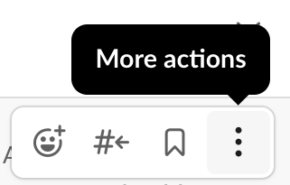
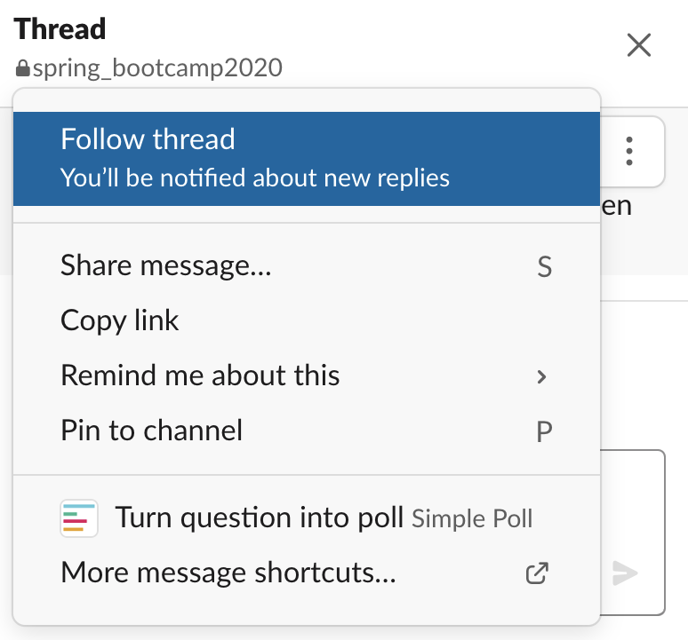

# How to use the Bootcamp Slack channel

For us to keep discussions in the channel organized, here are a few tips we would like everyone to follow:

1. If you have a new comment or question, post it to to the main channel

2. If you want to add another comment related to the same issue, instead of posting it to the main channel, please start a thread.
   - To  start a thread, use your cursor to hover over your initial message and choose the icon for starting a thread as shown in the picture below:

    

starting threads

3. If you want to reply to someone else's message or add your own related question, follow this same rule and do so with a thread.

4. We will try to answer your questions on slack with messages first, but if it is not possible to solve the issue like that, we will start a direct call to you using slack.

5. To view threads that are already open, simply click on the **reply** link that will show up under a message that has started a thread:

6. You can also make sure you get notifications for any updates on a thread.
    - If you replied to the thread, or posted the original message, you will be notified automatically
    - If you want to follow a question from someone else, open the thread and click on more actions, then click on follow thread:

    

    more actions

    

    follow thread
